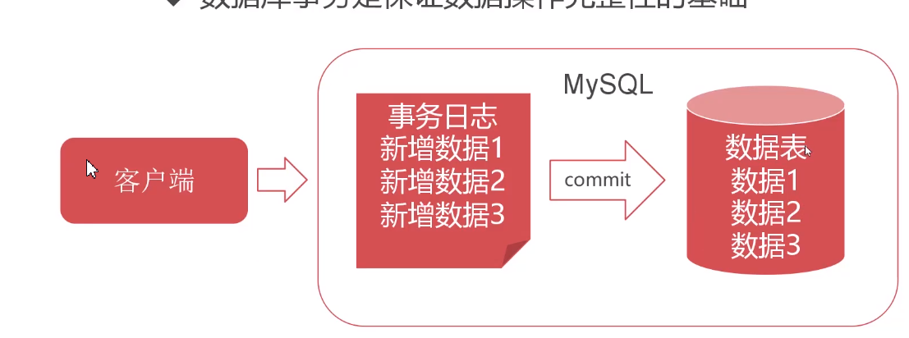
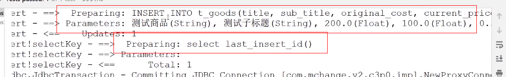
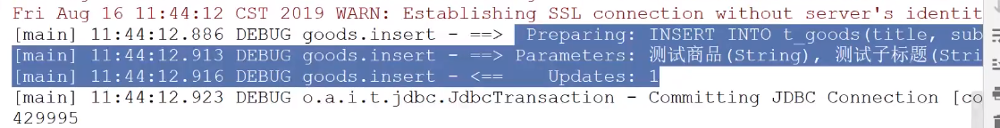
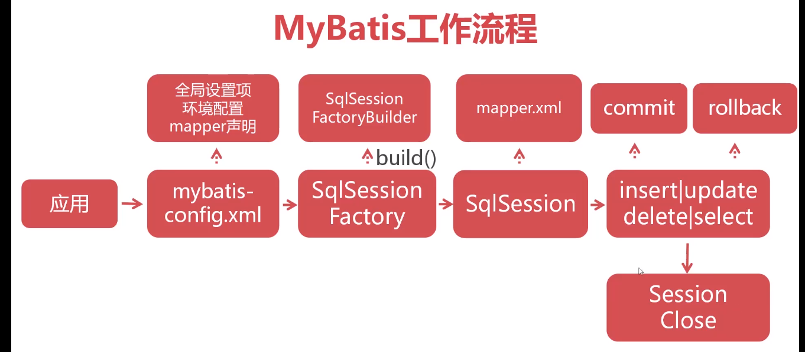
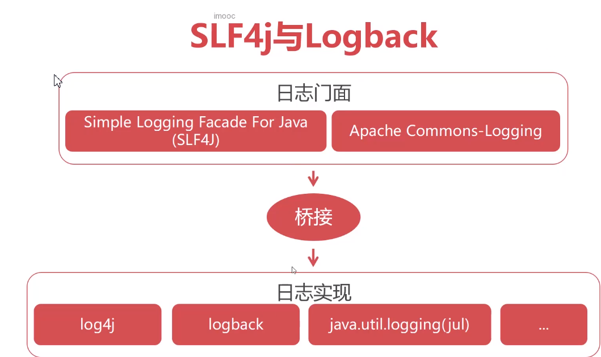
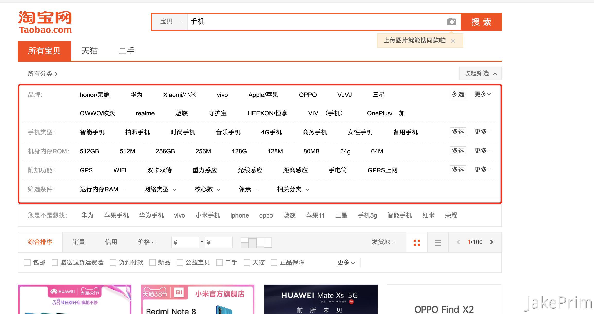
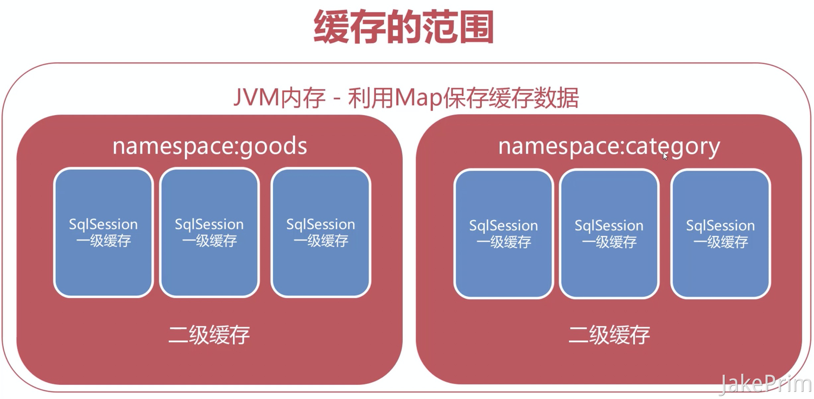
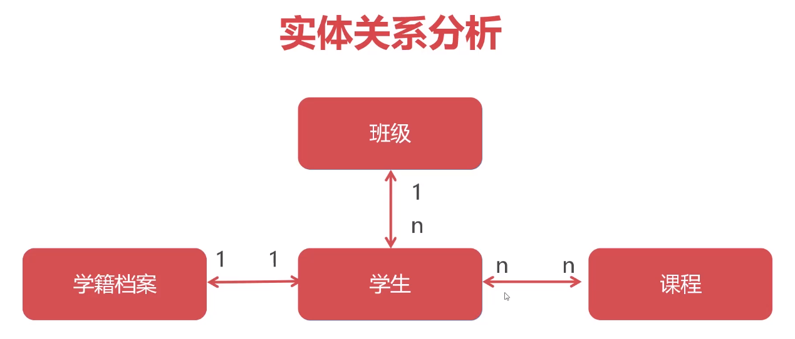
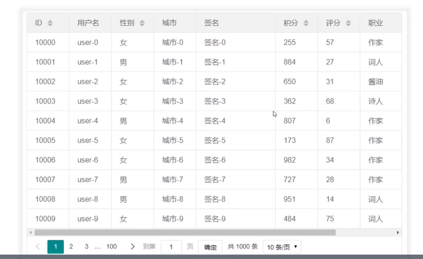
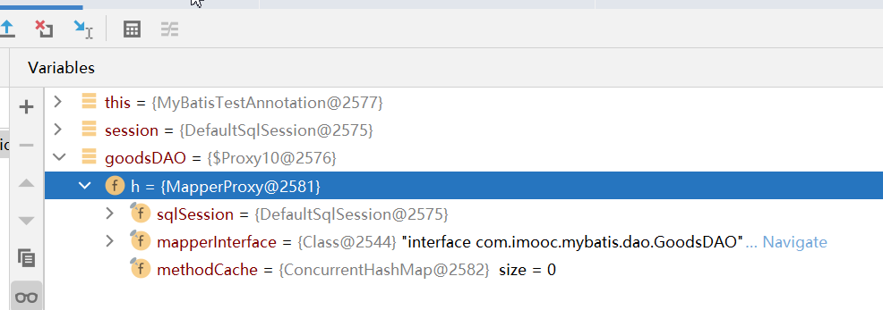

# mybatis入门介绍
## 入门
|内容	| 说明	| 重要程度  |
| --- | --- |-------|
|Mybatis框架介绍|	介绍框架与Mybatis的概念| 	**   |
|Mybatis开发流程	|详细讲解mybatis六步开发流程| ***** |
|Mybatis使用细则	|讲解mybatis开发中的各种细节| ***** |
|Mybatis工作流程	|讲解mybatis的内部执行过程	| ***   |

## Mybatis高级特性(mybatis-2.md)
|内容| 	说明                 | 	重要程度 |
| --- |---------------------|-------|
|Mybatis日志管理	| Mybatis日志管理配置	| **    |
|动态SQL处理| 	多条件查询下的SQL的动态执行过程  | ***** |
|Mybatis缓存机制	| 介绍mybatis一二级缓存作用与配置 | ***** |
|多表级联查询	| 配置mybatis多表级联查询	    | **    |
|PageHelper插件	| mybatis分页插件的使用办法	   | ***** |

## 准备数据
Database -> 右键: Run SQL Script -> babytun建库脚本

## 框架的作用
1. 软件开发中的框架  
框架是可被应用开发者定制的应用骨架  
框架是一种规则，保证开发者遵循相同的方式开发程序  
框架提倡“不要重复造轮子”，对基础功能进行封装  
2. 框架的优点  
极大提高了开发效率  
统一的编码规则，利于团队管理  
灵活配置的应用，拥有更好的维护性  
3. SSM开发框架  
Spring   Spring MVC  Mybatis

# mybatis介绍
## 什么是mybatis
1. Mybatis是最优秀持久层框架（dao）
2. Mybatis使用XML将SQL与程序**解耦**，便于维护
3. Mybatis学习简单，执行高效，是JDBC的延伸
Mybatis中文文档 https://mybatis.org/mybatis-3/zh/index.html

## Mybatis开发流程
1. 引入Mybatis依赖
2. 创建核心配置文件
3. 创建实体（Entity）类
4. 创建Mapper映射文件, 从表到类
5. 初始化SessionFactory, java编码, 会话工厂, 读取配置文件, 加载mapper映射
6. 利用SqlSession对象操作数据, Session粗略理解成数据库连接的connect, 做了一些包装, 增删改查

## mybatis-conf.xml
核心文件：mybatis-config.xml  
Mybatis采用XML格式配置数据库环境信息  
Mybatis环境配置标签<environment>  
environment包含数据库驱动、URL、用户名与密码  

```xml
<!--配置环境，不同的环境 不同的id名字-->
<environment id="dev">
    <!--采用JDBC方式对数据库事务进行commit/rollback-->
    <transactionManager type="JDBC"></transactionManager>
    <!--采用连接池方式管理数据库连接-->
    <dataSource type="POOLED">
        <property name="driver" value="com.mysql.cj.jdbc.Driver"/>
        <property name="url" value="jdbc:mysql://localhost:3306/babytun？useSSL=false&amp;useUnicode=true&amp;characterEncoding=UTF8&amp;serverTimezone=Asia/Shanghai&amp;allowPublicKeyRetrieval=true"/>
        <property name="username" value="root"/>
        <property name="password" value="root"/>
    </dataSource>
</environment>
```

添加maven依赖
```xml
<!--采用maven的方式增加依赖 写在pom.xml中-->
<!--mybatis依赖-->
<dependency>
    <groupId>org.mybatis</groupId>
    <artifactId>mybatis</artifactId>
    <version>3.5.1</version>
</dependency>

 <!--mysql驱动-->
<dependency>
    <groupId>mysql</groupId>
    <artifactId>mysql-connector-java</artifactId>
    <version>8.0.21</version>
</dependency>
```
mybatis-config.xml
```xml
<?xml version="1.0" encoding="UTF-8" ?>
<!DOCTYPE configuration
        PUBLIC "-//mybatis.org//DTD Config 3.0//EN"
        "http://mybatis.org/dtd/mybatis-3-config.dtd">
<configuration>
    <!--设置默认指向的数据库-->
    <environments default="dev">
        <environment id="dev">
            <transactionManager type="JDBC"/>
            <dataSource type="POOLED">
                <property name="driver" value="com.mysql.jdbc.Driver"/>
                <property name="url" value="jdbc:mysql://114.55.64.149:3306/babytun?useUnicode=true&amp;characterEncoding=UTF-8"/>
                <property name="username" value="root"/>
                <property name="password" value=""/>
            </dataSource>
        </environment>
    </environments>
    <!--
    <mappers>
        <mapper resource="org/mybatis/example/BlogMapper.xml"/>
    </mappers>
    -->
</configuration>
```

## SqlSessionFactory
1. SqlSessionFactory是Mybatis的核心对象
2. 用于初始化Mybatis,创建SqlSession对象
3. 保证SqlSessionFactory在应用中全局唯一

## SqlSession
1. SqlSession是Mybatis操作数据库的核心对象
2. SqlSession使用JDBC方式与数据库交互
3. SqlSession对象提供了数据表CRUD对应的方法


## SqlSessionFactory创建细节, 加载mybatis-conf

```java
import org.apache.ibatis.io.Resources;
import org.apache.ibatis.session.SqlSession;
import org.apache.ibatis.session.SqlSessionFactory;
import org.apache.ibatis.session.SqlSessionFactoryBuilder;
import org.junit.Assert;
import org.junit.Test;

import java.io.Reader;
import java.sql.Connection;

public class MyBatisTest {


    @Test
    public void testSqlSessionFactory() {
        SqlSession sqlSession = null;
        try {
            // 利用Reader加载classpath下的mybatis-config.xml核心配置文件
            Reader reader = Resources.getResourceAsReader("mybatis-config.xml");
            // 初始化SqlSessionFactory对象，同时解析mybatis-config.xml文件
            // 构造者模式
            SqlSessionFactory build = new SqlSessionFactoryBuilder().build(reader);
            System.out.println("SqlSessionFactory加载成功");

            //创建SqlSession对象，SqlSession是JDBC的扩展类，用于与数据库交互
            sqlSession = build.openSession();
            //创建数据库连接（测试用）
            // 1.并不是必须的, 只是为了演示, 正常开发时由mybatis完成, 不需要显式调用
            // 2.实际引入了mybatis, 要避免直接import 数据库jdbc的类
            Connection connection = sqlSession.getConnection();
            System.out.println(connection);
        } catch (Exception e) {
            e.printStackTrace();
            Assert.fail();
        } finally {
            if (sqlSession != null) {
                // config中 -> (ps: 数据库连接池的实现之一)
                //如果type="POOLED",代表使用连接池,close则是将连接回收到连接池
                //如果type="UNPOOLED",代表直连，close则会调用Connection.close()方法关闭
                sqlSession.close();
            }
        }
    }

}
```
注意点:
* 保证SqlSessionFactory在应用中全局唯一 -> `// 保证SqlSessionFactory的全局唯一, 使用static`
* SqlSessionFactory 构造者模式
* config中type, POOLED: 数据库连接池
* 不需要显式调用数据库连接, sqlSession.getConnection()


## 初始化工作类MybatisUtils
```java
package com.imooc.mybatis.utils;

import org.apache.ibatis.io.Resources;
import org.apache.ibatis.session.SqlSession;
import org.apache.ibatis.session.SqlSessionFactory;
import org.apache.ibatis.session.SqlSessionFactoryBuilder;

import java.io.IOException;
import java.io.Reader;

/**
 * MybatisUtils工具类，创建全局唯一的SqlSessionFactory对象
 */
public class MyBatisUtils {

    // 保证SqlSessionFactory的全局唯一, 使用static
    // 属于类, 而不属于对象
    private static SqlSessionFactory sqlSessionFactory = null;

    // static块初始化静态对象sqlSessionFactory
    static {
        Reader reader = null;
        try {
            reader = Resources.getResourceAsReader("mybatis-config.xml");
            sqlSessionFactory = new SqlSessionFactoryBuilder().build(reader);
        } catch (IOException e) {
            e.printStackTrace();
            // 初始化错误时，通过抛出异常ExceptionInInitializerError通知调用者
            throw new ExceptionInInitializerError(e);
        }
    }

    /**
     * openSession 创建一个新的SqlSession对象
     * @return SqlSession
     */
    public static SqlSession openSession() {
        return sqlSessionFactory.openSession();
    }

    /**
     * 释放一个有效的SqlSession对象
     * @param sqlSession sqlSession
     */
    public static void closeSession(SqlSession sqlSession) {
        if (null != sqlSession) {
            sqlSession.close();
        }
    }
}
```

# MyBatis数据操作

## Mybatis数据查询

### Mybatis数据查询步骤
1. 创建实体类（Entity）
2. 创建Mapper XML
3. 编写`<select>` SQL标签
4. 开启驼峰命名映射
5. 新增`<mapper>`
6. SqlSession执行select语句

### Mybatis数据查询具体实现
提取t_goods表中数据
#### 1.entity
```java
@Getter
@Setter
public class Goods {
    private Integer goodsId;
    private String  title;
    private String  subTitle;
    private Float originalCost;
    private Float currentPrice;
    private Float  discount;
    private Integer isFreeDelivery;
    private Integer categoryId;
}
```
#### 创建Mapper XML
xml文件用来说明实体类和哪个表对应, 类属性和表中字段的对应映射关系
```xml
<?xml version="1.0" encoding="UTF-8" ?>
<!DOCTYPE mapper
        PUBLIC "-//mybatis.org//DTD Config 3.0//EN"
        "http://mybatis.org/dtd/mybatis-3-mapper.dtd">
<mapper namespace="goods">
  
</mapper>
```

#### 编写 < select > SQL标签
```xml
<select id="selectAll" resultType="com.xiaofeng.mybatis.entity.Goods">
    select * from t_goods order by goods_id asc  limit 10
</select>
```
* namespace: 类似于java中的包, 区分不同的sql语句, 或其他的表
这里就是`namespace + id: goods + selectAll`来标记sql语句
有可能有其他的selectAll, 例如category: selectAll
* resultType: 返回的结果, sql语句执行之后, 将每条记录包装成对应对象(Goods)

#### 开启驼峰命名映射
https://mybatis.org/mybatis-3/zh/configuration.html#settings  
是否开启驼峰命名自动映射，即从经典数据库列名 A_COLUMN 映射到经典 Java 属性名 aColumn。

```xml
<!--mybatis-config.xml 下的configuration标签中添加这段代码 开启驼峰命名-->
<settings>
    <setting name="mapUnderscoreToCamelCase" value="true"/>
</settings>
```

#### 新增< mapper >
```xml
<!--mybatis-config.xml 下的configuration标签中添加这段代码-->
<mappers>
    <mapper resource="mappers/goods.xml"/>
</mappers>
```

## SQL传参
### 单参数传递
```xml
<!-- 单参数传递，使用parameterType指定参数的数据类型即可， SQL中的#{value}提取参数 -->
<select id="selectById" parameterType="Integer" resultType="com.xiaofeng.mybatis.entity.Goods">
    select * from t_goods where goods_id=#{value}
</select>
```
```
@Test
public void testSelectById(){
    SqlSession session=null;
    try{
        session= MybatisUtils.openSession();
        //看这里
        Goods  goods=session.selectOne("goods.selectById",739);
        System.out.println(goods.getTitle());

    }catch (Exception e){
        e.printStackTrace();
    } finally {
        MybatisUtils.closeSession(session);
    }
}
```
这里需要注意得是`session.selectOne("goods.selectById",739)`, 其中的第二个参数要根据xml中的`parameterType`来设置

### 多参数传递
```xml
<!--多参数传递时，使用parameterType指定Map接口， SQL中的#{key}提取参数 -->
<select id="selectByPriceRange" parameterType="java.util.Map" resultType="com.xiaofeng.mybatis.entity.Goods">
        select * from t_goods
         where current_price between #{min} and  #{max}
         order by current_price
         limit 0 ,#{limt}
</select>
```
```java
public void testGoodsSeleceByPriceRange() {
    SqlSession sqlSession = null;
    try {
        sqlSession = MyBatisUtils.openSession();
        Map<String, Integer> param = new HashMap<>();
        param.put("min", 888);
        param.put("max", 999);
        param.put("limit", 10);
        // 如果可以保证id全局唯一, 也可以不增加namespace: goods.selectByPriceRange
        List<Goods> list = sqlSession.selectList("selectByPriceRange", param);

        int a = 0;
    } catch(Exception e) {
        e.printStackTrace();
        Assert.fail();
    } finally {
        if (sqlSession != null) {
            MyBatisUtils.closeSession(sqlSession);
        }
    }
}
```


## 多表关联查询
### 获取多表关联查询结果
```xml
<!-- 多表联合查询 -->
<!-- select id="selectGoodsMap"  resultType="java.util.Map"  返回结果乱序-->
<!--LinkedHashMap 返回结果有序-->
<!--利用LinkedHashMap保存多表关联结果
    Mybatis会将每一条记录包装为LinkedHashMap对象
    key是字段名，value是字段所对应的值，字段类型根据表结构进行自动判断
    优点：易于扩展，易于使用
    缺点：太过灵活，无法进行编译时检查
-->
<select id="selectGoodsMap2" resultType="java.util.LinkedHashMap">
    select g.*, c.category_name
    from t_goods g,
    t_category c
    where g.category_id = c.category_id
</select>
<select id="selectGoodsMap1" resultType="java.util.Map">
select g.*, c.category_name
from t_goods t,
t_category c
where g.category_id = c.category_id
</select>
```
* 太过灵活，无法进行编译时检查  
map中的数据类型未知, 之前的查询可以知道是Goods类型, 但是这里只有调试才知道数据类型

**所以map不是最好的解决方案, 无法进行编译时检查**

***所以要用对象的方式保存关联查询结果***


### [ResultMap结果映射](https://mybatis.org/mybatis-3/zh/sqlmap-xml.html#Result_Maps)
1. ResultMap可以将查询结果**映射为复杂类型**的Java对象
2. ResultMap适用于**Java对象保存多表关联结果**
3. ResultMap支持**对象关联查询**等高级特性

扩展创建新的dto对象, 保存结果  
缺点: 要书写额外的映射规则  
多人协作的时候, 建议使用resultMap定义好映射规则, 构建DTO

## MyBatis的数据插入、修改与删除

[官方文档](https://mybatis.org/mybatis-3/zh/sqlmap-xml.html#insert_update_and_delete)

### MyBatis的数据写入
**数据库事务**: 数据库事务是保证数据操作完整性的基础  


```
               |               MySQL                                       |
               |       事务日志                                数据表        |
客户端-------->   |    新增日志1                                   数据1        |
                |    新增日志2              commit------>         数据2        |
                |    新增日志3              <-----rollback         数据3       |
```


### MyBatis写操作
三种写操作:  
```
插入 ------ <insert>
更新 ------ <update>
删除 ------ <delete>
```

```xml
<!-- insert -->
    <insert id="insert" parameterType="com.imooc.mybatis.entity.Goods">
        INSERT INTO babytun.t_goods(title, sub_title, original_cost, current_price, discount, is_free_delivery,
        category_id)
        VALUES (#{title}, #{subTitle}, #{originalCost}, #{currentPrice}, #{discount}, #{isFreeDelivery}, #{categoryId});

        <!-- 当前连接中最后产生的id号 -->
        <!-- 可以在插入之后获得到id, test中的goods.getGoodsId() -->
        <!-- 主键回填 -->
        <!-- After: 执行sql语句之后回填 -->
        <selectKey resultType="int" keyProperty="goodsId" order="AFTER">
            select last_insert_id()
        </selectKey>

    </insert>
```

可以看到, 插入的时候, 并没有声明主键goods_id, 因为主键字段在设计的时候成自动生成的编码, 不需要认为设置

```
	@Test
    public void testInsert() {
        SqlSession sqlSession = null;
        try {
            sqlSession = MyBatisUtils.openSession();

            Goods goods = new Goods();
            goods.setTitle("测试数据");
            goods.setSubTitle("测试子标题");
            goods.setOriginalCost(300f);
            goods.setCurrentPrice(200f);
            goods.setDiscount(0.7f);
            goods.setIsFreeDelivery(0);
            goods.setCategoryId(44);

            //insert()方法返回值代表本次成功插入的记录总数
            int num = sqlSession.insert("goods.insert", goods);
            assert num != 1;
            sqlSession.commit();//提交事务数据
            System.out.println(goods.getGoodsId());

        } catch (Exception e) {
            if (sqlSession != null) {
                sqlSession.rollback();//回滚事务
            }
            e.printStackTrace();
        } finally {
            MyBatisUtils.closeSession(sqlSession);
        }
    }
```

需要注意的是, 这里的`goods.getGoodsId()`需要在xml中配置**selectKey**才会显示, 否则是null

selectKey的作用: 主键回填

select标签中的order表示, 是在SQL语句执行之前BEFORE还是之后AFTER
After的示例, 可以看到日志是先执行SQL, 再selectKey


---

useGeneratedKeys

```xml
<!-- useGeneratedKeys -->
    <insert id="insert2"
            parameterType="com.imooc.mybatis.entity.Goods"
            useGeneratedKeys="true" keyProperty="goodsId" keyColumn="goods_id">
        INSERT INTO babytun.t_goods(title, sub_title, original_cost, current_price,
                                    discount, is_free_delivery, category_id)
        VALUES (#{title}, #{subTitle}, #{originalCost}, #{currentPrice},
                #{discount}, #{isFreeDelivery}, #{categoryId});
    </insert>
```

日志中可以看到, 他只是执行了SQL, 并不像selectKey一样执行`last_insert_id`的操作 -> 显示隐式的区别


### selectKey与useGeneratedKeys的区别

#### < selectKey >标签的用法

```xml
<insert id="insert" parameterType="com.xiaofeng.mybatis.entity.Goods">
    INSERT INTO SQL语句
    <selectKey resultType="Integer" keyProperty="goodsId" order="AFTER">
        <!-- 当前连接中最后产生的id号 -->
        select last_insert_id();
    </selectKey>
</insert>
```

#### useGeneratedKeys属性的用法

在insert标签中增加额外的属性,`useGeneratedKeys` , `keyProperty`,`keyColumn` , 在标签体的地方写SQL语句即可

`useGeneratedKeys`:（仅适用于 insert 和 update）这会令 MyBatis 使用 JDBC 的 getGeneratedKeys 方法来取出由数据库内部生成的主键（比如：像 MySQL 和 SQL Server 这样的关系型数据库管理系统的自动递增字段），默认值：false。

```xml
<insert id="insert" parameterType="com.xiaofeng.mybatis.entity.Goods"
useGeneratedKeys="true"  keyProperty="goodsId" keyColumn="goods_id">
     INSERT INTO SQL语句
</insert>
```

#### 二者区别

* 显示与隐式
  1.  selectKey标签需要**明确编写**获取最新主键的SQL语句
  2.  useGeneratedKeys属性会**自动**根据**驱动生成**对应的获取最新主键SQL语句, 例如MySQL到SQLServer, 那么MyBatis就会自动根据驱动生成对应的语句
* 应用场景不同
  1. selectKey适用于使用的**关系型**数据库
  2. useGeneratedKeys只支持"自增主键"类型的数据库. 不支持的: Oracle, 用selectKey
* 总结
  1. selectKey标签是**通用**方案，适用于**所有数据库**，但编写麻烦
  2. useGeneratedKeys属性只支持"自增主键"类型的数据库，使用简单  ---->个人推荐这个

#### 在Oracle中selectKey的用法

```xml
<insert id="insert" parameterType="com.xiaofeng.mybatis.entity.Goods">
     INSERT INTO SQL语句
    <selectKey resultType="Integer" keyProperty="goodsId" order="BEFORE">
        SELECT seq_goods.nextval as id from dual;
    </selectKey>
</insert>
```

Before: 在insert语句之前执行

`seq_goods.nextval`: 回填这个序列的下一个值

## MyBatis的数据更新与删除

### MyBatis更新操作

```xml
<update id="update" parameterType="com.xiaofeng.mybatis.entity.Goods">
  UPDATE babytun.t_goods 
  SET
    title =  #{title}, 
    sub_title =  #{subTitle}, 
    original_cost =  #{originalCost},
    current_price =  #{currentPrice}, 
    discount =  #{discount}, 
    is_free_delivery =  #{isFreeDelivery}, 
    category_id =  #{categoryId}
 WHERE 
    goods_id = #{goodsId}
</update>
```

代码中: 先select, 再更新, 保证数据影响最小

```
/**
     * update
     */
    @Test
    public void testUpdate() {
        SqlSession session = null;
        try {
            session = MyBatisUtils.openSession();

            // 先select, 再更新, 保证数据影响最小
            Goods goods = session.selectOne("goods.selectById", 739);
            goods.setTitle("test update, 测试更新商品" + System.currentTimeMillis());

            // update()方法返回值代表本次成功修改的记录总数
            int num = session.update("goods.update", goods);
            assert num == 1;
            session.commit();//提交事务数据
        } catch (Exception e) {
            if (session != null) {
                session.rollback();//回滚事务
            }
            e.printStackTrace();
            Assert.fail();
        } finally {
            MyBatisUtils.closeSession(session);
        }
    }
```


### MyBatis删除操作

```xml
<delete id="delete" parameterType="Integer">
     delete from t_goods where  goods_id = #{value}
</delete>
```

```
/**
 * del
 */
@Test
public void testDelete() {
    SqlSession session = null;
    try {
        session = MyBatisUtils.openSession();
        //看这里
        //delete()方法返回值代表本次成功删除的记录总数
        int num = session.delete("goods.delete", 2678);
        assert num == 1;
        session.commit();//提交事务数据
    } catch (Exception e) {
        if (session != null) {
            session.rollback();//回滚事务
        }
        e.printStackTrace();
        Assert.fail();
    } finally {
        MyBatisUtils.closeSession(session);
    }
}
```

## 预防SQL注入攻击

### SQL注入攻击

SQL注入是指: 攻击者利用SQL漏洞，绕过系统约束，越权获取数据的攻击方式

SQL代码：`select * from a where name='" +name+";`
正常情况：
        name：张三 -> `select * from a where name='张三';`
SQL注入攻击:
    name: 'or 1=1 or 1=' ->  `select * from a where name='' or 1=1 or 1='';`

* or 1 = 1: or, 只要1=1成立, 那么就永远成立, 那么就可以查询到表A中的所有数据

* 产生原因: 没有对单引号和此类的输入做转义操作, 所以造成前端输入的字符串作为SQL语句的一部分被带入到SQL中

* 解决方法: 把例如单引号这类的特殊字符做转义 -> MyBatis已经做了处理

### Mybatis两种传值方式 -> 预防SQL注入

1. ${}: 文本替换，未经任何处理对SQL文本替换（**原文传值**）

2. #{}: 预编译传值，使用预编译传值可以**预防SQL注入**

---

测试:

```xml
<!-- 测试${} -->
<select id="selectByTitle"
        parameterType="java.util.Map" resultType="com.imooc.mybatis.entity.Goods">
    select * from t_goods where title = ${title}
</select>
```

因为这里使用了${title}, 所以我们在传值的时候带上***单引号***, `param.put("title", "' ... '");`

并且他无法防SQL注入, `param.put("title", "'' or 1 = 1");`此时SQL就成了:`select * from t_goods where title = '' or 1 = 1`, 可以查询到所有信息, 

如果换成`#{}`就可以防止SQL注入, `param.put("title", "'' or 1 = 1")`, 此时SQL是: `select * from t_goods where title = "'' or 1 = 1"`, 当成了title的一部分

总结来说, 

* ${}会把直接文本替换, 把传入的当成SQL的一部分; 

* #{}预编传值, 会把传入的当成字符串(你设置的, 此处是title)的一部分


### ${}: 原文传值的使用场景

需要根据前台输入的条件不同, 来选择不同的字段做排序, 那么就用动态传值动态变化SQL

上文的例子中, java文件中 `param.put("order", "order by title desc");`

那么xml中就需要用${}, `select * from t_goods where title = ${title} ${order}`

```xml
<select id="selectByTitle"
            parameterType="java.util.Map" resultType="com.imooc.mybatis.entity.Goods">
        select * from t_goods where title = ${title} ${order}
    </select>
```

```
/**
 * 测试 ${}
 */
@Test
public void testSelectByTitle() {
    SqlSession session = null;
    try {
        session = MyBatisUtils.openSession();
        Map param = new HashMap();
        // 这里需要用单引号注明
        // param.put("title", "' '");
        param.put("title", "'' or 1 = 1");
        // ${}, 原值传递
        // select * from t_goods where title = '' or 1 = 1
        // #{}, 预编译
        // select * from t_goods where title = "'' or 1 = 1"
        param.put("order", "order by title desc");
        List<Goods> objects = session.selectList("goods.selectByTitle", param);
        for (Goods goods : objects) {
            System.out.println(goods.getTitle() + ": " + goods.getCurrentPrice());
        }
    } catch (Exception e) {
        e.printStackTrace();
        Assert.fail();
    } finally {
        MyBatisUtils.closeSession(session);
    }
}
```

# MyBatis工作流程
insert, update, delete写操作才需要commit和rollback
select不需要


# **MyBatis高级特性**

## MyBatis 日志管理

### 什么是日志

什么是日志呢? 日志有什么用处

- 日志文件是用于记录**系统操作事件**的记录文件或文件集合
- 日志保存历史数据是诊断问题以及理解系统活动的重要依据

如下图所示 ,Java中的日志系统:所有的日志都是基于日志门面来实现的,本章主要来学习logback的开源的日志框架.


门面和实现的例子: 插排的门面都是2孔和三孔, 但是不同品牌插排的内部实现是不一样的, 统一的门面屏蔽了内部不同的复杂实现

Java中的日志组件, 日志门面(SLF4J和Apache)就像插排的门面, Java实现了统一的Java调用接口,  日志的实现由各种组织开发

门面和实现分开, 便利程序迁移, 例如: log4j更换成logback, 更改依赖jar包即可, 程序的门面不需要做任何调整, SLF4J自动完成迁移切换工作. 使用门面, 对调用者来说, 程序底层的实现就不重要了

工作中, logback是主流, [logback的官方网站](http://logback.qos.ch/ )

### logback自定义

通过日志来看MyBatis运行状况, 参数等信息, 方便程序调试

运行test,

```
19:50:12.598 [main] DEBUG goods.selectByTitle - ==>  Preparing: select * from t_goods where title = '' or 1 = 1 order by title desc 
19:50:12.629 [main] DEBUG goods.selectByTitle - ==> Parameters: 
19:50:15.052 [main] DEBUG goods.selectByTitle - <==      Total: 1931
```

---

在`resource`中新增`logback.xml`来对日志进行配置

```xml
<?xml version="1.0" encoding="utf-8" ?>
<configuration>
    <!-- 日志的打印配置 关于其他的设置可参考官方网站 -->
    <appender name="console" class="ch.qos.logback.core.ConsoleAppender">
        <encoder>
            <!-- 规定日志输出的格式 %d{HH:mm:ss.SSS} [%thread] %-5level %logger{36} - %msg%n-->
            <!-- 36:类长度, 如果过程就会做压缩, 例如 o.a.i.d.pooled.PooledDataSource; %msg:日志内容; %n: 换行-->
            <!-- <pattern>%d{HH:mm:ss.SSS} [%thread] %-5level %logger{36} -> %msg%n</pattern>-->
            <pattern>%d{HH:mm:ss.SSS} [%thread] %-5level [%p][%c][%M][%L] -> %m%n</pattern>
        </encoder>
    </appender>
    <!-- 设置日志级别 -->
    <!-- level: 日志输出的最低级别 -->
    <!-- 日志输出级别, 优先级从高到低
        error: 错误 - 系统的故障日志
        warn: 警告 - 存在风险或使用不当日志
        info: 一般性消息
        debug: 程序内部用于调试信息
        trace: 程序运行的跟踪信息
    -->
    <root level="debug">
        <appender-ref ref="console"/>
    </root>
</configuration>
```

root level:

```xml
<!-- 日志输出级别, 优先级从高到低
    error: 错误 - 系统的故障日志
    warn: 警告 - 存在风险或使用不当日志
    info: 一般性消息
    debug: 程序内部用于调试信息
    trace: 程序运行的跟踪信息
-->
```

可以看到输出的日志信息, 这里以insert为例:

```
20:05:56.400 [main] DEBUG [DEBUG][org.apache.ibatis.datasource.pooled.PooledDataSource][popConnection][405] -> Created connection 1816147548.
20:05:56.401 [main] DEBUG [DEBUG][org.apache.ibatis.transaction.jdbc.JdbcTransaction][setDesiredAutoCommit][100] -> Setting autocommit to false on JDBC Connection [com.mysql.jdbc.JDBC4Connection@6c40365c]
20:05:56.440 [main] DEBUG [DEBUG][goods.insert1][debug][143] -> ==>  Preparing: INSERT INTO babytun.t_goods(title, sub_title, original_cost, current_price, discount, is_free_delivery, category_id) VALUES (?, ?, ?, ?, ?, ?, ?); 
20:05:56.474 [main] DEBUG [DEBUG][goods.insert1][debug][143] -> ==> Parameters: 测试数据(String), 测试子标题(String), 300.0(Float), 200.0(Float), 0.7(Float), 0(Integer), 44(Integer)
20:05:56.531 [main] DEBUG [DEBUG][goods.insert1][debug][143] -> <==    Updates: 1
20:05:56.534 [main] DEBUG [DEBUG][goods.insert1!selectKey][debug][143] -> ==>  Preparing: select last_insert_id() 
20:05:56.534 [main] DEBUG [DEBUG][goods.insert1!selectKey][debug][143] -> ==> Parameters: 
20:05:56.574 [main] DEBUG [DEBUG][goods.insert1!selectKey][debug][143] -> <==      Total: 1
20:05:56.575 [main] DEBUG [DEBUG][org.apache.ibatis.transaction.jdbc.JdbcTransaction][commit][69] -> Committing JDBC Connection [com.mysql.jdbc.JDBC4Connection@6c40365c]
2679
20:05:56.609 [main] DEBUG [DEBUG][org.apache.ibatis.transaction.jdbc.JdbcTransaction][resetAutoCommit][122] -> Resetting autocommit to true on JDBC Connection [com.mysql.jdbc.JDBC4Connection@6c40365c]
20:05:56.639 [main] DEBUG [DEBUG][org.apache.ibatis.transaction.jdbc.JdbcTransaction][close][90] -> Closing JDBC Connection [com.mysql.jdbc.JDBC4Connection@6c40365c]
20:05:56.639 [main] DEBUG [DEBUG][org.apache.ibatis.datasource.pooled.PooledDataSource][pushConnection][362] -> Returned connection 1816147548 to pool.
```

开发环境一般设置dubug级别

生成环境一般设置info级别

## 动态SQL

[动态SQL](https://mybatis.org/mybatis-3/zh/dynamic-sql.html)

### 动态SQL的应用场景

TB中搜索"电脑"的时候, 下方有品牌名, 点击进行搜索

> 动态SQL是指根据条件, 使用参数数据动态组织SQL的技术,一般用到的场景很多,比如常见的多个分类搜索, 比如我们有10几个非类中不能分别写10几条分类的SQL查询语句吧, 类似淘宝 京东的搜索商品

如图的实现就是使用动态SQL只需要一个SQL查询语句即可,便于维护., 在原先的SQL上增加子筛选条件即可


如下写法通过<where> <if> 标签如果有传递值则进行查询,没有传递值就不在查询

```xml
<!-- 动态SQL1 -->
<!-- 1=1占位 -->
<select id="dynamicSQL1" parameterType="java.util.Map"
        resultType="com.imooc.mybatis.entity.Goods">
    select * from t_goods
    where
    1=1
    <if test="categoryId != null">
        and category_id = #{categoryId}
    </if>
    <!-- &lt; 小于等于号的转义符 -->
    <if test="currentPrice != null">
        and current_price &lt; #{currentPrice}
    </if>
</select>
<!-- 动态SQL2 -->
<!-- 标签where, 会对语句进行处理, 此处第一个and去掉 -->
<select id="dynamicSQL2" parameterType="java.util.Map"
        resultType="com.imooc.mybatis.entity.Goods">
    select * from t_goods
    <where>
        <if test="categoryId != null">
            and category_id = #{categoryId}
        </if>
        <!-- &lt; 小于等于号的转义符 -->
        <if test="currentPrice != null">
            and current_price &lt; #{currentPrice}
        </if>
    </where>
</select>
```

```java
/**
 * 动态SQL
 */
@Test
public void testDynamicSQL() {
    SqlSession session = null;
    try {
        session = MyBatisUtils.openSession();
        Map param = new HashMap();
        param.put("categoryId", 44);
        // param.put("currentPrice", 5);
        List<Goods> lists = session.selectList("goods.dynamicSQL1", param);
        for (Goods g : lists) {
            System.out.println(g.getTitle() + ": " +g.getTitle());
        }
    } catch (Exception e) {
        e.printStackTrace();
        Assert.fail();
    } finally {
        if (session != null) {
            MyBatisUtils.closeSession(session);
        }
    }
}
```

## MyBatis二级缓存

MyBatis 既然是持久层的框架,那么对于数据库的查询操作就一定会存在缓存.MyBatis实际上存在两种缓存:

* 一级缓存: **默认开启**,缓存范围: SqlSession会话

* 二级缓存: **手动开启**.属于范围: Mapper Namespace, Mapper映射器的命名空间

如下图所示,缓存的范围:


map键值对结构来保存

* 一级缓存中, 每一个缓存范围都是默认存储在自己的SqlSession中, 两个SqlSession之间不互通. 也就是每个用户得到的一级缓存都是不一样的, SqlSession会话释放的时候, 缓存会被清空

* 二级缓存的范围更大, 属于整个namespace命名空间, 可以给所有的SqlSession对象共享

二级缓存运行规则:

* 二级缓存开启后, 默认所有查询都使用缓存

* 写操作commit提交时, 对该namespace**所有缓存**强制清空 -> 为了保证数据的一致性
* 查询时, 可以配置某一个sql的`useCache = false`, 不使用缓存
* flushCache = true, 强制清空缓存


### 一级缓存

```java
/**
 * 一级缓存
 */
@Test
public void testLevelOneCache() {
    SqlSession session = null;
    try {
        session = MyBatisUtils.openSession();
        // 在同一个sqlSession 中执行相同的sql语句都是指向了同一个对象
        // hashcode 也就验证了sqlSession执行相同的查询语句 将从缓存中的JVM内存中读取的数据
        Goods good1 = session.selectOne("goods.selectById", 888);
        Goods good2 = session.selectOne("goods.selectById", 888);
        assert good1.hashCode() == good2.hashCode();
        System.out.println("good1: " + good1.hashCode() + " good2: " + good2.hashCode());
    } catch (Exception e) {
        e.printStackTrace();
        Assert.fail();
    } finally {
        if (session != null) {
            MyBatisUtils.closeSession(session);
        }
    }
    
    try {
        //一级缓存 生命周期太短了
        session = MyBatisUtils.openSession();
        //查询相同的ID sql语句只执行了一遍
        Goods goods1 = session.selectOne("goods.selectById", 888);
        session.commit();//commit 会把当前的namespace下 所有缓存进行强制清空
        Goods goods2 = session.selectOne("goods.selectById", 888);
        System.out.println("good1: " + goods1.hashCode() + " good2: " + goods2.hashCode());
    } catch (Exception e) {
        e.printStackTrace();
        Assert.fail();
    } finally {
        if (session != null) {
            MyBatisUtils.closeSession(session);
        }
    }
}
```

日志:

```
10:05:02.432 [main] DEBUG [DEBUG][org.apache.ibatis.datasource.pooled.PooledDataSource][popConnection][405] -> Created connection 16148478.
10:05:02.433 [main] DEBUG [DEBUG][org.apache.ibatis.transaction.jdbc.JdbcTransaction][setDesiredAutoCommit][100] -> Setting autocommit to false on JDBC Connection [com.mysql.jdbc.JDBC4Connection@f667fe]
10:05:02.474 [main] DEBUG [DEBUG][goods.selectById][debug][143] -> ==>  Preparing: select * from t_goods where goods_id = ? 
10:05:02.516 [main] DEBUG [DEBUG][goods.selectById][debug][143] -> ==> Parameters: 888(Integer)
10:05:02.557 [main] DEBUG [DEBUG][goods.selectById][debug][143] -> <==      Total: 1
good1: 2044337856 good2: 2044337856
10:05:02.558 [main] DEBUG [DEBUG][org.apache.ibatis.transaction.jdbc.JdbcTransaction][resetAutoCommit][122] -> Resetting autocommit to true on JDBC Connection [com.mysql.jdbc.JDBC4Connection@f667fe]
10:05:02.580 [main] DEBUG [DEBUG][org.apache.ibatis.transaction.jdbc.JdbcTransaction][close][90] -> Closing JDBC Connection [com.mysql.jdbc.JDBC4Connection@f667fe]
10:05:02.580 [main] DEBUG [DEBUG][org.apache.ibatis.datasource.pooled.PooledDataSource][pushConnection][362] -> Returned connection 16148478 to pool.
10:05:02.581 [main] DEBUG [DEBUG][org.apache.ibatis.transaction.jdbc.JdbcTransaction][openConnection][136] -> Opening JDBC Connection
10:05:02.581 [main] DEBUG [DEBUG][org.apache.ibatis.datasource.pooled.PooledDataSource][popConnection][397] -> Checked out connection 16148478 from pool.
10:05:02.581 [main] DEBUG [DEBUG][org.apache.ibatis.transaction.jdbc.JdbcTransaction][setDesiredAutoCommit][100] -> Setting autocommit to false on JDBC Connection [com.mysql.jdbc.JDBC4Connection@f667fe]
10:05:02.603 [main] DEBUG [DEBUG][goods.selectById][debug][143] -> ==>  Preparing: select * from t_goods where goods_id = ? 
10:05:02.603 [main] DEBUG [DEBUG][goods.selectById][debug][143] -> ==> Parameters: 888(Integer)
10:05:02.627 [main] DEBUG [DEBUG][goods.selectById][debug][143] -> <==      Total: 1
10:05:02.628 [main] DEBUG [DEBUG][goods.selectById][debug][143] -> ==>  Preparing: select * from t_goods where goods_id = ? 
10:05:02.628 [main] DEBUG [DEBUG][goods.selectById][debug][143] -> ==> Parameters: 888(Integer)
10:05:02.652 [main] DEBUG [DEBUG][goods.selectById][debug][143] -> <==      Total: 1
good1: 1273958371 good2: 1659515968
10:05:02.653 [main] DEBUG [DEBUG][org.apache.ibatis.transaction.jdbc.JdbcTransaction][resetAutoCommit][122] -> Resetting autocommit to true on JDBC Connection [com.mysql.jdbc.JDBC4Connection@f667fe]
10:05:02.674 [main] DEBUG [DEBUG][org.apache.ibatis.transaction.jdbc.JdbcTransaction][close][90] -> Closing JDBC Connection [com.mysql.jdbc.JDBC4Connection@f667fe]
10:05:02.675 [main] DEBUG [DEBUG][org.apache.ibatis.datasource.pooled.PooledDataSource][pushConnection][362] -> Returned connection 16148478 to pool.
```

* 第一次查询(第一个trycatch)的时候, 只执行了一次sql, hashcode一样, 说明地址也一样. sqlSession没有关闭前,执行相同的查询操作从缓存中JVM内存获取的对象,都是同一个对象,并且SQL查询操作也只执行了一次

* 第二次查询的时候, 因为open了不同的sqlsession, 一样的查询id, 查出来的也不一样. 当sqlsession关闭后,缓存就被清除了,重新执行了查询操作, hashcode不相同; 当手动提交commit后,同样缓存也会被清除.

### 二级缓存

开启二级缓存, 在`goods.xml`中goods的namespace中开启

```xml
<!--
    eviction: 缓存清空策略
    flushInterval: 刷新间隔
    size: 缓存最大
    readOnly: 只读
 -->
<cache eviction="LRU" flushInterval="600000" size="512" readOnly="true" />
```

属性详细的解释: 

手动配置二级缓存 推荐保留单个的实体对象的缓存 而对于集合不进行缓存，如果集合的数据量太大对内存存在太大的压力    

* eviction:缓存清除的策略 - 

   LRU：最近最少使用算法，移除最长时间不被使用的对象 - 推荐使用   

   FIFO ：先进先出：按对象进入缓存的顺序来移除它们   

   SOFT：软应用：移除基于垃圾回收器状态和软引用规则的对象   

   WEAK：弱引用：更积极地移除基于垃圾收集器的状态和弱引用规则的对象   

* flushInterval： 间隔多长时间自动清空缓存 单位毫秒   600000毫秒 = 10分钟

* size: 缓存存储上限 用于保存对象或集合(1个list集合算1对象, selectAll中返回list视为一个)的数量上限 缓存多少个对象,最大数量 （一般返回集合不推荐使用返回, 因为集合缓存的命中率较低）   ; size的长度不要太小, 如果goods有1.4k个商品, size应该大于1.4k, 这样子所有的商品对象都可以存储下俩, 增加缓存命中率

* readOnly：true表示缓存是只读的, 每次从缓存取出的是**缓存对象本身**，执行率较高；false 代表每次取出的是缓存对象的**"副本"**，每一次取出的对象都是不同的，这种安全性较高

* useCache: 是否使用缓存, 例如selectAll不推荐把查询结果放入缓存


```
LRU:最近最少使用算法，移除最长时间不被使用的对象
LFU:最近最少使用, 移除最近一段时间内被访问的次数最少的额

O1 O2 O3 O4 ... O512
14 99 83 01     893

LRU:最久未被使用的, O512
LFU:最近一段时间, O1被访问14次, O2被访问99次, ...O4只被访问一次, 移除O1
```

---

注意：

* 二级缓存开启后默认的所有操作均使用缓存 推荐保留单个的实体对象的缓存   

* 在**写操作**提交时commit，会对该namespace下的缓存强制清空
* 在**查询操作**手动commit时,不会清空缓存

* 在<select>标签中,开启二级缓存后,userCache默认为true  

* 配置flushCache=true 代表强制清空缓存   

* 配置useCache=false 表示可以不用缓存

* 在写操作的标签中 <insert> <update> <delete> 1. 手动调用commit 将缓存强制清空; 2.同时也可以配置flushCache=true代表强制清空缓存,在执行操作后强制清空缓存 . 该标签和commit效果一样, 只是做了显式设置. <select>查询操作也可以使用该配置强制清空缓存, 该条SQL执行的结果也不会放入缓存
* 对于查询操作,推荐保留单个的实体对象的缓存,而对于集合不进行缓存，如果集合的数据量太大比如100万条对内存存在太大的压力.    

---

运行后日志:

```
10:15:27.102 [main] DEBUG [DEBUG][org.apache.ibatis.datasource.pooled.PooledDataSource][popConnection][405] -> Created connection 1313916817.
10:15:27.102 [main] DEBUG [DEBUG][org.apache.ibatis.transaction.jdbc.JdbcTransaction][setDesiredAutoCommit][100] -> Setting autocommit to false on JDBC Connection [com.mysql.jdbc.JDBC4Connection@4e50c791]
10:15:27.136 [main] DEBUG [DEBUG][goods.selectById][debug][143] -> ==>  Preparing: select * from t_goods where goods_id = ? 
10:15:27.169 [main] DEBUG [DEBUG][goods.selectById][debug][143] -> ==> Parameters: 888(Integer)
10:15:27.209 [main] DEBUG [DEBUG][goods.selectById][debug][143] -> <==      Total: 1
10:15:27.209 [main] DEBUG [DEBUG][goods][getObject][62] -> Cache Hit Ratio [goods]: 0.0
good1: 1007412025 good2: 1007412025
10:15:27.210 [main] DEBUG [DEBUG][org.apache.ibatis.transaction.jdbc.JdbcTransaction][resetAutoCommit][122] -> Resetting autocommit to true on JDBC Connection [com.mysql.jdbc.JDBC4Connection@4e50c791]
10:15:27.232 [main] DEBUG [DEBUG][org.apache.ibatis.transaction.jdbc.JdbcTransaction][close][90] -> Closing JDBC Connection [com.mysql.jdbc.JDBC4Connection@4e50c791]
10:15:27.232 [main] DEBUG [DEBUG][org.apache.ibatis.datasource.pooled.PooledDataSource][pushConnection][362] -> Returned connection 1313916817 to pool.
10:15:27.233 [main] DEBUG [DEBUG][goods][getObject][62] -> Cache Hit Ratio [goods]: 0.3333333333333333
10:15:27.233 [main] DEBUG [DEBUG][goods][getObject][62] -> Cache Hit Ratio [goods]: 0.5
good1: 1007412025 good2: 1007412025
```

可以看到: 相同的namespace, 在不同的SqlSession, 查询使用缓存

## 多表级联查询

多表级联查询和多表关联查询不一样, 

* 关联查询: 两个表通过主外键在一条SQL中完成所有数据的

* 级联查询: 通过一个对象获取与他关联的另外一个对象, 执行多条SQL

实体关系有一对一, 一对多, 多对一, 多对多, 如下所示


### 一对多查询

商品和详情对象关联查询:

* 商品和图片: 一对多, 一个商品有多张图片描述
  商品表 和 商品详情表,一个商品表的记录可能对应着商品详情表中多个记录, 比如商品详情表存储这商品的图片信息, 商品肯定有多个图片的信息. 这么这种一对多关系要如何查询出商品和商品详情信息呢?
  一般的做法,先从商品表中找出商品ID, 再去商品详情表中根据商品ID查询商品图片信息. 很是麻烦. 来看mybatis是如何帮助我们处理的

`Goods`中有`List<GoodsDetail>`

```
t_goods_detail:
gd_id, goods_id, gd_pic_url, gd_order
```

新增GoodsDetail类

```java
package com.imooc.mybatis.entity;

import lombok.Getter;
import lombok.Setter;

@Getter
@Setter
public class GoodsDetail {
    private Integer gdId;
    private Integer goodsId;
    private String gdPicUrl;
    private Integer gdOrder;
}
```

创建goods_detail.xml的mapper, **注意新创建的mapper要添加到mybatis-config.xml中**

```xml
<?xml version="1.0" encoding="UTF-8" ?>
<!DOCTYPE mapper
        PUBLIC "-//mybatis.org//DTD Config 3.0//EN"
        "http://mybatis.org/dtd/mybatis-3-mapper.dtd">

<mapper namespace="goodsDetail">
    <select id="selectGoodsDetail" parameterType="Integer" resultType="com.imooc.mybatis.entity.GoodsDetail">
        select *
        from t_goods_detail
        where goods_id = #{value}
    </select>
</mapper>
```

一对多关系中, 可以对`一`的一方中添加List<>集合

```java
public class Goods {
    private Integer goodsId;
    private String  title;
    private String  subTitle;
    private Float originalCost;
    private Float currentPrice;
    private Float  discount;
    private Integer isFreeDelivery;
    private Integer categoryId;

    private List<GoodsDetail> goodsDetailList;
}
```

一个Goods对象下有多个GoodsDetail

在`goods.xml`中添加

```xml
<!-- oneToMore, 级联查询-->
<!--
    resultMap:可以用来说明一对多或者多对一的映射关系
    id: resultMap属性引用的标识
    type: 指向One的实体, 这里是Goods
 -->
<resultMap id="detailMap" type="com.imooc.mybatis.entity.Goods">
    <!-- 映射Goods对象的主键到goods_id字段, 必须添加主键 -->
    <id column="goods_id" property="goodsId"/>
    <!-- 除了id的字段,不需要像上面书写大量的result, Goods属性名默认与数据库中字段一一对应,
    符合驼峰转换
    只需要额外增加一个collection对集合list进行说明, 从哪里取值-->
    <!-- collection: 集合
        映射集合对应的就是商品详情页的集合记录
        property 设置实体类的属性名
        select 查询商品详情表的查询语句 可以从另一个mapper中查询
        column 字段名用户传递给查询详情页的SQL语句 作为查询条件
    -->
    <!-- collection含义是: 在select * from t_goods limit 0,1
        得到结果后, 对所有的Goods对象遍历得到goods_id字段值,
        并带入到goodDetail命名空间的findByGoodsId的SQL中查询
        将得到的"商品详情"集合赋值给goodsDetailList对象
     -->
    <collection property="goodsDetailList" select="goodsDetail.selectGoodsDetailByGoodsId" column="goods_id"/>
</resultMap>
<!-- resultMap: 说明List集合数据从哪儿来 -->
<select id="oneToMany" resultMap="detailMap">
    select *
    from t_goods limit 0, 1
</select>
```

在`goods_detail.xml`中添加:

```xml
<?xml version="1.0" encoding="UTF-8" ?>
<!DOCTYPE mapper
        PUBLIC "-//mybatis.org//DTD Config 3.0//EN"
        "http://mybatis.org/dtd/mybatis-3-mapper.dtd">
<mapper namespace="goodsDetail">
    <select id="selectGoodsDetail" parameterType="Integer" resultType="com.imooc.mybatis.entity.GoodsDetail">
        select *
        from t_goods_detail
        where goods_id = #{value}
    </select>
</mapper>
```

测试用例:

```java
/**
 * 多表级联: 一对多
 */
@Test
public void testOneToMany() {
    SqlSession session = null;
    try {
        session = MyBatisUtils.openSession();
        List<Goods> list = session.selectList("goods.oneToMany");
        for (Goods goods : list) {
            System.out.println(goods.getTitle() + ":" + goods.getGoodsDetailList().size());
        }
    } catch(Exception e) {
        e.printStackTrace();
        Assert.fail();
    } finally {
        if (session != null) {
            MyBatisUtils.closeSession(session);
        }
    }
}
```

---

resultMap的作用:

* 说明列与列之间的映射管理

  ```xml
  <resultMap id="rmGoods" type="com.imooc.mybatis.dto.GoodsDTO">
          <!--设置主键字段与属性映射-->
          <id property="goods.goodsId" column="goods_id"/>
          <result property="goods.title" column="title"/>
          <result property="goods.subTitle" column="sub_title"/>
  ...
          <!-- <result property="categoryName" column="category_name"/> -->
          <!--Category-->
          <!-- 这里的column的category_id可以重复 -->
          <result property="category.categoryId" column="category_id"/>
          <result property="category.categoryName" column="category_name"/>
  ...
          <result property="test" column="test"/>
      </resultMap>
  ```

* 说明一对多或者多对一的映射逻辑

```xml
<!-- oneToMore, 级联查询-->
<!--
    resultMap:可以用来说明一对多或者多对一的映射关系
    id: resultMap属性引用的标识
    type: 指向One的实体, 这里是Goods
 -->
<resultMap id="detailMap" type="com.imooc.mybatis.entity.Goods">
    <!-- 映射Goods对象的主键到goods_id字段, 必须添加主键 -->
    <id column="goods_id" property="goodsId"/>
    <!-- 除了id的字段,不需要像上面书写大量的result, Goods属性名默认与数据库中字段一一对应,
    符合驼峰转换
    只需要额外增加一个collection对集合list进行说明, 从哪里取值-->
    <!-- collection: 集合
        映射集合对应的就是商品详情页的集合记录
        property 设置实体类的属性名
        select 查询商品详情表的查询语句 可以从另一个mapper中查询
        column 字段名用户传递给查询详情页的SQL语句 作为查询条件
    -->
    <!-- collection含义是: 在select * from t_goods limit 0,1
        得到结果后, 对所有的Goods对象遍历得到goods_id字段值,
        并带入到goodDetail命名空间的findByGoodsId的SQL中查询
        将得到的"商品详情"集合赋值给goodsDetailList对象
     -->
    <collection property="goodsDetailList" select="goodsDetail.selectGoodsDetailByGoodsId" column="goods_id"/>
</resultMap>
<!-- resultMap: 说明List集合数据从哪儿来 -->
<select id="oneToMany" resultMap="detailMap">
    select *
    from t_goods limit 0, 1
</select>
```

---

ResultMap中的Collection含义:

```xml
<!-- collection含义是: 在select * from t_goods limit 0,1
    得到结果后, 对所有的Goods对象遍历得到goods_id字段值,
    并带入到goodDetail命名空间的findByGoodsId的SQL中查询
    将得到的"商品详情"集合赋值给goodsDetailList对象
 -->
```

通过日志可以看到流程:

```
21:30:15.492 [main] DEBUG [DEBUG][org.apache.ibatis.datasource.pooled.PooledDataSource][popConnection][405] -> Created connection 1911152052.
21:30:15.492 [main] DEBUG [DEBUG][org.apache.ibatis.transaction.jdbc.JdbcTransaction][setDesiredAutoCommit][100] -> Setting autocommit to false on JDBC Connection [com.mysql.jdbc.JDBC4Connection@71e9ddb4]
21:30:15.531 [main] DEBUG [DEBUG][goods.oneToMany][debug][143] -> ==>  Preparing: select * from t_goods limit 0, 1 
21:30:15.561 [main] DEBUG [DEBUG][goods.oneToMany][debug][143] -> ==> Parameters: 
21:30:15.603 [main] DEBUG [DEBUG][goodsDetail.selectGoodsDetailByGoodsId][debug][143] -> ====>  Preparing: select * from t_goods_detail where goods_id = ? 
21:30:15.603 [main] DEBUG [DEBUG][goodsDetail.selectGoodsDetailByGoodsId][debug][143] -> ====> Parameters: 739(Integer)
21:30:15.644 [main] DEBUG [DEBUG][goodsDetail.selectGoodsDetailByGoodsId][debug][143] -> <====      Total: 14
21:30:15.644 [main] DEBUG [DEBUG][goods.oneToMany][debug][143] -> <==      Total: 1
test update, 测试更新商品1638930507273:14
21:30:15.645 [main] DEBUG [DEBUG][org.apache.ibatis.transaction.jdbc.JdbcTransaction][resetAutoCommit][122] -> Resetting autocommit to true on JDBC Connection [com.mysql.jdbc.JDBC4Connection@71e9ddb4]
21:30:15.673 [main] DEBUG [DEBUG][org.apache.ibatis.transaction.jdbc.JdbcTransaction][close][90] -> Closing JDBC Connection [com.mysql.jdbc.JDBC4Connection@71e9ddb4]
21:30:15.673 [main] DEBUG [DEBUG][org.apache.ibatis.datasource.pooled.PooledDataSource][pushConnection][362] -> Returned connection 1911152052 to pool.
```

1. `select * from t_goods limit 0,1`得到结果, 对所有的Goods对象遍历得到goods_id字段值
2. goods_id传入`goodsDetail.selectGoodsDetailByGoodsId`的SQL中查询, 将得到的detail(商品详情)集合赋值给goodsDetailList对象

---

将`goods.oneToMany`中的SQL改为:

```sql
select * from t_goods limit 0, 10
```

查看日志:

```
21:40:40.238 [main] DEBUG [DEBUG][org.apache.ibatis.datasource.pooled.PooledDataSource][popConnection][405] -> Created connection 1911152052.
21:40:40.238 [main] DEBUG [DEBUG][org.apache.ibatis.transaction.jdbc.JdbcTransaction][setDesiredAutoCommit][100] -> Setting autocommit to false on JDBC Connection [com.mysql.jdbc.JDBC4Connection@71e9ddb4]
21:40:40.288 [main] DEBUG [DEBUG][goods.oneToMany][debug][143] -> ==>  Preparing: select * from t_goods limit 0, 10 
21:40:40.346 [main] DEBUG [DEBUG][goods.oneToMany][debug][143] -> ==> Parameters: 
21:40:40.404 [main] DEBUG [DEBUG][goodsDetail.selectGoodsDetailByGoodsId][debug][143] -> ====>  Preparing: select * from t_goods_detail where goods_id = ? 
21:40:40.405 [main] DEBUG [DEBUG][goodsDetail.selectGoodsDetailByGoodsId][debug][143] -> ====> Parameters: 739(Integer)
21:40:40.453 [main] DEBUG [DEBUG][goodsDetail.selectGoodsDetailByGoodsId][debug][143] -> <====      Total: 14
21:40:40.454 [main] DEBUG [DEBUG][goodsDetail.selectGoodsDetailByGoodsId][debug][143] -> ====>  Preparing: select * from t_goods_detail where goods_id = ? 
21:40:40.455 [main] DEBUG [DEBUG][goodsDetail.selectGoodsDetailByGoodsId][debug][143] -> ====> Parameters: 740(Integer)
21:40:40.499 [main] DEBUG [DEBUG][goodsDetail.selectGoodsDetailByGoodsId][debug][143] -> <====      Total: 11
21:40:40.500 [main] DEBUG [DEBUG][goodsDetail.selectGoodsDetailByGoodsId][debug][143] -> ====>  Preparing: select * from t_goods_detail where goods_id = ? 
21:40:40.501 [main] DEBUG [DEBUG][goodsDetail.selectGoodsDetailByGoodsId][debug][143] -> ====> Parameters: 741(Integer)
21:40:40.548 [main] DEBUG [DEBUG][goodsDetail.selectGoodsDetailByGoodsId][debug][143] -> <====      Total: 6
21:40:40.549 [main] DEBUG [DEBUG][goodsDetail.selectGoodsDetailByGoodsId][debug][143] -> ====>  Preparing: select * from t_goods_detail where goods_id = ? 
21:40:40.550 [main] DEBUG [DEBUG][goodsDetail.selectGoodsDetailByGoodsId][debug][143] -> ====> Parameters: 742(Integer)
21:40:40.594 [main] DEBUG [DEBUG][goodsDetail.selectGoodsDetailByGoodsId][debug][143] -> <====      Total: 22
21:40:40.595 [main] DEBUG [DEBUG][goodsDetail.selectGoodsDetailByGoodsId][debug][143] -> ====>  Preparing: select * from t_goods_detail where goods_id = ? 
21:40:40.596 [main] DEBUG [DEBUG][goodsDetail.selectGoodsDetailByGoodsId][debug][143] -> ====> Parameters: 743(Integer)
21:40:40.639 [main] DEBUG [DEBUG][goodsDetail.selectGoodsDetailByGoodsId][debug][143] -> <====      Total: 14
21:40:40.641 [main] DEBUG [DEBUG][goodsDetail.selectGoodsDetailByGoodsId][debug][143] -> ====>  Preparing: select * from t_goods_detail where goods_id = ? 
21:40:40.641 [main] DEBUG [DEBUG][goodsDetail.selectGoodsDetailByGoodsId][debug][143] -> ====> Parameters: 744(Integer)
21:40:40.686 [main] DEBUG [DEBUG][goodsDetail.selectGoodsDetailByGoodsId][debug][143] -> <====      Total: 12
21:40:40.687 [main] DEBUG [DEBUG][goodsDetail.selectGoodsDetailByGoodsId][debug][143] -> ====>  Preparing: select * from t_goods_detail where goods_id = ? 
21:40:40.688 [main] DEBUG [DEBUG][goodsDetail.selectGoodsDetailByGoodsId][debug][143] -> ====> Parameters: 745(Integer)
21:40:40.730 [main] DEBUG [DEBUG][goodsDetail.selectGoodsDetailByGoodsId][debug][143] -> <====      Total: 19
21:40:40.731 [main] DEBUG [DEBUG][goodsDetail.selectGoodsDetailByGoodsId][debug][143] -> ====>  Preparing: select * from t_goods_detail where goods_id = ? 
21:40:40.732 [main] DEBUG [DEBUG][goodsDetail.selectGoodsDetailByGoodsId][debug][143] -> ====> Parameters: 746(Integer)
21:40:40.775 [main] DEBUG [DEBUG][goodsDetail.selectGoodsDetailByGoodsId][debug][143] -> <====      Total: 12
21:40:40.776 [main] DEBUG [DEBUG][goodsDetail.selectGoodsDetailByGoodsId][debug][143] -> ====>  Preparing: select * from t_goods_detail where goods_id = ? 
21:40:40.777 [main] DEBUG [DEBUG][goodsDetail.selectGoodsDetailByGoodsId][debug][143] -> ====> Parameters: 747(Integer)
21:40:40.820 [main] DEBUG [DEBUG][goodsDetail.selectGoodsDetailByGoodsId][debug][143] -> <====      Total: 22
21:40:40.821 [main] DEBUG [DEBUG][goodsDetail.selectGoodsDetailByGoodsId][debug][143] -> ====>  Preparing: select * from t_goods_detail where goods_id = ? 
21:40:40.822 [main] DEBUG [DEBUG][goodsDetail.selectGoodsDetailByGoodsId][debug][143] -> ====> Parameters: 748(Integer)
21:40:40.862 [main] DEBUG [DEBUG][goodsDetail.selectGoodsDetailByGoodsId][debug][143] -> <====      Total: 13
21:40:40.863 [main] DEBUG [DEBUG][goods.oneToMany][debug][143] -> <==      Total: 10
test update, 测试更新商品1638930507273:14
爱恩幼 孕妇护肤品润养颜睡眠面膜 100g:11
斯利安 孕妈专用 洗发水 氨基酸表面活性剂 舒缓头皮 滋养发根 让你的秀发会喝水 品质孕妈:6
亲恩 孕妇护肤品 燕窝补水保湿6件套 孕期安全温和 补水保湿套装:22
优美孕 补水保湿 黄金果水润嫩肤三件套(中样装 洁面乳50g 水50ml 乳液50ml):14
雅滋美特 孕妇护肤品天然叶酸补水保湿三件化妆品套装:12
美康粉黛 金风玉露隔离霜孕妇护肤品化妆品隔离污染均匀肤色持久服帖 自然无妆感 温情绿:19
亲润 孕妇专用遮瑕保湿隔离提亮肤色气垫CC霜:12
柔色孕期彩妆 植物彩妆买1送1 雾面口红唇膏不脱妆多色可选:22
哇爱 孕妇待产专用待产包 13件套【实用型】:13
```

### 多对一查询

还是以商品详情和商品为例, 根据商品详情查询商品信息结果映射有商品详情信息和商品信息, 首先在GoodsDetail类中加上商品信息实体类Goods goods; 

```java
public class GoodsDetail {
    private Integer gdId;
    private Integer goodsId;
    private String gdPicUrl;
    private Integer gdOrder;
    
    private Goods goods;
}
```

但是MyBatis不知道Goods数据从哪儿来, 所以在`goods_detail.xml`中进行对象关联的描述

通过`<association>` 映射单个的商品信息, 从多的一方到一的一方

```xml
<!-- 多对一映射关系 -->
<resultMap id="rmGoodsDetail" type="com.imooc.mybatis.entity.GoodsDetail">
    <id column="gd_id" property="gdId"/>
    <!--注意 association 会优先将查询到的goods_id优先传递给goods,
    所以此处手动先通过result将goods_id进行赋值, 否则goodsId就是null-->
    <result column="goods_id" property="goodsId"/>
    <!-- association -->
    <!-- 从查询到的商品详情信息 取出goods_id字段 传递给goods mapper 查询商品信息 -->
    <association property="goods" select="goods.selectById" column="goods_id"/>
</resultMap>
<select id="selectManyToOne" resultMap="rmGoodsDetail">
    select * from t_goods_detail limit 0, 10
</select>
```

* `<associatoin>`: 从查询到的商品详情信息 取出goods_id字段 传递给goods mapper 查询商品信息

* `<result>`: association 会优先将查询到的goods_id优先传递给goods, 所以此处手动先通过result将goods_id进行赋值, 否则goodsId就是null

```java
/**
 * 多表级联: 多对一
 */
@Test
public void testManyToOne() {
    SqlSession sqlSession = null;
    try {
        sqlSession = MyBatisUtils.openSession();
        //查询相同的ID sql语句只执行了一遍 存入缓存
        List<GoodsDetail> list = sqlSession.selectList("goodsDetail.selectManyToOne");
        //注意 association 会优先将查询到的goods_id优先传递给goods,
        for (GoodsDetail goodsDetail : list) {
            System.out.println(goodsDetail.getGoodsId() + ": " + 
                    goodsDetail.getGdPicUrl()+":"+
                    goodsDetail.getGoods().getTitle());
        }
    }catch (Exception e){
        e.printStackTrace();
        Assert.fail();
    }finally {
        MyBatisUtils.closeSession(sqlSession);
    }
}
```

* SQL的执行过程:

```
15:39:48.420 [main] DEBUG [DEBUG][org.apache.ibatis.transaction.jdbc.JdbcTransaction][setDesiredAutoCommit][100] -> Setting autocommit to false on JDBC Connection [com.mysql.jdbc.JDBC4Connection@1fe20588]
15:39:48.531 [main] DEBUG [DEBUG][goodsDetail.selectManyToOne][debug][143] -> ==>  Preparing: select * from t_goods_detail limit 0, 20 
15:39:48.560 [main] DEBUG [DEBUG][goodsDetail.selectManyToOne][debug][143] -> ==> Parameters: 
15:39:48.629 [main] DEBUG [DEBUG][goods][getObject][62] -> Cache Hit Ratio [goods]: 0.0
15:39:48.629 [main] DEBUG [DEBUG][goods.selectById][debug][143] -> ====>  Preparing: select * from t_goods where goods_id = ? 
15:39:48.630 [main] DEBUG [DEBUG][goods.selectById][debug][143] -> ====> Parameters: 739(Integer)
15:39:48.696 [main] DEBUG [DEBUG][goods.selectById][debug][143] -> <====      Total: 1
15:39:48.711 [main] DEBUG [DEBUG][goods][getObject][62] -> Cache Hit Ratio [goods]: 0.0
15:39:48.711 [main] DEBUG [DEBUG][goods.selectById][debug][143] -> ====>  Preparing: select * from t_goods where goods_id = ? 
15:39:48.712 [main] DEBUG [DEBUG][goods.selectById][debug][143] -> ====> Parameters: 740(Integer)
15:39:48.781 [main] DEBUG [DEBUG][goods.selectById][debug][143] -> <====      Total: 1
15:39:48.787 [main] DEBUG [DEBUG][goodsDetail.selectManyToOne][debug][143] -> <==      Total: 20
739: http://img05.meituncdn.com/group1/M00/04/63/987d578f4a05497190497ca46391bfb4.jpg:test update, 测试更新商品1638930507273
739: http://img04.meituncdn.com/group1/M00/41/4B/e41a15536b214b21a3b1d3c491ced64b.jpg:test update, 测试更新商品1638930507273
739: http://img04.meituncdn.com/group1/M00/ED/6D/56d76f2eea994865aed66daaa5925971.jpg:test update, 测试更新商品1638930507273
739: http://img03.meituncdn.com/group1/M00/DF/9C/caf6df14b80b49cf95d6f2d38686021a.jpg:test update, 测试更新商品1638930507273
739: http://img02.meituncdn.com/group1/M00/B1/94/db507b76ef334d40b1194ae940d111d1.jpg:test update, 测试更新商品1638930507273
739: http://img01.meituncdn.com/group1/M00/89/69/c2b1069a65204247b4489ad560385039.jpg:test update, 测试更新商品1638930507273
739: http://img04.meituncdn.com/group1/M00/A6/37/3cec71a613724334bd0666a1cdea9e14.jpg:test update, 测试更新商品1638930507273
739: http://img03.meituncdn.com/group1/M00/CD/57/521274b3895741ab91f575dcd683ef4a.jpg:test update, 测试更新商品1638930507273
739: http://img02.meituncdn.com/group1/M00/9C/C6/7aef692cb55c485dac29c67f9a520f5a.jpg:test update, 测试更新商品1638930507273
739: http://img04.meituncdn.com/group1/M00/A6/A0/05bcb23d73b44a2aa15ea674adb3a0c9.jpg:test update, 测试更新商品1638930507273
739: http://img02.meituncdn.com/group1/M00/AE/B8/f27b37eb98d34cb8a3e8c8f8ae443167.jpg:test update, 测试更新商品1638930507273
739: http://img04.meituncdn.com/group1/M00/29/DC/c438d4f6aee34368897ec4e291dc5f78.jpg:test update, 测试更新商品1638930507273
739: http://img03.meituncdn.com/group1/M00/48/24/63a162b611824a9ea0e68c484896d6a7.jpg:test update, 测试更新商品1638930507273
739: http://img05.meituncdn.com/group1/M00/4A/2A/92ab5cb26c5a42e4a9e7f32f035e5009.jpg:test update, 测试更新商品1638930507273
740: http://img02.meituncdn.com/group1/M00/C6/D6/wKgyOlcPGEyADBzNAALYMYZ5x4E809.jpg:爱恩幼 孕妇护肤品润养颜睡眠面膜 100g
740: http://img04.meituncdn.com/group1/M00/C6/D6/wKgyOlcPGEyAW2VhAAHgeyzKMjs444.jpg:爱恩幼 孕妇护肤品润养颜睡眠面膜 100g
740: http://img04.meituncdn.com/group1/M00/C6/D6/wKgyOlcPGFCAXxeFAAKt9ZKxZhw233.jpg:爱恩幼 孕妇护肤品润养颜睡眠面膜 100g
740: http://img04.meituncdn.com/group1/M00/C6/D6/wKgyOlcPGFGAQyuSAAFx_Euv0I4557.jpg:爱恩幼 孕妇护肤品润养颜睡眠面膜 100g
740: http://img01.meituncdn.com/group1/M00/C6/D7/wKgyOlcPGFGAH3CuAAFqY2ZPguI978.jpg:爱恩幼 孕妇护肤品润养颜睡眠面膜 100g
740: http://img04.meituncdn.com/group1/M00/C6/D7/wKgyOlcPGFGAOwx0AALEtVtWins630.jpg:爱恩幼 孕妇护肤品润养颜睡眠面膜 100g
```

分析日志可知:

1. `select * from t_goods_detail limit 0, 20`, 查询前20个goodsDetail,  20条数据中包含了2个不同的goodsId, 739和740
2. MyBatis得到这两个不同的goodsId之后, 将其分别代入到`select * from t_goods where goods_id = ?`, 查询goods实体
3. 得到的goods对象赋值关联的goodsDetail对象, 完成多对一的关联查询


## PageHelper 分页插件

MyBatis中著名的插件

分页查询:


在实际项目开发中,分页也是非常常见的场景,但是mybatis并没有实现分页的封装,如果我们自己实现分页需要进行多个繁碎的步骤,如下:

* 当前页数据查询: select * from tab limit 0, 10
* 总记录数查询: select count(*) from tab
* 程序计算总页数, 上一页页码, 下一页页码

使用开源的插件,帮助我们来实现了分页:[PageHelper](https://pagehelper.github.io/)

### pageHelper使用流程

1. maven引入PageHelper和jsqlparser(pageHelper底层依赖)

添加pom依赖

```xml
<!-- pageHelper -->
<dependency>
    <groupId>com.github.pagehelper</groupId>
    <artifactId>pagehelper</artifactId>
    <version>5.1.10</version>
</dependency>
<dependency>
    <groupId>com.github.jsqlparser</groupId>
    <artifactId>jsqlparser</artifactId>
    <version>2.0</version>
</dependency>
```

2. mybatis-conf中增加Plugin配置

```xml
<plugins>
        <plugin interceptor="com.github.pagehelper.PageInterceptor">
            <!-- 配置分页插件选择哪种数据库连接 -->
            <!-- 不同数据库分页方式不一样 -->
            <property name="helperDialect" value="mysql"/>
            <!-- 分页合理化 默认为, false直接根据参数进行查询
            当该参数设置为 true 时，pageNum<=0 时会查询第一页，
            pageNum>pages（超过总数时），会查询最后一页。
            -->
            <property name="reasonable" value="true"/>
        </plugin>
    </plugins>
```


3. 代码中使用PageHelper.startPage()自动分页

`goods.xml`中新增:

```xml
<select id="selectPage" resultType="com.imooc.mybatis.entity.Goods">
        select * from t_goods where current_price &lt; 1000
    </select>
```

测试类:

```java
/**
 * 分页
 */
@Test
public void testPageHelper() {
    SqlSession sqlSession = null;
    try {
        sqlSession = MyBatisUtils.openSession();
        // 在查询语句前先配置分页数据 startPage会自动查询分页
        // 从第二页开始 加载十条数据
        // startPage会自动将下一次查询进行分页
        PageHelper.startPage(3, 10);
        // 在开始查询语句
        Page<Goods> page = (Page) sqlSession.selectList("goods.selectPage");
        System.out.println("总页数：" + page.getPages());
        System.out.println("总记录数：" + page.getTotal());
        System.out.println("当前页数:" + page.getPageNum());
        System.out.println("开始的行数：" + page.getStartRow());
        System.out.println("结束的行数：" + page.getEndRow());
        List<Goods> result = page.getResult();
        for (Goods goods : result) {
            System.out.println(goods.getTitle());
        }
    } catch (Exception e) {
        e.printStackTrace();
        Assert.fail();
    } finally {
        MyBatisUtils.closeSession(sqlSession);
    }
}
```

查看日志:

```
[com.mysql.jdbc.JDBC4Connection@76508ed1]
16:10:53.375 [main] DEBUG [DEBUG][goods.selectPage_COUNT][debug][143] -> ==>  Preparing: SELECT count(0) FROM t_goods WHERE current_price < 1000 
16:10:53.413 [main] DEBUG [DEBUG][goods.selectPage_COUNT][debug][143] -> ==> Parameters: 
16:10:53.543 [main] DEBUG [DEBUG][goods.selectPage_COUNT][debug][143] -> <==      Total: 1
16:10:53.547 [main] DEBUG [DEBUG][goods][getObject][62] -> Cache Hit Ratio [goods]: 0.0
16:10:53.547 [main] DEBUG [DEBUG][goods.selectPage][debug][143] -> ==>  Preparing: select * from t_goods where current_price < 1000 LIMIT ?, ? 
16:10:53.547 [main] DEBUG [DEBUG][goods.selectPage][debug][143] -> ==> Parameters: 20(Integer), 10(Integer)
16:10:53.614 [main] DEBUG [DEBUG][goods.selectPage][debug][143] -> <==      Total: 10
总页数：182
总记录数：1811
当前页数:3
开始的行数：20
结束的行数：30
【日本】Moony XL38(男)婴幼儿拉拉裤*3包
【日本】日本Moony XL38(女)拉拉裤*4包
【日本】Moony XL38(女)婴幼儿拉拉裤*3包
【日本】Moony尤妮佳婴儿拉拉裤(男)L44片*4包
【美囤包税】【韩国】菊花吕滋养固发洗发水 400ml*2
吕 【美囤包税】Ryoe吕洗发水护发素套装防脱发洗发水系列 黑吕两件套两洗400*2瓶装
吕 【美囤包税】Ryoe吕洗发水护发素套装防脱发洗发水系列 黑吕两件套两洗一护400*3瓶装
【德国】Aptamil爱他美奶粉2+段600g*1罐（24个月以上）
【德国】Aptamil爱他美奶粉2段 800g*1罐（6-10个月）
【德国】Aptamil爱他美奶粉1+段600g*1罐（12个月以上）
```

1. `SELECT count(0) FROM t_goods WHERE current_price < 1000`, PageHelper自动生成获取所有记录数, 返回的是`Total: 1`: 代表返回一条数据, 注意不是总记录数
2. `select * from t_goods where current_price < 1000 LIMIT ?, ? `, PageHelper自动增加, 第一个?1: 从第?1行开始; 第二个?2: 包括第?1行, 向后取?2行记录. 这里的limit是MySQL的分页行驶, 如果xml中设置property name为其他的数据库的话, 会自动更新过去

### PageHelper原理

在原有要执行的SQL基础上进行分析, 自动生成分页和`select count(*)`此类语句

因为涉及到对原始sql的解析, PageHelper依赖jsqlparser来实现

### 不同数据库分页的实现原理

#### MySQL分页

分页语句: 

```sql
select * from table limit 10, 20;
--第一个参数: 起始的行号
--第二个参数: 从第一个参数的行号开始, 向后取多少条
```

#### Oracel

分页: 三层嵌套

```sql
select t3.* from (
	select t2.*, rownum, as row_num from (
        select * from table order by id asc
    )t2 where rownum <= 20
) t3
where t2.row_num > 11
```

* 外侧的两层SQL几乎是固定的, 内侧SQL用来查询table中的数据.

* rownum as row_num: 伪列, 无需声明可以直接使用的隐藏列, rownum代表了当前的行号

* 第二层的查询: 在内侧的查询结果中, 通过rownum筛选前20条数据
* 最外侧查询: 筛选行号大于11
* 最终就是区间[12, 20]

可以看到, 在Oracle中写分页很麻烦, 用PageHelper自动生成sql

#### SQLServer 2000以及以前的旧版本

```sql
select top 3 * from table
where 
	id not in
    (select top 15 id from table)
-- 前15条数据排除之后, 取前三条16, 17, 18
```

子查询方式做分页查询

#### SQLServer 2012之后的版本

```mysql
select * from table order by id
    offset 4 rows fetch next 5 rows only
-- 迁移4行, 从第5行开始向后取5行
```

## MyBatis 配置c3po连接池

之前我们在mybatis-config.xml 中配置了“POOLED” 使用连接池,但是这是mybatis内部实现的连接池,如果我们想要使用其他的连接池要如何配置呢?

1. 配置c3p0的连接池,引入c3p0的依赖

```xml
<!-- c3p0连接池 -->
        <dependency>
            <groupId>com.mchange</groupId>
            <artifactId>c3p0</artifactId>
            <version>0.9.5.4</version>
        </dependency>
```

2. 需要额外扩展一个类

新建`datasource`包用来保存数据源, 新建类`C3P0DataSourceFactory`

```java
package com.imooc.mybatis.datasource;

import com.mchange.v2.c3p0.ComboPooledDataSource;
import org.apache.ibatis.datasource.unpooled.UnpooledDataSourceFactory;

/**
 * c3p0 与 mybatis 兼容的数据源工厂类
 * 在mybatis-config.xml中配置datasource type属性添加该类 就会自动使用C3P0DataSourceFactory 以c3p0作为连接池数据源
 */
public class C3P0DataSourceFactory extends UnpooledDataSourceFactory {
    public C3P0DataSourceFactory() {
        this.dataSource = new ComboPooledDataSource();
    }
}
```

3. mybatis-conf.xml中更新

```xml
<!-- c3p0连接池 -->
<dataSource type="com.imooc.mybatis.datasource.C3P0DataSourceFactory">
    <!-- 注意以下属性名称要和c3p0属性名称相符合 不同的连接池参考相应的文档 -->
    <property name="driverClass" value="com.mysql.jdbc.Driver"/>
    <property name="jdbcUrl" value="jdbc:mysql://114.55.64.149:3306/babytun?useUnicode=true&amp;characterEncoding=UTF-8"/>
    <property name="user" value="root"/>
    <property name="password" value="mypwd"/>
    <!-- 初始化连接池 -->
    <property name="initialPoolSize" value="5"/>
    <!-- 最大连接池数量 -->
    <property name="maxPoolSize" value="20"/>
    <!-- 最小连接池的数量 -->
    <property name="minPoolSize" value="5"/>
</dataSource>
```

4. 在test中找一个进行测试, 查看日志输出

```
22:12:37.332 [MLog-Init-Reporter] DEBUG [DEBUG][com.mchange.v2.log.MLog][log][207] -> Reading VM config for path list /com/mchange/v2/log/default-mchange-log.properties, /mchange-commons.properties, /c3p0.properties, hocon:/reference,/application,/c3p0,/, /mchange-log.properties, /
22:12:37.333 [MLog-Init-Reporter] DEBUG [DEBUG][com.mchange.v2.log.MLog][log][207] -> The configuration file for resource identifier '/mchange-commons.properties' could not be found. Skipping.
22:12:37.333 [MLog-Init-Reporter] DEBUG [DEBUG][com.mchange.v2.log.MLog][log][207] -> The configuration file for resource identifier '/c3p0.properties' could not be found. Skipping.
22:12:37.333 [MLog-Init-Reporter] DEBUG [DEBUG][com.mchange.v2.log.MLog][log][207] -> The configuration file for resource identifier 'hocon:/reference,/application,/c3p0,/' could not be found. Skipping.
22:12:37.333 [MLog-Init-Reporter] DEBUG [DEBUG][com.mchange.v2.log.MLog][log][207] -> The configuration file for resource identifier '/mchange-log.properties' could not be found. Skipping.
22:12:37.335 [main] DEBUG [DEBUG][com.mchange.v2.cfg.MConfig][log][207] -> The configuration file for resource identifier '/mchange-commons.properties' could not be found. Skipping.
22:12:37.335 [main] DEBUG [DEBUG][com.mchange.v2.cfg.MConfig][log][207] -> The configuration file for resource identifier '/mchange-log.properties' could not be found. Skipping.
22:12:37.335 [main] DEBUG [DEBUG][com.mchange.v2.cfg.MConfig][log][207] -> The configuration file for resource identifier 'hocon:/reference,/application,/c3p0,/' could not be found. Skipping.
22:12:37.336 [main] DEBUG [DEBUG][com.mchange.v2.cfg.MConfig][log][207] -> The configuration file for resource identifier '/c3p0.properties' could not be found. Skipping.
22:12:42.473 [main] INFO  [INFO][com.mchange.v2.c3p0.C3P0Registry][log][212] -> Initializing c3p0-0.9.5.4 [built 23-March-2019 23:00:48 -0700; debug? true; trace: 10]
22:12:42.515 [main] DEBUG [DEBUG][com.mchange.v2.c3p0.management.DynamicPooledDataSourceManagerMBean][log][204] -> MBean: com.mchange.v2.c3p0:type=PooledDataSource,identityToken=1hge51dal19p121ik6nmoq|6279cee3,name=1hge51dal19p121ik6nmoq|6279cee3 registered.
22:12:42.540 [main] DEBUG [DEBUG][com.mchange.v2.c3p0.management.DynamicPooledDataSourceManagerMBean][log][204] -> MBean: com.mchange.v2.c3p0:type=PooledDataSource,identityToken=1hge51dal19p121ik6nmoq|6279cee3,name=1hge51dal19p121ik6nmoq|6279cee3 unregistered, in order to be reregistered after update.
22:12:42.540 [main] DEBUG [DEBUG][com.mchange.v2.c3p0.management.DynamicPooledDataSourceManagerMBean][log][204] -> MBean: com.mchange.v2.c3p0:type=PooledDataSource,identityToken=1hge51dal19p121ik6nmoq|6279cee3,name=1hge51dal19p121ik6nmoq|6279cee3 registered.
22:12:42.741 [main] DEBUG [DEBUG][goods][getObject][62] -> Cache Hit Ratio [goods]: 0.0
22:12:42.747 [main] DEBUG [DEBUG][org.apache.ibatis.transaction.jdbc.JdbcTransaction][openConnection][136] -> Opening JDBC Connection
22:12:42.782 [main] INFO  [INFO][com.mchange.v2.c3p0.impl.AbstractPoolBackedDataSource][log][212] -> Initializing c3p0 pool... com.mchange.v2.c3p0.ComboPooledDataSource [ acquireIncrement -> 3, acquireRetryAttempts -> 30, acquireRetryDelay -> 1000, autoCommitOnClose -> false, automaticTestTable -> null, breakAfterAcquireFailure -> false, checkoutTimeout -> 0, connectionCustomizerClassName -> null, connectionTesterClassName -> com.mchange.v2.c3p0.impl.DefaultConnectionTester, contextClassLoaderSource -> caller, dataSourceName -> 1hge51dal19p121ik6nmoq|6279cee3, debugUnreturnedConnectionStackTraces -> false, description -> null, driverClass -> com.mysql.jdbc.Driver, extensions -> {}, factoryClassLocation -> null, forceIgnoreUnresolvedTransactions -> false, forceSynchronousCheckins -> false, forceUseNamedDriverClass -> false, identityToken -> 1hge51dal19p121ik6nmoq|6279cee3, idleConnectionTestPeriod -> 0, initialPoolSize -> 5, jdbcUrl -> jdbc:mysql://114.55.64.149:3306/babytun?useUnicode=true&characterEncoding=UTF-8, maxAdministrativeTaskTime -> 0, maxConnectionAge -> 0, maxIdleTime -> 0, maxIdleTimeExcessConnections -> 0, maxPoolSize -> 20, maxStatements -> 0, maxStatementsPerConnection -> 0, minPoolSize -> 5, numHelperThreads -> 3, preferredTestQuery -> null, privilegeSpawnedThreads -> false, properties -> {user=******, password=******}, propertyCycle -> 0, statementCacheNumDeferredCloseThreads -> 0, testConnectionOnCheckin -> false, testConnectionOnCheckout -> false, unreturnedConnectionTimeout -> 0, userOverrides -> {}, usesTraditionalReflectiveProxies -> false ]
22:12:42.803 [main] DEBUG [DEBUG][com.mchange.v2.cfg.MConfig][log][207] -> The configuration file for resource identifier '/mchange-commons.properties' could not be found. Skipping.
22:12:42.804 [main] DEBUG [DEBUG][com.mchange.v2.cfg.MConfig][log][207] -> The configuration file for resource identifier '/mchange-log.properties' could not be found. Skipping.
22:12:42.804 [main] DEBUG [DEBUG][com.mchange.v2.cfg.MConfig][log][207] -> The configuration file for resource identifier '/c3p0.properties' could not be found. Skipping.
22:12:42.804 [main] DEBUG [DEBUG][com.mchange.v2.cfg.MConfig][log][207] -> The configuration file for resource identifier 'hocon:/reference,/application,/c3p0,/' could not be found. Skipping.
22:12:42.807 [main] DEBUG [DEBUG][com.mchange.v2.resourcepool.BasicResourcePool][log][204] -> com.mchange.v2.resourcepool.BasicResourcePool@7e07db1f config: [start -> 5; min -> 5; max -> 20; inc -> 3; num_acq_attempts -> 30; acq_attempt_delay -> 1000; check_idle_resources_delay -> 0; max_resource_age -> 0; max_idle_time -> 0; excess_max_idle_time -> 0; destroy_unreturned_resc_time -> 0; expiration_enforcement_delay -> 0; break_on_acquisition_failure -> false; debug_store_checkout_exceptions -> false; force_synchronous_checkins -> false]
22:12:42.807 [main] DEBUG [DEBUG][com.mchange.v2.c3p0.impl.C3P0PooledConnectionPoolManager][log][204] -> Created new pool for auth, username (masked): 'ro******'.
22:12:42.807 [main] DEBUG [DEBUG][com.mchange.v2.resourcepool.BasicResourcePool][log][204] -> acquire test -- pool size: 0; target_pool_size: 5; desired target? 1
22:12:42.808 [main] DEBUG [DEBUG][com.mchange.v2.resourcepool.BasicResourcePool][log][204] -> awaitAvailable(): [unknown]
Fri Dec 10 22:12:43 CST 2021 WARN: Establishing SSL connection without server's identity verification is not recommended. According to MySQL 5.5.45+, 5.6.26+ and 5.7.6+ requirements SSL connection must be established by default if explicit option isn't set. For compliance with existing applications not using SSL the verifyServerCertificate property is set to 'false'. You need either to explicitly disable SSL by setting useSSL=false, or set useSSL=true and provide truststore for server certificate verification.
Fri Dec 10 22:12:43 CST 2021 WARN: Establishing SSL connection without server's identity verification is not recommended. According to MySQL 5.5.45+, 5.6.26+ and 5.7.6+ requirements SSL connection must be established by default if explicit option isn't set. For compliance with existing applications not using SSL the verifyServerCertificate property is set to 'false'. You need either to explicitly disable SSL by setting useSSL=false, or set useSSL=true and provide truststore for server certificate verification.
Fri Dec 10 22:12:43 CST 2021 WARN: Establishing SSL connection without server's identity verification is not recommended. According to MySQL 5.5.45+, 5.6.26+ and 5.7.6+ requirements SSL connection must be established by default if explicit option isn't set. For compliance with existing applications not using SSL the verifyServerCertificate property is set to 'false'. You need either to explicitly disable SSL by setting useSSL=false, or set useSSL=true and provide truststore for server certificate verification.
22:12:45.279 [main] DEBUG [DEBUG][org.apache.ibatis.transaction.jdbc.JdbcTransaction][setDesiredAutoCommit][100] -> Setting autocommit to false on JDBC Connection [com.mchange.v2.c3p0.impl.NewProxyConnection@16d04d3d [wrapping: com.mysql.jdbc.JDBC4Connection@49ec71f8]]
22:12:45.756 [main] DEBUG [DEBUG][goods.selectById][debug][143] -> ==>  Preparing: select * from t_goods where goods_id = ? 
22:12:45.801 [main] DEBUG [DEBUG][goods.selectById][debug][143] -> ==> Parameters: 888(Integer)
22:12:45.854 [main] DEBUG [DEBUG][goods.selectById][debug][143] -> <==      Total: 1
华为 畅享6S 3GB+32GB版 银色 移动联通电信4G手机 双卡双待
22:12:45.861 [main] DEBUG [DEBUG][org.apache.ibatis.transaction.jdbc.JdbcTransaction][resetAutoCommit][122] -> Resetting autocommit to true on JDBC Connection [com.mchange.v2.c3p0.impl.NewProxyConnection@16d04d3d [wrapping: com.mysql.jdbc.JDBC4Connection@49ec71f8]]
22:12:45.886 [main] DEBUG [DEBUG][org.apache.ibatis.transaction.jdbc.JdbcTransaction][close][90] -> Closing JDBC Connection [com.mchange.v2.c3p0.impl.NewProxyConnection@16d04d3d [wrapping: com.mysql.jdbc.JDBC4Connection@49ec71f8]]
```

## MyBatis 批处理

批量处理, 一条条数据效率慢, 例如10w条数据

用集合保存批处理的数据, 使用批处理SQL一次性完成, 提高执行效率

1. `goods.xml`中新增

```xml
<!-- 批量插入数据
insert table values("a1", "a2", "a3"),("b1", "b2", "b3"),(...)
 -->
<insert id="batchInsert" parameterType="java.util.List">
    <!-- 通过foreach标签类似循环 进行批量插入
    注意这几个属性的值 是mybatis强制的 不要改变 collection="list" item="item" index="index"
    list: 从外侧传入的list集合; item: 循环中的迭代变量; index: 循环的索引(当前第几次循环)
     separator 分割器 每一条(), (), ()逗号进行分割
     注意：批量插入会存在两个问题：无法获取插入数据的主键ID
            批量生成的SQL太长，可能会被服务器拒绝，需要提前进行压力测试 -->
    insert into t_goods(title, sub_title, original_cost, current_price,
                        discount, is_free_delivery, category_id)
    values
    <foreach collection="list" item="item" index="index" separator=",">
        (#{item.title}, #{item.subTitle}, #{item.originalCost}, #{item.currentPrice},
        #{item.discount}, #{item.isFreeDelivery}, #{item.categoryId})
    </foreach>
</insert>
```

2. 批量插入测试用例

```java
/**
 * 批处理插入
 */
@Test
public void testBatchInsert() {
    SqlSession sqlSession = null;
    try {
        sqlSession = MyBatisUtils.openSession();
        //测试插入10000条数据
        long start = new Date().getTime();
        List<Goods> list = new ArrayList();
        for (int i = 0; i < 10000; i++) {
            Goods goods = new Goods();
            goods.setTitle("测试插入：" + i);
            goods.setSubTitle("测试商品:" + i);
            goods.setDiscount(200f);
            goods.setCategoryId(1);
            goods.setIsFreeDelivery(1);
            goods.setCurrentPrice(100f);
            goods.setOriginalCost(100f);
            list.add(goods);
        }
        sqlSession.insert("goods.batchInsert", list);
        long end = new Date().getTime();
        // 09:21:55.511 [main] DEBUG [DEBUG][goods.batchInsert][debug][143] -> <==    Updates: 100
        // 所用时间：5265ms
        System.out.println("所用时间：" + (end - start) + "ms");
    } catch (Exception e) {
        e.printStackTrace();
        Assert.fail();
    } finally {
        MyBatisUtils.closeSession(sqlSession);
    }
}
```

再用普通的循环1w次来作对比

```xml
<!-- 普通insert -->
<insert id="insertGoods" parameterType="com.imooc.mybatis.entity.Goods">
    INSERT INTO babytun.t_goods(title, sub_title, original_cost, current_price,
    discount, is_free_delivery, category_id)
    VALUES (#{title}, #{subTitle}, #{originalCost}, #{currentPrice},
    #{discount}, #{isFreeDelivery}, #{categoryId});
    <!-- 当前连接中最后产生的id号 -->
    <!-- 可以在插入之后获得到id, test中的goods.getGoodsId() -->
    <!-- 主键回填 -->
    <!-- After: 执行sql语句之后回填 -->
    <!--<selectKey resultType="int" keyProperty="goodsId" order="AFTER">
        select last_insert_id()
    </selectKey>-->
</insert>
```

```java
/**
 * 普通的一次插入一条的操作所用的时间,
 * 与批插入做对比, 10000次
 */
@Test
public void testBatchInsert2(){
    SqlSession sqlSession = null;
    try {
        sqlSession = MyBatisUtils.openSession();
        //测试插入10000条数据
        long start = new Date().getTime();
        List list = new ArrayList();
        for (int i = 0; i < 10000; i++) {
            Goods goods = new Goods();
            goods.setTitle("测试插入："+i);
            goods.setSubTitle("测试商品:"+i);
            goods.setDiscount(200f);
            goods.setCategoryId(1);
            goods.setIsFreeDelivery(1);
            goods.setCurrentPrice(100f);
            goods.setOriginalCost(100f);
            sqlSession.insert("goods.insertGoods", goods);
        }
        long end = new Date().getTime();
        System.out.println("所用时间："+(end-start)+"ms");//509749ms 一条一条的进行插入 所用的时间要比批量插入长很多
    }catch (Exception e){
        e.printStackTrace();
        Assert.fail();
    }finally {
        MyBatisUtils.closeSession(sqlSession);
    }
}
```

可以看出Batch批量操作速度明显更快

### batchInsert的限制

批量插入也存在局限性:

1. 无法获得插入数据的id
2. 批量生成的SQL太长, 服务器对数据包大小有限制,可能会被服务器拒绝

所以在进行批量插入的时候一定要提前进行压力测试.

实际情况下, 如果是1kw的数据, 一般采取分段的方式, 1kw条数据拆分成, 1k组的1w条数据, for嵌套for即可

### BatchDelete操作

```xml
    <!-- 批量删除
        delete from table where goods_id in (, , , , , ,)
     -->
    <delete id="batchDelete" parameterType="java.util.List">
        delete from t_goods
        where goods_id in
        <foreach collection="list" item="item" index="index" open="(" close=")" separator=",">
            #{item}
        </foreach>
    </delete>
```

```java
/**
 * 测试batchDelete
 */
@Test
public void testBatchDelete() {
    SqlSession sqlSession = null;
    try {
        long start = new Date().getTime();
        sqlSession = MyBatisUtils.openSession();
        List<Integer> list = new ArrayList<>();
        list.add(1920);
        list.add(1921);
        list.add(1922);
        sqlSession.delete("batch.batchDelete", list);
        // sqlSession.commit();//提交事务数据
        long end = new Date().getTime();
        System.out.println("所用时间："+(end-start)+"ms");//14178ms 一条一条的进行插入 所用的时间要比批量插入长很多
    }catch (Exception e){
        e.printStackTrace();
        Assert.fail();
    }finally {
        MyBatisUtils.closeSession(sqlSession);
    }
}
```


## MyBatis 注解

| 注解     | 标签           | 说明 |
| -------- | -------------- | ---- |
| @Insert  | `<insert>`     |      |
| @Update  | `<update>`     |      |
| @Delete  | `<delete>`     |      |
| @Select  | `<select>`     |      |
| @Param   | `--`           |      |
| @Results | `<resultMap>`  |      |
| @Result  | `<id><result>` |      |

1. 不需要写mapper的xml文件, 创建dao包, 创建接口GoodsDAO

**注解+接口, 替代原有的xml文件**

原本写在xml中的语句, 写到程序中

```java
@Select("select *\n" +
            "        from t_goods\n" +
            "        where current_price between #{min} and #{max}\n" +
            "        order by current_price\n" +
            "        limit 0, #{limit}")
    public List<Goods> selectByPriceRange(@Param("min") Float min,
                                          @Param("max") Float max,
                                          @Param("limit") Integer limit);
```

* sql语句与xml中一致
* 用Param标签表示参数对应

类声明: 添加注解@Mapper和@Repository

```java
@Mapper
@Repository
public interface StudentMapper {}
```


2. 在mybatis-conf中说明

或者直接类上@Mapper注解

```java
@Mapper
@Repository
public interface StudentMapper {}
```

写法1:
```xml
<mapper class="com.imooc.mybatis.dao.GoodsDAO" />
```

写法2: 

```xml
<package name="com.imooc.mybatis.dao"/>
```

3. 测试用例

虽然持有的是接口, 但是执行的时候根据GoodsDAO中的配置信息, 动态生成实现类

```java
@Test
public void testSelectByPriceRange() {
    SqlSession session = null;
    try {
        session = MyBatisUtils.openSession();
        // getMapper方式
        // 虽然持有的是接口, 但是执行的时候根据GoodsDAO中的配置信息, 动态生成实现类
        GoodsDAO mapper = session.getMapper(GoodsDAO.class);
        List<Goods> goodsList = mapper.selectByPriceRange(100f, 500f, 20);
        System.out.println(goodsList.size());
        for (Goods goods : goodsList) {
            System.out.println(goods.getGoodsId() + ":" + goods.getTitle());
        }
    } catch(Exception e) {
        e.printStackTrace();
        Assert.fail();
    } finally {
        MyBatisUtils.closeSession(session);
    }
}
```

调试可以看到, goodsDAP: 基于代理模式, 自动生成实现


---

其他的方法:

```java
/**
 * 插入
 *
 * @param goods
 * @return
 */
@Insert("INSERT INTO t_goods(title, sub_title, original_cost, current_price,\n" +
        "        discount, is_free_delivery, category_id)\n" +
        "        VALUES (#{title}, #{subTitle}, #{originalCost}, #{currentPrice},\n" +
        "        #{discount}, #{isFreeDelivery}, #{categoryId});")
// statement: selectKey要执行的SQL语句
@SelectKey(statement = "select last_insert_id()", before = false, resultType = Integer.class, keyProperty = "goodsId")
public int insert(Goods goods);
/**
 * 返回结果映射集合的注解处理
 */
@Select("select g.*,c.* from t_goods g, t_category c where g.category_id = c.category_id")
@Results({
        @Result(property = "goods.goodsId", column = "goods_id", id = true),
        @Result(property = "goods.title", column = "title"),
        @Result(property = "goods.subTitle", column = "sub_title"),
        @Result(property = "goods.originalCost", column = "original_cost"),
        @Result(property = "goods.currentPrice", column = "current_price"),
        @Result(property = "goods.discount", column = "discount"),
        @Result(property = "goods.isFreeDelivery", column = "is_free_delivery"),
        @Result(property = "goods.categoryId", column = "category_id"),
        @Result(property = "category.categoryName", column = "category_name"),
        @Result(property = "category.parentId", column = "parent_id"),
        @Result(property = "category.categoryLevel", column = "category_level"),
        @Result(property = "category.categoryOrder", column = "category_order")
})
List<GoodsDTO> selectDTO();
```

```Java
/**
 * insert
 */
@Test
public void testInsert() {
    SqlSession session = null;
    try {
        session = MyBatisUtils.openSession();
        // getMapper方式
        // 虽然持有的是接口, 但是执行的时候根据GoodsDAO中的配置信息, 动态生成实现类
        GoodsDAO goodsDAO = session.getMapper(GoodsDAO.class);
        Goods goods = new Goods();
        goods.setTitle("测试数据2");
        goods.setSubTitle("测试子标题2");
        goods.setOriginalCost(300f);
        goods.setCurrentPrice(200f);
        goods.setDiscount(0.7f);
        goods.setIsFreeDelivery(0);
        goods.setCategoryId(44);
        int num = goodsDAO.insert(goods);
        assert num == 1;
        session.commit();
        System.out.println(goods.getGoodsId());
    } catch (Exception e) {
        e.printStackTrace();
        Assert.fail();
    } finally {
        if (session != null) {
            MyBatisUtils.closeSession(session);
        }
    }
}
/**
 * resultMap
 */
@Test
public void testResultMap() {
    SqlSession session = null;
    try {
        session = MyBatisUtils.openSession();
        // getMapper方式
        // 虽然持有的是接口, 但是执行的时候根据GoodsDAO中的配置信息, 动态生成实现类
        GoodsDAO goodsDAO = session.getMapper(GoodsDAO.class);
        List<GoodsDTO> dtos = goodsDAO.selectDTO();
        System.out.println(dtos.size());
        for (GoodsDTO dto : dtos) {
            System.out.println(dto.getGoods().getGoodsId());
        }
    } catch (Exception e) {
        e.printStackTrace();
        Assert.fail();
    } finally {
        if (session != null) {
            MyBatisUtils.closeSession(session);
        }
    }
}
```


# Spring Boot中的使用

foodie-study中的自定义mapper记录

## 传参和多表关联查询

1. mapper接口定义

```java
package com.imooc.mapper;

import com.imooc.pojo.vo.CategoryVO;
import com.imooc.pojo.vo.NewItemsVO;
import org.apache.ibatis.annotations.Param;

import java.util.List;
import java.util.Map;

public interface CategoryMapperCustom {
    public List<CategoryVO> getSubCategoryList(Integer rootCategoryId);
    public List<NewItemsVO> getSixNewItemsLazy(@Param("paramsMap") Map<String, Object> map);
}
```

2. 自定义mapper.xml

```xml
<?xml version="1.0" encoding="UTF-8" ?>
<!DOCTYPE mapper PUBLIC "-//mybatis.org//DTD Mapper 3.0//EN" "http://mybatis.org/dtd/mybatis-3-mapper.dtd" >
<mapper namespace="com.imooc.mapper.CategoryMapperCustom">

    <resultMap id="myCategoryVO" type="com.imooc.pojo.vo.CategoryVO">
        <id column="id" property="id"/>
        <result column="name" property="name"/>
        <result column="type" property="type"/>
        <result column="fatherId" property="fatherId"/>

        <!--
          collection 标签：用于定义关联的list集合类型的封装规则
          property：对应三级分类的list属性名
          ofType：集合的类型，三级分类的vo
        -->
        <collection property="subCategoryList" ofType="com.imooc.pojo.vo.SubCategoryVO">
            <id column="subId" property="subId"/>
            <result column="subName" property="subName"/>
            <result column="subType" property="subType"/>
            <result column="subFatherId" property="subFatherId"/>
        </collection>
    </resultMap>

    <select id="getSubCategoryList" resultMap="myCategoryVO" parameterType="int">
        SELECT f.id        as id,
               f.name      as name,
               f.type      as type,
               f.father_id as fatherId,
               c.id        as subId,
               c.name      as subName,
               c.type      as subType,
               c.father_id as subFatherId
        FROM category f
                 LEFT JOIN
             category c
             on
                 f.id = c.father_id
        WHERE f.father_id = #{rootCatId}
    </select>

    <resultMap id="myNewItemsVO" type="com.imooc.pojo.vo.NewItemsVO">
        <id column="rootCategoryId" property="rootCategoryId"/>
        <result column="rootCategoryName" property="rootCategoryName"/>
        <result column="slogan" property="slogan"/>
        <result column="categoryImage" property="categoryImage"/>
        <result column="backgroundColor" property="backgroundColor"/>

        <collection property="simpleItemList" ofType="com.imooc.pojo.vo.SimpleItemVO">
            <id column="itemId" property="itemId"/>
            <result column="itemName" property="itemName"/>
            <result column="itemUrl" property="itemUrl"/>
        </collection>
    </resultMap>

    <select id="getSixNewItemsLazy" resultMap="myNewItemsVO" parameterType="Map">
        select f.id           as rootCategoryId,
               f.name         as rootCategoryName,
               f.slogan       as slogan,
               f.cat_image    as categoryImage,
               f.bg_color     as backgroundColor,
               i.id           as itemId,
               i.item_name    as itemName,
               ii.url         as itemUrl,
               i.created_time as createTime
        from category f
                 left join items i on f.id = i.root_cat_id
                 left join items_img ii on i.id = ii.item_id
        where f.type = 1
          and ii.is_main = 1
          and i.root_cat_id = #{paramsMap.rootCategoryId}
        order by i.created_time desc
        limit 0, 6;
    </select>
</mapper>
```

## sql查询中某个属性可能为空

使用`<if>`标签

```xml
<select id="queryItemComments" parameterType="Map" resultType="com.imooc.pojo.vo.ItemCommentVO">
    select ic.comment_level as commentLevel,
    ic.content as contene,
    ic.sepc_name as sepcName,
    ic.created_time as createTime,
    u.face as userFace,
    u.nickname as nickname
    from items_comments ic
    left join users u on ic.user_id = u.id
    where ic.item_id = #{paramsMap.itemId}
    <if test=" paramsMap.level != null and paramsMap.level != '' ">
        and ic.comment_level = #{paramsMap.level}
    </if>
</select>
```

```java
package com.imooc.mapper;

import com.imooc.pojo.vo.ItemCommentVO;
import org.apache.ibatis.annotations.Param;

import java.util.List;
import java.util.Map;

public interface ItemsMapperCustom {
    public List<ItemCommentVO> queryItemComments(@Param("paramsMap") Map<String, Object> map);
}
```


# Problems

## Caused by: javax.net.ssl.SSLHandshakeException: No appropriate protocol (protocol is disabled or cipher suites are inappropriate)
[solution](https://juejin.cn/post/6969142310718144520)


# ref
* imooc: Java工程师 , 阶段3
* 简书
作者：无往er
链接：https://www.jianshu.com/p/5b1bc6678069
来源：简书
著作权归作者所有。商业转载请联系作者获得授权，非商业转载请注明出处。
* [语雀-苏福鹿](https://www.yuque.com/jakeprim/java/xuog0h)
* [语雀-苏福鹿](https://www.yuque.com/jakeprim/java/og1ahc)

