# 内容介绍

imooc体系课[Java工程师](https://class.imooc.com/java2021#Anchor)Spring部分笔记

## Spring IOC

| 内容              | 说明                          | 重要程度 |
| ----------------- | ----------------------------- | -------- |
| Spring 框架介绍   | Spring IOC、DI和AOP等核心概念 | 5        |
| Spring loC容器    | Spring实例化与管理对象        | 5        |
| 集合对象注入      | 注入List、Set、Map集合对象    | 5        |
| 底层原理          | Spring Bean的生命周期         | 5        |
| 注解与Java Config | Spring注解分类和常用注解应用  | 5        |

## Spring AOP

| 内容          | 说明                               | 重要程度 |
| ------------- | ---------------------------------- | -------- |
| 理解AOP及名词 | Spring AOP开发与配置流程           | 4        |
| 五种通知类型  | Spring五种通知类型与应用场景       | 3        |
| 切点表达式    | PointCut切点表达式的语法规则及应用 | 2        |
| 代理模式      | JDK动态代理和CGLib代理的执行过程   | 4        |

## Spring JDBC与声明式事务

| 内容               | 说明                              | 重要程度 |
| ------------------ | --------------------------------- | -------- |
| Spring JDBC        | Spring JDBC的环境配置             | 4        |
| RestTemplate       | 基于RestTemplate实现SQL处理(CRUD) | 3        |
| 配置声明式事务     | 声明式事务的配置过程              | 5        |
| 事务传播行为介绍   | 讲解常用事务传播行为的用途        | 3        |
| 声明式事务注解形式 | 基于注解使用声明式事务            | 5        |

事务传播行为: 当多个拥有事务的方法彼此嵌套调用的时候, 事务是如何进行控制的


# Spring

## 什么是Spring

Spring可从狭义与广义两个角度看待: 

狭义的Spring是指Spring框架(Spring Fremework): 高度的封装和抽象技术, 简化程序开发, 底层提供IoC容器管理系统中的对象和依赖

广义的Spring是指Spring生态体系: 

### 狭义的Spring

* Spring框架是企业开发复杂性的一站式解决方案

* Spring框架的核心是**IoC容器**与**AOP面向切面编程**

IoC: 所有对象管理的基础, 包括AOP

* Spring loC负责创建与管理系统对象，使用者从IoC容器中提取对象, 所以Spring可以在此基础上扩展功能, 例如AOP, 在方法前后扩展

---

[Spring Framework: ](https://docs.spring.io/spring-framework/docs/5.0.0.RC2/spring-framework-reference/overview.html)


四层

* Core Container: 最核心, IOC容器, pom中引入的context就是该模块. 把这个模块引入以后，作为spring依赖关系，会把对应的号核心模块进行引入，它提供了spring最核心的代码实现以及Beans; Beans对对象进行创建和装配; SpEL是spring的表达式语言

* TestS: Spring 提供的测试模块

再晚上是Spring的性能增强以及网络, 以上的模块都基于IOC容器来实现

* aspect: 切面; instrumentation: 检测在运行过程Spring; Message: spring提供的消息处理功能

* Data Access: 数据访问, ORM: 访问ORM框架, OXM: 数据访问框架, 提供了Java对象和xml文档之间的互相转换。Transaction: 事务处理
* Web: 


### 广义的Spring

生态体系, 一站式解决方案

分布式, 微服务, 响应式编程, 云端技术(自动扩展自动链接), web apps, serverless无服务器编程, 事件驱动, 批处理...

### 传统开发方式

对象直接引用导致对象硬性关联，程序难以扩展维护. 使用者主动创建对象

使用者 -> new ObjectA -> new ObjectB

### 使用Spring IoC

Spring IoC容器是Spring生态的地基，用于统一创建与管理对象依赖

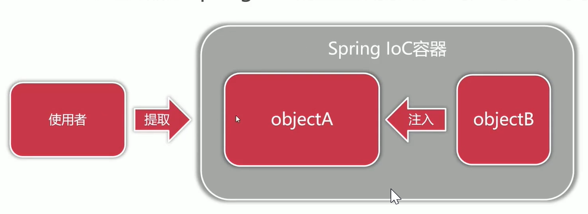

注入: 使用反射技术, 将ObjectA的依赖B, 注入到ObjectA中 -> DI

使用者不需要关注容器内部的对象和对象之间的关系, 只需要关注从什么地方提取需要的对象即可. 使用者不再面对具体的对象, 而是面对容器, 通过容器获取到需要的对象

>  SpringIoC容器职责:
>
> * 对象的控制权交由**第三方**统一管理（loC控制反转）
> * 利用Java**反射**技术实现**运行时**对象创建与关联（Dl依赖注入）
> * 基于配置提高应用程序的可维护性与扩展性

# Spring IoC

## IoC与DI

Spring快速入门, Spring XML配置, 依赖注入配置, 对象实例化配置, 注解与Java Config, Spring 单元测试

### 控制反转

**控制反转（Inverse of Control）**是一种是面向对象编程中的一种设计理念，用来减低计算机代码之间的耦合度。其基本思想是：借助于“第三方”实现具有依赖关系的对象之间的解耦。

并不是由最终的消费者负责创建对象, 引入"代理人"的角色, 由"代理人"统一对象的创建和管理, 消费者面向"代理人"获取对象和进行信息的交换与处理

IoC根本目的: 为了降低对象之间的直接耦合.通过代理人来做解耦, 对象之间可以灵活变化

加入**IoC容器**将对象统一管理，让对象关联变为弱耦合

### DI依赖注入

* IoC是设计理念，是现代程序设计遵循的标准，是宏观目标

* DI(Dependency Injection)是具体技术实现，是微观实现; 在程序**运行过程**中完成对象的创建与绑定.

运行过程 -> DI在Java中利用**反射**技术实现对象注入(Injection), 反射技术来做行为的动态变化, 例如:创建对象, 调用属性, 调用方法

## Spring IoC初体验

### 传统写法

```java
Apple apple1 = new Apple("apple1", "red", "origin1");
Apple apple2 = new Apple("apple2", "green", "origin2");
Apple apple3 = new Apple("apple3", "yellow", "origin3");
// 孩子和苹果之间的对象关联
Child child1 = new Child("child1", apple1);
Child child2 = new Child("child2", apple2);
Child child3 = new Child("child3", apple3);
child1.eat();
child2.eat();
child3.eat();
```

弊端:

* 对象的描述写死在代码中, 对象的信息发现变化后需要修改源代码->不合理, 写死之后修改, 应用环境就需要重新发布上线, 要重新提交测试审核等流程, 软件的维护性很差
* 对象的数量写死了, 如果要新增对象, 要修改源代码
* 最重要的一点: 对象是硬关联, 在程序中使用构造方法参数进行设置, 程序运行后两个对象(孩子和苹果)的关系就确定了, 在程序编译时就确定了关系, 死板, 例如两个孩子吃的苹果交换一下, 就需要修改源代码. 
  * new 关键字在编译时对象与对象之间强制绑定

-> Spring IOC: 根本目的就是通过**配置**的方式完成对象的实例化以及对象之间的依赖关系

### 修改成IoC写法

1. 添加pom依赖

```xml
 <!-- 使用spring ioc容器最小的范围 -->
 <dependency>
     <groupId>org.springframework</groupId>
     <artifactId>spring-context</artifactId>
     <version>5.2.6.RELEASE</version>
 </dependency>
```

2. 新建applicationContext.xml文件

参考[官方文档](https://docs.spring.io/spring-framework/docs/current/reference/html/core.html#spring-core) 1.2.1Configuration Metadata中的xml

```xml
<?xml version="1.0" encoding="UTF-8"?>
<beans xmlns="http://www.springframework.org/schema/beans"
       xmlns:xsi="http://www.w3.org/2001/XMLSchema-instance"
       xsi:schemaLocation="http://www.springframework.org/schema/beans
        https://www.springframework.org/schema/beans/spring-beans.xsd">

    <!--在Ioc容器启动时，自动由Spring实例化Apple对象，取名sweetApple放入到容器中-->
    <bean id="sweetApple" class="com.imooc.spring.ioc.entity.Apple">
        <property name="title" value="红富士"/>
        <property name="color" value="Red"/>
        <property name="origin" value="Eur"/>
    </bean>

    <bean id="sourApple" class="com.imooc.spring.ioc.entity.Apple">
        <property name="title" value="green apple"/>
        <property name="color" value="Green"/>
        <property name="origin" value="origin2"/>
    </bean>

    <bean id="softApple" class="com.imooc.spring.ioc.entity.Apple">
        <property name="title" value="金帅"/>
        <property name="color" value="Red"/>
        <property name="origin" value="China"/>
    </bean>
</beans>
```

* 可以将原本程序中写死的属性, 写到配置文件中. 配置文件是纯文本, 内容变化后不需要对程序进行重新编译
* 在xml中写的bean, 在spring启动的时候自动由Spring实例化该对象, 取名id放到IoC容器中 -> 这里容器会自动创建三个对象

3. SpringApplication

```java
import com.imooc.spring.ioc.entity.Apple;
import org.springframework.context.ApplicationContext;
import org.springframework.context.support.ClassPathXmlApplicationContext;

public class SpringApplication {
    public static void main(String[] args) {
        //创建SpringIoC容器，并根据配置文件在容器中实例化对象
        ApplicationContext context =
                new ClassPathXmlApplicationContext("classpath:applicationContext.xml");

        Apple sweetApple = context.getBean("sweetApple", Apple.class);
        System.out.println(sweetApple.getTitle());
    }
}
```

---

* IoC容器可以通过xml文件的方式, 让我们不再使用new关键字来创建对象, 对于每一个创建的对象都放到了IoC容器中

, IoC统一管理, 贴上标签Bean id. 


* 代码变成可配置文本, 无需修改源代码, 只需要修改配置文件

* 通过配置方式维护对象之间的关联关系, 不需要修改源代码 -> Child和Apple之间的关系

4. 添加child的bean id, ref标签

```xml
<bean id="child1" class="com.imooc.spring.ioc.entity.Child">
    <property name="name" value="child1"/>
    <property name="apple" ref="sweetApple"/>
</bean>
<bean id="child2" class="com.imooc.spring.ioc.entity.Child">
    <property name="name" value="child2"/>
    <property name="apple" ref="sourApple"/>
</bean>
<bean id="child3" class="com.imooc.spring.ioc.entity.Child">
    <property name="name" value="child3"/>
    <property name="apple" ref="softApple"/>
</bean>
```

ref标签指向其他的bean

5. 取出bean

```java
import com.imooc.spring.ioc.entity.Apple;
import com.imooc.spring.ioc.entity.Child;
import org.springframework.context.ApplicationContext;
import org.springframework.context.support.ClassPathXmlApplicationContext;

public class SpringApplication {
    public static void main(String[] args) {
        //创建SpringIoC容器，并根据配置文件在容器中实例化对象
        ApplicationContext context =
                new ClassPathXmlApplicationContext("classpath:applicationContext.xml");

        Apple sweetApple = context.getBean("sweetApple", Apple.class);
        System.out.println(sweetApple.getTitle());
        Child child1 = context.getBean("child1", Child.class);
        child1.eat();
        Child child2 = context.getBean("child2", Child.class);
        child2.eat();
        Child child3 = context.getBean("child3", Child.class);
        child3.eat();
    }
}
```

* 代码上来看, 没有描述任何对象实例化和对象关联的操作, Spring IoC容器在启动过程中根据配置文件applicationContext.xml进行动态的初始化和绑定, 用到的是java中反射的技术, 在程序运行时完成

* 虽然增加了配置, 但是提高了程序上线的可维护性, 如果修改对象关系或者对象初始化, 原始的方式需要修改源代码, 在spring ioc中直接修改配置文件, 不需要修改源代码

* Spring IoC容器的用途, 对象与对象之间解耦, IoC容器对所有的对象做统一的管理, 对象之间的关联也通过反射技术进行管理, 在**运行时**动态设置, 灵活. 以前的对象关系通过硬编码形式(编译时确定), 现在用配置文件(运行时反射)

## xml管理对象, Bean

Java Bean, java可重用对象的编码要求, 例如: 必须有默认构造函数, 属性私有, 通过gettersetter方法设置属性..., 满足这些条件就可以成为Java Bean. 而在Spring IOC容器中管理的就是这些java Bean, 容器中的对象

### 三种配置方式

* 基于XML配置Bean
* 基于注解配置Bean
* 基于Java代码配置Bean

三种配置方式都是告诉SpringIOC容器如何实例化, 如何管理Bean, 只是表现形式不同

#### 基于xml配置Bean

实例化Bean的三种方式:

* 基于构造方法对象实例化(90%的情况)
* 基于静态工厂实例化
* 基于工厂实例方法实例化

##### 基于构造方法对象实例化

###### 无参初始化

* xml文件中添加

```xml
<!--在Ioc容器启动时，自动由Spring实例化Apple对象，取名sweetApple放入到容器中-->
<!--
    bean: 通知IOC容器需要实例化什么对象
    class: 从哪个类进行实例化
-->
<!-- <Bean>标签默认通过默认构造方法创建对象 -->
<bean id="apple1" class="com.imooc.spring.ioc.entity.Apple"/>
```

* 查看加载到容器中

```java
import org.springframework.context.ApplicationContext;
import org.springframework.context.support.ClassPathXmlApplicationContext;

public class SpringApplication {
    public static void main(String[] args) {
        //创建SpringIoC容器，并根据配置文件在容器中实例化对象
        ApplicationContext context =
                new ClassPathXmlApplicationContext("classpath:applicationContext.xml");
    }
}
```

ApplicationContext是接口, 有各种实现类, ClassPathXmlApplicationContext从置顶路径加载xml配置文件

执行后java运行内存中保存了IOC容器, 并且IOC容器根据xml中的配置创建对应的对象, 并管理

运行后, 实例化和初始化对象

给Apple添加无参的初始化

```java
Apple() {
    System.out.println("apple 对象已创建" + this);
}
```

直接运行可以看到输出:

```
apple 对象已创建com.imooc.spring.ioc.entity.Apple@737996a0
```

所以说,**`<Bean>`标签默认通过默认构造方法创建对象**

###### 含参初始化

1. xml文件配置

* constructor-arg name: 使用**参数名**的方式给对应的参数进行初始化赋值

```xml
<!-- 含参初始化 -->
<bean id="sweetApple" class="com.imooc.spring.ioc.entity.Apple">
    <!--没有constructor-arg则代表调用默认构造方法实例化-->
    <constructor-arg name="title" value="红富士"/>
    <constructor-arg name="color" value="红色"/>
    <constructor-arg name="origin" value="欧洲"/>
</bean>
```

constructor-arg会去查找在class中对应的构造方法, 再根据name参数的名字, 使用反射的技术在运行时动态设置对应的值.

* constructor-arg index: 利用构造方法**参数位置**实现对象实例化

```xml
<bean id="sweetApple2" class="com.imooc.spring.ioc.entity.Apple">
    <!--利用构造方法参数位置实现对象实例化-->
    <constructor-arg index="0" value="红富士"/>
    <constructor-arg index="1" value="红色"/>
    <constructor-arg index="2" value="欧洲"/>
</bean>
```

2. 书写构造函数输出

```java
public Apple(String title, String color, String origin) {
    this.title = title;
    this.color = color;
    this.origin = origin;
    System.out.println("带参数的构造函数创建对象: " + this);
    System.out.println(this.title + " " + this.color + " " + this.origin);
}
```

直接运行Application

```
带参数的构造函数创建对象: com.imooc.spring.ioc.entity.Apple@548e7350
红富士 红色 欧洲
```

3. 其他类型初始化

xml文件中虽然是以字符类型, 但是spring框架会把字符型自动转成对应的类型, 例如这里添加price为double类型

```xml
<bean id="sweetApple1" class="com.imooc.spring.ioc.entity.Apple">
    <!--没有constructor-arg则代表调用默认构造方法实例化-->
    <constructor-arg name="title" value="红富士"/>
    <constructor-arg name="color" value="红色"/>
    <constructor-arg name="origin" value="欧洲"/>
    <constructor-arg name="price" value="12.55"/>
</bean>
```

Apple中添加对应的构造函数

```java
public Apple(String title, String color, String origin, double price) {
    this.title = title;
    this.color = color;
    this.origin = origin;
    this.price = price;
    System.out.println("带参数的构造函数创建对象: " + this);
    System.out.println(this.title + " " + this.color + " " + this.origin + " " + this.price);
}
```

输出:

```
带参数的构造函数创建对象: com.imooc.spring.ioc.entity.Apple@1ed4004b
红富士 红色 欧洲 12.55
```

4. 如果没有对应的构造方法

编译提示错误:

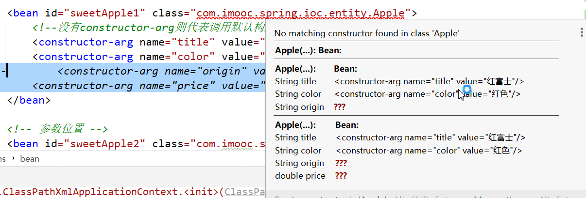

idea会报错:

```
org.springframework.beans.factory.UnsatisfiedDependencyException: Error creating bean with name 'sweetApple1' defined in class path resource [applicationContext.xml]: Unsatisfied dependency expressed through constructor parameter 2: Ambiguous argument values for parameter of type [java.lang.String] - did you specify the correct bean references as arguments?
```

所以xml配置要严格按照类的定义来书写

##### 基于静态工厂实例化

工厂模式: 隐藏创建类的细节, 通过额外的工厂类组织创建需要的对象

静态工厂: 静态工厂通过静态方法(static)创建对家，隐藏创建对象的细节

1. 新建AppleStaticFactory

```java
import com.imooc.spring.ioc.entity.Apple;

/**
 * 静态工厂通过静态方法创建对家，隐藏创建对象的细节
 */
public class AppleStaticFactory {
    public static Apple createSweetApple() {
        Apple apple = new Apple();
        apple.setTitle("红富士");
        apple.setOrigin("欧洲");
        apple.setColor("红色");
        return apple;
    }
}
```

2. xml文件中

```xml
<!-- 利用静态工厂获取对象 -->
<bean id="apple4" class="com.imooc.spring.ioc.factory.AppleStaticFactory"
      factory-method="createSweetApple"/>
```

产生的apple对象放到了Spring IOC容器中

* 疑惑: 在静态工程中, 不还是使用的new关键字创建Apple对象? 这样子和直接在程序中new Apple有什么区别?

这里工厂通过静态方法创建对象, 同时隐藏创建对象的细节, 只看方法的话, 内部创建的过程是不可见的, 工厂的目的就是为了不让我们知道对象是如何构建的. 对创建者来说, 只需要调用了`createSweetApple`方法, 工厂就会返回一个sweetApple对象

出现静态工厂的目的: 在IOC容器之外, 通过程序的方式来组织对象, 

好处: 如果在createSweetApple方法中添加额外的行为, 例如logger, 与实际业务相关, 增加额外的代码. 这些工作对于纯xml配置的方式就较难实现

##### 基于工厂实例方法实例化

静态方法, static关键字描述, 说明这个方法(createSweetApple)属于工厂类(AppleStaticFactory)本身, 不属于工厂对象

工厂实例: 在IOC容器中对工厂进行实例化, 调用工厂对象中的某一个方法来完成具体对象创建的工作

工厂实例方法创建对象是指: IoC容器对工厂类进行实例化并调用对应的实例方法创建对象的过程

1. 新建AppleFactoryInstance

没有static关键字, 说明方法属于工厂对象, 而不是属于工厂类

```java
import com.imooc.spring.ioc.entity.Apple;
/**
 * 工厂实例方法创建对象是指IoC容器对工厂类进行实例化并调用对应的实例方法创建对象的过程
 */
public class AppleFactoryInstance {
    public Apple createSweetApple() {
        Apple apple = new Apple();
        apple.setTitle("红富士");
        apple.setOrigin("欧洲");
        apple.setColor("红色");
        return apple;
    }
}
```

2. xml文件中

需要两个Bean, 第一个Bean指向工厂本身, 第二个Bean利用工厂实例的createSweetApple方法获取实例对象, 使用factory-bean和factory-method

```xml
<!-- 利用工厂实例获取对象 -->
<!-- 在IOC容器初始化中, 首先对工厂进行实例化 -->
<bean id="factoryInstance" class="com.imooc.spring.ioc.factory.AppleFactoryInstance"/>
<bean id="apple5" factory-bean="factoryInstance" factory-method="createSweetApple"/>
```

两种工厂本质都是封装隐藏创建对象的细节.

#### 基于注解配置Bean


#### 基础Java代码配置Bean


### IOC容器中获取Bean

#### 获取方法

```java
Apple sweetApple = context.getBean("sweetApple", Apple.class);// 优先
Apple sweetApple1 = (Apple) context.getBean("sweetApple");
```

#### bean id和name

name用来设置bean名称

id和name的相同点: 

* bean id与name都是设置对象在loC容器中唯一标识
* 两者在同一个配置文件中都不允许出现重复
* 两者允许在**多个配置**文件中出现**重复**, 新对象覆盖旧对象

同一个文件不允许重复, 多个文件允许重复, 新对象覆盖旧对象

id和name的区别:

* id要求更为严格，一次只能定义一个对象标识（推荐）
* name更为宽松，一次允许定义多个对象标识
* tips:id与name的命名要求有意义,按驼峰命名书写

##### 多个applicationContext文件

1. 复制一个applicationContext-1.xml文件

2. ClassPathXmlApplicationContext允许加载多个xml文件

```java
String[] configLocatoins = new String[]{"classpath:applicationContext.xml", "classpath:applicationContext-1.xml"};

//创建SpringIoC容器，并根据配置文件在容器中实例化对象
ApplicationContext context =
    new ClassPathXmlApplicationContext(configLocatoins);

Apple sweetApple = context.getBean("sweetApple", Apple.class);
System.out.println(sweetApple.getTitle());
```

按照String[]中的顺序, 先加载applicationContext, 再加载了applicationContext-1, 覆盖了旧对象

##### id的标识唯一, name更为宽松，一次允许定义多个对象标识

```xml
<bean name="sweetApple, apple7" class="com.imooc.spring.ioc.entity.Apple">
    <!--没有constructor-arg则代表调用默认构造方法实例化-->
    <constructor-arg name="title" value="红富士2"/>
    <constructor-arg name="color" value="红色"/>
    <constructor-arg name="origin" value="欧洲"/>
</bean>
```

可以通过`getBean("apple7", Apple.class)`来得到

通过name属性可以设置多个bean标识, id只能设置一个bean标识

##### 没有id与name的bean默认使用类名全称作为bean标识

开发中用得少

```xml
<!--没有id与name的bean默认使用类名全称作为bean标识-->
<bean class="com.imooc.spring.ioc.entity.Apple">
    <constructor-arg name="title" value="红富士3"/>
    <constructor-arg name="color" value="红色3"/>
    <constructor-arg name="origin" value="欧洲3"/>
</bean>
```

```java
Apple apple = context.getBean("com.imooc.spring.ioc.entity.Apple", Apple.class);
System.out.println(apple.getTitle());
```

### 路径匹配表达式

IOC加载配置使用的路径匹配表达式

```java
//创建SpringIoC容器，并根据配置文件在容器中实例化对象
ApplicationContext context =
                new ClassPathXmlApplicationContext("classpath:applicationContext.xml")
    
// 加载多配置文件
String[] configLocatoins = new String[]{"classpath:applicationContext.xml", "classpath:applicationContext-1.xml"};

//创建SpringIoC容器，并根据配置文件在容器中实例化对象
ApplicationContext context =
    new ClassPathXmlApplicationContext(configLocatoins);
```

`classpath:applicationContext.xml`: 加载类路径下, 名为applicationContext的配置文件

类路径: target/classes目录, 而不是源代码中的resources

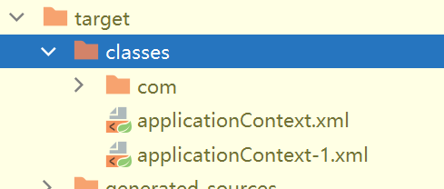

---

其他的写法:

| 表达式实例                      | 说明                                                |
| ------------------------------- | --------------------------------------------------- |
| classpath:config.xml            | 扫描classpath根路径(不包含jar)的config.xml          |
| classpath:com/imooc/config.xml  | 扫描classpath下(不包含jar)com.imooc包中的config.xml |
| classpath*:com/imooc/config.xml | 扫描classpath下(包含jar)com.imooc包中的config.xml   |
| classpath:config-*.xml          | 扫描classpath根路径下所有以config-开头的XML文件     |
| classpath:com/**/config.xml     | 扫描com包下（包含任何子包）的config.xml             |
| file:c:/config.xml              | 扫描c盘根路径config.xml                             |

* 不包含jar: 只扫描自己写的target中的资源或配置文件, 因为引入的maven依赖jar包本质也是压缩包, 其中也有可能包含配置文件

* config-*.xml: 多配置文件情况下, 后加载的覆盖旧加载的, ` *通配符 `的加载顺序按照文件名ASCNII码升序.

### 对象依赖注入

在SpringIOC容器中设置对象的依赖关系, 也就是对象依赖注入过程

之前Apple和Child之间的例子:

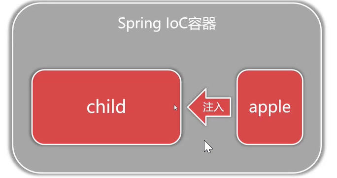

依赖注入是指运行时将容器内对象利用**反射**赋给其他对象的操作, 两种实现方法:

* 基于setter方法注入对象(开发中常用) ->两种 使用场景
* 基于构造方法注入对象

#### 利用setter实现静态数值的注入

1. 属性使用property标签指代, name: 属性名, value: 属性值

在数据操作的时候, 所有的都是对象, String, Double, Float, 包装类型

```xml
<!--IoC容器自动利用反射机制运行时调用stXXX方法为属性赋值-->
<bean id="sweetApple" class="com.imooc.spring.ioc.entity.Apple">
    <property name="title" value="红富士"/>
    <property name="color" value="Red"/>
    <property name="origin" value="Eur"/>
</bean>
```

***IOC容器内对象会使用反射技术, 在运行时调用setXXX方法为属性赋值***

2. 在Apple的setTitle方法中新增输出:

```java
public void setTitle(String title) {
    System.out.println("hello");
    this.title = title;
}
```

输出:

```
hello
红富士
```

3. Apple中新增属性

```java
private Double price;
```

新增属性price, 但是不设置getter和setter方法, 变异有错误提示, 运行报错:

```
警告: Exception encountered during context initialization - cancelling refresh attempt: org.springframework.beans.factory.BeanCreationException: Error creating bean with name 'sweetApple' defined in class path resource [applicationContext.xml]: Error setting property values; nested exception is org.springframework.beans.NotWritablePropertyException: Invalid property 'price' of bean class [com.imooc.spring.ioc.entity.Apple]: Bean property 'price' is not writable or has an invalid setter method. Does the parameter type of the setter match the return type of the getter?
Exception in thread "main" org.springframework.beans.factory.BeanCreationException: Error creating bean with name 'sweetApple' defined in class path resource [applicationContext.xml]: Error setting property values; nested exception is org.springframework.beans.NotWritablePropertyException: Invalid property 'price' of bean class [com.imooc.spring.ioc.entity.Apple]: Bean property 'price' is not writable or has an invalid setter method. Does the parameter type of the setter match the return type of the getter?
```

#### setter方法注入对象(对象与对象之间的依赖)

ref后写有效的bean id, 完成apple和child关联

1. 增加配置

```xml
<bean id="sweetApple" class="com.imooc.spring.ioc.entity.Apple">
    <property name="title" value="红富士"/>
    <property name="color" value="red"/>
    <property name="origin" value="eur"/>
    <property name="price" value="12.2"/>
</bean>

<!-- -->
<bean id="lily" class="com.imooc.spring.ioc.entity.Child">
    <property name="name" value="莉莉"/>
    <property name="apple" ref="sweetApple"/>
</bean>
```

2. java类中添加输出

```java
public Apple() {
    System.out.println("apple 对象已创建" + this);
}
```

```java
public Child() {
    System.out.println("创建child对象: " + this);
}

public void setApple(Apple apple) {
    System.out.println("setApple: " + apple);
    this.apple = apple;
}
```

运行后发现, SpringIOC容器初始化:

```
apple 对象已创建com.imooc.spring.ioc.entity.Apple@735b478
Apple setTitle: 红富士
创建child对象: com.imooc.spring.ioc.entity.Child@69ea3742
setApple: com.imooc.spring.ioc.entity.Apple@735b478
```

可以看到, Child中注入的Apple对象正是之前创建的Apple(@735b478)

在创建过程中, 在IOC容器中创建了两个不相关的对象Apple和Child, IOC容器调用Child对象的setApple方法将之前创建的Apple对象赋值set的参数, 赋值Child中的Apple属性

#### 注入集合对象

注入List:

```xml
<bean id="..." class="...">
	<property name="someList">
	<list>
		<value>具体值</value>
		<!-- 或者使用 -->
		<ref bean="beanid"></ref>
	</list>
	</property>
</bean>
```

注入Set:

```xml
<bean id="..." class="...">
	<property name="someSet">
	<set>
		<value>具体值</value>
        <!-- 或者使用 -->
		<ref bean="beanld"></ref>
	</set>
	</property>
</bean>
```

注入Map：

```xml
<bean id="..." class="...">
	<property name="someMap">
	<map>
		<entry key="k1" value="v1"></entry>
		<entry key="k2" value-ref="beanid"></entry >
	</map>
	</property>
</bean>
```

注入Properties, 属性类型: 

```xml
<bean id="..." class="...">
	<property name="someProperties">
	<props>
		<prop key="k1">v1</prop>
		<prop key="k2">v2</prop>
	</props>
	</property>
</bean>
```

与map区别: properties只允许key和value是字符串类型

---

例子:->s04

ApplicationContext.xml

```xml
<?xml version="1.0" encoding="UTF-8"?>
<beans xmlns="http://www.springframework.org/schema/beans"
       xmlns:xsi="http://www.w3.org/2001/XMLSchema-instance"
       xsi:schemaLocation="http://www.springframework.org/schema/beans
        https://www.springframework.org/schema/beans/spring-beans.xsd">

    <bean id="computer1" class="com.imooc.spring.ioc.entity.Computer">
        <constructor-arg name="brand" value="联想"/>
        <constructor-arg name="type" value="台式机"/>
        <constructor-arg name="sn" value="8389283012"/>
        <constructor-arg name="price" value="3085"/>
    </bean>

    <bean id="company" class="com.imooc.spring.ioc.entity.Company">
        <property name="rooms">
            <list>
                <value>2001-总裁办</value>
                <value>2003-总经理办公室</value>
                <value>2010-研发部会议室</value>
                <value>2010-研发部会议室</value>
            </list>
        </property>

        <property name="rooms1">
            <set>
                <value>2001-总裁办</value>
                <value>2003-总经理办公室</value>
                <value>2010-研发部会议室</value>
                <value>2010-研发部会议室</value>
            </set>
        </property>

        <property name="computerMap">
            <map>
                <!-- 这个写法要求每次要写一个computer的bean -->
                <entry key="dev-88172" value-ref="computer1"/>
                <!-- 使用内置bean, 只给该map使用 -->
                <entry key="dev-88173">
                    <bean class="com.imooc.spring.ioc.entity.Computer">
                        <constructor-arg name="brand" value="dell"/>
                        <constructor-arg name="type" value="台式机"/>
                        <constructor-arg name="sn" value="8389283013"/>
                        <constructor-arg name="price" value="3099"/>
                    </bean>
                </entry>
            </map>
        </property>

        <property name="info">
            <props>
                <prop key="phone">01000000</prop>
                <prop key="address">China-xxx</prop>
                <prop key="website">www.xxx.com</prop>
            </props>
        </property>
    </bean>
</beans>
```

1. 可以看到ApplicatoinContext中List的默认注入类型是ArrayList

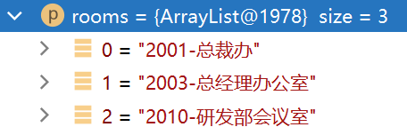


2. Set标签去重, LinkedHashSet, TreeSet是无需的, 但是linkedHashSet在内存中数据分散存储, 但是基于双向链表, 数据在提取的时候按照数据存放的顺序.

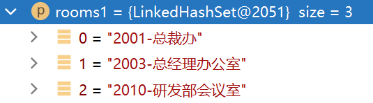

3. Map标签, 可以直接ref来指向外部的bean, 但是麻烦; 也可以直接写内置bean, 只给该map使用

Map的类型是LinkedHashMap, 双向链表, 数据遍历提取的时候按照数据存放的顺序

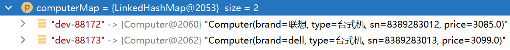

4. property, 

```java
company.getInfo().getProperty("key")
```

#### 依赖注入的好处

利用IOC容器将软件过程中的**对象解耦**, 进而让软件成员协作也解耦. 双方约定bean的依赖, 互相不关系各自的实现, 不需要修改

1. 新建book-shop项目, 新建两个xml

service和dao两个xml由两个成员分别开发, 各自维护自己的模块

applicationContext-service: 保存所有的服务类

applicationContext-dao: 保存所有的数据服务类, CRUD

2. 新建dao和service类

* 新建接口

``` java
public interface BookDao {
    /**
     * 向book表中插入数据
     */
    public void insert();
}
```

* 新建实现类

```java
public class BookDaoImpl implements BookDao {
    @Override
    public void insert() {
        System.out.println("MySQL Table Book insert one record");
    }
}
```

* 新建Service

```java
import com.imooc.spring.ioc.bookshop.dao.BookDao;

public class BookService {

    // 不需要new, 在IOC容器启动过程中会自动注入
    private BookDao bookDao;
    /**
     * 采购新书
     */
    public void purchase() {
        System.out.println("purchase start");
        bookDao.insert();
    }

    public BookDao getBookDao() {
        return bookDao;
    }

    public void setBookDao(BookDao bookDao) {
        this.bookDao = bookDao;
    }
}
```

BookService中使用BookDao, 注意不需要new, 让IOC容器启动的时候自动完成注入

3. 分别配置xml文件, 注意由两个人开发

applicationContext-dao.xml

```xml
<?xml version="1.0" encoding="UTF-8"?>
<beans xmlns="http://www.springframework.org/schema/beans"
       xmlns:xsi="http://www.w3.org/2001/XMLSchema-instance"
       xsi:schemaLocation="http://www.springframework.org/schema/beans
        https://www.springframework.org/schema/beans/spring-beans.xsd">
    <bean id="bookDao" class="com.imooc.spring.ioc.bookshop.dao.BookDaoImpl">
    </bean>
</beans>
```

applicationContext-service.xml

```xml
<?xml version="1.0" encoding="UTF-8"?>
<beans xmlns="http://www.springframework.org/schema/beans"
       xmlns:xsi="http://www.w3.org/2001/XMLSchema-instance"
       xsi:schemaLocation="http://www.springframework.org/schema/beans
        https://www.springframework.org/schema/beans/spring-beans.xsd">
    <bean id="bookService" class="com.imooc.spring.ioc.bookshop.service.BookService">
        <!-- id=bookDao, 由另一位开发者开发 -->
        <property name="bookDao" ref="bookDao"/>
    </bean>
</beans>
```

4. 新增Application启动

```java
import com.imooc.spring.ioc.bookshop.service.BookService;
import org.springframework.context.ApplicationContext;
import org.springframework.context.support.ClassPathXmlApplicationContext;

public class BookShopApplication {
    public static void main(String[] args) {
        ApplicationContext context =
                new ClassPathXmlApplicationContext("classpath:applicationContext-*.xml");

        BookService bookService = context.getBean("bookService", BookService.class);
        bookService.purchase();
    }
}
```

输出:

```
purchase start
MySQL Table Book insert one record
```

---

通过配置的方式, 实现service调用dao的过程, service和dao是不同人开发, 都有自己的配置文件, 双方约定好依赖的bean之后, 独自开发, 不干扰

如果系统升级, MySQL升级为Oracle

1. 新增Oracle的impl类

```java
public class BookDaoOracleImpl implements BookDao {
    @Override
    public void insert() {
        System.out.println("Orcale table Book insert one revord");
    }
}
```

2. xml中bean的class修改为BookDaoOracleImpl

```xml
<bean id="bookDao" class="com.imooc.spring.ioc.bookshop.dao.BookDaoOracleImpl">
</bean>
```

对于service的开发者而言, 没有任何的影响, 不需要做任何修改(都是BookDao接口), 因为双方已经提前约定好了bean的依赖关系, 双方解耦

service端不需要修改任何数据

运行结果: 可以看到发生了变化

```
purchase start
Orcale table Book insert one revord
```

## 查看IOC容器内对象

```java
// 获取容器内所有bean Id数组
String[] beanNames = context.getBeanDefinitionNames();
```

1. 需要注意的是, 如果是内部bean, 例如在"注入集合对象"中的Map的内部bean, IOC容器认为该bean只给当前MapValue, 其他地方不会使用

2. 对于没有指定id和name的bean, 输出类似`com.imooc.spring.ioc.entity.Computer#0`.如果有多个同class的匿名bean, 就会按照0,1,2,3,4的来排列

3. 如果有多个匿名bean, 使用类全称获取bean的时候, 默认获取的是第一个匿名bean. 
   如果要获取其他的, 需要加上#和编号. 实际不推荐使用, 因为如果位置修改了, 代码也需要修改

```java
Computer computer0 = 
    context.getBean("com.imooc.spring.ioc.entity.Computer", Computer.class);
System.out.println(computer0.getBrand());

Computer computer1 =
    context.getBean("com.imooc.spring.ioc.entity.Computer#1", Computer.class);
System.out.println(computer1.getBrand());
```

4. bean的类型和内容

```java
context.getBean(beanName).getClass().getName();
context.getBean(beanName).toString();// 重写toString方法
```

## Bean scope

* bean scope属性用于决定对象何时被创建与作用范围
* bean scope配置将影响容器内对象的数量
* bean scope默认值singleton(单例),指全局共享同一个对象实例
* 默认情况下bean会在loC容器创建后自动实例化，全局唯一

```xml
<bean id="bookDao"
	class="com.imooc.spring.ioc.bookshop.dao.BookDaoOraclelmpl"
	scope="prototype" />
```

| scope属性     | 说明                                                         |
| ------------- | ------------------------------------------------------------ |
| **singleton** | 单例（默认值），每一个容器有且只有唯一的实例，实例被全局共享 |
| **prototype** | 多例，每次使用时都是创建一个实例                             |
| request       | web环境下，每一次独立请求存在唯一实例                        |
| session       | web环境下,每一个session存在有唯一实例                        |
| application   | web环境下,ServletContext存在唯一实例                         |
| websocket     | 每一次WebSocket连接中存在唯一实例                            |

### singleton单例

scope默认是singleton单例, 在容器启动的时候被IOC容器创建

userDao对象被其他所有的应用对象共享

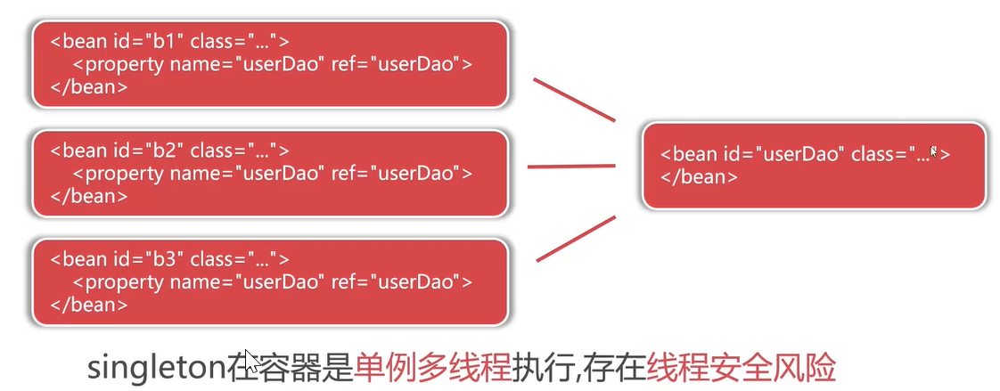

* 为什么默认使用单例模式?

如果每一次在需要某一个对象的时候再去创建, 额外占用内存空间和CPU的计算资源, 大应用中频繁创建资源造成的损耗很大. 单例模式可以有效解决创建对象的资源损耗问题

* 会不会出现阻塞?

如果b1, b2, b3同时发起调用, 会不会阻塞?

不会, singleton在容器是单例多线程执行，但是存在**线程安全风险**

* singleton的线程安全问题

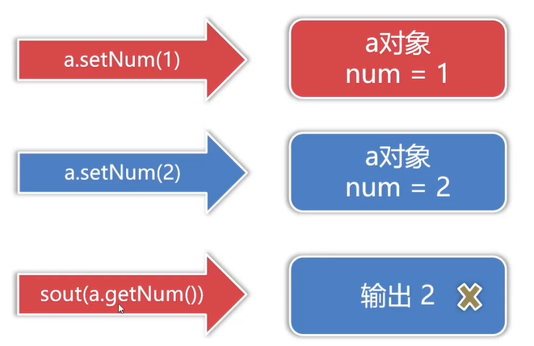

如何解决? 很多方法

* synchronize关键字加锁, 设置读取的时候独占
* 每个用户分配只属于自己的对象, -> Spring中prototype多例


### prototype多例

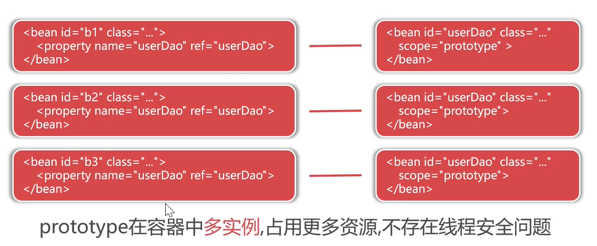

每一个**产生对象注入(或者context.getBean)**的时候, IOC容器都会产生新的Dao

多个实例, 一一绑定, 每个线程的工作互不影响, 解决线程安全问题

### singleton与prototype对比

|              | singleton     | prototype             |
| ------------ | ------------- | --------------------- |
| 对象数量     | 全局唯一      | 存在多个              |
| 实例化时机   | IoC容器启动时 | getBean()或对象注入时 |
| 线程安全问题 | 存在          | 不存在                |
| 执行效率     | 高            | 低                    |

### 代码说明区别

s05

1. UserDao和他的的构造方法

```java
public class UserDao {
    public UserDao() {
        System.out.println("hello, UserDao" + this);
    }
}
```

2. applicationContext声明bean, 默认是singleton, 在IOC容器启动时候就实例化

```xml
<?xml version="1.0" encoding="UTF-8"?>
<beans xmlns="http://www.springframework.org/schema/beans"
       xmlns:xsi="http://www.w3.org/2001/XMLSchema-instance"
       xsi:schemaLocation="http://www.springframework.org/schema/beans
        https://www.springframework.org/schema/beans/spring-beans.xsd">
    <bean id="userdao" class="com.imooc.spring.ioc.dao.UserDao"/>
</beans>
```

3. 启动

```java
import org.springframework.context.ApplicationContext;
import org.springframework.context.support.ClassPathXmlApplicationContext;

public class SpringApplication {
    public static void main(String[] args) {

        ApplicationContext context =
                new ClassPathXmlApplicationContext("classpath:applicationContext.xml");
    }
}

```

运行后可以发现, 在IOC容器启动时, 就实例化sington的bean

```
hello, UserDao. com.imooc.spring.ioc.dao.UserDao@7225790e
```

4. 将scope修改为prototype -> getBean()

```xml
<bean id="userdao" class="com.imooc.spring.ioc.dao.UserDao" scope="prototype"/>
```

prototype的实例化是在: getBean()或对象注入时

如果还是直接运行, 不会有输出. 

在SpringApplication中添加:

```java
UserDao bean = context.getBean("userdao", UserDao.class);
```

getBean()的时候产生新的对象

```
hello, UserDao. com.imooc.spring.ioc.dao.UserDao@d2cc05a
```

如果多运行几次

```java
UserDao bean1 = context.getBean("userdao", UserDao.class);
UserDao bean2 = context.getBean("userdao", UserDao.class);
UserDao bean3 = context.getBean("userdao", UserDao.class);
```

输出:

```
hello, UserDao. com.imooc.spring.ioc.dao.UserDao@d2cc05a
hello, UserDao. com.imooc.spring.ioc.dao.UserDao@6a41eaa2
hello, UserDao. com.imooc.spring.ioc.dao.UserDao@7cd62f43
```

编号都不一样, 不同的

5. prototype, 方法注入的时候实例化

* 新增Service

```java
import com.imooc.spring.ioc.dao.UserDao;

public class UserService {
    private UserDao userDao;

    public UserService() {
        Syste.out.println("UserService create: " + this);
    }

    public UserDao getUserDao() {
        return userDao;
    }

    public void setUserDao(UserDao userDao) {
        System.out.println("UserService: setUserDao. " + userDao);
        this.userDao = userDao;
    }
}
```

* bean中配置

```xml
<?xml version="1.0" encoding="UTF-8"?>
<beans xmlns="http://www.springframework.org/schema/beans"
       xmlns:xsi="http://www.w3.org/2001/XMLSchema-instance"
       xsi:schemaLocation="http://www.springframework.org/schema/beans
        https://www.springframework.org/schema/beans/spring-beans.xsd">

<!--    <bean id="userdao" class="com.imooc.spring.ioc.dao.UserDao"/>-->
    <bean id="userdao" class="com.imooc.spring.ioc.dao.UserDao" scope="prototype"/>

    <bean id="userservice" class="com.imooc.spring.ioc.service.UserService">
        <property name="userDao" ref="userdao"/>
    </bean>
</beans>

```

* ***在IOC容器初始化过程, 会有几个对象***?

会创建两个对象, 第一个是userService, 因为userService默认使用的是单例, 在IOC容器初始化过程中创建; 第二个是userDao, 因为在userService中引用了userDao对象, 需要userDao的实例, 而userdao在容器初始化的时候不存在, 所以IOC也进行了实例化

只保留new class...语句:

```
ApplicationContext context =
        new ClassPathXmlApplicationContext("classpath:applicationContext.xml");
```

```
UserService create: com.imooc.spring.ioc.service.UserService@531be3c5
hello, UserDao. com.imooc.spring.ioc.dao.UserDao@51081592
UserService: setUserDao. com.imooc.spring.ioc.dao.UserDao@51081592
```

可以通过输出语句看到创建对象的过程

需要注意, 单例模式下bean的初始化顺序是按照bean的书写顺序来确定的, 但是如果增加了prototype的scope, bean不会在IOC容器初始化的时候自动实例化

所以当关联到prototype对象的时候同样会触发实例化操作

* UserService也修改为prototype

```xml
<bean id="userdao" class="com.imooc.spring.ioc.dao.UserDao" scope="prototype"/>
<bean id="userservice" class="com.imooc.spring.ioc.service.UserService" scope="prototype">
    <property name="userDao" ref="userdao"/>
</bean>
```

直接运行context是没有被实例化的

运行getBean

```java
import com.imooc.spring.ioc.dao.UserDao;
import com.imooc.spring.ioc.service.UserService;
import org.springframework.context.ApplicationContext;
import org.springframework.context.support.ClassPathXmlApplicationContext;

public class SpringApplication {
    public static void main(String[] args) {

        ApplicationContext context =
                new ClassPathXmlApplicationContext("classpath:applicationContext.xml");
        System.out.println("=======ioc容器已初始化========");
        UserService userService = context.getBean("userservice", UserService.class);
        UserService userService1 = context.getBean("userservice", UserService.class);
        UserService userService2 = context.getBean("userservice", UserService.class);
        UserService userService3 = context.getBean("userservice", UserService.class);
        UserService userService4 = context.getBean("userservice", UserService.class);
    }
}
```

输出:

```
=======ioc容器已初始化========
UserService create: com.imooc.spring.ioc.service.UserService@2a2d45ba
hello, UserDao. com.imooc.spring.ioc.dao.UserDao@42e26948
UserService: setUserDao. com.imooc.spring.ioc.dao.UserDao@42e26948
UserService create: com.imooc.spring.ioc.service.UserService@6e06451e
hello, UserDao. com.imooc.spring.ioc.dao.UserDao@59494225
UserService: setUserDao. com.imooc.spring.ioc.dao.UserDao@59494225
UserService create: com.imooc.spring.ioc.service.UserService@6e1567f1
hello, UserDao. com.imooc.spring.ioc.dao.UserDao@5cb9f472
UserService: setUserDao. com.imooc.spring.ioc.dao.UserDao@5cb9f472
UserService create: com.imooc.spring.ioc.service.UserService@cb644e
hello, UserDao. com.imooc.spring.ioc.dao.UserDao@13805618
UserService: setUserDao. com.imooc.spring.ioc.dao.UserDao@13805618
UserService create: com.imooc.spring.ioc.service.UserService@56ef9176
hello, UserDao. com.imooc.spring.ioc.dao.UserDao@4566e5bd
UserService: setUserDao. com.imooc.spring.ioc.dao.UserDao@4566e5bd
```

可以看到, 在IOC容器初始化的过程中, 没有产生任何对象, 所有对象都是在getBean或者注入的时候被创建的. UserSevice中注入UserDao的时候, UserDao也是protoType的, 所以都是要新创建的

笔试题, 给一份配置文件, 需要看出来在初始化时, 实例化了什么对象

---

在实际项目中, Service, Dao这些类应该是什么scope?

在绝大多数情况下, Service, Dao, SpringMVC的Controller类都是都是单例singleton的. 

单例的线程安全问题根源是因为对象的某一个属性在运行过程中不断变化, 但是实际情况下, 如果UserService被创建, 那么UserDao是哪个具体的类就被确定了, 大部分情况下不会重新设置UserDao, 不会出现线程安全的问题

总结来看, 如果某个属性在运行过程中是恒定不变的, 那么就可以设置成单例singleton; 如果在程序过程中不断变化, 使用prototype

## bean的生命周期

### 整体流程

在IOC容器的某个阶段, Bean做了什么事情

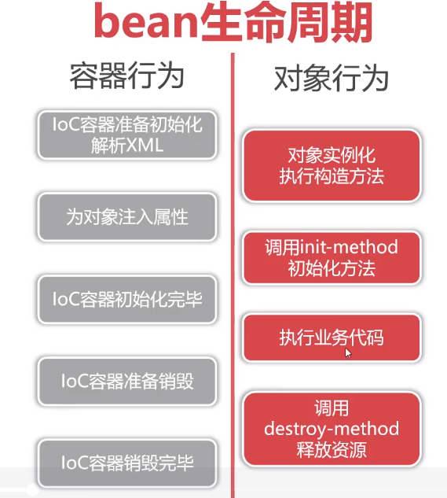

1. 解析applicationContext.xml文件: 查看当前xml中需要创建哪些对象, 对哪些对象注入什么属性, 基础配置信息

2. 对象实例化: IOC根据XML配置文件, 通过反射实例化对应的bean, 同时基于java的规则, 执行对应的构造方法

3. 对象注入属性: 根据前面解析的XML, 就知道要为当前新创建的对象注入哪些属性

4. 当对象注入以后，由ioc容器会自动的去调用对象的init-method初始化方法, 完成对象的初始化工作
   * 这里有一个注意点, 之前说得对象初始化在构造方法中完成, 为什么这里又有一个init-method的配置? 因为在构造方法创建的时候，作为这个对象，他还没有任何属性. 只有当对象创建好之后, IOC容器才为其注入了这个对象数据. 
   * init的作用就是在为对象注入属性值之后, 基于属性值完成对象的初始化工作

5. IOC容器初始化完毕后, 通过代码调用这些对象的业务代码
6. IOC容器结束准备销毁, 调用在配置文件中所声明的destory-method方法释放对应的资源
7. 所有的destory-method方法执行完成, IOC容器销毁完毕

### 案例说明

1. 新增Order类

```java
public class Order {
    private Double price;
    private Integer quantity;
    private Double total;

    public Order() {
        System.out.println("order NoArgs construct " + this);
    }

    public void init() {
        System.out.println("init()");
        total = price * quantity;
    }

    public void pay() {
        System.out.println("Order pay total: " + total);
    }

    public void setPrice(Double price) {
        System.out.println("setPrice " + price);
        this.price = price;
    }


    public void setQuantity(Integer quantity) {
        System.out.println("setQuantity " + quantity);
        this.quantity = quantity;
    }
}
```

注意这里的init方法, 后续要用到

2. xml中配置

```xml
<!-- init-method在设置完属性之后再去执行 -->
<bean id="order1" class="com.imooc.spring.ioc.entity.Order" init-method="init">
    <property name="price" value="19.8"/>
    <property name="quantity" value="1000"/>
</bean>
```

可以看到使用了init-method, 因为在使用标签property设置属性的时候, total属性已知是price*quantity, 不可能手动计算后赋值property. 

所以使用init-method, 利用其在设置完属性之后再去执行的特点, 完成total属性的计算

3. SpringApplication中

```java
Order order1 = context.getBean("order1", Order.class);
order1.pay();
```

输出:

```
order NoArgs construct com.imooc.spring.ioc.entity.Order@1b7cc17c
setPrice 19.8
setQuantity 1000
init()
=======ioc容器已初始化========
Order pay total: 19800.0
```

1. IOC容器初始化过程中实例化Order对象
2. set方法设置不同的值
3. 执行init-method方法
4. 容器初始化以后, 执行业务逻辑

---

* 容器销毁:

1. SpringApplication中调用销毁方法

```
// 销毁IOC容器, 没有定义在接口
// 目的是销毁IOC容器, 会调用bean中的destroy-method
((ClassPathXmlApplicationContext) context).registerShutdownHook();
```

2. Order中destroy方法

```java
public void destroy() {
    // 文件, 网络连接, 其他系统方法的调用...
    System.out.println("destroy");
}
```

3.xml中配置destroy-method

```xml
<bean id="order1" class="com.imooc.spring.ioc.entity.Order"
          init-method="init" destroy-method="destroy">
    <property name="price" value="19.8"/>
    <property name="quantity" value="1000"/>
</bean>
```

输出:

```
order NoArgs construct com.imooc.spring.ioc.entity.Order@1b7cc17c
setPrice 19.8
setQuantity 1000
init()
=======ioc容器已初始化========
Order pay total: 19800.0
destroy
```

可以看到在调用销毁的时候, 会执行destroy-method的方法


## 极简IOC容器

s06

1. applicationContext.xml文件

```xml
<?xml version="1.0" encoding="UTF-8"?>
<beans>
    <bean id="sweetApple" class="com.imooc.spring.ioc.entity.Apple">
        <property name="title" value="红富士"/>
        <property name="color" value="red"/>
        <property name="origin" value="eur"/>
    </bean>
</beans>
```

2. Apple类, 后续要实例化的类

```java
import lombok.Getter;
import lombok.Setter;

@Getter
@Setter
public class Apple {
    private String title;
    private String color;
    // 产地
    private String origin;
    private double price;

    public Apple() {
        System.out.println("apple 对象已创建" + this);
    }
    public Apple(String title, String color, String origin) {
        this.title = title;
        this.color = color;
        this.origin = origin;
        System.out.println("带参数的构造函数创建对象: " + this);
        System.out.println(this.title + " " + this.color + " " + this.origin);
    }

    public Apple(String title, String color, String origin, double price) {
        this.title = title;
        this.color = color;
        this.origin = origin;
        this.price = price;
        System.out.println("带参数的构造函数创建对象: " + this);
        System.out.println(this.title + " " + this.color + " " + this.origin + " " + this.price);
    }
}
```

3. ApplicatoinContext接口:

```java
public interface ApplicationContext {

    public Object getBean(String beanId);

}
```

4. ClassPathXmlApplicationContext实现接口

```java
import org.dom4j.Document;
import org.dom4j.Element;
import org.dom4j.Node;
import org.dom4j.io.SAXReader;

import java.io.File;
import java.lang.reflect.Method;
import java.net.URLDecoder;
import java.util.HashMap;
import java.util.List;
import java.util.Map;

/**
 * 理解成, 每一个ClassPathXmlApplicationContext都对应一个IOC容器
 * 使用Map保存beanId和对象之间的关系
 */
public class ClassPathXmlApplicationContext implements ApplicationContext {
    // IOC容器
    private Map iocContainer = new HashMap();

    /**
     * 默认构造方法
     * 读取配置文件
     */
    public ClassPathXmlApplicationContext() {
        try {
            String filePath = this.getClass().getResource("/applicationContext.xml").getPath();
            // 地址如果有中文, 需要url解码, 担心找不到
            filePath = URLDecoder.decode(filePath, "UTF-8");

            // 解析xml文件, 依赖org.dom4j和jaxen
            SAXReader reader = new SAXReader();
            // 保存xml文件内容
            Document document = reader.read(new File(filePath));
            List<Node> beans = document.getRootElement().selectNodes("bean");
            for (Node node : beans) {
                Element element = (Element) node;
                String id = element.attributeValue("id");
                String className = element.attributeValue("class");
                // 反射, 实例化对象
                Class c = Class.forName(className);
                Object obj = c.newInstance();

                // 获取到对象之后, 设置属性
                List<Node> properties = element.selectNodes("property");
                for (Node p : properties) {
                    Element property = (Element) p;
                    String name = property.attributeValue("name");
                    String value = property.attributeValue("value");

                    String setMethodName = "set" + name.substring(0, 1).toUpperCase()
                            + name.substring(1);
                    System.out.println("ready for " + setMethodName + " 注入获取");
                    Method setMethod = c.getMethod(setMethodName, String.class);
                    setMethod.invoke(obj, value);
                }
                iocContainer.put(id, obj);
            }
            System.out.println("iocContainer: " + iocContainer);
            System.out.println("ioc initial complete");

        } catch (Exception e) {
            e.printStackTrace();
        }
    }

    @Override
    public Object getBean(String beanId) {
        return iocContainer.get(beanId);
    }
}
```

* 使用map存储IOC容器
* 使用org.dom4j和jaxen解析xml文件内容
* 利用反射基础实例化对象
* 调用set方法设置属性(组装setMethodName, invoke)

## 基础注解配置IOC容器

上文是基于xml的配置, 虽然配置方式的不同, 基于xml, 注解, java Config底层原理一致

优势: 

* 摆脱繁琐的XML形式的bean与依赖注入配置(bean很多的话, 需要写很多, 要源代码和xml文件之间切换)
* 基于”声明式”的原则，更适合轻量级的现代企业应用(注解是写在源代码中的配置信息)
* 让代码可读性变得更好，研发人员拥有更好的开发体验

三种注解:

* 组件类型注解-声明当前类的功能与职责
* 自动装配注解-根据属性特征自动注入对象
* 元数据注解-更细化的辅助loC容器管理对象的注解

### 四种组件类型注解

| 注解        | 说明                                                        |
| ----------- | ----------------------------------------------------------- |
| @Component  | 组件注解，通用注解，被该注解描述的类将被loC容器管理并实例化 |
| @Controller | 语义注解，说明当前类是MVC应用中的控制器类                   |
| @Service    | 语义注解，说明当前类是Service业务服务类                     |
| @Repository | 语义注解，说明当前类用于业务持久层，通常描述对应Dao类       |

通常放在java类上, 各自的语义就是当前的bean需要被IOC容器创建和管理, 利用注解通知IOC容器各自类的职责是什么

Component: 开发中无法确认该类是controller, service还是repository, 边界模糊, 这个时候就可以使用component, 最统称的注解. 其他三个是细化的注解

* 需要开启组件扫描才可以使用注解

```xml
<！--XML配置开启组件扫描，才能使用注解-->
<context:component-scan base-package="com.imooc">
    <!-- 不想扫描的类, 正则表达式 -->
	<context:exclude-filter type="regex" expression="com.imooc.exl.*"/>
</context:component-scan>
```
* 组件类型注解默认beanId为类名首字母小写

也可以进行手动设置, 例如: @Repository("udao")

---

1. 配置xml文件[beans-annotation-config](https://docs.spring.io/spring-framework/docs/current/reference/html/core.html#beans-annotation-config)

注解类的xml和普通的xml不同, 多了一个context命名空间

```xml
xmlns:context="http://www.springframework.org/schema/context"
```

命名空间: 类比java中的包名, 多个重复标签前可以添加此命名空间做区分

```xml
<?xml version="1.0" encoding="UTF-8"?>
<beans xmlns="http://www.springframework.org/schema/beans"
       xmlns:xsi="http://www.w3.org/2001/XMLSchema-instance"
       xmlns:context="http://www.springframework.org/schema/context"
       xsi:schemaLocation="http://www.springframework.org/schema/beans
        https://www.springframework.org/schema/beans/spring-beans.xsd
        http://www.springframework.org/schema/context
        https://www.springframework.org/schema/context/spring-context.xsd">

    <!--在IoC容器初始化时自动扫描四种组件类型注解并完成实例化
        @Repository
        @Service
        @Controller
        @Component
    -->
    <context:component-scan base-package="com.imooc"/>
</beans>
```

设置基准扫描的包名

2. 设置不同的注解, 添加各自的组件类型

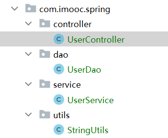

```java
import org.springframework.stereotype.Repository;

/**
 * CRUD

 * 组件类型注解默认beanId为类名首字母小写userDao
 *
 */
@Repository
public class UserDao {
}
```

也可以使用自定义beanid, @repository("uDao")

3. 输出

```java
import org.springframework.context.ApplicationContext;
import org.springframework.context.support.ClassPathXmlApplicationContext;

public class SpringApplication {
    public static void main(String[] args) {

        ApplicationContext context =
                new ClassPathXmlApplicationContext("classpath:applicationContext.xml");
        String[] ids = context.getBeanDefinitionNames();
        for (String id : ids) {
            System.out.println(id + ": " + context.getBean(id));
        }
    }
}
```

```
userController: com.imooc.spring.controller.UserController@17baae6e
userDao: com.imooc.spring.dao.UserDao@69379752
userService: com.imooc.spring.service.UserService@27fe3806
stringUtils: com.imooc.spring.utils.StringUtils@5f71c76a
org.springframework.context.annotation.internalConfigurationAnnotationProcessor: org.springframework.context.annotation.ConfigurationClassPostProcessor@1d7acb34
org.springframework.context.annotation.internalAutowiredAnnotationProcessor: org.springframework.beans.factory.annotation.AutowiredAnnotationBeanPostProcessor@48a242ce
org.springframework.context.annotation.internalCommonAnnotationProcessor: org.springframework.context.annotation.CommonAnnotationBeanPostProcessor@1e4a7dd4
org.springframework.context.event.internalEventListenerProcessor: org.springframework.context.event.EventListenerMethodProcessor@4f51b3e0
org.springframework.context.event.internalEventListenerFactory: org.springframework.context.event.DefaultEventListenerFactory@4b9e255
```

### 两类自动装配注解

#### 自动装配分类

自动装配: IOC容器在运行过程中自动为某个属性赋值

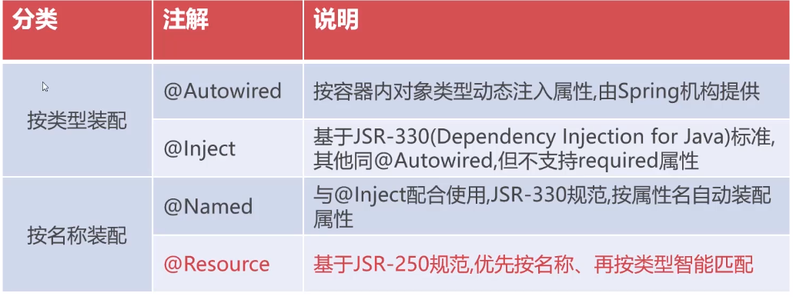

* 按类型装配:
  * @Autowired: 按容器内对象类型动态注入属性，由Spring机构提供, spring自己定义的规则
  * @Inject: 基于JSR-330(Dependency Injection for Java)标准,其他同@Autowired,但不支持required属性,java的行业标准

* 按名称装配:
  * @Named: 与@Inject配合使用，JSR-330规范，按属性名自动装配
  * @Resource: 基于JSR-250规范，优先按名称、再按类型智能匹配

在实际过程中推荐按名称装配, autowired的问题见`代码演示`

原理: 

@Resource和@Autowired方法都可以不适用setter方法来完成对象的注入, 运行时通过反射技术将属性从private修改为public, 再完成属性的直接赋值, 赋值完之后再改为private.

---

#### 例子

* 按名称注入的例子:

book-shop中, serivce中引用bookDao, 使用bean的id(名称)动态注入到其他属性中

```xml
<bean id="bookService" class="com.imooc.spring.ioc.bookshop.service.BookService">
    <!-- id=bookDao, 由另一位开发者开发 -->
    <property name="bookDao" ref="bookDao"/>
</bean>
```

* 按类型装配指的是, 不关心bean的名称是什么, 只需要在运行过程中为属性进行注入时, 把与属性相同类型的对象做注入

---

#### 具体讲解, 代码演示

Controller依赖于Service, Service依赖于Dao

##### @Autowired

service依赖于dao

1. service中

```java
import com.imooc.spring.dao.UserDao;
import org.springframework.beans.factory.annotation.Autowired;
import org.springframework.stereotype.Service;

@Service
public class UserService {
    @Autowired
    private UserDao userDao;

    public UserService() {
        System.out.println("UserService constructor " + this);
    }

    public void setUserDao(UserDao userDao) {
        System.out.println("setUserDao: " + userDao);
        this.userDao = userDao;
    }
    public UserDao getUserDao() {
        return userDao;
    }
}
```

使用Autowired

2. dao中

```java
package com.imooc.spring.dao;

import org.springframework.stereotype.Repository;

/**
 * CRUD
 * 组件类型注解默认beanId为类名首字母小写userDao
 *
 */
@Repository
public class UserDao {
    public UserDao() {
        System.out.println("UserDao constructor " + this);
    }
}
```

3. 初始化IOC容器

```java
ApplicationContext context =
                new ClassPathXmlApplicationContext("classpath:applicationContext.xml");
```

输出

```
UserDao constructor com.imooc.spring.dao.UserDao@df27fae
UserService constructor com.imooc.spring.service.UserService@24a35978
```

预期的有初始化和set方法, 但是set方法没有出现, 对象没有注入么?

提取userService然后调用get方法, 查看输出

```java
UserService userService = context.getBean("userService", UserService.class);
System.out.println(userService.getUserDao());
```

```
UserDao constructor com.imooc.spring.dao.UserDao@df27fae
UserService constructor com.imooc.spring.service.UserService@24a35978
com.imooc.spring.dao.UserDao@df27fae
```

打印输出后发现, udao是有数据的, 就是原始初始化的UserDao(@df27fae), 那为什么没有调用set方法完成注入的工作?

4. 做个实验, 将autowired放在set方法上

```java
@Autowired
public void setUserDao(UserDao userDao) {
    System.out.println("setUserDao: " + userDao);
    this.userDao = userDao;
}
```

输出:

```
UserDao constructor com.imooc.spring.dao.UserDao@fcd6521
UserService constructor com.imooc.spring.service.UserService@31f924f5
setUserDao: com.imooc.spring.dao.UserDao@fcd6521
com.imooc.spring.dao.UserDao@fcd6521
```

可以看到set方法输出了, 在set方法上增加autowired注解和在属性名上增加autowired注解都可以完成对象的注入

但是一个执行了set方法, 一个没有执行, 两个机制完全不同. ***重要!!!***

* 如果装配注解Autowired放在set方法上，则自动按类型/名称对set方法参数进行注入. IOC容器会自动将容器中类型为UserDao的对象注入到set参数userDao中, 然后执行代码

* 如果装配注解Autowired放在属性上,  Spring Ioc容器会自动通过反射技术将属性private修饰符自动改为public,直接进行赋值, 不再执行set方法. 在运行时动态完成

所以如果注解Autowired放在属性上, 我们就不需要set方法了

---

Autowired本身的问题

Autowired是按照类型装配, -**在工作中不推荐进行类型装配**, 演示案例如下:

1. dao包下新建接口IUserDao, 同时两个实现类, UserDao和UserOracleDao(后续开发中数据库要迁移, 新建实现类)

```java
public interface IUserDao {
}
```

```java
import org.springframework.stereotype.Repository;

/**
 * CRUD
 * 组件类型注解默认beanId为类名首字母小写userDao
 *
 */
@Repository
public class UserDao implements IUserDao {
    public UserDao() {
        System.out.println("UserDao constructor " + this);
    }
}
```

```java
import org.springframework.stereotype.Repository;

@Repository
public class UserOracleDao implements IUserDao {
    public UserOracleDao() {
        System.out.println("UserOracleDao constructor " + this);
    }
}
```


2. Service中的对象就要修改为IUserDao

按照面向对象的要求, 属性要变成接口private IUserDao uDao;

```java
import com.imooc.spring.dao.IUserDao;
import com.imooc.spring.dao.UserDao;
import org.springframework.beans.factory.annotation.Autowired;
import org.springframework.stereotype.Service;

@Service
public class UserService {

    // @Autowired
    // Spring Ioc容器会自动通过反射技术将属性private修饰符自动改为public,直接进行赋值
    // 不再执行set方法
    // private UserDao userDao;

    @Autowired
    private IUserDao uDao;

    public UserService() {
        System.out.println("UserService constructor " + this);
    }

    /*@Autowired
    // 如果装配注解Autowired放在set方法上，则自动按类型/名称对set方法参数进行注入
    public void setUserDao(UserDao userDao) {
        System.out.println("setUserDao: " + userDao);
        this.userDao = userDao;
    }*/

    public IUserDao getUserDao() {
        return uDao;
    }
}
```

3. 运行后报错

```
Caused by: org.springframework.beans.factory.NoUniqueBeanDefinitionException: No qualifying bean of type 'com.imooc.spring.dao.IUserDao' available: expected single matching bean but found 2: userDao,userOracleDao
```

可以发现是因为容器中发现了两个匹配的bean, 注入失败

因为autowired是按类型注入, IUserDao接口, IOC容器在当前容器中查询有哪些bean的类型是IUserDao, 发现有两个对象都实现了IUserDao, 分别是UserDao和UserOracleDao, IOC容器并不清楚要将哪个bean注入到当前的udao属性, 报错

4. 解决方法

* 去除某一个@Repository注解即可, 对应Dao就不会被IOC容器管理
* IOC容器中出现多个相同的对象, 添加`@Primary`注解, 默认采用该注解注入
* @Resource注解

这样子就解决问题了

根本原因是在IOC容器中可能出现多个相同类型的对象, 会出现这种问题

为了避免这种问题, 在实际项目中, 多采用按照名称注入的方法, 因为名称在容器中是唯一的

##### @Resource

优先按名称、再按类型智能匹配

注解流程:

```
1.@Resource设置name属性，则按name在Ioc容器中将bean注入, 如果未找到, 则报错
2.@Resource未设置name属性
2.1 以属性名作为bean name在IoC容器中匹配bean，如有匹配, 则注入
2.2 按属性名未匹配，则按类型进行匹配，同@Autowired, 如果出现冲突, 需加入Primary解决类型冲突
使用建议：在使用@Resource对象时推荐设置name或保证属性名与bean名称一致
```

1. 新增DepartmentService

```java
import com.imooc.spring.dao.IUserDao;
import org.springframework.stereotype.Service;

import javax.annotation.Resource;

@Service
public class DepartmentService {

    /**
     * 1.@Resource设置name属性，则按name在Ioc容器中将bean注入, 如果未找到, 则报错
     * 2.@Resource未设置name属性
     * 2.1 以属性名作为bean name在IoC容器中匹配bean，如有匹配则注入
     * 2.2 按属性名未匹配，则按类型进行匹配，同@Autowired,如果出现冲突, 需加入Primary解决类型冲突
     * 使用建议：在使用@Resource对象时推荐设置name或保证属性名与bean名称一致
     */
    // 1. 使用namne
    /*@Resource(name = "userOracleDao")
    private IUserDao udao;*/

    // 2. 规范属性名
    @Resource
    private IUserDao userOracleDao;

    public void joinDepartment() {
        System.out.println(userOracleDao);
    }
}
```

@Resource标签两种常用的方法

* 使用@Resource(name="")设置bean
* 规范属性名称为bean id

 

2. 获取bean

```java
DepartmentService departmentService = context.getBean("departmentService", DepartmentService.class);
departmentService.joinDepartment();
```

可以看到输出:

```
UserDao constructor com.imooc.spring.dao.UserDao@5579bb86
UserOracleDao constructor com.imooc.spring.dao.UserOracleDao@5204062d
UserService constructor com.imooc.spring.service.UserService@4516af24
com.imooc.spring.dao.UserOracleDao@5204062d
com.imooc.spring.dao.UserOracleDao@5204062d
```

注入的就是之前实例化的对象

---


原理: 

@Resource和@Autowired方法都可以不适用setter方法来完成对象的注入, 运行时通过反射技术将属性从private修改为public, 再完成属性的直接赋值, 赋值完之后再改为private.

#### 元数据注解

为IOC容器管理对象的时候提供辅助信息

| 注解           | 说明                                                       |
| -------------- | ---------------------------------------------------------- |
| @Primary       | 按类型装配时出现多个相同类型对象，拥有此注解对象优先被注入 |
| @PostConstruct | 描述方法，相当于XML中init-method配置的注解版本             |
| @PreDestroy    | 描述方法，相当于XML中destroy-method配置的注解版本          |
| @Scope         | 设置对象的scope属性                                        |
| @Value         | 为属性注入静态数据                                         |

* UserService中添加注解

```java
package com.imooc.spring.service;

import com.imooc.spring.dao.IUserDao;
import com.imooc.spring.dao.UserDao;
import org.springframework.beans.factory.annotation.Autowired;
import org.springframework.beans.factory.annotation.Value;
import org.springframework.context.annotation.Scope;
import org.springframework.stereotype.Service;

import javax.annotation.PostConstruct;
@Service
@Scope("prototype")// 设置单例/多例, xml中的bean scope相同
public class UserService {
    @Value("${metaData}") // 读取config.properties的metaData属性值
    private String metaData;
    // @Autowired
    // Spring Ioc容器会自动通过反射技术将属性private修饰符自动改为public,直接进行赋值
    // 不再执行set方法
    // private UserDao userDao;
    @Autowired
    private IUserDao uDao;
    @PostConstruct// 相当于xml中的init-method
    public void init() {
        System.out.println("UserService: init method, metaData = " + metaData);
    }

    public UserService() {
        System.out.println("UserService constructor " + this);
    }

    /*@Autowired
    // 如果装配注解Autowired放在set方法上，则自动按类型/名称对set方法参数进行注入
    public void setUserDao(UserDao userDao) {
        System.out.println("setUserDao: " + userDao);
        this.userDao = userDao;
    }*/

    public IUserDao getUserDao() {
        return uDao;
    }
}
```

需要说明Value注解使用的时候, 需要添加配置文件, config.properties

```xml
metaData = imooc.com
```

同时要在ApplicationContext.xml中说明读取该配置文件

```xml
<!--通知Spring IoC容器初始化时加载属性文件-->
<context:property-placeholder location="classpath:config.properties"/>
```

调用的时候需要${}的格式, 输入完整key

```java
@Value("${metaData}")
```

输出

```
UserDao constructor com.imooc.spring.dao.UserDao@17776a8
UserOracleDao constructor com.imooc.spring.dao.UserOracleDao@69a10787
UserService constructor com.imooc.spring.service.UserService@70b0b186
UserService: init method, metaData = imooc.com
com.imooc.spring.dao.UserOracleDao@69a10787
com.imooc.spring.dao.UserOracleDao@69a10787
```

* @Value注解

```java
@Value("imooc.com")
private String metaData;

private String metaData = "imooc.com"
```

两者有什么区别? 直接赋值的执行效率比运行时反射效率还要高

主要用处是在读取配置文件中的信息

@Value的运行过程和@Autowired@Resource相同, 都是在运行过程中private修改为public, 赋值后再修改回private
@Value读取信息的三个步骤: 1.创建配置文件, 创建键值对;2.ApplicationContext中声明,加载对应的配置文件;3.调用注解${}

@Value的使用广泛, 数据库连接时的url, driver, pwd, username都可以设置, 一般通过前缀说明属性的作用或者访问方位, 例如:`connection.driver`

---

鱼和熊掌:

xml不需要修改源代码, 但是配置繁琐

注解书写方便, 但是写在了源代码中

##  基于Java Config配置IOC容器

使用Java类替代传统的xml文件

优势:

* 完全摆脱XML的束缚，使用独立Java类管理对象与依赖
* 注解配置相对分散，利用Java Config可对配置集中管理
* 可以在编译时进行依赖检查(Java源代码, ide检查)，不容易出错. xml中都是在运行中检查

劣势:

* Java源代码, 修改后需要重新编译再发布

多用于敏捷开发, 快迭代, SpringBoot默认基于Java Config配置

### Java Config核心注解

| 注解            | 说明                                                         |
| --------------- | ------------------------------------------------------------ |
| @Configuration  | 描述类，说明当前类是Java Config配置类，完全替代XML文件       |
| @Bean           | 描述**方法**，方法返回对象将被loC容器管理，beanld默认为方法名 |
| @ImportResource | 描述类，加载静态文件，可使用@Value注解获取                   |
| @ComponentScan  | 描述类，同XML的`<context:compoment-scan>`标签                |

### Java Config实例化

1. 新增Config.java文件, 替代原先的ApplicationContext.xml

```java
import com.imooc.spring.dao.UserDao;
import org.springframework.context.annotation.Bean;
import org.springframework.context.annotation.Configuration;

/**
 * java config, config类替代xml文件
 */
@Configuration// 当前类是一个配置类, 用于替代applicationContext.xml
public class Config {

    // Java Config利用方法创建对象，将方法返回对象放入容器，beanId=方法名
    // <bean id="XXX" class="XXX"
    @Bean
    public UserDao userDao() {
        // 使用new关键字完成创建
        // 不要把这里看成是工程的一部分, 把他当成一个配置文件, 在userDao方法内部用来构建对象
        UserDao userDao = new UserDao();
        return userDao;
    }
}
```

* 需要添加@Configuration注解

* 为什么还是new?
  不要把这里看成是工程的一部分, 把他当成一个配置文件, 在userDao方法内部用来构建对象

2. 启动类, SpringApplication

```java
import org.springframework.context.ApplicationContext;
import org.springframework.context.annotation.AnnotationConfigApplicationContext;

public class SpringApplication {
    public static void main(String[] args) {
        // 基于注解配置的应用程序上下文
        // 基于Java Config配置IOC容器的初始化
        ApplicationContext context = new AnnotationConfigApplicationContext(Config.class);

        String[] ids = context.getBeanDefinitionNames();
        for (String id : ids) {
            System.out.println(id + ": " + context.getBean(id));
        }
    }
}
```

输出:

```
org.springframework.context.annotation.internalConfigurationAnnotationProcessor: org.springframework.context.annotation.ConfigurationClassPostProcessor@3d3fcdb0
org.springframework.context.annotation.internalAutowiredAnnotationProcessor: org.springframework.beans.factory.annotation.AutowiredAnnotationBeanPostProcessor@641147d0
org.springframework.context.annotation.internalCommonAnnotationProcessor: org.springframework.context.annotation.CommonAnnotationBeanPostProcessor@6e38921c
org.springframework.context.event.internalEventListenerProcessor: org.springframework.context.event.EventListenerMethodProcessor@64d7f7e0
org.springframework.context.event.internalEventListenerFactory: org.springframework.context.event.DefaultEventListenerFactory@27c6e487
config: com.imooc.spring.ioc.Config$$EnhancerBySpringCGLIB$$9ddf0940@49070868
userDao: com.imooc.spring.ioc.dao.UserDao@6385cb26
```

两个重要的对象

```
config: com.imooc.spring.ioc.Config$$EnhancerBySpringCGLIB$$9ddf0940@49070868
userDao: com.imooc.spring.ioc.dao.UserDao@6385cb26
```

### Java Config依赖注入

Service依赖于Dao, Controller依赖于Service

那么在Config中设置Bean的时候, 传入参数, 例如:

```java
@Bean
public UserService userService(UserDao userDao) {
    UserService userService = new UserService();
    userService.setUserDao(userDao);   
    return userService;
}
```

参数增加userDao, 那么在容器初始化的时候, 就会先创建bean: userDao, 然后在执行userService方法的时候发现需要注入参数userDao, 参数名和bean id相同, 所以自动把userDao创建的bean放到参数中, 执行下面代码

整体的代码:

```java
import com.imooc.spring.ioc.controller.UserController;
import com.imooc.spring.ioc.dao.UserDao;
import com.imooc.spring.ioc.service.UserService;
import org.springframework.context.annotation.Bean;
import org.springframework.context.annotation.Configuration;
import org.springframework.validation.annotation.Validated;

/**
 * java config, config类替代xml文件
 */
@Configuration// 当前类是一个配置类, 用于替代applicationContext.xml
public class Config {

    // Java Config利用方法创建对象，将方法返回对象放入容器，beanId=方法名
    // <bean id="XXX" class="XXX"
    @Bean
    public UserDao userDao() {
        // 使用new关键字完成创建
        // 不要把这里看成是工程的一部分, 把他当成一个配置文件, 在userDao方法内部用来构建对象
        UserDao userDao = new UserDao();
        System.out.println("UserDao create: " + userDao);
        return userDao;
    }


    @Bean
    public UserService userService(UserDao userDao) {
        UserService userService = new UserService();
        System.out.println("userService create: " + userService);
        userService.setUserDao(userDao);
        System.out.println("userService.setUserDao: " + userDao);
        return userService;
    }

    @Bean
    public UserController userController(UserService userService) {
        UserController userController = new UserController();
        System.out.println("userController create: " + userController);
        userController.setUserService(userService);
        System.out.println("userController.setUserService: " + userService);
        return userController;
    }
}
```

输出: 初始化IOC容器后做个分割

```java
import org.springframework.context.ApplicationContext;
import org.springframework.context.annotation.AnnotationConfigApplicationContext;

public class SpringApplication {
    public static void main(String[] args) {
        // 基于注解配置的应用程序上下文
        // 基于Java Config配置IOC容器的初始化
        ApplicationContext context = new AnnotationConfigApplicationContext(Config.class);

        System.out.println("==============");

        String[] ids = context.getBeanDefinitionNames();
        for (String id : ids) {
            System.out.println(id + ": " + context.getBean(id));
        }
    }
}
```

```
UserDao create: com.imooc.spring.ioc.dao.UserDao@1dd02175
userService create: com.imooc.spring.ioc.service.UserService@16267862
userService.setUserDao: com.imooc.spring.ioc.dao.UserDao@1dd02175
userController create: com.imooc.spring.ioc.controller.UserController@6166e06f
userController.setUserService: com.imooc.spring.ioc.service.UserService@16267862
==============
org.springframework.context.annotation.internalConfigurationAnnotationProcessor: org.springframework.context.annotation.ConfigurationClassPostProcessor@51931956
org.springframework.context.annotation.internalAutowiredAnnotationProcessor: org.springframework.beans.factory.annotation.AutowiredAnnotationBeanPostProcessor@2b4a2ec7
org.springframework.context.annotation.internalCommonAnnotationProcessor: org.springframework.context.annotation.CommonAnnotationBeanPostProcessor@564718df
org.springframework.context.event.internalEventListenerProcessor: org.springframework.context.event.EventListenerMethodProcessor@51b7e5df
org.springframework.context.event.internalEventListenerFactory: org.springframework.context.event.DefaultEventListenerFactory@18a70f16
config: com.imooc.spring.ioc.Config$$EnhancerBySpringCGLIB$$dd8fc29a@62e136d3
userDao: com.imooc.spring.ioc.dao.UserDao@1dd02175
userService: com.imooc.spring.ioc.service.UserService@16267862
userController: com.imooc.spring.ioc.controller.UserController@6166e06f
```

可以看到创建UserDao, 然后创建UserService, set其中的UserDao(1dd02175), controller中也一样, 注入Service. 可以看到注入的和创建的是同一个对象

---

setter是在运行中注入的, 那么是按照类型注入的, 还是按照名称注入的?

先按name尝试注入，name不存在则按类型注入

Service的setter中参数是userDao, 正好上面的bean name也是userDao, 可以注入

如果修改参数名称为uDao, 那么不会报错, 但是如果要创建多个UserDao类型, 会报错:

```java
@Bean
public UserDao userDao() {
    // 使用new关键字完成创建
    // 不要把这里看成是工程的一部分, 把他当成一个配置文件, 在userDao方法内部用来构建对象
    UserDao userDao = new UserDao();
    System.out.println("UserDao create: " + userDao);
    return userDao;
}

@Bean
// @Primary
public UserDao userDao1() {
    // 使用new关键字完成创建
    // 不要把这里看成是工程的一部分, 把他当成一个配置文件, 在userDao方法内部用来构建对象
    UserDao userDao = new UserDao();
    System.out.println("UserDao create: " + userDao);
    return userDao;
}

@Bean
public UserService userService(UserDao udao) {
    UserService userService = new UserService();
    System.out.println("userService create: " + userService);
    userService.setUserDao(udao);
    System.out.println("userService.setUserDao: " + udao);
    return userService;
}
```

这里程序就不知道根据类型注入的时候, 需要注入哪个bean了

```
Caused by: org.springframework.beans.factory.NoUniqueBeanDefinitionException: No qualifying bean of type 'com.imooc.spring.ioc.dao.UserDao' available: expected single matching bean but found 2: userDao,userDao1
```

当然可以添加@Primary的注解来解决该问题

---

### Java Config与注解

1. Java Config与注解是不冲突的, 例如@Primary, @Scope等注解可以在Java Config中使用

```java
@Bean
@Scope("prototype")
public UserController userController(UserService userService) {
    UserController userController = new UserController();
    System.out.println("userController create: " + userController);
    userController.setUserService(userService);
    System.out.println("userController.setUserService: " + userService);
    return userController;
}
```

2. Config中添加@ComponentScan

添加@ComponentScan注解, 

```java
@Configuration// 当前类是一个配置类, 用于替代applicationContext.xml
@ComponentScan(basePackages = "com.imooc")
public class Config {}
```

IOC容器不仅加载config中的对象, 还会去指定路径下扫描指定的类

例如另外一位开发人员习惯了注解方法, 在dao下, 

```java
@Repository
public class EmployeeDao {
    public EmployeeDao() {
        System.out.println("EmployeeDao create");
    }
}
```

那么因为Config中添加了@ComponentScan(...), 指定扫描, 也会初始化实例到IOC容器中

```
EmployeeDao create com.imooc.spring.ioc.dao.EmployeeDao@345965f2
```

如果需要注入的话, 也一样在Java Config中添加参数即可.例如在UserService需要引入EmployeeDao

```java
@Bean
public UserService userService(UserDao userDao, EmployeeDao employeeDao) {
    UserService userService = new UserService();
    System.out.println("userService create: " + userService);
    userService.setUserDao(userDao);
    System.out.println("userService.setUserDao: " + userDao);
    userService.setEmployeeDao(employeeDao);
    System.out.println("userService.employeeDao: " + employeeDao);
    return userService;
}
```

## Spring Test

* Spring Test是Spring中用于测试的模块
* Spring Test对JUnit单元测试框架有良好的整合
* 通过Spring Test可在Unit在单元测试时自动初始化IoC容器

基于注解来完成

### 整合过程

1. Maven工程依赖spring-test
2. 利用@RunWith与@ContextConfiguration描述测试用例类
   * @RunWith: 将Junit4的运行过程交给Spring来完成, 该注解让Spring接管Junit4的控制权, 完成IOC的初始化工作
   * @ContextConfiguratoin: 初始化IOC容器过程中, 加载哪个配置文件
3. 测试用例类从容器获取对象完成测试用例的执行

---

1. pom依赖

```xml
<?xml version="1.0" encoding="UTF-8"?>
<project xmlns="http://maven.apache.org/POM/4.0.0"
         xmlns:xsi="http://www.w3.org/2001/XMLSchema-instance"
         xsi:schemaLocation="http://maven.apache.org/POM/4.0.0 http://maven.apache.org/xsd/maven-4.0.0.xsd">
    <modelVersion>4.0.0</modelVersion>

    <groupId>org.example</groupId>
    <artifactId>s09</artifactId>
    <version>1.0-SNAPSHOT</version>

    <properties>
        <maven.compiler.source>8</maven.compiler.source>
        <maven.compiler.target>8</maven.compiler.target>
    </properties>

    <dependencies>
        <dependency>
            <groupId>org.springframework</groupId>
            <artifactId>spring-context</artifactId>
            <version>5.2.6.RELEASE</version>
        </dependency>

        <dependency>
            <groupId>org.springframework</groupId>
            <artifactId>spring-test</artifactId>
            <version>5.2.6.RELEASE</version>
        </dependency>

        <dependency>
            <groupId>junit</groupId>
            <artifactId>junit</artifactId>
            <version>4.12</version>
            <scope>test</scope>
        </dependency>

    </dependencies>

</project>
```

2. Bean

```Java
import com.imooc.spring.ioc.dao.UserDao;
public class UserService {

    private UserDao userDao;

    public void createUser() {
        System.out.println("create user");
        userDao.insert();
    }


    public UserDao getUserDao() {
        return userDao;
    }

    public void setUserDao(UserDao userDao) {
        this.userDao = userDao;
    }
}
```

```Java
package com.imooc.spring.ioc.dao;

public class UserDao {

    public void insert() {
        System.out.println("insert one record");
    }
}
```

```xml
<?xml version="1.0" encoding="UTF-8"?>
<beans xmlns="http://www.springframework.org/schema/beans"
       xmlns:xsi="http://www.w3.org/2001/XMLSchema-instance"
       xsi:schemaLocation="http://www.springframework.org/schema/beans
        https://www.springframework.org/schema/beans/spring-beans.xsd">

    <bean id="userDao" class="com.imooc.spring.ioc.dao.UserDao"/>


    <bean id="userService" class="com.imooc.spring.ioc.service.UserService">
        <property name="userDao" ref="userDao"/>
    </bean>

</beans>
```

3. Spring Test与Junit4整合

test:

```Java
import com.imooc.spring.ioc.service.UserService;
import org.junit.Test;
import org.junit.runner.RunWith;
import org.springframework.test.context.ContextConfiguration;
import org.springframework.test.context.junit4.SpringJUnit4ClassRunner;

import javax.annotation.Resource;


//将Junit4的执行权交由Spring Test,在测试用例执行前自动初始化IoC容器
@RunWith(SpringJUnit4ClassRunner.class)
@ContextConfiguration(locations = {"classpath:applicationContext.xml"})
public class SpringTestor {

    //IOC初始化过程中创建好了
    @Resource
    private UserService userService;

    @Test
    public void testUserService() {
        userService.createUser();
    }
}
```

输出:

```
create user
insert one record
```

## 总结

* Spring快速入门
* Spring XML配置
* 对象实例化配置
* 依赖注入配置
* Spring注解配置
* Java Config配置
* Spring 单元测试

# Spring AOP

## 简介

AOP: 面向切面编程. 

* 介绍Spring AOP与相关概念名词
* Spring AOP开发与配置流程
* Spring 五种通知类型与应用场景

AOP: Spring中的可插拔的组件技术

例子:

开发两个软件模块, A(用户管理模块)和B(员工管理模块). 两者各自运行自己的类

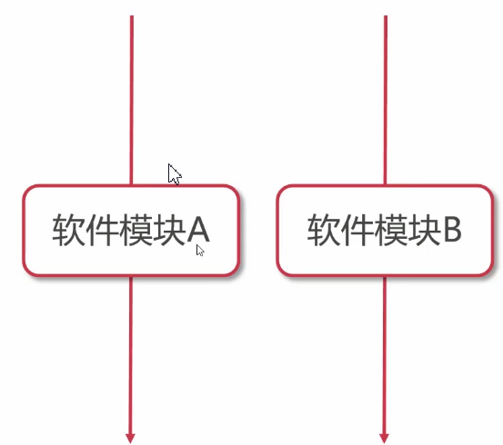


现在新增要求, 在两个软件模块的业务处理之前, 都要做权限过滤操作, 只有有对应权限的用户才可以运行对应的模块

之前会在软件模块前增加权限判断的代码, A, B各加一个. 没问题, 但是如果后续又需要删除了, 又要找到对应的代码位置进行删除. 更好的方法, Spring AOP


在软件执行的过程中, 在执行前或者执行后, 都可以增加额外的扩展功能. 扩展功能称之为切面

在上图中, 在执行软件模块A和B之前, 程序先执行了权限校验, 如果用户没有权限的话, 由切面将用户拒绝, 权限切面起到了在程序运行前的拦截作用. 在程序运行完之后, 又增加了日志切面.

权限切面和日志切面对于软件来说, 都是额外的, 在软件模块运行的时候, 也不会感知到两个切面的存在. 如果后续不需要这两个切面, 只需要在配置文件中进行简单的调整即可.

切面看成在原有的软件模块基础上, 额外增加一些插件.

* 为什么被称为Aspect切面呢?

如图所示, 正常的流程是从上往下依次执行, 而新增的模块就像横切面一样, 横穿在了原先的软件模块运行过程中, 给原始的业务代码提供扩展

---

* Spring AOP-Aspect Oriented Programming 面向切面编程
* AOP的做法是将通用、与业无关的功能抽象封装为切面类, 再通过配置的形式加入到系统中
* 切面可配置在目标方法的执行前、后运行，真正做到即插即用

***在不修改源码的情况下对程序行为进行扩展***


# Spring JDBC与事务管理


# Ref

imooc:[Java工程师]( https://class.imooc.com/java2021#Anchor)


