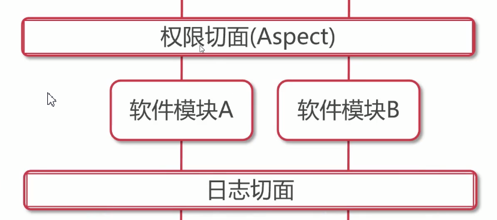
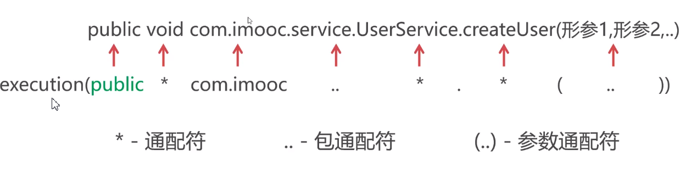
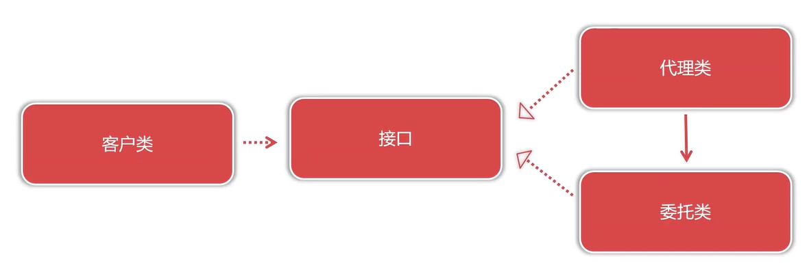
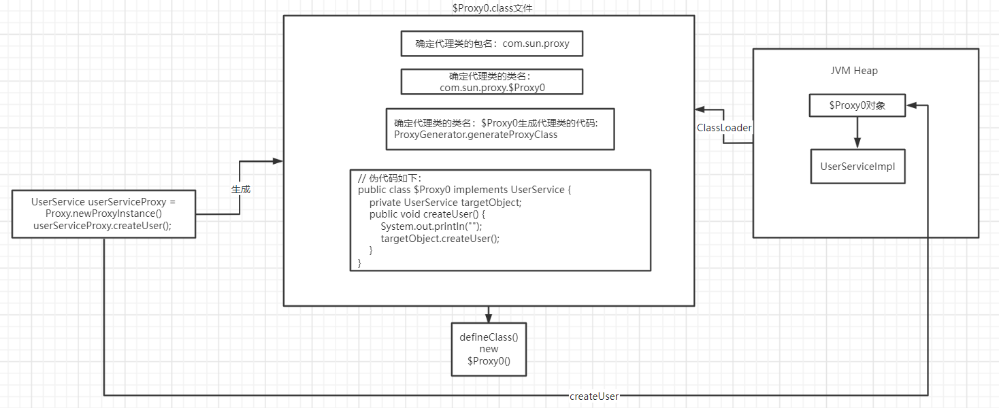
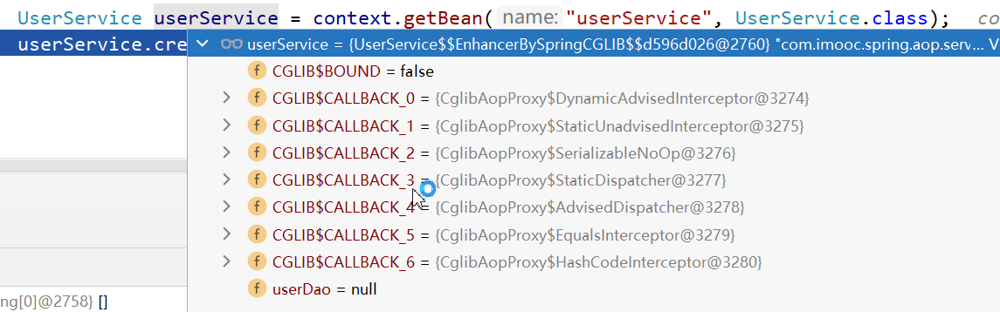
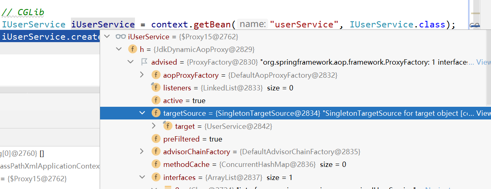

# 内容介绍

imooc体系课[Java工程师](https://class.imooc.com/java2021#Anchor)Spring部分笔记

## Spring IOC

| 内容              | 说明                          | 重要程度 |
| ----------------- | ----------------------------- | -------- |
| Spring 框架介绍   | Spring IOC、DI和AOP等核心概念 | 5        |
| Spring loC容器    | Spring实例化与管理对象        | 5        |
| 集合对象注入      | 注入List、Set、Map集合对象    | 5        |
| 底层原理          | Spring Bean的生命周期         | 5        |
| 注解与Java Config | Spring注解分类和常用注解应用  | 5        |

## Spring AOP

| 内容          | 说明                               | 重要程度 |
| ------------- | ---------------------------------- | -------- |
| 理解AOP及名词 | Spring AOP开发与配置流程           | 4        |
| 五种通知类型  | Spring五种通知类型与应用场景       | 3        |
| 切点表达式    | PointCut切点表达式的语法规则及应用 | 2        |
| 代理模式      | JDK动态代理和CGLib代理的执行过程   | 4        |

## Spring JDBC与声明式事务

| 内容               | 说明                              | 重要程度 |
| ------------------ | --------------------------------- | -------- |
| Spring JDBC        | Spring JDBC的环境配置             | 4        |
| RestTemplate       | 基于RestTemplate实现SQL处理(CRUD) | 3        |
| 配置声明式事务     | 声明式事务的配置过程              | 5        |
| 事务传播行为介绍   | 讲解常用事务传播行为的用途        | 3        |
| 声明式事务注解形式 | 基于注解使用声明式事务            | 5        |

事务传播行为: 当多个拥有事务的方法彼此嵌套调用的时候, 事务是如何进行控制的


# Spring

## 什么是Spring

Spring可从狭义与广义两个角度看待: 

狭义的Spring是指Spring框架(Spring Fremework): 高度的封装和抽象技术, 简化程序开发, 底层提供IoC容器管理系统中的对象和依赖

广义的Spring是指Spring生态体系: 

### 狭义的Spring

* Spring框架是企业开发复杂性的一站式解决方案

* Spring框架的核心是**IoC容器**与**AOP面向切面编程**

IoC: 所有对象管理的基础, 包括AOP

* Spring loC负责创建与管理系统对象，使用者从IoC容器中提取对象, 所以Spring可以在此基础上扩展功能, 例如AOP, 在方法前后扩展

---

[Spring Framework: ](https://docs.spring.io/spring-framework/docs/5.0.0.RC2/spring-framework-reference/overview.html)


四层

* Core Container: 最核心, IOC容器, pom中引入的context就是该模块. 把这个模块引入以后，作为spring依赖关系，会把对应的号核心模块进行引入，它提供了spring最核心的代码实现以及Beans; Beans对对象进行创建和装配; SpEL是spring的表达式语言

* TestS: Spring 提供的测试模块

再晚上是Spring的性能增强以及网络, 以上的模块都基于IOC容器来实现

* aspect: 切面; instrumentation: 检测在运行过程Spring; Message: spring提供的消息处理功能

* Data Access: 数据访问, ORM: 访问ORM框架, OXM: 数据访问框架, 提供了Java对象和xml文档之间的互相转换。Transaction: 事务处理
* Web: 


### 广义的Spring

生态体系, 一站式解决方案

分布式, 微服务, 响应式编程, 云端技术(自动扩展自动链接), web apps, serverless无服务器编程, 事件驱动, 批处理...

### 传统开发方式

对象直接引用导致对象硬性关联，程序难以扩展维护. 使用者主动创建对象

使用者 -> new ObjectA -> new ObjectB

### 使用Spring IoC

Spring IoC容器是Spring生态的地基，用于统一创建与管理对象依赖


注入: 使用反射技术, 将ObjectA的依赖B, 注入到ObjectA中 -> DI

使用者不需要关注容器内部的对象和对象之间的关系, 只需要关注从什么地方提取需要的对象即可. 使用者不再面对具体的对象, 而是面对容器, 通过容器获取到需要的对象

>  SpringIoC容器职责:
>
> * 对象的控制权交由**第三方**统一管理（loC控制反转）
> * 利用Java**反射**技术实现**运行时**对象创建与关联（Dl依赖注入）
> * 基于配置提高应用程序的可维护性与扩展性

# Spring IoC

## IoC与DI

Spring快速入门, Spring XML配置, 依赖注入配置, 对象实例化配置, 注解与Java Config, Spring 单元测试

### 控制反转

**控制反转（Inverse of Control）**是一种是面向对象编程中的一种设计理念，用来减低计算机代码之间的耦合度。其基本思想是：借助于“第三方”实现具有依赖关系的对象之间的解耦。

并不是由最终的消费者负责创建对象, 引入"代理人"的角色, 由"代理人"统一对象的创建和管理, 消费者面向"代理人"获取对象和进行信息的交换与处理

IoC根本目的: 为了降低对象之间的直接耦合.通过代理人来做解耦, 对象之间可以灵活变化

加入**IoC容器**将对象统一管理，让对象关联变为弱耦合

### DI依赖注入

* IoC是设计理念，是现代程序设计遵循的标准，是宏观目标

* DI(Dependency Injection)是具体技术实现，是微观实现; 在程序**运行过程**中完成对象的创建与绑定.

运行过程 -> DI在Java中利用**反射**技术实现对象注入(Injection), 反射技术来做行为的动态变化, 例如:创建对象, 调用属性, 调用方法

## Spring IoC初体验

### 传统写法

```java
Apple apple1 = new Apple("apple1", "red", "origin1");
Apple apple2 = new Apple("apple2", "green", "origin2");
Apple apple3 = new Apple("apple3", "yellow", "origin3");
// 孩子和苹果之间的对象关联
Child child1 = new Child("child1", apple1);
Child child2 = new Child("child2", apple2);
Child child3 = new Child("child3", apple3);
child1.eat();
child2.eat();
child3.eat();
```

弊端:

* 对象的描述写死在代码中, 对象的信息发现变化后需要修改源代码->不合理, 写死之后修改, 应用环境就需要重新发布上线, 要重新提交测试审核等流程, 软件的维护性很差
* 对象的数量写死了, 如果要新增对象, 要修改源代码
* 最重要的一点: 对象是硬关联, 在程序中使用构造方法参数进行设置, 程序运行后两个对象(孩子和苹果)的关系就确定了, 在程序编译时就确定了关系, 死板, 例如两个孩子吃的苹果交换一下, 就需要修改源代码. 
  * new 关键字在编译时对象与对象之间强制绑定

-> Spring IOC: 根本目的就是通过**配置**的方式完成对象的实例化以及对象之间的依赖关系

### 修改成IoC写法

1. 添加pom依赖

```xml
 <!-- 使用spring ioc容器最小的范围 -->
 <dependency>
     <groupId>org.springframework</groupId>
     <artifactId>spring-context</artifactId>
     <version>5.2.6.RELEASE</version>
 </dependency>
```

2. 新建applicationContext.xml文件

参考[官方文档](https://docs.spring.io/spring-framework/docs/current/reference/html/core.html#spring-core) 1.2.1Configuration Metadata中的xml

```xml
<?xml version="1.0" encoding="UTF-8"?>
<beans xmlns="http://www.springframework.org/schema/beans"
       xmlns:xsi="http://www.w3.org/2001/XMLSchema-instance"
       xsi:schemaLocation="http://www.springframework.org/schema/beans
        https://www.springframework.org/schema/beans/spring-beans.xsd">

    <!--在Ioc容器启动时，自动由Spring实例化Apple对象，取名sweetApple放入到容器中-->
    <bean id="sweetApple" class="com.imooc.spring.ioc.entity.Apple">
        <property name="title" value="红富士"/>
        <property name="color" value="Red"/>
        <property name="origin" value="Eur"/>
    </bean>

    <bean id="sourApple" class="com.imooc.spring.ioc.entity.Apple">
        <property name="title" value="green apple"/>
        <property name="color" value="Green"/>
        <property name="origin" value="origin2"/>
    </bean>

    <bean id="softApple" class="com.imooc.spring.ioc.entity.Apple">
        <property name="title" value="金帅"/>
        <property name="color" value="Red"/>
        <property name="origin" value="China"/>
    </bean>
</beans>
```

* 可以将原本程序中写死的属性, 写到配置文件中. 配置文件是纯文本, 内容变化后不需要对程序进行重新编译
* 在xml中写的bean, 在spring启动的时候自动由Spring实例化该对象, 取名id放到IoC容器中 -> 这里容器会自动创建三个对象

3. SpringApplication

```java
import com.imooc.spring.ioc.entity.Apple;
import org.springframework.context.ApplicationContext;
import org.springframework.context.support.ClassPathXmlApplicationContext;

public class SpringApplication {
    public static void main(String[] args) {
        //创建SpringIoC容器，并根据配置文件在容器中实例化对象
        ApplicationContext context =
                new ClassPathXmlApplicationContext("classpath:applicationContext.xml");

        Apple sweetApple = context.getBean("sweetApple", Apple.class);
        System.out.println(sweetApple.getTitle());
    }
}
```

---

* IoC容器可以通过xml文件的方式, 让我们不再使用new关键字来创建对象, 对于每一个创建的对象都放到了IoC容器中

, IoC统一管理, 贴上标签Bean id. 


* 代码变成可配置文本, 无需修改源代码, 只需要修改配置文件

* 通过配置方式维护对象之间的关联关系, 不需要修改源代码 -> Child和Apple之间的关系

4. 添加child的bean id, ref标签

```xml
<bean id="child1" class="com.imooc.spring.ioc.entity.Child">
    <property name="name" value="child1"/>
    <property name="apple" ref="sweetApple"/>
</bean>
<bean id="child2" class="com.imooc.spring.ioc.entity.Child">
    <property name="name" value="child2"/>
    <property name="apple" ref="sourApple"/>
</bean>
<bean id="child3" class="com.imooc.spring.ioc.entity.Child">
    <property name="name" value="child3"/>
    <property name="apple" ref="softApple"/>
</bean>
```

ref标签指向其他的bean

5. 取出bean

```java
import com.imooc.spring.ioc.entity.Apple;
import com.imooc.spring.ioc.entity.Child;
import org.springframework.context.ApplicationContext;
import org.springframework.context.support.ClassPathXmlApplicationContext;

public class SpringApplication {
    public static void main(String[] args) {
        //创建SpringIoC容器，并根据配置文件在容器中实例化对象
        ApplicationContext context =
                new ClassPathXmlApplicationContext("classpath:applicationContext.xml");

        Apple sweetApple = context.getBean("sweetApple", Apple.class);
        System.out.println(sweetApple.getTitle());
        Child child1 = context.getBean("child1", Child.class);
        child1.eat();
        Child child2 = context.getBean("child2", Child.class);
        child2.eat();
        Child child3 = context.getBean("child3", Child.class);
        child3.eat();
    }
}
```

* 代码上来看, 没有描述任何对象实例化和对象关联的操作, Spring IoC容器在启动过程中根据配置文件applicationContext.xml进行动态的初始化和绑定, 用到的是java中反射的技术, 在程序运行时完成

* 虽然增加了配置, 但是提高了程序上线的可维护性, 如果修改对象关系或者对象初始化, 原始的方式需要修改源代码, 在spring ioc中直接修改配置文件, 不需要修改源代码

* Spring IoC容器的用途, 对象与对象之间解耦, IoC容器对所有的对象做统一的管理, 对象之间的关联也通过反射技术进行管理, 在**运行时**动态设置, 灵活. 以前的对象关系通过硬编码形式(编译时确定), 现在用配置文件(运行时反射)

## xml管理对象, Bean

Java Bean, java可重用对象的编码要求, 例如: 必须有默认构造函数, 属性私有, 通过gettersetter方法设置属性..., 满足这些条件就可以成为Java Bean. 而在Spring IOC容器中管理的就是这些java Bean, 容器中的对象

### 三种配置方式

* 基于XML配置Bean
* 基于注解配置Bean
* 基于Java代码配置Bean

三种配置方式都是告诉SpringIOC容器如何实例化, 如何管理Bean, 只是表现形式不同

#### 基于xml配置Bean

实例化Bean的三种方式:

* 基于构造方法对象实例化(90%的情况)
* 基于静态工厂实例化
* 基于工厂实例方法实例化

##### 基于构造方法对象实例化

###### 无参初始化

* xml文件中添加

```xml
<!--在Ioc容器启动时，自动由Spring实例化Apple对象，取名sweetApple放入到容器中-->
<!--
    bean: 通知IOC容器需要实例化什么对象
    class: 从哪个类进行实例化
-->
<!-- <Bean>标签默认通过默认构造方法创建对象 -->
<bean id="apple1" class="com.imooc.spring.ioc.entity.Apple"/>
```

* 查看加载到容器中

```java
import org.springframework.context.ApplicationContext;
import org.springframework.context.support.ClassPathXmlApplicationContext;

public class SpringApplication {
    public static void main(String[] args) {
        //创建SpringIoC容器，并根据配置文件在容器中实例化对象
        ApplicationContext context =
                new ClassPathXmlApplicationContext("classpath:applicationContext.xml");
    }
}
```

ApplicationContext是接口, 有各种实现类, ClassPathXmlApplicationContext从置顶路径加载xml配置文件

执行后java运行内存中保存了IOC容器, 并且IOC容器根据xml中的配置创建对应的对象, 并管理

运行后, 实例化和初始化对象

给Apple添加无参的初始化

```java
Apple() {
    System.out.println("apple 对象已创建" + this);
}
```

直接运行可以看到输出:

```
apple 对象已创建com.imooc.spring.ioc.entity.Apple@737996a0
```

所以说,**`<Bean>`标签默认通过默认构造方法创建对象**

###### 含参初始化

1. xml文件配置

* constructor-arg name: 使用**参数名**的方式给对应的参数进行初始化赋值

```xml
<!-- 含参初始化 -->
<bean id="sweetApple" class="com.imooc.spring.ioc.entity.Apple">
    <!--没有constructor-arg则代表调用默认构造方法实例化-->
    <constructor-arg name="title" value="红富士"/>
    <constructor-arg name="color" value="红色"/>
    <constructor-arg name="origin" value="欧洲"/>
</bean>
```

constructor-arg会去查找在class中对应的构造方法, 再根据name参数的名字, 使用反射的技术在运行时动态设置对应的值.

* constructor-arg index: 利用构造方法**参数位置**实现对象实例化

```xml
<bean id="sweetApple2" class="com.imooc.spring.ioc.entity.Apple">
    <!--利用构造方法参数位置实现对象实例化-->
    <constructor-arg index="0" value="红富士"/>
    <constructor-arg index="1" value="红色"/>
    <constructor-arg index="2" value="欧洲"/>
</bean>
```

2. 书写构造函数输出

```java
public Apple(String title, String color, String origin) {
    this.title = title;
    this.color = color;
    this.origin = origin;
    System.out.println("带参数的构造函数创建对象: " + this);
    System.out.println(this.title + " " + this.color + " " + this.origin);
}
```

直接运行Application

```
带参数的构造函数创建对象: com.imooc.spring.ioc.entity.Apple@548e7350
红富士 红色 欧洲
```

3. 其他类型初始化

xml文件中虽然是以字符类型, 但是spring框架会把字符型自动转成对应的类型, 例如这里添加price为double类型

```xml
<bean id="sweetApple1" class="com.imooc.spring.ioc.entity.Apple">
    <!--没有constructor-arg则代表调用默认构造方法实例化-->
    <constructor-arg name="title" value="红富士"/>
    <constructor-arg name="color" value="红色"/>
    <constructor-arg name="origin" value="欧洲"/>
    <constructor-arg name="price" value="12.55"/>
</bean>
```

Apple中添加对应的构造函数

```java
public Apple(String title, String color, String origin, double price) {
    this.title = title;
    this.color = color;
    this.origin = origin;
    this.price = price;
    System.out.println("带参数的构造函数创建对象: " + this);
    System.out.println(this.title + " " + this.color + " " + this.origin + " " + this.price);
}
```

输出:

```
带参数的构造函数创建对象: com.imooc.spring.ioc.entity.Apple@1ed4004b
红富士 红色 欧洲 12.55
```

4. 如果没有对应的构造方法

编译提示错误:


idea会报错:

```
org.springframework.beans.factory.UnsatisfiedDependencyException: Error creating bean with name 'sweetApple1' defined in class path resource [applicationContext.xml]: Unsatisfied dependency expressed through constructor parameter 2: Ambiguous argument values for parameter of type [java.lang.String] - did you specify the correct bean references as arguments?
```

所以xml配置要严格按照类的定义来书写

##### 基于静态工厂实例化

工厂模式: 隐藏创建类的细节, 通过额外的工厂类组织创建需要的对象

静态工厂: 静态工厂通过静态方法(static)创建对家，隐藏创建对象的细节

1. 新建AppleStaticFactory

```java
import com.imooc.spring.ioc.entity.Apple;

/**
 * 静态工厂通过静态方法创建对家，隐藏创建对象的细节
 */
public class AppleStaticFactory {
    public static Apple createSweetApple() {
        Apple apple = new Apple();
        apple.setTitle("红富士");
        apple.setOrigin("欧洲");
        apple.setColor("红色");
        return apple;
    }
}
```

2. xml文件中

```xml
<!-- 利用静态工厂获取对象 -->
<bean id="apple4" class="com.imooc.spring.ioc.factory.AppleStaticFactory"
      factory-method="createSweetApple"/>
```

产生的apple对象放到了Spring IOC容器中

* 疑惑: 在静态工程中, 不还是使用的new关键字创建Apple对象? 这样子和直接在程序中new Apple有什么区别?

这里工厂通过静态方法创建对象, 同时隐藏创建对象的细节, 只看方法的话, 内部创建的过程是不可见的, 工厂的目的就是为了不让我们知道对象是如何构建的. 对创建者来说, 只需要调用了`createSweetApple`方法, 工厂就会返回一个sweetApple对象

出现静态工厂的目的: 在IOC容器之外, 通过程序的方式来组织对象, 

好处: 如果在createSweetApple方法中添加额外的行为, 例如logger, 与实际业务相关, 增加额外的代码. 这些工作对于纯xml配置的方式就较难实现

##### 基于工厂实例方法实例化

静态方法, static关键字描述, 说明这个方法(createSweetApple)属于工厂类(AppleStaticFactory)本身, 不属于工厂对象

工厂实例: 在IOC容器中对工厂进行实例化, 调用工厂对象中的某一个方法来完成具体对象创建的工作

工厂实例方法创建对象是指: IoC容器对工厂类进行实例化并调用对应的实例方法创建对象的过程

1. 新建AppleFactoryInstance

没有static关键字, 说明方法属于工厂对象, 而不是属于工厂类

```java
import com.imooc.spring.ioc.entity.Apple;
/**
 * 工厂实例方法创建对象是指IoC容器对工厂类进行实例化并调用对应的实例方法创建对象的过程
 */
public class AppleFactoryInstance {
    public Apple createSweetApple() {
        Apple apple = new Apple();
        apple.setTitle("红富士");
        apple.setOrigin("欧洲");
        apple.setColor("红色");
        return apple;
    }
}
```

2. xml文件中

需要两个Bean, 第一个Bean指向工厂本身, 第二个Bean利用工厂实例的createSweetApple方法获取实例对象, 使用factory-bean和factory-method

```xml
<!-- 利用工厂实例获取对象 -->
<!-- 在IOC容器初始化中, 首先对工厂进行实例化 -->
<bean id="factoryInstance" class="com.imooc.spring.ioc.factory.AppleFactoryInstance"/>
<bean id="apple5" factory-bean="factoryInstance" factory-method="createSweetApple"/>
```

两种工厂本质都是封装隐藏创建对象的细节.

#### 基于注解配置Bean


#### 基础Java代码配置Bean


### IOC容器中获取Bean

#### 获取方法

```java
Apple sweetApple = context.getBean("sweetApple", Apple.class);// 优先
Apple sweetApple1 = (Apple) context.getBean("sweetApple");
```

#### bean id和name

name用来设置bean名称

id和name的相同点: 

* bean id与name都是设置对象在loC容器中唯一标识
* 两者在同一个配置文件中都不允许出现重复
* 两者允许在**多个配置**文件中出现**重复**, 新对象覆盖旧对象

同一个文件不允许重复, 多个文件允许重复, 新对象覆盖旧对象

id和name的区别:

* id要求更为严格，一次只能定义一个对象标识（推荐）
* name更为宽松，一次允许定义多个对象标识
* tips:id与name的命名要求有意义,按驼峰命名书写

##### 多个applicationContext文件

1. 复制一个applicationContext-1.xml文件

2. ClassPathXmlApplicationContext允许加载多个xml文件

```java
String[] configLocatoins = new String[]{"classpath:applicationContext.xml", "classpath:applicationContext-1.xml"};

//创建SpringIoC容器，并根据配置文件在容器中实例化对象
ApplicationContext context =
    new ClassPathXmlApplicationContext(configLocatoins);

Apple sweetApple = context.getBean("sweetApple", Apple.class);
System.out.println(sweetApple.getTitle());
```

按照String[]中的顺序, 先加载applicationContext, 再加载了applicationContext-1, 覆盖了旧对象

##### id的标识唯一, name更为宽松，一次允许定义多个对象标识

```xml
<bean name="sweetApple, apple7" class="com.imooc.spring.ioc.entity.Apple">
    <!--没有constructor-arg则代表调用默认构造方法实例化-->
    <constructor-arg name="title" value="红富士2"/>
    <constructor-arg name="color" value="红色"/>
    <constructor-arg name="origin" value="欧洲"/>
</bean>
```

可以通过`getBean("apple7", Apple.class)`来得到

通过name属性可以设置多个bean标识, id只能设置一个bean标识

##### 没有id与name的bean默认使用类名全称作为bean标识

开发中用得少

```xml
<!--没有id与name的bean默认使用类名全称作为bean标识-->
<bean class="com.imooc.spring.ioc.entity.Apple">
    <constructor-arg name="title" value="红富士3"/>
    <constructor-arg name="color" value="红色3"/>
    <constructor-arg name="origin" value="欧洲3"/>
</bean>
```

```java
Apple apple = context.getBean("com.imooc.spring.ioc.entity.Apple", Apple.class);
System.out.println(apple.getTitle());
```

### 路径匹配表达式

IOC加载配置使用的路径匹配表达式

```java
//创建SpringIoC容器，并根据配置文件在容器中实例化对象
ApplicationContext context =
                new ClassPathXmlApplicationContext("classpath:applicationContext.xml")
    
// 加载多配置文件
String[] configLocatoins = new String[]{"classpath:applicationContext.xml", "classpath:applicationContext-1.xml"};

//创建SpringIoC容器，并根据配置文件在容器中实例化对象
ApplicationContext context =
    new ClassPathXmlApplicationContext(configLocatoins);
```

`classpath:applicationContext.xml`: 加载类路径下, 名为applicationContext的配置文件

类路径: target/classes目录, 而不是源代码中的resources


---

其他的写法:

| 表达式实例                      | 说明                                                |
| ------------------------------- | --------------------------------------------------- |
| classpath:config.xml            | 扫描classpath根路径(不包含jar)的config.xml          |
| classpath:com/imooc/config.xml  | 扫描classpath下(不包含jar)com.imooc包中的config.xml |
| classpath*:com/imooc/config.xml | 扫描classpath下(包含jar)com.imooc包中的config.xml   |
| classpath:config-*.xml          | 扫描classpath根路径下所有以config-开头的XML文件     |
| classpath:com/**/config.xml     | 扫描com包下（包含任何子包）的config.xml             |
| file:c:/config.xml              | 扫描c盘根路径config.xml                             |

* 不包含jar: 只扫描自己写的target中的资源或配置文件, 因为引入的maven依赖jar包本质也是压缩包, 其中也有可能包含配置文件

* config-*.xml: 多配置文件情况下, 后加载的覆盖旧加载的, ` *通配符 `的加载顺序按照文件名ASCNII码升序.

### 对象依赖注入

在SpringIOC容器中设置对象的依赖关系, 也就是对象依赖注入过程

之前Apple和Child之间的例子:


依赖注入是指运行时将容器内对象利用**反射**赋给其他对象的操作, 两种实现方法:

* 基于setter方法注入对象(开发中常用) ->两种 使用场景
* 基于构造方法注入对象

#### 利用setter实现静态数值的注入

1. 属性使用property标签指代, name: 属性名, value: 属性值

在数据操作的时候, 所有的都是对象, String, Double, Float, 包装类型

```xml
<!--IoC容器自动利用反射机制运行时调用stXXX方法为属性赋值-->
<bean id="sweetApple" class="com.imooc.spring.ioc.entity.Apple">
    <property name="title" value="红富士"/>
    <property name="color" value="Red"/>
    <property name="origin" value="Eur"/>
</bean>
```

***IOC容器内对象会使用反射技术, 在运行时调用setXXX方法为属性赋值***

2. 在Apple的setTitle方法中新增输出:

```java
public void setTitle(String title) {
    System.out.println("hello");
    this.title = title;
}
```

输出:

```
hello
红富士
```

3. Apple中新增属性

```java
private Double price;
```

新增属性price, 但是不设置getter和setter方法, 变异有错误提示, 运行报错:

```
警告: Exception encountered during context initialization - cancelling refresh attempt: org.springframework.beans.factory.BeanCreationException: Error creating bean with name 'sweetApple' defined in class path resource [applicationContext.xml]: Error setting property values; nested exception is org.springframework.beans.NotWritablePropertyException: Invalid property 'price' of bean class [com.imooc.spring.ioc.entity.Apple]: Bean property 'price' is not writable or has an invalid setter method. Does the parameter type of the setter match the return type of the getter?
Exception in thread "main" org.springframework.beans.factory.BeanCreationException: Error creating bean with name 'sweetApple' defined in class path resource [applicationContext.xml]: Error setting property values; nested exception is org.springframework.beans.NotWritablePropertyException: Invalid property 'price' of bean class [com.imooc.spring.ioc.entity.Apple]: Bean property 'price' is not writable or has an invalid setter method. Does the parameter type of the setter match the return type of the getter?
```

#### setter方法注入对象(对象与对象之间的依赖)

ref后写有效的bean id, 完成apple和child关联

1. 增加配置

```xml
<bean id="sweetApple" class="com.imooc.spring.ioc.entity.Apple">
    <property name="title" value="红富士"/>
    <property name="color" value="red"/>
    <property name="origin" value="eur"/>
    <property name="price" value="12.2"/>
</bean>

<!-- -->
<bean id="lily" class="com.imooc.spring.ioc.entity.Child">
    <property name="name" value="莉莉"/>
    <property name="apple" ref="sweetApple"/>
</bean>
```

2. java类中添加输出

```java
public Apple() {
    System.out.println("apple 对象已创建" + this);
}
```

```java
public Child() {
    System.out.println("创建child对象: " + this);
}

public void setApple(Apple apple) {
    System.out.println("setApple: " + apple);
    this.apple = apple;
}
```

运行后发现, SpringIOC容器初始化:

```
apple 对象已创建com.imooc.spring.ioc.entity.Apple@735b478
Apple setTitle: 红富士
创建child对象: com.imooc.spring.ioc.entity.Child@69ea3742
setApple: com.imooc.spring.ioc.entity.Apple@735b478
```

可以看到, Child中注入的Apple对象正是之前创建的Apple(@735b478)

在创建过程中, 在IOC容器中创建了两个不相关的对象Apple和Child, IOC容器调用Child对象的setApple方法将之前创建的Apple对象赋值set的参数, 赋值Child中的Apple属性

#### 注入集合对象

注入List:

```xml
<bean id="..." class="...">
	<property name="someList">
	<list>
		<value>具体值</value>
		<!-- 或者使用 -->
		<ref bean="beanid"></ref>
	</list>
	</property>
</bean>
```

注入Set:

```xml
<bean id="..." class="...">
	<property name="someSet">
	<set>
		<value>具体值</value>
        <!-- 或者使用 -->
		<ref bean="beanld"></ref>
	</set>
	</property>
</bean>
```

注入Map：

```xml
<bean id="..." class="...">
	<property name="someMap">
	<map>
		<entry key="k1" value="v1"></entry>
		<entry key="k2" value-ref="beanid"></entry >
	</map>
	</property>
</bean>
```

注入Properties, 属性类型: 

```xml
<bean id="..." class="...">
	<property name="someProperties">
	<props>
		<prop key="k1">v1</prop>
		<prop key="k2">v2</prop>
	</props>
	</property>
</bean>
```

与map区别: properties只允许key和value是字符串类型

---

例子:->s04

ApplicationContext.xml

```xml
<?xml version="1.0" encoding="UTF-8"?>
<beans xmlns="http://www.springframework.org/schema/beans"
       xmlns:xsi="http://www.w3.org/2001/XMLSchema-instance"
       xsi:schemaLocation="http://www.springframework.org/schema/beans
        https://www.springframework.org/schema/beans/spring-beans.xsd">

    <bean id="computer1" class="com.imooc.spring.ioc.entity.Computer">
        <constructor-arg name="brand" value="联想"/>
        <constructor-arg name="type" value="台式机"/>
        <constructor-arg name="sn" value="8389283012"/>
        <constructor-arg name="price" value="3085"/>
    </bean>

    <bean id="company" class="com.imooc.spring.ioc.entity.Company">
        <property name="rooms">
            <list>
                <value>2001-总裁办</value>
                <value>2003-总经理办公室</value>
                <value>2010-研发部会议室</value>
                <value>2010-研发部会议室</value>
            </list>
        </property>

        <property name="rooms1">
            <set>
                <value>2001-总裁办</value>
                <value>2003-总经理办公室</value>
                <value>2010-研发部会议室</value>
                <value>2010-研发部会议室</value>
            </set>
        </property>

        <property name="computerMap">
            <map>
                <!-- 这个写法要求每次要写一个computer的bean -->
                <entry key="dev-88172" value-ref="computer1"/>
                <!-- 使用内置bean, 只给该map使用 -->
                <entry key="dev-88173">
                    <bean class="com.imooc.spring.ioc.entity.Computer">
                        <constructor-arg name="brand" value="dell"/>
                        <constructor-arg name="type" value="台式机"/>
                        <constructor-arg name="sn" value="8389283013"/>
                        <constructor-arg name="price" value="3099"/>
                    </bean>
                </entry>
            </map>
        </property>

        <property name="info">
            <props>
                <prop key="phone">01000000</prop>
                <prop key="address">China-xxx</prop>
                <prop key="website">www.xxx.com</prop>
            </props>
        </property>
    </bean>
</beans>
```

1. 可以看到ApplicatoinContext中List的默认注入类型是ArrayList


2. Set标签去重, LinkedHashSet, TreeSet是无需的, 但是linkedHashSet在内存中数据分散存储, 但是基于双向链表, 数据在提取的时候按照数据存放的顺序.


3. Map标签, 可以直接ref来指向外部的bean, 但是麻烦; 也可以直接写内置bean, 只给该map使用

Map的类型是LinkedHashMap, 双向链表, 数据遍历提取的时候按照数据存放的顺序


4. property, 

```java
company.getInfo().getProperty("key")
```

#### 依赖注入的好处

利用IOC容器将软件过程中的**对象解耦**, 进而让软件成员协作也解耦. 双方约定bean的依赖, 互相不关系各自的实现, 不需要修改

1. 新建book-shop项目, 新建两个xml

service和dao两个xml由两个成员分别开发, 各自维护自己的模块

applicationContext-service: 保存所有的服务类

applicationContext-dao: 保存所有的数据服务类, CRUD

2. 新建dao和service类

* 新建接口

``` java
public interface BookDao {
    /**
     * 向book表中插入数据
     */
    public void insert();
}
```

* 新建实现类

```java
public class BookDaoImpl implements BookDao {
    @Override
    public void insert() {
        System.out.println("MySQL Table Book insert one record");
    }
}
```

* 新建Service

```java
import com.imooc.spring.ioc.bookshop.dao.BookDao;

public class BookService {

    // 不需要new, 在IOC容器启动过程中会自动注入
    private BookDao bookDao;
    /**
     * 采购新书
     */
    public void purchase() {
        System.out.println("purchase start");
        bookDao.insert();
    }

    public BookDao getBookDao() {
        return bookDao;
    }

    public void setBookDao(BookDao bookDao) {
        this.bookDao = bookDao;
    }
}
```

BookService中使用BookDao, 注意不需要new, 让IOC容器启动的时候自动完成注入

3. 分别配置xml文件, 注意由两个人开发

applicationContext-dao.xml

```xml
<?xml version="1.0" encoding="UTF-8"?>
<beans xmlns="http://www.springframework.org/schema/beans"
       xmlns:xsi="http://www.w3.org/2001/XMLSchema-instance"
       xsi:schemaLocation="http://www.springframework.org/schema/beans
        https://www.springframework.org/schema/beans/spring-beans.xsd">
    <bean id="bookDao" class="com.imooc.spring.ioc.bookshop.dao.BookDaoImpl">
    </bean>
</beans>
```

applicationContext-service.xml

```xml
<?xml version="1.0" encoding="UTF-8"?>
<beans xmlns="http://www.springframework.org/schema/beans"
       xmlns:xsi="http://www.w3.org/2001/XMLSchema-instance"
       xsi:schemaLocation="http://www.springframework.org/schema/beans
        https://www.springframework.org/schema/beans/spring-beans.xsd">
    <bean id="bookService" class="com.imooc.spring.ioc.bookshop.service.BookService">
        <!-- id=bookDao, 由另一位开发者开发 -->
        <property name="bookDao" ref="bookDao"/>
    </bean>
</beans>
```

4. 新增Application启动

```java
import com.imooc.spring.ioc.bookshop.service.BookService;
import org.springframework.context.ApplicationContext;
import org.springframework.context.support.ClassPathXmlApplicationContext;

public class BookShopApplication {
    public static void main(String[] args) {
        ApplicationContext context =
                new ClassPathXmlApplicationContext("classpath:applicationContext-*.xml");

        BookService bookService = context.getBean("bookService", BookService.class);
        bookService.purchase();
    }
}
```

输出:

```
purchase start
MySQL Table Book insert one record
```

---

通过配置的方式, 实现service调用dao的过程, service和dao是不同人开发, 都有自己的配置文件, 双方约定好依赖的bean之后, 独自开发, 不干扰

如果系统升级, MySQL升级为Oracle

1. 新增Oracle的impl类

```java
public class BookDaoOracleImpl implements BookDao {
    @Override
    public void insert() {
        System.out.println("Orcale table Book insert one revord");
    }
}
```

2. xml中bean的class修改为BookDaoOracleImpl

```xml
<bean id="bookDao" class="com.imooc.spring.ioc.bookshop.dao.BookDaoOracleImpl">
</bean>
```

对于service的开发者而言, 没有任何的影响, 不需要做任何修改(都是BookDao接口), 因为双方已经提前约定好了bean的依赖关系, 双方解耦

service端不需要修改任何数据

运行结果: 可以看到发生了变化

```
purchase start
Orcale table Book insert one revord
```

## 查看IOC容器内对象

```java
// 获取容器内所有bean Id数组
String[] beanNames = context.getBeanDefinitionNames();
```

1. 需要注意的是, 如果是内部bean, 例如在"注入集合对象"中的Map的内部bean, IOC容器认为该bean只给当前MapValue, 其他地方不会使用

2. 对于没有指定id和name的bean, 输出类似`com.imooc.spring.ioc.entity.Computer#0`.如果有多个同class的匿名bean, 就会按照0,1,2,3,4的来排列

3. 如果有多个匿名bean, 使用类全称获取bean的时候, 默认获取的是第一个匿名bean. 
   如果要获取其他的, 需要加上#和编号. 实际不推荐使用, 因为如果位置修改了, 代码也需要修改

```java
Computer computer0 = 
    context.getBean("com.imooc.spring.ioc.entity.Computer", Computer.class);
System.out.println(computer0.getBrand());

Computer computer1 =
    context.getBean("com.imooc.spring.ioc.entity.Computer#1", Computer.class);
System.out.println(computer1.getBrand());
```

4. bean的类型和内容

```java
context.getBean(beanName).getClass().getName();
context.getBean(beanName).toString();// 重写toString方法
```

## Bean scope

* bean scope属性用于决定对象何时被创建与作用范围
* bean scope配置将影响容器内对象的数量
* bean scope默认值singleton(单例),指全局共享同一个对象实例
* 默认情况下bean会在loC容器创建后自动实例化，全局唯一

```xml
<bean id="bookDao"
	class="com.imooc.spring.ioc.bookshop.dao.BookDaoOraclelmpl"
	scope="prototype" />
```

| scope属性     | 说明                                                         |
| ------------- | ------------------------------------------------------------ |
| **singleton** | 单例（默认值），每一个容器有且只有唯一的实例，实例被全局共享 |
| **prototype** | 多例，每次使用时都是创建一个实例                             |
| request       | web环境下，每一次独立请求存在唯一实例                        |
| session       | web环境下,每一个session存在有唯一实例                        |
| application   | web环境下,ServletContext存在唯一实例                         |
| websocket     | 每一次WebSocket连接中存在唯一实例                            |

### singleton单例

scope默认是singleton单例, 在容器启动的时候被IOC容器创建

userDao对象被其他所有的应用对象共享


* 为什么默认使用单例模式?

如果每一次在需要某一个对象的时候再去创建, 额外占用内存空间和CPU的计算资源, 大应用中频繁创建资源造成的损耗很大. 单例模式可以有效解决创建对象的资源损耗问题

* 会不会出现阻塞?

如果b1, b2, b3同时发起调用, 会不会阻塞?

不会, singleton在容器是单例多线程执行，但是存在**线程安全风险**

* singleton的线程安全问题


如何解决? 很多方法

* synchronize关键字加锁, 设置读取的时候独占
* 每个用户分配只属于自己的对象, -> Spring中prototype多例


### prototype多例


每一个**产生对象注入(或者context.getBean)**的时候, IOC容器都会产生新的Dao

多个实例, 一一绑定, 每个线程的工作互不影响, 解决线程安全问题

### singleton与prototype对比

|              | singleton     | prototype             |
| ------------ | ------------- | --------------------- |
| 对象数量     | 全局唯一      | 存在多个              |
| 实例化时机   | IoC容器启动时 | getBean()或对象注入时 |
| 线程安全问题 | 存在          | 不存在                |
| 执行效率     | 高            | 低                    |

### 代码说明区别

s05

1. UserDao和他的的构造方法

```java
public class UserDao {
    public UserDao() {
        System.out.println("hello, UserDao" + this);
    }
}
```

2. applicationContext声明bean, 默认是singleton, 在IOC容器启动时候就实例化

```xml
<?xml version="1.0" encoding="UTF-8"?>
<beans xmlns="http://www.springframework.org/schema/beans"
       xmlns:xsi="http://www.w3.org/2001/XMLSchema-instance"
       xsi:schemaLocation="http://www.springframework.org/schema/beans
        https://www.springframework.org/schema/beans/spring-beans.xsd">
    <bean id="userdao" class="com.imooc.spring.ioc.dao.UserDao"/>
</beans>
```

3. 启动

```java
import org.springframework.context.ApplicationContext;
import org.springframework.context.support.ClassPathXmlApplicationContext;

public class SpringApplication {
    public static void main(String[] args) {

        ApplicationContext context =
                new ClassPathXmlApplicationContext("classpath:applicationContext.xml");
    }
}

```

运行后可以发现, 在IOC容器启动时, 就实例化sington的bean

```
hello, UserDao. com.imooc.spring.ioc.dao.UserDao@7225790e
```

4. 将scope修改为prototype -> getBean()

```xml
<bean id="userdao" class="com.imooc.spring.ioc.dao.UserDao" scope="prototype"/>
```

prototype的实例化是在: getBean()或对象注入时

如果还是直接运行, 不会有输出. 

在SpringApplication中添加:

```java
UserDao bean = context.getBean("userdao", UserDao.class);
```

getBean()的时候产生新的对象

```
hello, UserDao. com.imooc.spring.ioc.dao.UserDao@d2cc05a
```

如果多运行几次

```java
UserDao bean1 = context.getBean("userdao", UserDao.class);
UserDao bean2 = context.getBean("userdao", UserDao.class);
UserDao bean3 = context.getBean("userdao", UserDao.class);
```

输出:

```
hello, UserDao. com.imooc.spring.ioc.dao.UserDao@d2cc05a
hello, UserDao. com.imooc.spring.ioc.dao.UserDao@6a41eaa2
hello, UserDao. com.imooc.spring.ioc.dao.UserDao@7cd62f43
```

编号都不一样, 不同的

5. prototype, 方法注入的时候实例化

* 新增Service

```java
import com.imooc.spring.ioc.dao.UserDao;

public class UserService {
    private UserDao userDao;

    public UserService() {
        Syste.out.println("UserService create: " + this);
    }

    public UserDao getUserDao() {
        return userDao;
    }

    public void setUserDao(UserDao userDao) {
        System.out.println("UserService: setUserDao. " + userDao);
        this.userDao = userDao;
    }
}
```

* bean中配置

```xml
<?xml version="1.0" encoding="UTF-8"?>
<beans xmlns="http://www.springframework.org/schema/beans"
       xmlns:xsi="http://www.w3.org/2001/XMLSchema-instance"
       xsi:schemaLocation="http://www.springframework.org/schema/beans
        https://www.springframework.org/schema/beans/spring-beans.xsd">

<!--    <bean id="userdao" class="com.imooc.spring.ioc.dao.UserDao"/>-->
    <bean id="userdao" class="com.imooc.spring.ioc.dao.UserDao" scope="prototype"/>

    <bean id="userservice" class="com.imooc.spring.ioc.service.UserService">
        <property name="userDao" ref="userdao"/>
    </bean>
</beans>

```

* ***在IOC容器初始化过程, 会有几个对象***?

会创建两个对象, 第一个是userService, 因为userService默认使用的是单例, 在IOC容器初始化过程中创建; 第二个是userDao, 因为在userService中引用了userDao对象, 需要userDao的实例, 而userdao在容器初始化的时候不存在, 所以IOC也进行了实例化

只保留new class...语句:

```
ApplicationContext context =
        new ClassPathXmlApplicationContext("classpath:applicationContext.xml");
```

```
UserService create: com.imooc.spring.ioc.service.UserService@531be3c5
hello, UserDao. com.imooc.spring.ioc.dao.UserDao@51081592
UserService: setUserDao. com.imooc.spring.ioc.dao.UserDao@51081592
```

可以通过输出语句看到创建对象的过程

需要注意, 单例模式下bean的初始化顺序是按照bean的书写顺序来确定的, 但是如果增加了prototype的scope, bean不会在IOC容器初始化的时候自动实例化

所以当关联到prototype对象的时候同样会触发实例化操作

* UserService也修改为prototype

```xml
<bean id="userdao" class="com.imooc.spring.ioc.dao.UserDao" scope="prototype"/>
<bean id="userservice" class="com.imooc.spring.ioc.service.UserService" scope="prototype">
    <property name="userDao" ref="userdao"/>
</bean>
```

直接运行context是没有被实例化的

运行getBean

```java
import com.imooc.spring.ioc.dao.UserDao;
import com.imooc.spring.ioc.service.UserService;
import org.springframework.context.ApplicationContext;
import org.springframework.context.support.ClassPathXmlApplicationContext;

public class SpringApplication {
    public static void main(String[] args) {

        ApplicationContext context =
                new ClassPathXmlApplicationContext("classpath:applicationContext.xml");
        System.out.println("=======ioc容器已初始化========");
        UserService userService = context.getBean("userservice", UserService.class);
        UserService userService1 = context.getBean("userservice", UserService.class);
        UserService userService2 = context.getBean("userservice", UserService.class);
        UserService userService3 = context.getBean("userservice", UserService.class);
        UserService userService4 = context.getBean("userservice", UserService.class);
    }
}
```

输出:

```
=======ioc容器已初始化========
UserService create: com.imooc.spring.ioc.service.UserService@2a2d45ba
hello, UserDao. com.imooc.spring.ioc.dao.UserDao@42e26948
UserService: setUserDao. com.imooc.spring.ioc.dao.UserDao@42e26948
UserService create: com.imooc.spring.ioc.service.UserService@6e06451e
hello, UserDao. com.imooc.spring.ioc.dao.UserDao@59494225
UserService: setUserDao. com.imooc.spring.ioc.dao.UserDao@59494225
UserService create: com.imooc.spring.ioc.service.UserService@6e1567f1
hello, UserDao. com.imooc.spring.ioc.dao.UserDao@5cb9f472
UserService: setUserDao. com.imooc.spring.ioc.dao.UserDao@5cb9f472
UserService create: com.imooc.spring.ioc.service.UserService@cb644e
hello, UserDao. com.imooc.spring.ioc.dao.UserDao@13805618
UserService: setUserDao. com.imooc.spring.ioc.dao.UserDao@13805618
UserService create: com.imooc.spring.ioc.service.UserService@56ef9176
hello, UserDao. com.imooc.spring.ioc.dao.UserDao@4566e5bd
UserService: setUserDao. com.imooc.spring.ioc.dao.UserDao@4566e5bd
```

可以看到, 在IOC容器初始化的过程中, 没有产生任何对象, 所有对象都是在getBean或者注入的时候被创建的. UserSevice中注入UserDao的时候, UserDao也是protoType的, 所以都是要新创建的

笔试题, 给一份配置文件, 需要看出来在初始化时, 实例化了什么对象

---

在实际项目中, Service, Dao这些类应该是什么scope?

在绝大多数情况下, Service, Dao, SpringMVC的Controller类都是都是单例singleton的. 

单例的线程安全问题根源是因为对象的某一个属性在运行过程中不断变化, 但是实际情况下, 如果UserService被创建, 那么UserDao是哪个具体的类就被确定了, 大部分情况下不会重新设置UserDao, 不会出现线程安全的问题

总结来看, 如果某个属性在运行过程中是恒定不变的, 那么就可以设置成单例singleton; 如果在程序过程中不断变化, 使用prototype

## bean的生命周期

### 整体流程

在IOC容器的某个阶段, Bean做了什么事情


1. 解析applicationContext.xml文件: 查看当前xml中需要创建哪些对象, 对哪些对象注入什么属性, 基础配置信息

2. 对象实例化: IOC根据XML配置文件, 通过反射实例化对应的bean, 同时基于java的规则, 执行对应的构造方法

3. 对象注入属性: 根据前面解析的XML, 就知道要为当前新创建的对象注入哪些属性

4. 当对象注入以后，由ioc容器会自动的去调用对象的init-method初始化方法, 完成对象的初始化工作
   * 这里有一个注意点, 之前说得对象初始化在构造方法中完成, 为什么这里又有一个init-method的配置? 因为在构造方法创建的时候，作为这个对象，他还没有任何属性. 只有当对象创建好之后, IOC容器才为其注入了这个对象数据. 
   * init的作用就是在为对象注入属性值之后, 基于属性值完成对象的初始化工作

5. IOC容器初始化完毕后, 通过代码调用这些对象的业务代码
6. IOC容器结束准备销毁, 调用在配置文件中所声明的destory-method方法释放对应的资源
7. 所有的destory-method方法执行完成, IOC容器销毁完毕

### 案例说明

1. 新增Order类

```java
public class Order {
    private Double price;
    private Integer quantity;
    private Double total;

    public Order() {
        System.out.println("order NoArgs construct " + this);
    }

    public void init() {
        System.out.println("init()");
        total = price * quantity;
    }

    public void pay() {
        System.out.println("Order pay total: " + total);
    }

    public void setPrice(Double price) {
        System.out.println("setPrice " + price);
        this.price = price;
    }


    public void setQuantity(Integer quantity) {
        System.out.println("setQuantity " + quantity);
        this.quantity = quantity;
    }
}
```

注意这里的init方法, 后续要用到

2. xml中配置

```xml
<!-- init-method在设置完属性之后再去执行 -->
<bean id="order1" class="com.imooc.spring.ioc.entity.Order" init-method="init">
    <property name="price" value="19.8"/>
    <property name="quantity" value="1000"/>
</bean>
```

可以看到使用了init-method, 因为在使用标签property设置属性的时候, total属性已知是price*quantity, 不可能手动计算后赋值property. 

所以使用init-method, 利用其在设置完属性之后再去执行的特点, 完成total属性的计算

3. SpringApplication中

```java
Order order1 = context.getBean("order1", Order.class);
order1.pay();
```

输出:

```
order NoArgs construct com.imooc.spring.ioc.entity.Order@1b7cc17c
setPrice 19.8
setQuantity 1000
init()
=======ioc容器已初始化========
Order pay total: 19800.0
```

1. IOC容器初始化过程中实例化Order对象
2. set方法设置不同的值
3. 执行init-method方法
4. 容器初始化以后, 执行业务逻辑

---

* 容器销毁:

1. SpringApplication中调用销毁方法

```
// 销毁IOC容器, 没有定义在接口
// 目的是销毁IOC容器, 会调用bean中的destroy-method
((ClassPathXmlApplicationContext) context).registerShutdownHook();
```

2. Order中destroy方法

```java
public void destroy() {
    // 文件, 网络连接, 其他系统方法的调用...
    System.out.println("destroy");
}
```

3.xml中配置destroy-method

```xml
<bean id="order1" class="com.imooc.spring.ioc.entity.Order"
          init-method="init" destroy-method="destroy">
    <property name="price" value="19.8"/>
    <property name="quantity" value="1000"/>
</bean>
```

输出:

```
order NoArgs construct com.imooc.spring.ioc.entity.Order@1b7cc17c
setPrice 19.8
setQuantity 1000
init()
=======ioc容器已初始化========
Order pay total: 19800.0
destroy
```

可以看到在调用销毁的时候, 会执行destroy-method的方法


## 极简IOC容器

s06

1. applicationContext.xml文件

```xml
<?xml version="1.0" encoding="UTF-8"?>
<beans>
    <bean id="sweetApple" class="com.imooc.spring.ioc.entity.Apple">
        <property name="title" value="红富士"/>
        <property name="color" value="red"/>
        <property name="origin" value="eur"/>
    </bean>
</beans>
```

2. Apple类, 后续要实例化的类

```java
import lombok.Getter;
import lombok.Setter;

@Getter
@Setter
public class Apple {
    private String title;
    private String color;
    // 产地
    private String origin;
    private double price;

    public Apple() {
        System.out.println("apple 对象已创建" + this);
    }
    public Apple(String title, String color, String origin) {
        this.title = title;
        this.color = color;
        this.origin = origin;
        System.out.println("带参数的构造函数创建对象: " + this);
        System.out.println(this.title + " " + this.color + " " + this.origin);
    }

    public Apple(String title, String color, String origin, double price) {
        this.title = title;
        this.color = color;
        this.origin = origin;
        this.price = price;
        System.out.println("带参数的构造函数创建对象: " + this);
        System.out.println(this.title + " " + this.color + " " + this.origin + " " + this.price);
    }
}
```

3. ApplicatoinContext接口:

```java
public interface ApplicationContext {

    public Object getBean(String beanId);

}
```

4. ClassPathXmlApplicationContext实现接口

```java
import org.dom4j.Document;
import org.dom4j.Element;
import org.dom4j.Node;
import org.dom4j.io.SAXReader;

import java.io.File;
import java.lang.reflect.Method;
import java.net.URLDecoder;
import java.util.HashMap;
import java.util.List;
import java.util.Map;

/**
 * 理解成, 每一个ClassPathXmlApplicationContext都对应一个IOC容器
 * 使用Map保存beanId和对象之间的关系
 */
public class ClassPathXmlApplicationContext implements ApplicationContext {
    // IOC容器
    private Map iocContainer = new HashMap();

    /**
     * 默认构造方法
     * 读取配置文件
     */
    public ClassPathXmlApplicationContext() {
        try {
            String filePath = this.getClass().getResource("/applicationContext.xml").getPath();
            // 地址如果有中文, 需要url解码, 担心找不到
            filePath = URLDecoder.decode(filePath, "UTF-8");

            // 解析xml文件, 依赖org.dom4j和jaxen
            SAXReader reader = new SAXReader();
            // 保存xml文件内容
            Document document = reader.read(new File(filePath));
            List<Node> beans = document.getRootElement().selectNodes("bean");
            for (Node node : beans) {
                Element element = (Element) node;
                String id = element.attributeValue("id");
                String className = element.attributeValue("class");
                // 反射, 实例化对象
                Class c = Class.forName(className);
                Object obj = c.newInstance();

                // 获取到对象之后, 设置属性
                List<Node> properties = element.selectNodes("property");
                for (Node p : properties) {
                    Element property = (Element) p;
                    String name = property.attributeValue("name");
                    String value = property.attributeValue("value");

                    String setMethodName = "set" + name.substring(0, 1).toUpperCase()
                            + name.substring(1);
                    System.out.println("ready for " + setMethodName + " 注入获取");
                    Method setMethod = c.getMethod(setMethodName, String.class);
                    setMethod.invoke(obj, value);
                }
                iocContainer.put(id, obj);
            }
            System.out.println("iocContainer: " + iocContainer);
            System.out.println("ioc initial complete");

        } catch (Exception e) {
            e.printStackTrace();
        }
    }

    @Override
    public Object getBean(String beanId) {
        return iocContainer.get(beanId);
    }
}
```

* 使用map存储IOC容器
* 使用org.dom4j和jaxen解析xml文件内容
* 利用反射基础实例化对象
* 调用set方法设置属性(组装setMethodName, invoke)

## 基础注解配置IOC容器

上文是基于xml的配置, 虽然配置方式的不同, 基于xml, 注解, java Config底层原理一致

优势: 

* 摆脱繁琐的XML形式的bean与依赖注入配置(bean很多的话, 需要写很多, 要源代码和xml文件之间切换)
* 基于”声明式”的原则，更适合轻量级的现代企业应用(注解是写在源代码中的配置信息)
* 让代码可读性变得更好，研发人员拥有更好的开发体验

三种注解:

* 组件类型注解-声明当前类的功能与职责
* 自动装配注解-根据属性特征自动注入对象
* 元数据注解-更细化的辅助loC容器管理对象的注解

### 四种组件类型注解

| 注解        | 说明                                                        |
| ----------- | ----------------------------------------------------------- |
| @Component  | 组件注解，通用注解，被该注解描述的类将被loC容器管理并实例化 |
| @Controller | 语义注解，说明当前类是MVC应用中的控制器类                   |
| @Service    | 语义注解，说明当前类是Service业务服务类                     |
| @Repository | 语义注解，说明当前类用于业务持久层，通常描述对应Dao类       |

通常放在java类上, 各自的语义就是当前的bean需要被IOC容器创建和管理, 利用注解通知IOC容器各自类的职责是什么

Component: 开发中无法确认该类是controller, service还是repository, 边界模糊, 这个时候就可以使用component, 最统称的注解. 其他三个是细化的注解

* 需要开启组件扫描才可以使用注解

```xml
<！--XML配置开启组件扫描，才能使用注解-->
<context:component-scan base-package="com.imooc">
    <!-- 不想扫描的类, 正则表达式 -->
	<context:exclude-filter type="regex" expression="com.imooc.exl.*"/>
</context:component-scan>
```
* 组件类型注解默认beanId为类名首字母小写

也可以进行手动设置, 例如: @Repository("udao")

---

1. 配置xml文件[beans-annotation-config](https://docs.spring.io/spring-framework/docs/current/reference/html/core.html#beans-annotation-config)

注解类的xml和普通的xml不同, 多了一个context命名空间

```xml
xmlns:context="http://www.springframework.org/schema/context"
```

命名空间: 类比java中的包名, 多个重复标签前可以添加此命名空间做区分

```xml
<?xml version="1.0" encoding="UTF-8"?>
<beans xmlns="http://www.springframework.org/schema/beans"
       xmlns:xsi="http://www.w3.org/2001/XMLSchema-instance"
       xmlns:context="http://www.springframework.org/schema/context"
       xsi:schemaLocation="http://www.springframework.org/schema/beans
        https://www.springframework.org/schema/beans/spring-beans.xsd
        http://www.springframework.org/schema/context
        https://www.springframework.org/schema/context/spring-context.xsd">

    <!--在IoC容器初始化时自动扫描四种组件类型注解并完成实例化
        @Repository
        @Service
        @Controller
        @Component
    -->
    <context:component-scan base-package="com.imooc"/>
</beans>
```

设置基准扫描的包名

2. 设置不同的注解, 添加各自的组件类型


```java
import org.springframework.stereotype.Repository;

/**
 * CRUD

 * 组件类型注解默认beanId为类名首字母小写userDao
 *
 */
@Repository
public class UserDao {
}
```

也可以使用自定义beanid, @repository("uDao")

3. 输出

```java
import org.springframework.context.ApplicationContext;
import org.springframework.context.support.ClassPathXmlApplicationContext;

public class SpringApplication {
    public static void main(String[] args) {

        ApplicationContext context =
                new ClassPathXmlApplicationContext("classpath:applicationContext.xml");
        String[] ids = context.getBeanDefinitionNames();
        for (String id : ids) {
            System.out.println(id + ": " + context.getBean(id));
        }
    }
}
```

```
userController: com.imooc.spring.controller.UserController@17baae6e
userDao: com.imooc.spring.dao.UserDao@69379752
userService: com.imooc.spring.service.UserService@27fe3806
stringUtils: com.imooc.spring.utils.StringUtils@5f71c76a
org.springframework.context.annotation.internalConfigurationAnnotationProcessor: org.springframework.context.annotation.ConfigurationClassPostProcessor@1d7acb34
org.springframework.context.annotation.internalAutowiredAnnotationProcessor: org.springframework.beans.factory.annotation.AutowiredAnnotationBeanPostProcessor@48a242ce
org.springframework.context.annotation.internalCommonAnnotationProcessor: org.springframework.context.annotation.CommonAnnotationBeanPostProcessor@1e4a7dd4
org.springframework.context.event.internalEventListenerProcessor: org.springframework.context.event.EventListenerMethodProcessor@4f51b3e0
org.springframework.context.event.internalEventListenerFactory: org.springframework.context.event.DefaultEventListenerFactory@4b9e255
```

### 两类自动装配注解

#### 自动装配分类

自动装配: IOC容器在运行过程中自动为某个属性赋值


* 按类型装配:
  * @Autowired: 按容器内对象类型动态注入属性，由Spring机构提供, spring自己定义的规则
  * @Inject: 基于JSR-330(Dependency Injection for Java)标准,其他同@Autowired,但不支持required属性,java的行业标准

* 按名称装配:
  * @Named: 与@Inject配合使用，JSR-330规范，按属性名自动装配
  * @Resource: 基于JSR-250规范，优先按名称、再按类型智能匹配

在实际过程中推荐按名称装配, autowired的问题见`代码演示`

原理: 

@Resource和@Autowired方法都可以不适用setter方法来完成对象的注入, 运行时通过反射技术将属性从private修改为public, 再完成属性的直接赋值, 赋值完之后再改为private.

---

#### 例子

* 按名称注入的例子:

book-shop中, serivce中引用bookDao, 使用bean的id(名称)动态注入到其他属性中

```xml
<bean id="bookService" class="com.imooc.spring.ioc.bookshop.service.BookService">
    <!-- id=bookDao, 由另一位开发者开发 -->
    <property name="bookDao" ref="bookDao"/>
</bean>
```

* 按类型装配指的是, 不关心bean的名称是什么, 只需要在运行过程中为属性进行注入时, 把与属性相同类型的对象做注入

---

#### 具体讲解, 代码演示

Controller依赖于Service, Service依赖于Dao

##### @Autowired

service依赖于dao

1. service中

```java
import com.imooc.spring.dao.UserDao;
import org.springframework.beans.factory.annotation.Autowired;
import org.springframework.stereotype.Service;

@Service
public class UserService {
    @Autowired
    private UserDao userDao;

    public UserService() {
        System.out.println("UserService constructor " + this);
    }

    public void setUserDao(UserDao userDao) {
        System.out.println("setUserDao: " + userDao);
        this.userDao = userDao;
    }
    public UserDao getUserDao() {
        return userDao;
    }
}
```

使用Autowired

2. dao中

```java
package com.imooc.spring.dao;

import org.springframework.stereotype.Repository;

/**
 * CRUD
 * 组件类型注解默认beanId为类名首字母小写userDao
 *
 */
@Repository
public class UserDao {
    public UserDao() {
        System.out.println("UserDao constructor " + this);
    }
}
```

3. 初始化IOC容器

```java
ApplicationContext context =
                new ClassPathXmlApplicationContext("classpath:applicationContext.xml");
```

输出

```
UserDao constructor com.imooc.spring.dao.UserDao@df27fae
UserService constructor com.imooc.spring.service.UserService@24a35978
```

预期的有初始化和set方法, 但是set方法没有出现, 对象没有注入么?

提取userService然后调用get方法, 查看输出

```java
UserService userService = context.getBean("userService", UserService.class);
System.out.println(userService.getUserDao());
```

```
UserDao constructor com.imooc.spring.dao.UserDao@df27fae
UserService constructor com.imooc.spring.service.UserService@24a35978
com.imooc.spring.dao.UserDao@df27fae
```

打印输出后发现, udao是有数据的, 就是原始初始化的UserDao(@df27fae), 那为什么没有调用set方法完成注入的工作?

4. 做个实验, 将autowired放在set方法上

```java
@Autowired
public void setUserDao(UserDao userDao) {
    System.out.println("setUserDao: " + userDao);
    this.userDao = userDao;
}
```

输出:

```
UserDao constructor com.imooc.spring.dao.UserDao@fcd6521
UserService constructor com.imooc.spring.service.UserService@31f924f5
setUserDao: com.imooc.spring.dao.UserDao@fcd6521
com.imooc.spring.dao.UserDao@fcd6521
```

可以看到set方法输出了, 在set方法上增加autowired注解和在属性名上增加autowired注解都可以完成对象的注入

但是一个执行了set方法, 一个没有执行, 两个机制完全不同. ***重要!!!***

* 如果装配注解Autowired放在set方法上，则自动按类型/名称对set方法参数进行注入. IOC容器会自动将容器中类型为UserDao的对象注入到set参数userDao中, 然后执行代码

* 如果装配注解Autowired放在属性上,  Spring Ioc容器会自动通过反射技术将属性private修饰符自动改为public,直接进行赋值, 不再执行set方法. 在运行时动态完成

所以如果注解Autowired放在属性上, 我们就不需要set方法了

---

Autowired本身的问题

Autowired是按照类型装配, -**在工作中不推荐进行类型装配**, 演示案例如下:

1. dao包下新建接口IUserDao, 同时两个实现类, UserDao和UserOracleDao(后续开发中数据库要迁移, 新建实现类)

```java
public interface IUserDao {
}
```

```java
import org.springframework.stereotype.Repository;

/**
 * CRUD
 * 组件类型注解默认beanId为类名首字母小写userDao
 *
 */
@Repository
public class UserDao implements IUserDao {
    public UserDao() {
        System.out.println("UserDao constructor " + this);
    }
}
```

```java
import org.springframework.stereotype.Repository;

@Repository
public class UserOracleDao implements IUserDao {
    public UserOracleDao() {
        System.out.println("UserOracleDao constructor " + this);
    }
}
```


2. Service中的对象就要修改为IUserDao

按照面向对象的要求, 属性要变成接口private IUserDao uDao;

```java
import com.imooc.spring.dao.IUserDao;
import com.imooc.spring.dao.UserDao;
import org.springframework.beans.factory.annotation.Autowired;
import org.springframework.stereotype.Service;

@Service
public class UserService {

    // @Autowired
    // Spring Ioc容器会自动通过反射技术将属性private修饰符自动改为public,直接进行赋值
    // 不再执行set方法
    // private UserDao userDao;

    @Autowired
    private IUserDao uDao;

    public UserService() {
        System.out.println("UserService constructor " + this);
    }

    /*@Autowired
    // 如果装配注解Autowired放在set方法上，则自动按类型/名称对set方法参数进行注入
    public void setUserDao(UserDao userDao) {
        System.out.println("setUserDao: " + userDao);
        this.userDao = userDao;
    }*/

    public IUserDao getUserDao() {
        return uDao;
    }
}
```

3. 运行后报错

```
Caused by: org.springframework.beans.factory.NoUniqueBeanDefinitionException: No qualifying bean of type 'com.imooc.spring.dao.IUserDao' available: expected single matching bean but found 2: userDao,userOracleDao
```

可以发现是因为容器中发现了两个匹配的bean, 注入失败

因为autowired是按类型注入, IUserDao接口, IOC容器在当前容器中查询有哪些bean的类型是IUserDao, 发现有两个对象都实现了IUserDao, 分别是UserDao和UserOracleDao, IOC容器并不清楚要将哪个bean注入到当前的udao属性, 报错

4. 解决方法

* 去除某一个@Repository注解即可, 对应Dao就不会被IOC容器管理
* IOC容器中出现多个相同的对象, 添加`@Primary`注解, 默认采用该注解注入
* @Resource注解

这样子就解决问题了

根本原因是在IOC容器中可能出现多个相同类型的对象, 会出现这种问题

为了避免这种问题, 在实际项目中, 多采用按照名称注入的方法, 因为名称在容器中是唯一的

##### @Resource

优先按名称、再按类型智能匹配

注解流程:

```
1.@Resource设置name属性，则按name在Ioc容器中将bean注入, 如果未找到, 则报错
2.@Resource未设置name属性
2.1 以属性名作为bean name在IoC容器中匹配bean，如有匹配, 则注入
2.2 按属性名未匹配，则按类型进行匹配，同@Autowired, 如果出现冲突, 需加入Primary解决类型冲突
使用建议：在使用@Resource对象时推荐设置name或保证属性名与bean名称一致
```

1. 新增DepartmentService

```java
import com.imooc.spring.dao.IUserDao;
import org.springframework.stereotype.Service;

import javax.annotation.Resource;

@Service
public class DepartmentService {

    /**
     * 1.@Resource设置name属性，则按name在Ioc容器中将bean注入, 如果未找到, 则报错
     * 2.@Resource未设置name属性
     * 2.1 以属性名作为bean name在IoC容器中匹配bean，如有匹配则注入
     * 2.2 按属性名未匹配，则按类型进行匹配，同@Autowired,如果出现冲突, 需加入Primary解决类型冲突
     * 使用建议：在使用@Resource对象时推荐设置name或保证属性名与bean名称一致
     */
    // 1. 使用namne
    /*@Resource(name = "userOracleDao")
    private IUserDao udao;*/

    // 2. 规范属性名
    @Resource
    private IUserDao userOracleDao;

    public void joinDepartment() {
        System.out.println(userOracleDao);
    }
}
```

@Resource标签两种常用的方法

* 使用@Resource(name="")设置bean
* 规范属性名称为bean id

 

2. 获取bean

```java
DepartmentService departmentService = context.getBean("departmentService", DepartmentService.class);
departmentService.joinDepartment();
```

可以看到输出:

```
UserDao constructor com.imooc.spring.dao.UserDao@5579bb86
UserOracleDao constructor com.imooc.spring.dao.UserOracleDao@5204062d
UserService constructor com.imooc.spring.service.UserService@4516af24
com.imooc.spring.dao.UserOracleDao@5204062d
com.imooc.spring.dao.UserOracleDao@5204062d
```

注入的就是之前实例化的对象

---


原理: 

@Resource和@Autowired方法都可以不适用setter方法来完成对象的注入, 运行时通过反射技术将属性从private修改为public, 再完成属性的直接赋值, 赋值完之后再改为private.

#### 元数据注解

为IOC容器管理对象的时候提供辅助信息

| 注解           | 说明                                                       |
| -------------- | ---------------------------------------------------------- |
| @Primary       | 按类型装配时出现多个相同类型对象，拥有此注解对象优先被注入 |
| @PostConstruct | 描述方法，相当于XML中init-method配置的注解版本             |
| @PreDestroy    | 描述方法，相当于XML中destroy-method配置的注解版本          |
| @Scope         | 设置对象的scope属性                                        |
| @Value         | 为属性注入静态数据                                         |

* UserService中添加注解

```java
package com.imooc.spring.service;

import com.imooc.spring.dao.IUserDao;
import com.imooc.spring.dao.UserDao;
import org.springframework.beans.factory.annotation.Autowired;
import org.springframework.beans.factory.annotation.Value;
import org.springframework.context.annotation.Scope;
import org.springframework.stereotype.Service;

import javax.annotation.PostConstruct;
@Service
@Scope("prototype")// 设置单例/多例, xml中的bean scope相同
public class UserService {
    @Value("${metaData}") // 读取config.properties的metaData属性值
    private String metaData;
    // @Autowired
    // Spring Ioc容器会自动通过反射技术将属性private修饰符自动改为public,直接进行赋值
    // 不再执行set方法
    // private UserDao userDao;
    @Autowired
    private IUserDao uDao;
    @PostConstruct// 相当于xml中的init-method
    public void init() {
        System.out.println("UserService: init method, metaData = " + metaData);
    }

    public UserService() {
        System.out.println("UserService constructor " + this);
    }

    /*@Autowired
    // 如果装配注解Autowired放在set方法上，则自动按类型/名称对set方法参数进行注入
    public void setUserDao(UserDao userDao) {
        System.out.println("setUserDao: " + userDao);
        this.userDao = userDao;
    }*/

    public IUserDao getUserDao() {
        return uDao;
    }
}
```

需要说明Value注解使用的时候, 需要添加配置文件, config.properties

```xml
metaData = imooc.com
```

同时要在ApplicationContext.xml中说明读取该配置文件

```xml
<!--通知Spring IoC容器初始化时加载属性文件-->
<context:property-placeholder location="classpath:config.properties"/>
```

调用的时候需要${}的格式, 输入完整key

```java
@Value("${metaData}")
```

输出

```
UserDao constructor com.imooc.spring.dao.UserDao@17776a8
UserOracleDao constructor com.imooc.spring.dao.UserOracleDao@69a10787
UserService constructor com.imooc.spring.service.UserService@70b0b186
UserService: init method, metaData = imooc.com
com.imooc.spring.dao.UserOracleDao@69a10787
com.imooc.spring.dao.UserOracleDao@69a10787
```

* @Value注解

```java
@Value("imooc.com")
private String metaData;

private String metaData = "imooc.com"
```

两者有什么区别? 直接赋值的执行效率比运行时反射效率还要高

主要用处是在读取配置文件中的信息

@Value的运行过程和@Autowired@Resource相同, 都是在运行过程中private修改为public, 赋值后再修改回private
@Value读取信息的三个步骤: 1.创建配置文件, 创建键值对;2.ApplicationContext中声明,加载对应的配置文件;3.调用注解${}

@Value的使用广泛, 数据库连接时的url, driver, pwd, username都可以设置, 一般通过前缀说明属性的作用或者访问方位, 例如:`connection.driver`

---

鱼和熊掌:

xml不需要修改源代码, 但是配置繁琐

注解书写方便, 但是写在了源代码中

##  基于Java Config配置IOC容器

使用Java类替代传统的xml文件

优势:

* 完全摆脱XML的束缚，使用独立Java类管理对象与依赖
* 注解配置相对分散，利用Java Config可对配置集中管理
* 可以在编译时进行依赖检查(Java源代码, ide检查)，不容易出错. xml中都是在运行中检查

劣势:

* Java源代码, 修改后需要重新编译再发布

多用于敏捷开发, 快迭代, SpringBoot默认基于Java Config配置

### Java Config核心注解

| 注解            | 说明                                                         |
| --------------- | ------------------------------------------------------------ |
| @Configuration  | 描述类，说明当前类是Java Config配置类，完全替代XML文件       |
| @Bean           | 描述**方法**，方法返回对象将被loC容器管理，beanld默认为方法名 |
| @ImportResource | 描述类，加载静态文件，可使用@Value注解获取                   |
| @ComponentScan  | 描述类，同XML的`<context:compoment-scan>`标签                |

### Java Config实例化

1. 新增Config.java文件, 替代原先的ApplicationContext.xml

```java
import com.imooc.spring.dao.UserDao;
import org.springframework.context.annotation.Bean;
import org.springframework.context.annotation.Configuration;

/**
 * java config, config类替代xml文件
 */
@Configuration// 当前类是一个配置类, 用于替代applicationContext.xml
public class Config {

    // Java Config利用方法创建对象，将方法返回对象放入容器，beanId=方法名
    // <bean id="XXX" class="XXX"
    @Bean
    public UserDao userDao() {
        // 使用new关键字完成创建
        // 不要把这里看成是工程的一部分, 把他当成一个配置文件, 在userDao方法内部用来构建对象
        UserDao userDao = new UserDao();
        return userDao;
    }
}
```

* 需要添加@Configuration注解

* 为什么还是new?
  不要把这里看成是工程的一部分, 把他当成一个配置文件, 在userDao方法内部用来构建对象

2. 启动类, SpringApplication

```java
import org.springframework.context.ApplicationContext;
import org.springframework.context.annotation.AnnotationConfigApplicationContext;

public class SpringApplication {
    public static void main(String[] args) {
        // 基于注解配置的应用程序上下文
        // 基于Java Config配置IOC容器的初始化
        ApplicationContext context = new AnnotationConfigApplicationContext(Config.class);

        String[] ids = context.getBeanDefinitionNames();
        for (String id : ids) {
            System.out.println(id + ": " + context.getBean(id));
        }
    }
}
```

输出:

```
org.springframework.context.annotation.internalConfigurationAnnotationProcessor: org.springframework.context.annotation.ConfigurationClassPostProcessor@3d3fcdb0
org.springframework.context.annotation.internalAutowiredAnnotationProcessor: org.springframework.beans.factory.annotation.AutowiredAnnotationBeanPostProcessor@641147d0
org.springframework.context.annotation.internalCommonAnnotationProcessor: org.springframework.context.annotation.CommonAnnotationBeanPostProcessor@6e38921c
org.springframework.context.event.internalEventListenerProcessor: org.springframework.context.event.EventListenerMethodProcessor@64d7f7e0
org.springframework.context.event.internalEventListenerFactory: org.springframework.context.event.DefaultEventListenerFactory@27c6e487
config: com.imooc.spring.ioc.Config$$EnhancerBySpringCGLIB$$9ddf0940@49070868
userDao: com.imooc.spring.ioc.dao.UserDao@6385cb26
```

两个重要的对象

```
config: com.imooc.spring.ioc.Config$$EnhancerBySpringCGLIB$$9ddf0940@49070868
userDao: com.imooc.spring.ioc.dao.UserDao@6385cb26
```

### Java Config依赖注入

Service依赖于Dao, Controller依赖于Service

那么在Config中设置Bean的时候, 传入参数, 例如:

```java
@Bean
public UserService userService(UserDao userDao) {
    UserService userService = new UserService();
    userService.setUserDao(userDao);   
    return userService;
}
```

参数增加userDao, 那么在容器初始化的时候, 就会先创建bean: userDao, 然后在执行userService方法的时候发现需要注入参数userDao, 参数名和bean id相同, 所以自动把userDao创建的bean放到参数中, 执行下面代码

整体的代码:

```java
import com.imooc.spring.ioc.controller.UserController;
import com.imooc.spring.ioc.dao.UserDao;
import com.imooc.spring.ioc.service.UserService;
import org.springframework.context.annotation.Bean;
import org.springframework.context.annotation.Configuration;
import org.springframework.validation.annotation.Validated;

/**
 * java config, config类替代xml文件
 */
@Configuration// 当前类是一个配置类, 用于替代applicationContext.xml
public class Config {

    // Java Config利用方法创建对象，将方法返回对象放入容器，beanId=方法名
    // <bean id="XXX" class="XXX"
    @Bean
    public UserDao userDao() {
        // 使用new关键字完成创建
        // 不要把这里看成是工程的一部分, 把他当成一个配置文件, 在userDao方法内部用来构建对象
        UserDao userDao = new UserDao();
        System.out.println("UserDao create: " + userDao);
        return userDao;
    }


    @Bean
    public UserService userService(UserDao userDao) {
        UserService userService = new UserService();
        System.out.println("userService create: " + userService);
        userService.setUserDao(userDao);
        System.out.println("userService.setUserDao: " + userDao);
        return userService;
    }

    @Bean
    public UserController userController(UserService userService) {
        UserController userController = new UserController();
        System.out.println("userController create: " + userController);
        userController.setUserService(userService);
        System.out.println("userController.setUserService: " + userService);
        return userController;
    }
}
```

输出: 初始化IOC容器后做个分割

```java
import org.springframework.context.ApplicationContext;
import org.springframework.context.annotation.AnnotationConfigApplicationContext;

public class SpringApplication {
    public static void main(String[] args) {
        // 基于注解配置的应用程序上下文
        // 基于Java Config配置IOC容器的初始化
        ApplicationContext context = new AnnotationConfigApplicationContext(Config.class);

        System.out.println("==============");

        String[] ids = context.getBeanDefinitionNames();
        for (String id : ids) {
            System.out.println(id + ": " + context.getBean(id));
        }
    }
}
```

```
UserDao create: com.imooc.spring.ioc.dao.UserDao@1dd02175
userService create: com.imooc.spring.ioc.service.UserService@16267862
userService.setUserDao: com.imooc.spring.ioc.dao.UserDao@1dd02175
userController create: com.imooc.spring.ioc.controller.UserController@6166e06f
userController.setUserService: com.imooc.spring.ioc.service.UserService@16267862
==============
org.springframework.context.annotation.internalConfigurationAnnotationProcessor: org.springframework.context.annotation.ConfigurationClassPostProcessor@51931956
org.springframework.context.annotation.internalAutowiredAnnotationProcessor: org.springframework.beans.factory.annotation.AutowiredAnnotationBeanPostProcessor@2b4a2ec7
org.springframework.context.annotation.internalCommonAnnotationProcessor: org.springframework.context.annotation.CommonAnnotationBeanPostProcessor@564718df
org.springframework.context.event.internalEventListenerProcessor: org.springframework.context.event.EventListenerMethodProcessor@51b7e5df
org.springframework.context.event.internalEventListenerFactory: org.springframework.context.event.DefaultEventListenerFactory@18a70f16
config: com.imooc.spring.ioc.Config$$EnhancerBySpringCGLIB$$dd8fc29a@62e136d3
userDao: com.imooc.spring.ioc.dao.UserDao@1dd02175
userService: com.imooc.spring.ioc.service.UserService@16267862
userController: com.imooc.spring.ioc.controller.UserController@6166e06f
```

可以看到创建UserDao, 然后创建UserService, set其中的UserDao(1dd02175), controller中也一样, 注入Service. 可以看到注入的和创建的是同一个对象

---

setter是在运行中注入的, 那么是按照类型注入的, 还是按照名称注入的?

先按name尝试注入，name不存在则按类型注入

Service的setter中参数是userDao, 正好上面的bean name也是userDao, 可以注入

如果修改参数名称为uDao, 那么不会报错, 但是如果要创建多个UserDao类型, 会报错:

```java
@Bean
public UserDao userDao() {
    // 使用new关键字完成创建
    // 不要把这里看成是工程的一部分, 把他当成一个配置文件, 在userDao方法内部用来构建对象
    UserDao userDao = new UserDao();
    System.out.println("UserDao create: " + userDao);
    return userDao;
}

@Bean
// @Primary
public UserDao userDao1() {
    // 使用new关键字完成创建
    // 不要把这里看成是工程的一部分, 把他当成一个配置文件, 在userDao方法内部用来构建对象
    UserDao userDao = new UserDao();
    System.out.println("UserDao create: " + userDao);
    return userDao;
}

@Bean
public UserService userService(UserDao udao) {
    UserService userService = new UserService();
    System.out.println("userService create: " + userService);
    userService.setUserDao(udao);
    System.out.println("userService.setUserDao: " + udao);
    return userService;
}
```

这里程序就不知道根据类型注入的时候, 需要注入哪个bean了

```
Caused by: org.springframework.beans.factory.NoUniqueBeanDefinitionException: No qualifying bean of type 'com.imooc.spring.ioc.dao.UserDao' available: expected single matching bean but found 2: userDao,userDao1
```

当然可以添加@Primary的注解来解决该问题

---

### Java Config与注解

1. Java Config与注解是不冲突的, 例如@Primary, @Scope等注解可以在Java Config中使用

```java
@Bean
@Scope("prototype")
public UserController userController(UserService userService) {
    UserController userController = new UserController();
    System.out.println("userController create: " + userController);
    userController.setUserService(userService);
    System.out.println("userController.setUserService: " + userService);
    return userController;
}
```

2. Config中添加@ComponentScan

添加@ComponentScan注解, 

```java
@Configuration// 当前类是一个配置类, 用于替代applicationContext.xml
@ComponentScan(basePackages = "com.imooc")
public class Config {}
```

IOC容器不仅加载config中的对象, 还会去指定路径下扫描指定的类

例如另外一位开发人员习惯了注解方法, 在dao下, 

```java
@Repository
public class EmployeeDao {
    public EmployeeDao() {
        System.out.println("EmployeeDao create");
    }
}
```

那么因为Config中添加了@ComponentScan(...), 指定扫描, 也会初始化实例到IOC容器中

```
EmployeeDao create com.imooc.spring.ioc.dao.EmployeeDao@345965f2
```

如果需要注入的话, 也一样在Java Config中添加参数即可.例如在UserService需要引入EmployeeDao

```java
@Bean
public UserService userService(UserDao userDao, EmployeeDao employeeDao) {
    UserService userService = new UserService();
    System.out.println("userService create: " + userService);
    userService.setUserDao(userDao);
    System.out.println("userService.setUserDao: " + userDao);
    userService.setEmployeeDao(employeeDao);
    System.out.println("userService.employeeDao: " + employeeDao);
    return userService;
}
```

## Spring Test

* Spring Test是Spring中用于测试的模块
* Spring Test对JUnit单元测试框架有良好的整合
* 通过Spring Test可在Unit在单元测试时自动初始化IoC容器

基于注解来完成

### 整合过程

1. Maven工程依赖spring-test
2. 利用@RunWith与@ContextConfiguration描述测试用例类
   * @RunWith: 将Junit4的运行过程交给Spring来完成, 该注解让Spring接管Junit4的控制权, 完成IOC的初始化工作
   * @ContextConfiguratoin: 初始化IOC容器过程中, 加载哪个配置文件

这两个注解相当与:

```java
ApplicationContext context =
                new ClassPathXmlApplicationContext("classpath:applicationContext.xml");
```

3. 测试用例类从容器获取对象完成测试用例的执行

---

1. pom依赖

```xml
<?xml version="1.0" encoding="UTF-8"?>
<project xmlns="http://maven.apache.org/POM/4.0.0"
         xmlns:xsi="http://www.w3.org/2001/XMLSchema-instance"
         xsi:schemaLocation="http://maven.apache.org/POM/4.0.0 http://maven.apache.org/xsd/maven-4.0.0.xsd">
    <modelVersion>4.0.0</modelVersion>

    <groupId>org.example</groupId>
    <artifactId>s09</artifactId>
    <version>1.0-SNAPSHOT</version>

    <properties>
        <maven.compiler.source>8</maven.compiler.source>
        <maven.compiler.target>8</maven.compiler.target>
    </properties>

    <dependencies>
        <dependency>
            <groupId>org.springframework</groupId>
            <artifactId>spring-context</artifactId>
            <version>5.2.6.RELEASE</version>
        </dependency>

        <dependency>
            <groupId>org.springframework</groupId>
            <artifactId>spring-test</artifactId>
            <version>5.2.6.RELEASE</version>
        </dependency>

        <dependency>
            <groupId>junit</groupId>
            <artifactId>junit</artifactId>
            <version>4.12</version>
            <scope>test</scope>
        </dependency>

    </dependencies>

</project>
```

2. Bean

```Java
import com.imooc.spring.ioc.dao.UserDao;
public class UserService {

    private UserDao userDao;

    public void createUser() {
        System.out.println("create user");
        userDao.insert();
    }


    public UserDao getUserDao() {
        return userDao;
    }

    public void setUserDao(UserDao userDao) {
        this.userDao = userDao;
    }
}
```

```Java
package com.imooc.spring.ioc.dao;

public class UserDao {

    public void insert() {
        System.out.println("insert one record");
    }
}
```

```xml
<?xml version="1.0" encoding="UTF-8"?>
<beans xmlns="http://www.springframework.org/schema/beans"
       xmlns:xsi="http://www.w3.org/2001/XMLSchema-instance"
       xsi:schemaLocation="http://www.springframework.org/schema/beans
        https://www.springframework.org/schema/beans/spring-beans.xsd">

    <bean id="userDao" class="com.imooc.spring.ioc.dao.UserDao"/>


    <bean id="userService" class="com.imooc.spring.ioc.service.UserService">
        <property name="userDao" ref="userDao"/>
    </bean>

</beans>
```

3. Spring Test与Junit4整合

test:

```Java
import com.imooc.spring.ioc.service.UserService;
import org.junit.Test;
import org.junit.runner.RunWith;
import org.springframework.test.context.ContextConfiguration;
import org.springframework.test.context.junit4.SpringJUnit4ClassRunner;

import javax.annotation.Resource;


//将Junit4的执行权交由Spring Test,在测试用例执行前自动初始化IoC容器
@RunWith(SpringJUnit4ClassRunner.class)
@ContextConfiguration(locations = {"classpath:applicationContext.xml"})
public class SpringTestor {

    //IOC初始化过程中创建好了
    @Resource
    private UserService userService;

    @Test
    public void testUserService() {
        userService.createUser();
    }
}
```

输出:

```
create user
insert one record
```

## 总结

* Spring快速入门
* Spring XML配置
* 对象实例化配置
* 依赖注入配置
* Spring注解配置
* Java Config配置
* Spring 单元测试

# Spring AOP

## 简介

AOP: 面向切面编程. 运行在IOC之上, 需要IOC为基础

* 介绍Spring AOP与相关概念名词
* Spring AOP开发与配置流程
* Spring 五种通知类型与应用场景

AOP: Spring中的可插拔的组件技术

例子:

开发两个软件模块, A(用户管理模块)和B(员工管理模块). 两者各自运行自己的类


现在新增要求, 在两个软件模块的业务处理之前, 都要做权限过滤操作, 只有有对应权限的用户才可以运行对应的模块

之前会在软件模块前增加权限判断的代码, A, B各加一个. 没问题, 但是如果后续又需要删除了, 又要找到对应的代码位置进行删除. 更好的方法, Spring AOP



在软件执行的过程中, 在执行前或者执行后, 都可以增加额外的扩展功能. 扩展功能称之为切面

在上图中, 在执行软件模块A和B之前, 程序先执行了权限校验, 如果用户没有权限的话, 由切面将用户拒绝, 权限切面起到了在程序运行前的拦截作用. 在程序运行完之后, 又增加了日志切面.

权限切面和日志切面对于软件来说, 都是额外的, 在软件模块运行的时候, 也不会感知到两个切面的存在. 如果后续不需要这两个切面, 只需要在配置文件中进行简单的调整即可.

切面看成在原有的软件模块基础上, 额外增加一些插件.

* 为什么被称为Aspect切面呢?

如图所示, 正常的流程是从上往下依次执行, 而新增的模块就像横切面一样, 横穿在了原先的软件模块运行过程中, 给原始的业务代码提供扩展

---

* Spring AOP-Aspect Oriented Programming 面向切面编程
* AOP的做法是将通用、与业无关的功能抽象封装为切面类, 再通过配置的形式加入到系统中
* 切面可配置在目标方法的执行前、后运行，真正做到即插即用

***在不修改源码的情况下对程序行为进行扩展***

## AOP初体验

UserService, UserDao, EmployeeService, EmployeeDao

要求在每个Service和dao执行之前, 输出时间 -> s01

```java
public class UserDao {
    public void insert(){
        System.out.println("insert one record to User");
    }
}
```

```java
import com.imooc.spring.aop.dao.UserDao;
public class UserService {
    private UserDao userDao;
    public void createUser() {
        /*if (1 == 1) {
            throw new RuntimeException("用户已存在");
        }*/
        System.out.println("UserService, createUser()");
        userDao.insert();
    }
    public String generateRandomPassword(String type, Integer length) {
        System.out.println("按" + type + "方式生成" + length + "位随机密码");
        return "Zxcquei1";
    }

    public UserDao getUserDao() {
        return userDao;
    }
    public void setUserDao(UserDao userDao) {
        this.userDao = userDao;
    }
}
```

```java
public class EmployeeDao {
    public void insert(){
        System.out.println("insert one record to Employee");
    }
}
```

```java
import com.imooc.spring.aop.dao.EmployeeDao;
import java.util.Date;
public class EmployeeService {
    private EmployeeDao employeeDao;

    public void entry() {
        System.out.println("EmployeeService, entry()");
        employeeDao.insert();
    }

    public EmployeeDao getEmployeeDao() {
        return employeeDao;
    }

    public void setEmployeeDao(EmployeeDao employeeDao) {
        this.employeeDao = employeeDao;
    }
}
```

使用AOP, 在方法运行前进行拦截, 打印时间. 不修改源代码, 直接扩展 -> Spring AOP

1. 添加AOP的pom依赖spring-context和aspectjweaver

```xml
<dependency>
    <groupId>org.springframework</groupId>
    <artifactId>spring-context</artifactId>
    <version>5.2.6.RELEASE</version>
</dependency>

<!--aspectjweaver是Spring AOP的底层依赖-->
<dependency>
    <groupId>org.aspectj</groupId>
    <artifactId>aspectjweaver</artifactId>
    <version>1.9.5</version>
</dependency>
```

aspectjwaver是Spring AOP的底层依赖

2. 添加Aspect切面类

```Java
package com.imooc.spring.aop.aspect;

import org.aspectj.lang.JoinPoint;
import java.text.SimpleDateFormat;
import java.util.Date;

// 切面类
public class MethodAspect {
    // 切面方法,用于扩展额外功能
    // JoinPoint 连接点,通过连接点可以获取目标类/方法的信息
    public void printExecTime(JoinPoint joinPoint) {
        // ------------------------ 哪些类的哪些方法在什么时间执行 ------------------------
        SimpleDateFormat simpleDateFormat = new SimpleDateFormat("yyyy-MM-dd HH:mm:ss SSS");
        String now = simpleDateFormat.format(new Date());
        // 获取目标类的名称
        String className = joinPoint.getTarget().getClass().getName();
        // 获取方法名称
        String methodName = joinPoint.getSignature().getName();

        System.out.println("---->" + now + ":" + className + "." + methodName);
    }
}
```

获取类的名称, 类的方法, 类的执行时间

3. 添加applicationContext.xml配置文件

```xml
<?xml version="1.0" encoding="UTF-8"?>
<beans xmlns:xsi="http://www.w3.org/2001/XMLSchema-instance"
       xmlns:context="http://www.springframework.org/schema/context"
       xmlns:aop="http://www.springframework.org/schema/aop"
       xmlns="http://www.springframework.org/schema/beans"
       xsi:schemaLocation="http://www.springframework.org/schema/beans
        http://www.springframework.org/schema/beans/spring-beans.xsd
        http://www.springframework.org/schema/context
        http://www.springframework.org/schema/context/spring-context.xsd
        http://www.springframework.org/schema/aop
        http://www.springframework.org/schema/aop/spring-aop.xsd">
    <bean id="userDao" class="com.imooc.spring.aop.dao.UserDao"/>
    <bean id="employeeDao" class="com.imooc.spring.aop.dao.EmployeeDao"/>
    <bean id="userService" class="com.imooc.spring.aop.service.UserService">
        <property name="userDao" ref="userDao"/>
    </bean>
    <bean id="employeeService" class="com.imooc.spring.aop.service.EmployeeService">
        <property name="employeeDao" ref="employeeDao"/>
    </bean>

    <!-- AOP配置 -->

    <!-- IOC配置 -->
    <bean id="methodAspect" class="com.imooc.spring.aop.aspect.MethodAspect"/>

    <!-- PointCut 切点,
        使用execution表达式描述切面的作用范围: pointCut作用在哪些类的哪些方法上 -->
    <!-- execution(public * com.imooc..*.*(..)) 说明切面作用在com.imooc包下的所有类的所有方法上 -->
    <aop:config>
        <aop:pointcut id="pointcut" expression="execution(public * com.imooc..*.*(..))"/>

        <!-- aop:aspect: 定义切面类 -->
        <aop:aspect ref="methodAspect">
            <!-- before, 前置通知(Advice),
            代表在目标方法运行前先执行methodAspect.printExecutionTime()
             他的作用范围是由pointcut中的expression表达式决定的-->
            <aop:before method="printExecTime" pointcut-ref="pointcut"/>
        </aop:aspect>
    </aop:config>
</beans>
```

aop:config标签对切面进行配置

aop:pointcut用于描述切点作用在哪些类的哪些方法上, execution表达式

aop:aspect增加aop:before标签代表在目标方法运行前先执行methodAspect.printExecutionTime(), 他的作用范围是由pointcut中的expression表达式决定的

4. SpringApplication中

```java
package com.imooc.spring.aop;
import com.imooc.spring.aop.service.UserService;
import org.springframework.context.ApplicationContext;
import org.springframework.context.support.ClassPathXmlApplicationContext;

public class SpringApplication {
    public static void main(String[] args) {
        ApplicationContext context =
                new ClassPathXmlApplicationContext("classpath:applicationContext.xml");
        UserService userService = context.getBean("userService", UserService.class);
        userService.createUser();
    }
}
```

输出:

```
---->2021-12-24 22:05:12 991:com.imooc.spring.aop.service.UserService.createUser
UserService, createUser()
---->2021-12-24 22:05:13 015:com.imooc.spring.aop.dao.UserDao.insert
insert one record to User
```

---

AOP的配置过程:

1. pom依赖AspectJ
2. 实现切面类和方法. Class MethodAspect, JoinPoint
3. xml中配置切面类, [aop conf](https://docs.spring.io/spring-framework/docs/current/reference/html/core.html#xsd-schemas-aop)

4. 定义pointCut, 当前的切面作用在哪些类的哪些方法上
5. 配置Advice, 配置通知, (before: 前置通知)

## AOP关键概念

### Spring AOP和AspectJ的关系

* Eclipse AspectJ,一种基于Java平台的面向切面编程的语言

* Spring AOP使用AspectJWeaver实现**类与方法匹配**
  引入aspectjweaver -> xml文件中定义aop:point execution表达式, 在哪些类的哪些方法. 这个范围圈定的过程就是依赖于aspectjweaver

* Spring AOP利用**代理技术**实现对象**运行时功能扩展**

几个关键概念:

| 注解                | 说明                                                         |
| ------------------- | ------------------------------------------------------------ |
| Aspect              | 1. 切面，具体的可插拔组件功能类，通常一个切面只实现一个通用功能, <br />2. 本质上就是一个标准的类, 在切面类上定义切面方法(具体的功能扩展)<br />3. `public void printExecTime(JoinPoint joinPoint)`返回值是void/Object, 重要的是参数joinPoint连接点, 通过连接点可以获取目标类/方法的信息 |
| Target Class/Method | 目标类、目标方法，指真正要执行与业务相关的方法<br />之前例子中类中的create, insert方法<br />切面就是对这些目标方法进行增强 |
| PointCut            | 切入点(切点)，使用execution表达式说明切面要作用在系统的哪些类上 |
| JoinPoint           | 连接点，切面运行过程中是包含了目标类/方法元数据的对象        |
| Advice              | 通知，说明具体的切面的执行时机，Spring包含了五种不同类型通知 |

AOP配置:

```xml
<!-- IOC配置 -->
<bean id="methodAspect" class="com.imooc.spring.aop.aspect.MethodAspect"/>

<!-- PointCut 切点,
        使用execution表达式描述切面的作用范围: pointCut作用在哪些类的哪些方法上 -->
<!-- execution(public * com.imooc..*.*(..)) 说明切面作用在com.imooc包下的所有类的所有方法上 -->
<aop:config>
    <aop:pointcut id="pointcut" expression="execution(public * com.imooc..*.*(..))"/>

    <!-- aop:aspect: 定义切面类 -->
    <aop:aspect ref="methodAspect">
        <!-- before, 前置通知(Advice),
            代表在目标方法运行前先执行methodAspect.printExecutionTime()
             他的作用范围是由pointcut中的expression表达式决定的 -->
        <aop:before method="printExecTime" pointcut-ref="pointcut"/>
    </aop:aspect>
</aop:config>
```

切点pointcut: expression决定了在什么地方, 哪些类的那些方法

通知, before: 决定什么时间

method决定了做什么事情

### JoinPoint核心方法

JoinPoint用于获取目标类和方法的相关信息

| 注解                     | 说明                                  |
| ------------------------ | ------------------------------------- |
| Object getTarget()       | 获取IoC容器内目标对象 -> 得到对应的类 |
| Signature getSignature() | 获取目标方法                          |
| Object[] getArgs()       | 获取目标方法参数                      |

```java
// 获取目标类的名称
String className = joinPoint.getTarget().getClass().getName();
// 获取方法名称
String methodName = joinPoint.getSignature().getName();
// 获取参数列表
Object[] args = joinPoint.getArgs();
```

调用

```java
userService.generateRandomPassword("type", 3);
```

输出

```
---->2021-12-25 20:19:57 347:com.imooc.spring.aop.service.UserService.generateRandomPassword
---->参数个数: 2
---->参数: type
---->参数: 3
按type方式生成3位随机密
```

### PointCut切点表达式

```xml
<aop:pointcut id="pointcut" expression="execution(public * com.imooc..*.*(..))"/>
```

切点的作用: 告诉AOP当前切点在哪些类的哪些方法上生效, 规定应用范围

一个完整方法的描述与excution的对应

```
          public void com.imooc.service.UserService.createUser(形参1,形参2,..)

execution(public *    com.imooc ..       *        .  *         (..))
去匹配com.imooc包下所有类的所有公共方法
```



..: 包通配符, 下面所有层包

(..): 参数通配符, 匹配任何形式, 不限个数的参数

第一项public修饰符可以忽略, 调用的目标方法, 默认都是public

---

* 希望只在XXXService上打印系统的时间 

1. 修改xml配置:

```xml
<!-- 只输出service的时间, 类名符合xxxService即可 -->
<aop:pointcut id="pointcut" expression="execution(* com.imooc..*Service.*(..))"/>
```

2. 输出

```
---->2021-12-25 22:03:32 543:com.imooc.spring.aop.service.UserService.createUser
---->参数个数: 0
UserService, createUser()
insert one record to User
---->2021-12-25 22:03:32 562:com.imooc.spring.aop.service.UserService.generateRandomPassword
---->参数个数: 2
---->参数: type
---->参数: 3
按type方式生成3位随机密码
```

---

* 希望只对没有任何返回值/String返回值的方法输出

1. 修改xml

```xml
<!-- 只对没有任何返回值的输出 -->
<aop:pointcut id="pointcut" expression="execution(void com.imooc..*Service.*(..))"/>
<!-- 只返回String返回值的输出 -->
<aop:pointcut id="pointcut" expression="execution(String com.imooc..*Service.*(..))"/>
```

2. 输出

```
---->2021-12-25 22:06:52 013:com.imooc.spring.aop.service.UserService.createUser
---->参数个数: 0
UserService, createUser()
insert one record to User
按type方式生成3位随机密码

---
UserService, createUser()
insert one record to User
---->2021-12-25 22:08:53 917:com.imooc.spring.aop.service.UserService.generateRandomPassword
---->参数个数: 2
---->参数: type
---->参数: 3
按type方式生成3位随机密码
```

```
public String generateRandomPassword(String type, Integer length)返回值String
```

---

* 希望对create开头的方法进行捕获

1. 配置xml文件

```xml
<!-- 只返回XXXService类中的create开头的方法 -->
<aop:pointcut id="pointcut" expression="execution(* com.imooc..*Service.create*(..))"/>
```

2. 输出

```
---->2021-12-25 22:10:46 411:com.imooc.spring.aop.service.UserService.createUser
---->参数个数: 0
UserService, createUser()
insert one record to User
按type方式生成3位随机密码
```

---

* 捕获指定格式的参数

捕获无参数的方法

1. xml配置

```xml
<!-- 捕获无参数的方法-->
<aop:pointcut id="pointcut" expression="execution(* com.imooc..*Service.*())"/>
```

2.输出

```
---->2021-12-25 22:13:08 709:com.imooc.spring.aop.service.UserService.createUser
---->参数个数: 0
UserService, createUser()
insert one record to User
按type方式生成3位随机密码
```

捕获两个参数的方法

1.xml配置

```xml
<!-- 捕获两个参数的方法, *代表单个参数-->
<aop:pointcut id="pointcut" expression="execution(* com.imooc..*Service.*(*,*))"/>
```

2.输出

```
UserService, createUser()
insert one record to User
---->2021-12-25 22:15:05 048:com.imooc.spring.aop.service.UserService.generateRandomPassword
---->参数个数: 2
---->参数: type
---->参数: 3
```

强制规定参数类型

```xml
<!-- 规定第一个参数类型是String -->
<aop:pointcut id="pointcut" expression="execution(* com.imooc..*Service.*(String,*))"/>
```

---

日常开发中, 最常用的是对指定类进行匹配, 通常不干预参数的数量和返回值, `也就是这种:

```xml
<!-- 只输出service的时间, 类名符合xxxService即可 -->
<aop:pointcut id="pointcut" expression="execution(* com.imooc..*Service.*(..))"/>
```

### Advice通知

通知要绑定切点, 说明时机才可以使用.

#### 具体通知类型

通知: 什么时机取执行切面的方法. 都是作用在**方法**上

| 说明                   | 注解                                                   |
| ---------------------- | ------------------------------------------------------ |
| Before Advice          | 前置通知，目标方法运行前执行                           |
| After Returning Advice | 返回后通知，目标方法返回数据后执行                     |
| After Throwing Advice  | 异常通知，目标方法抛出异常后执行                       |
| After Advice           | 后置通知，目标方法运行后执行                           |
| Around Advice          | 最强大通知，自定义通知执行时机，可决定目标方法是否运行 |

After Returning 和After Throwing是互斥的

After Advice: 类似try catch, finally. 无论成功与否, 都会执行

---

特殊的"通知": 引介增强. 派生的, 类似通知的组件. 本质是一个拦截器

* 引介增强(Introductionlnterceptor)是对类的增强，而非方法

* 引介增强允许**在运行时**为目标类增加新属性或方法

* 引介增强允许**在运行时**改变类的行为，让类随运行环境动态变更

#### 使用(三个标签)

##### after

1. xml文件中新增通知

````xml
<aop:aspect ref="methodAspect">
    
    <!-- ... -->
    
    
    <aop:after method="doAfter" pointcut-ref="pointcut"/>
</aop:aspect>
````

前面的pointcut切点的配置为:

```xml
<!-- 只输出service的时间, 类名符合xxxService即可 -->
<aop:pointcut id="pointcut" expression="execution(* com.imooc..*Service.*(..))"/>
```

2. 新增doAfter方法

```java
/**
* 后置通知的处理方法
*/
public void doAfter(JoinPoint joinPoint) {
    System.out.println("出发后置通知");
}
```

3. 输出

```
---->2021-12-26 09:11:23 692:com.imooc.spring.aop.service.UserService.createUser
---->参数个数: 0
UserService, createUser()
insert one record to User
<----触发后置通知
---->2021-12-26 09:11:23 705:com.imooc.spring.aop.service.UserService.generateRandomPassword
---->参数个数: 2
---->参数: type
---->参数: 3
按type方式生成3位随机密码
<----触发后置通知
```

可以看到在方法的最后, 触发了后置通知

但是后置通知无法获取目标方法运行中产生的返回值, 或者时候抛出的异常. -> After Returning Advice/After Throwing Advice

##### after-returning

1. xml配置

```xml
<!-- returning: 由哪个参数接受目标方法的返回值 -->
<aop:after-returning method="doAfterReturning" returning="ret" pointcut-ref="pointcut"/>
```

注意其中returing参数, 代表由哪个参数接收目标方法的返回值

2. 添加切面方法

```java
public void doAfterReturning(JoinPoint joinPoint, Object ret) {
    System.out.println("<----返回后通知" + ret);
}
```

3. 运行

```
---->2021-12-26 09:17:03 473:com.imooc.spring.aop.service.UserService.createUser
---->参数个数: 0
UserService, createUser()
insert one record to User
<----触发后置通知
<----返回后通知null
---->2021-12-26 09:17:03 493:com.imooc.spring.aop.service.UserService.generateRandomPassword
---->参数个数: 2
---->参数: type
---->参数: 3
按type方式生成3位随机密码
<----触发后置通知
<----返回后通知Zxcquei1
```

createUser方法没有返回值, 所有输出null

generateRandomPassword方法有返回值, 输出对应的返回值

---

需要注意, after通知和after-returning通知的顺序是根据配置文件的前后顺序决定的

```xml
<aop:after method="doAfter" pointcut-ref="pointcut"/>
<aop:after-returning method="doAfterReturning" returning="ret" pointcut-ref="pointcut"/>
```

```xml
<aop:after-returning method="doAfterReturning" returning="ret" pointcut-ref="pointcut"/>
<aop:after method="doAfter" pointcut-ref="pointcut"/>
```

##### after-throwing

1. xml配置

```xml
<!-- throwing: 由哪个参数接收目标方法抛出的异常 -->
<aop:after-throwing method="doAfterThrowing" throwing="th" pointcut-ref="pointcut"/>
```

注意其中throwing参数, 代表由哪个参数接收目标方法抛出的异常


2. 添加切面方法

```java
public void doAfterThrowing(JoinPoint joinPoint, Throwable th) {
    System.out.println("<----异常通知" + th.getMessage());
}
```

3. userService中手动抛出异常

```java
public void createUser() {
    if (1 == 1) {
        throw new RuntimeException("用户已存在");
    }
    System.out.println("UserService, createUser()");
    userDao.insert();
}
```

4. 运行

```
---->2021-12-26 09:24:40 736:com.imooc.spring.aop.service.UserService.createUser
---->参数个数: 0
<----触发后置通知
<----异常通知用户已存在
Exception in thread "main" java.lang.RuntimeException: 用户已存在
	at com.imooc.spring.aop.service.UserService.createUser(UserService.java:13)
	...
```

---

需要注意, after通知和after-throwing通知的顺序是根据配置文件的前后顺序决定的

```xml
<aop:after-throwing method="doAfterThrowing" throwing="th" pointcut-ref="pointcut"/>
<aop:after method="doAfter" pointcut-ref="pointcut"/>
```

```xml
<aop:after method="doAfter" pointcut-ref="pointcut"/>
<aop:after-throwing method="doAfterThrowing" throwing="th" pointcut-ref="pointcut"/>
```

以上四种通知, 笔试面试考的多, 实际使用用的少, 更多使用Around Advice环绕通知

---

#### Around Advice

利用AOP进行方法性能筛选, 方法开始前记录方法的执行时间, 方法结束后记录方法的结束时间, 作差记录过长的时间. 利用环绕通知, 控制运行方法的完整运行周期. 自定义通知时机, 控制方法是否运行

可以使用环绕通知来实现上面的四种通知, 重点在于:

1. 切面方法的返回值是Object, 返回目标方法的返回值

```java
public Object check(ProceedingJoinPoint proceedingJoinPoint)
```

2. 重要的参数ProceedingJoinPoint, 是JoinPoint的升级版，在原有功能外，还可以控制目标方法是否执行

```java
// 执行目标方法, 返回值为目标方法的返回值
Object ret = proceedingJoinPoint.proceed();
```

---

1. around的切面方法

```java
/**
* ProceedingJoinPoint是JoinPoint的升级版，在原有功能外，还可以控制目标方法是否执行
* 环绕通知可以完成之前的四种通知的所有工作
*
* 注意这里方法的返回值是Object, 将目标方法的返回值进行返回
*/
public Object check(ProceedingJoinPoint proceedingJoinPoint) throws Throwable {
    try {
        Long startTime = new Date().getTime();

        // 执行目标方法, 返回值为目标方法的返回值
        Object ret = proceedingJoinPoint.proceed();

        Long endTime = new Date().getTime();

        long duration = endTime - startTime;
        if (duration >= 1000) {
            String className = proceedingJoinPoint.getTarget().getClass().getName();
            String methodName = proceedingJoinPoint.getSignature().getName();
            SimpleDateFormat sdf = new SimpleDateFormat("yyyy-MM-dd HH:mm:ss.SSS");
            String now = sdf.format(new Date());
            System.out.println("=====" + now + ":" + className + "." + methodName + "(" + duration +")");
        }
        return ret;
    } catch (Throwable throwable) {
        System.out.println("Exception Message: " + throwable.getMessage());
        throw throwable;
    }
}
```

注意这里的:

* 方法返回值Object

* // 执行目标方法, 返回值为目标方法的返回值
  Object ret = proceedingJoinPoint.proceed();

2. xml中配置around

```xml
<aop:config>
    <aop:pointcut id="pointcut" expression="execution(* com.imooc..*.*(..))"/>

    <aop:aspect ref="methodChecker">
        <!-- 环绕通知 -->
        <aop:around method="check" pointcut-ref="pointcut"/>
    </aop:aspect>
</aop:config>
```

3. 手动延长createUser方法

```java
public void createUser() {
    try {
        Thread.sleep(3000);
    } catch (InterruptedException e) {
        e.printStackTrace();
    }
    System.out.println("UserService, createUser()");
    userDao.insert();
}
```

4. 输出

```
UserService, createUser()
insert one record to User
=====2021-12-26 10:29:06.338:com.imooc.spring.aop.service.UserService.createUser(3026)
```

## 利用注解配置Spring AOP

注解简化XML配置, 效果和XML的一样

1. xml中配置

```xml
<?xml version="1.0" encoding="UTF-8"?>
<beans xmlns:xsi="http://www.w3.org/2001/XMLSchema-instance"
       xmlns:context="http://www.springframework.org/schema/context"
       xmlns:aop="http://www.springframework.org/schema/aop"
       xmlns="http://www.springframework.org/schema/beans"
       xsi:schemaLocation="http://www.springframework.org/schema/beans
        http://www.springframework.org/schema/beans/spring-beans.xsd
        http://www.springframework.org/schema/context
        http://www.springframework.org/schema/context/spring-context.xsd
        http://www.springframework.org/schema/aop
        http://www.springframework.org/schema/aop/spring-aop.xsd">

    <!-- 初始化IOC容器 -->
    <context:component-scan base-package="com.imooc"/>

    <!-- 启用Spring AOP的注解模式-->
    <aop:aspectj-autoproxy/>
</beans>
```

启用Spring AOP的注解模式: `<aop:aspectj-autoproxy/>`

2. 按照之前IOC的注解模式, 给各个类添加注解

这里Service中要注入Dao, 使用@Resource的方式

3. 声明切面类为组件和切面

```java
@Component// 说明当前类是组件
@Aspect// 说明当前类是切面
public class MethodChecker {...}
```

4. 声明切面方法

```java
// 环绕通知, 参数为PointCut切点表达式
@Around("execution(* com.imooc..*Service.*(..))")
public Object check(ProceedingJoinPoint proceedingJoinPoint) throws Throwable {}
```

当然还有其他四种注解

```
@Before()
@After()
@AfterReturning
@AfterThrowing
```

## Spring AOP实现原理

Spring基于代理模式实现功能动态扩展，包含两种情况：

* 目标类拥有接口，通过JDK动态代理实现功能扩展
* 目标类没有接口，通过CGLib组件实现功能扩展

先说明代理模式相关概念

### 代理模式和静态代理

代理模式: 通过代理对象对原对象的实现功能扩展



创建一个代理类, 代理中持有最原始的委托类. 代理类和委托类实现相同的接口, 客户类通过代理类实现相应的功能.

---

代码实现, 代理模式实现方法运行时间:

代理类持有委托类, 再增加扩展的功能

1. 接口UserService以及实现:

```java
package com.imooc.spring.aop.service;

public interface UserService {
    public void createUser();
}
```

```Java
package com.imooc.spring.aop.service;

public class UserServiceImpl implements UserService {
    @Override
    public void createUser() {
        System.out.println("create user");
    }
}
```

2. 代理类拓展委托类的方法:

持有委托对象, 实现接口类, 对方法做拓展:

```java
package com.imooc.spring.aop.service;

import java.text.SimpleDateFormat;
import java.util.Date;

public class UserServiceProxy implements UserService {

    // 持有委托类的对象
    private final UserService userService;

    public UserServiceProxy(UserService userService) {
        this.userService = userService;
    }

    @Override
    public void createUser() {
        // 执行目标方法前, 打印目标方法的执行时间
        System.out.println("======= " + new SimpleDateFormat("yyyy-MM-dd HH:mm:ss.SSS").format(new Date()) + " =======");
        userService.createUser();
    }
}

```

4. 输出:

```java
package com.imooc.spring.aop;
import com.imooc.spring.aop.service.UserService;
import com.imooc.spring.aop.service.UserServiceImpl;
import com.imooc.spring.aop.service.UserServiceProxy;
import com.imooc.spring.aop.service.UserServiceProxy1;
public class Application {
    public static void main(String[] args) {
        /*UserService userService = new UserServiceImpl();
        userService.createUser();*/

        UserService userService = new UserServiceProxy(new UserServiceImpl());
        userService.createUser();
    }
}
```

```
======= 2021-12-26 11:13:21.632 =======
create user
```

---

* 这里为什么代理类中的构造参数是接口的某一个实现类? 可不可以直接写UserService的实现类

```java
public UserServiceProxy(UserService userService) {
    this.userService = userService;
}
```

可以, 但是不建议. 代理模式可以嵌套使用, 例如: 房东租房给二房东, 二房东再租给租客

为了更好的功能拓展. 

举例说明:

1. 新增代理类UserServiceProxy1:

实现不同的功能

```java
package com.imooc.spring.aop.service;
public class UserServiceProxy1 implements UserService {

    // 持有委托类的对象
    private final UserService userService;
    public UserServiceProxy1(UserService userService) {
        this.userService = userService;
    }
    @Override
    public void createUser() {
        userService.createUser();
        System.out.println("======" + "后置拓展功能" + "======");
    }
}

```

2. 在Application的调用中, 以嵌套的形式

```java
package com.imooc.spring.aop;`
import com.imooc.spring.aop.service.UserService;
import com.imooc.spring.aop.service.UserServiceImpl;
import com.imooc.spring.aop.service.UserServiceProxy;
import com.imooc.spring.aop.service.UserServiceProxy1;

public class Application {
    public static void main(String[] args) {
        UserService userService = new UserServiceProxy1(new UserServiceProxy(new UserServiceImpl()));
        userService.createUser();
    }
}
```

3. 输出

```
======= 2021-12-26 11:13:21.632 =======
create user
后置拓展功能
```

代理模式中, 所有的代理类和委托类都要实现相同的接口, 可以代理类的构造方法中传入接口的某个具体实现, 进而实现对功能的多层层次的扩展. 可以更好的通过嵌套的方式来拓展方法

---

在上面, 每进行一次功能的扩展, 都需要自己创建一个代理类, 使用的就是静态代理的方式

静态代理是指必须手动创建代理类的代理模式使用方式

缺点: 随着功能的扩大, 每一个具体的实现类都至少需要拥有一个代理类Proxy, 每一个Proxy都需要按照规则来书写, 如果系统中有很多业务实现类, 也就需要对应很多的代理类为业务实现类提供扩展, 系统臃肿.

这里需要手动创建代理类, -> 自动生成(动态代理)

### JDK动态代理

#### 演示

静态代理: 手动创建代理类, 代理类实现接口, 并持有委托类的对象的引用, 在代理类的实现方法中做扩展

1. 代理类和委托类要实现相同的接口
2. 代理类中要持有委托类的对象

但是静态代理对于每一个委托类都要创建一个代理类, 类多的话, 就要手动创建额外的代理类. 

用动态代理, 根据接口的结构动态地在运行时在内存中生成

jdk1.2引入了反射机制, 其中有一个功能: 根据要实现的接口, 按照接口的结构, 自动生成相应的代理类, 完成目标方法的扩展

代理类通过反射, 在运行的时候自动生成

动态代理强制要求, 必须实现接口才可以运行

---

代码实现:

1. 代理类实现InvocationHandler

* InvocationHandler是JDK提供的反射类，用于在JDK动态代理中对目标方法进行增强

 * InvocationHandler实现类与切面类的环绕通知类似
 * 使用invoke的方法对目标方法进行增强
 * Object ret = method.invoke(target, args);
   // 调用目标对象方法, 类似于环绕通知的ProceedingJointPoint.proceed()方法       

```java
package com.imooc.spring.aop.service;

import java.lang.reflect.InvocationHandler;
import java.lang.reflect.Method;
import java.lang.reflect.Proxy;
import java.text.SimpleDateFormat;
import java.util.Date;

/**
 * InvocationHandler是JDK提供的反射类，用于在JDK动态代理中对目标方法进行增强
 * InvocationHandler实现类与切面类的环绕通知类似
 */
public class ProxyInvocationHandler implements InvocationHandler {

    // 目标对象
    private Object target;

    private ProxyInvocationHandler(Object target) {
        this.target = target;
    }

    /**
     * 在invoke()方法对目标方法进行增强
     *
     * @param proxy  代理类对象, 通常有jdk动态代理自动生成
     * @param method 目标方法对象
     * @param args   目标方法实参
     * @return 目标方法运行后返回值
     * @throws Throwable 目标方法抛出的异
     */
    @Override
    public Object invoke(Object proxy, Method method, Object[] args) throws Throwable {
        // 扩展方法
        System.out.println("======= " + new SimpleDateFormat("yyyy-MM-dd HH:mm:ss.SSS").format(new Date()) + " =======");

        // 调用目标对象方法, 类似于环绕通知的ProceedingJointPoint.proceed()方法
        Object ret = method.invoke(target, args);

        return ret;
    }
}
```

这里需要类似于静态代理的方式, 将"委托类"传入

```java
// 目标对象
private Object target;

private ProxyInvocationHandler(Object target) {
    this.target = target;
}
```

但是需要注意的是, 因为这里ProxyInvocationHandler面对所有类生效的, 所以不能强制书写类型, 而是使用Object

2. 在ProxyInvocationHandler中写main函数调用

Proxy.newProxyInstance(classLoader, interfaces, invocationHandler)得到代理对象

```java
public static void main(String[] args) {
    UserService userService = new UserServiceImpl();
    ProxyInvocationHandler invocationHandler = new ProxyInvocationHandler(userService);

    // 动态创建代理类. 基于接口创建制定的代理类
    // 传入: 类加载器, 需要实现的接口, 如何对方法进行扩展
    // 这个运行时的效果和之前的静态代理的方式完全相同, 只不过是自动生成
    UserService userServiceProxy =
        (UserService) Proxy.newProxyInstance(
        userService.getClass().getClassLoader(),
        userService.getClass().getInterfaces(), invocationHandler);
    userServiceProxy.createUser();
}
```

输出:

会运行invoker方法, 然后再invoke中method.invoke运行原方法

```
======= 2021-12-26 15:54:07.328 =======
create user
```

---

jdk动态代理是如何体现自动生成的?

1. 新建一个接口EmployeeService

```java
package com.imooc.spring.aop.service;
public interface EmployeeService {
    public void createEmployee();
}
```

2. 实现类

```java
package com.imooc.spring.aop.service;
public class EmplyeeServiceImpl implements EmployeeService {
    @Override
    public void createEmployee() {
        System.out.println("create employee");
    }
}
```

3. 新增代理

```java
package com.imooc.spring.aop.service;

import java.lang.reflect.InvocationHandler;
import java.lang.reflect.Method;
import java.lang.reflect.Proxy;
import java.text.SimpleDateFormat;
import java.util.Date;

/**
 * InvocationHandler是JDK提供的反射类，用于在JDK动态代理中对目标方法进行增强
 * InvocationHandler实现类与切面类的环绕通知类似
 */
public class ProxyInvocationHandler implements InvocationHandler {

    // 目标对象
    private Object target;

    private ProxyInvocationHandler(Object target) {
        this.target = target;
    }

    /**
     * 在invoke()方法对目标方法进行增强
     *
     * @param proxy  代理类对象, 通常有jdk动态代理自动生成
     * @param method 目标方法对象
     * @param args   目标方法实参
     * @return 目标方法运行后返回值
     * @throws Throwable 目标方法抛出的异
     */
    @Override
    public Object invoke(Object proxy, Method method, Object[] args) throws Throwable {
        // 扩展方法
        System.out.println("======= " + new SimpleDateFormat("yyyy-MM-dd HH:mm:ss.SSS").format(new Date()) + " =======");

        // 调用目标对象方法, 类似于环绕通知的ProceedingJointPoint.proceed()方法
        Object ret = method.invoke(target, args);

        return ret;
    }

    public static void main(String[] args) {
        UserService userService = new UserServiceImpl();
        ProxyInvocationHandler invocationHandler = new ProxyInvocationHandler(userService);

        // 动态创建代理类. 基于接口创建制定的代理类
        // 传入: 类加载器, 需要实现的接口, 如何对方法进行扩展
        // 这个运行时的效果和之前的静态代理的方式完全相同, 只不过是自动生成
        UserService userServiceProxy =
                (UserService) Proxy.newProxyInstance(
                        userService.getClass().getClassLoader(),
                        userService.getClass().getInterfaces(), invocationHandler);
        userServiceProxy.createUser();

        // 动态代理必须实现接口才可以运行
        EmployeeService employeeService = new EmplyeeServiceImpl();
        EmployeeService employeeServiceProxy =
                (EmployeeService) Proxy.newProxyInstance(
                        employeeService.getClass().getClassLoader(),
                        employeeService.getClass().getInterfaces(),
                        new ProxyInvocationHandler(employeeService));
        employeeServiceProxy.createEmployee();
    }
}
```

动态代理必须实现接口才可以运行, 但是实际工程中有大量的类都没有实现接口. 

Spring提供了解决方法, 依赖第三方组件CGLib, 实现对类的增强

#### 原理

```java
UserService userServiceProxy =
    (UserService) Proxy.newProxyInstance(
    userService.getClass().getClassLoader(),
    userService.getClass().getInterfaces(), invocationHandler);
```

根据已有的接口, 生成对应的代理类, 由JDK底层实现.

---

***实现逻辑:***

简化的实现类和ProxyInvocationHandler类

```java
public class UserServiceImpl implements UserService {    
    @Override    
    public void createUser() {        
        System.out.println("create user");    
    }
} 
```

```java
public class ProxyInvocationHandler implements InvocationHandler {    
    // 目标对象    
    private Object target;    
    private ProxyInvocationHandler(Object target) {        
        this.target = target;    
    }    
    @Override    
    public Object invoke(Object proxy, Method method, Object[] args) throws Throwable {        
        // 扩展方法        
        System.out.println("======= " + new SimpleDateFormat("yyyy-MM-dd HH:mm:ss.SSS").format(new Date()) + " =======");        
        // 调用目标对象方法, 类似于环绕通知的ProceedingJointPoint.proceed()方法        
        Object ret = method.invoke(target, args);        
        return ret;    
    }    
    public static void main(String[] args) {        
        UserService userService = new UserServiceImpl();        
        ProxyInvocationHandler invocationHandler = new ProxyInvocationHandler(userService);
        UserService userServiceProxy = (UserService)Proxy.newProxyInstance(
            userService.getClass().getClassLoader(),                  userService.getClass().getInterfaces(), invocationHandler);        
        userServiceProxy.createUser();
    } 
}
```

其中的重点就是`(UserService)Proxy.newProxyInstance(userService.getClass().getClassLoader(), userService.getClass().getInterfaces(),invocationHandler); `

Proxy是jdk1.2之后, 反射中提供的类, 他的作用是根据已有的接口生成对应的代理类, 由JDK底层实现

原理图:



* UserService userServiceProxy = Proxy.newProxyInstance()
  分成三个步骤: 

1. 在本地的硬盘上创建字节码.class文件. class文件类名和存放的包名在Proxy.newProxyInstance()方法中确定
   默认情况下, 包放在com.sun.proxy路径下, 

2. 确定类名, 类在没有重复的情况, com.sun.proxy.$Proxy0

3. 产生代理类的代码, ProxyGenerator.generateProxyClass. 来生成代理类
   代理类的功能:

   ```java
   // 伪代码如下：
   public class $Proxy0 implements UserService {    
       private UserService targetObject;    
       public void createUser() {        
           System.out.println("=========");        
           targetObject.createUser();                                                  
       }
   }
   ```

   实现同一个接口, 在代理类内部持有委托类的对象(由Proxy.newProxyInstance()中的invokerHandler传入的), 

最后保存了的class字节码文件, 如何被识别?

Proxy.newProxyInstance()方法中, 会执行defineClass0: 将刚才的class文件通过被代理类的classLoader, 使类加载器载入到JVM中的方法区中. JVM的方法区保存了字节码解析以后的类的描述信息.

类加载后, 通过newProxyInstance()完成实例化的工作, 类似于new创建对象, 创建出来的对象$Proxy0对象放在JVM heap(堆, 堆用来保存对象)中, 因为$Proxy0对象创建的时候, 也需要持有委托类, 所以在内存中, 代理对象会持有被代理接口的引用. 理解成, 代理对象$Proxy0在执行自己代码的时候, 还要执行委托类中的方法

以上newInstance方法完成.

然后执行userServiceProxy.createUser(), userServiceProxy指向我们的委托类的对象, 所以这里的createUser就会只有上面伪代码中的代码.

### CGLib

Spring基于代理模式实现功能动态扩展，包含两种形式：

* 目标类拥有接口，通过JDK动态代理实现功能扩展
* 目标类没有接口，通过CGLib组件实现功能扩展

---

CGLib是运行时字节码增强技术

SpringAOP扩展无接口类使用CGLib

某一个类没有实现接口的时候, AOP会运行时生成目标继承类字节码的方式进行行为扩展


原始的Service类中有一个方法findById, Service没有实现任何接口, 所以jdk的动态代理无法对他进行扩展, Spring看到这个类没有实现接口, 自动使用CGLib通过继承的方式对类进行扩展, 继承类是在JVM运行过程中自动生成的.

生成规则: 原始名字$$EnhancerByCGLIB extends 原始的类

重写findById, client直接调用增强的子类

---

演示, aop s03工程中, 使用AOP技术做了切面. 在`userService.createUser`增加断点可以看到



通过CGLib实现类的增强, 注意spring5之后名称改为EnhancerBySpringCGLIB

做一点小改造.

1. 新增接口

```java
package com.imooc.spring.aop.service;
public interface IUserService {
    public void createUser();
    public String generateRandomPassword(String type, Integer length);
}
```

2. UserService实现接口

```java
package com.imooc.spring.aop.service;
import com.imooc.spring.aop.dao.UserDao;
import org.springframework.stereotype.Service;
import javax.annotation.Resource;
@Service
public class UserService implements IUserService {
    @Resource
    private UserDao userDao;

    @Override
    public void createUser() {
        try {
            Thread.sleep(3000);
        } catch (InterruptedException e) {
            e.printStackTrace();
        }
        System.out.println("UserService, createUser()");
        userDao.insert();
    }

    @Override
    public String generateRandomPassword(String type, Integer length) {
        System.out.println("按" + type + "方式生成" + length + "位随机密码");
        return "Zxcquei1";
    }
}
```

3. SpringApplication中

```java
ApplicationContext context =
    new ClassPathXmlApplicationContext("classpath:applicationContext.xml");
// CGLib
IUserService iUserService = context.getBean("userService", IUserService.class);
iUserService.createUser();
```

断点打到createUser行, 可见



所产生的的对象不再是EnhancerBySpringCGLIB, 而是JdkDynamicAopProxy(jdk动态代理), 因为目标类实现了接口, 所以优先使用jdk动态代理来做类增强

所以!!!, 面试题: ***AOP的实现原理***, 要分成两种情况,:

* 目标类实现了接口, Spring优先使用JDK动态代理, 实现目标类的代理, 从而实现扩展
* 目标类没有实现接口, 自动使用CGLib, 继承的方式完成目标类的扩展.

# Spring JDBC与事务管理

* Spring JDBC与JdbcTemplate对象
* 声明式事务配置方式
* 声明式事务七种事务传播行为

## Spring JDBC

* Spring JDBC是Spring框架用于处理关系型数据库的模块
* Spring JDBC对JDBC API进行封装，极大简化开发工作量
* Jdbc Template是Spring JDBC核心类，提供数据CRUD方法

原生的JDBC, 查询语句繁琐, 要检查sql链接是否被关闭, 容易出错

学习: Spring JDBC的配置和Jdbc Template中的方法

---

* 有了MyBatis为什么还要Spring Jdbc?

两者面向的对象不一样

MyBatis是一个OM框架, 封装的jar包适合中小企业进行敏捷开发, 让程序员可以快速完成数据库交互工作, 涉及到XML配置和操作细节, 封装程度较高, 执行效率相对较低

Spring JDBC是对原始的JDBC做了简单封装, 大厂用户并发高, MyBatis微小的性能差距可能导致系统变慢, 所以大厂很少使用市面的成熟框架, 更多使用的是Spring JDBC这样子的轻量封装框架, 再进行二次封装

Spring JDBC的执行效率要比MyBatis高, 同时Spring IOC容器的存在, 不会让程序像原生JDBC那样难以管理, 是原生和OM之间的折中选择

---

使用步骤:

1. Maven工程引入依赖spring-jdbc
2. applicationContext.xml配置DataSource数据源
3. 在Dao注入JdbcTemplate对象，实现数据CRUD

## Spring Jdbc配置

1. pom引入依赖

需要依赖的jar:

* spring-context
* spring-jdbc
* mysql-connector-java, mysql驱动

```xml
<dependency>
    <groupId>org.springframework</groupId>
    <artifactId>spring-context</artifactId>
    <version>5.2.6.RELEASE</version>
</dependency>

<dependency>
    <groupId>org.springframework</groupId>
    <artifactId>spring-jdbc</artifactId>
    <version>5.2.6.RELEASE</version>
</dependency>

<!-- mysql驱动 -->
<dependency>
    <groupId>mysql</groupId>
    <artifactId>mysql-connector-java</artifactId>
    <version>8.0.13</version>
</dependency>
```

2. 书写applicationContext.xml

* 声明数据源dataSource

* 声明jdbcTemplate, 绑定数据源
* 声明Dao, 注入jdbcTemplate

```xml
<?xml version="1.0" encoding="UTF-8"?>
<beans xmlns="http://www.springframework.org/schema/beans"
       xmlns:xsi="http://www.w3.org/2001/XMLSchema-instance"
       xmlns:context="http://www.springframework.org/schema/context"
       xsi:schemaLocation="
        http://www.springframework.org/schema/beans
        https://www.springframework.org/schema/beans/spring-beans.xsd
        http://www.springframework.org/schema/context
        https://www.springframework.org/schema/context/spring-context.xsd">
    <!-- 数据源
        class指向Spring jdbc提供的数据源
        DriverManagerDataSource说明在当前数据库中使用哪种数据类型, 连接哪台服务器, 用户名和密码是什么.也就是jdbc连接数据库的参数-->
    <bean id="dataSource" class="org.springframework.jdbc.datasource.DriverManagerDataSource">
        <property name="driverClassName" value="com.mysql.cj.jdbc.Driver"/>
        <property name="url" value="jdbc:mysql://114.55.64.149:3306/imooc-JdbcTemplate?useSSL=false&amp;useUnicode=true&amp;characterEncoding=UTF-8&amp;serverTimezone=Asia/Shanghai&amp;allowPublicKeyRetrieval=true"/>
        <property name="username" value="root"/>
        <property name="password" value=""/>
    </bean>

    <!-- jdbcTemplate提供了CRUD的API
        id固定jdbcTemplate, 创建数据库连接, 绑定对应数据源
        jdbcTemplate对象与数据源绑定, 一旦通过jdbc对数据CRUD,
        就会通过datasource对象获取到底层的数据库连接信息, 进而创建jdbc连接对象, 完成后序操作-->
    <bean id="jdbcTemplate" class="org.springframework.jdbc.core.JdbcTemplate">
        <property name="dataSource" ref="dataSource"/>
    </bean>

    <bean id="employeeDao" class="com.imooc.spring.jdbc.dao.EmployeeDao">
        <!-- 为dao注入jdbcTemplate对象 -->
        <property name="jdbcTemplate" ref="jdbcTemplate"/>
    </bean>
</beans>
```

* dataSource数据源

class: Spring jdbc提供的数据源
DriverManagerDataSource: 在当前数据库中使用哪种数据类型, 连接哪台服务器, 用户名和密码是什么. 也就是jdbc连接数据库的参数

* jdbcTemplate

jdbcTemplate提供了CRUD的API, bean id固定jdbcTemplate, 创建数据库连接, 绑定对应数据源
jdbcTemplate对象与数据源绑定, 一旦通过jdbc对数据CRUD, 就会通过datasource对象获取到底层的数据库连接信息, 进而创建jdbc连接对象, 完成后序操作

3. Employee

entity类, 注意属性名和数据库字段名, 驼峰形式对应

```java
package com.imooc.spring.jdbc.entity;
import lombok.Getter;
import lombok.Setter;
import lombok.ToString;
import java.util.Date;

/**
 * 属性名和数据库字段名, 驼峰形式对应
 */
@Getter
@Setter
@ToString
public class Employee {
    private Integer eno;
    private String eName;
    private Float salary;
    private String dName;
    private Date hiredate;
}
```

4. EmployeeDao

```java
package com.imooc.spring.jdbc.dao;
import com.imooc.spring.jdbc.entity.Employee;
import lombok.Getter;
import lombok.Setter;
import org.springframework.jdbc.core.BeanPropertyRowMapper;
import org.springframework.jdbc.core.JdbcTemplate;
@Getter
@Setter
public class EmployeeDao {
    private JdbcTemplate jdbcTemplate;

    public Employee findById(Integer eno) {
        String sql = "select * from employee where eno = ?";
        // 进行指定的查询, 将唯一得到的数据转换为对应的对象
        // BeanPropertyRowMapper将bean的属性和每一行的列进行对应(Employee中的属性名和字段名按照驼峰命名格式一致)
        // 完成从数据库记录到实体对象的转化
        
        // 将指定的sql转换为相应的对象
        Employee employee = jdbcTemplate.queryForObject(sql, new Object[]{eno}, new BeanPropertyRowMapper<Employee>(Employee.class));
        return employee;
    }
}
```

* 注入jdbcTemplate

* jdbcTemplate.queryForObject, 自己写sql语句, ?代表查询参数; new Object[]{}的方式传参; BeanPropertyRowMapper将bean的属性和每一行的列进行对应(Employee中的属性名和字段名按照驼峰命名格式一致)

5. SpringApplication输出

```java
package com.imooc.spring.jdbc;
import com.imooc.spring.jdbc.dao.EmployeeDao;
import com.imooc.spring.jdbc.entity.Employee;
import org.springframework.context.ApplicationContext;
import org.springframework.context.support.ClassPathXmlApplicationContext;
public class SpringApplication {
    public static void main(String[] args) {

        ApplicationContext context =
                new ClassPathXmlApplicationContext("classpath:applicationContext.xml");

        EmployeeDao employeeDao = context.getBean("employeeDao", EmployeeDao.class);
        Employee employee = employeeDao.findById(3308);
        System.out.println(employee);
    }
}
```

输出

```
Employee(eno=3308, eName=张三, salary=6000.0, dName=研发部, hiredate=2011-05-08 00:00:00.0)
```

## Jdbc Template读操作

为了测试, 增加spring-test和junit

```xml
<dependency>
    <groupId>junit</groupId>
    <artifactId>junit</artifactId>
    <version>4.12</version>
    <scope>test</scope>
</dependency>
<dependency>
    <groupId>org.springframework</groupId>
    <artifactId>spring-test</artifactId>
    <version>5.2.6.RELEASE</version>
</dependency>
```


### 查询单条数据

就是上节的查询内容

jdbcTemplate.queryForObject

```java
/**
 * 通过id获取,单条记录
 */
@Test
public void testFindById() {
    Employee employee = employeeDao.findById(3308);
    System.out.println(employee);
}
```

### 查询多条数据

jdbcTemplate.query

dao中方法

```java
/**
 * 查询多条记录
 */
public List<Employee> findByDname(String dName) {
    String sql = "select * from employee where dname = ?";
    // 查询复合数据
    List<Employee> list = jdbcTemplate.query(
        sql, new Object[]{dName}, new BeanPropertyRowMapper<Employee>(Employee.class));
    return list;
}
```

test

````java
/**
 * 查询list
 */
@Test
public void testFindByDname() {
    List<Employee> byDname = employeeDao.findByDname("研发部");
    System.out.println(byDname);
}
````

### 查询属性与字段的映射

上面查询的是所有的字段, 并且将字段按照属性名的对照关系进行对应转换, 但是实际过程中, 很多字段没有与之对应的属性, 也就是无法进行有效的属性与字段的映射

jdbcTemplate.queryForList: 在没有对应实体类的情况下, 用`List<Map<>>`来得到相应的结果

不管有没有对应的实体属性, 都将其放入map中, 每一个map对应一条记录. Map中的key是原始的字段名, value是字段名所对应的数值

employeeDao中:

```java
/**
 * 没有与之对应的字段
 * as用来模拟无法进行有效的属性与字段的映射
 */
public List<Map<String, Object>> findMapByDname(String dName) {
    String sql = "select eno as empno, salary as s from employee where dname = ?";

    // 查询结果, 按照列表返回, 同时默认将数据按map对象进行包裹
    // Map中的key是原始的字段名, value是字段名所对应的数值
    // queryForList: 不管有没有对应的实体属性, 都将其放入map中, 每一个map对应一条记录
    List<Map<String, Object>> maps =
        jdbcTemplate.queryForList(sql, new Object[]{dName});
    return maps;
}
```

测试:

```java
/**
 * 没有与之对应的字段
 */
@Test
public void findMapByDname() {
    List<Map<String, Object>> list = employeeDao.findMapByDname("研发部");
    System.out.println(list);
}
```

输出:

```
[{empno=3308, s=6000.0}, {empno=3420, s=8700.0}]
```

list结果, 每条数据都是map, key是查询结果的字段名, value是对应的字段值

## Jdbc Template写操作

新增, 修改, 删除

jdbcTemplate.update(), 所有写入操作的方法, 返回值是影响的数据数目

---

新增:

```java
/**
     * insert
     */
public int insert(Employee employee) {
    String sql = "insert into employee(eno, ename, salary, dname, hiredate) values(?, ?, ?, ?, ?)";

    int count = jdbcTemplate.update(sql,
                                    new Object[]{employee.getEno(), employee.getEName(), employee.getSalary(), employee.getDName(), employee.getHiredate()});
    return count;
}
```

```java
/**
     * insert
     */
@Test
public void testInsert() {
    Employee employee = new Employee();
    employee.setEno(8888);
    employee.setEName("zhaoliu");
    employee.setSalary(6666F);
    employee.setDName("研发部");
    employee.setHiredate(new Date());
    employeeDao.insert(employee);
}
```

---

修改

```java
/**
     * update
     */
public int update(Employee employee) {
    String sql = "update employee set ename = ?, salary = ?, dname = ?, hiredate = ? where eno = ?";
    int count = jdbcTemplate.update(sql,
                                    new Object[]{employee.getEName(), employee.getSalary(), employee.getDName(), employee.getHiredate(), employee.getEno()});
    return count;
}
```

```java
/**
     * update
     */
@Test
public void testUpdate() {
    Employee employee = employeeDao.findById(8888);
    employee.setSalary(employee.getSalary() + 1000);

    int count = employeeDao.update(employee);
    System.out.println("# of update: " + count);
}
```

---

删除

```java
/**
* 删除
*/
public int delete(int eno) {
    String sql = "delete from employee where eno = ?";
    int count = jdbcTemplate.update(sql, new Object[]{eno});
    return count;
}
```

```java
/**
* 删除
*/
@Test
public void testDelete() {
	int count = employeeDao.delete(8888);
	System.out.println("# of delete: " + count);
}
```

## Spring Jdbc实现编程式事务


# Ref

imooc:[Java工程师]( https://class.imooc.com/java2021#Anchor)


