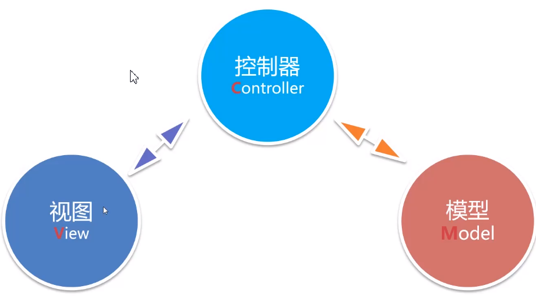
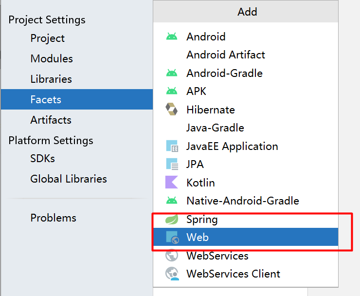
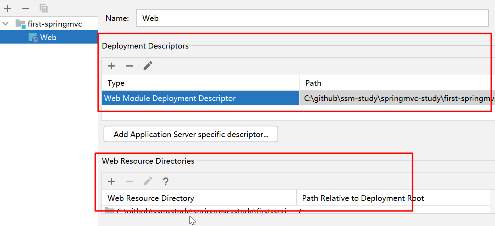
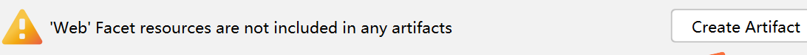
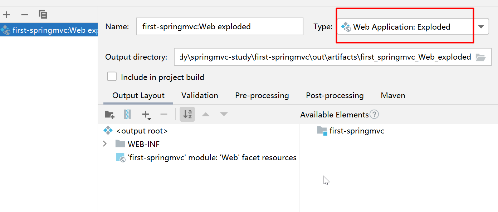
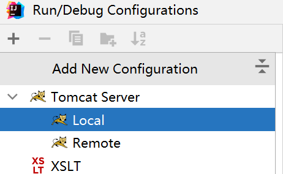

# 内容简介

| 内容           | 说明                         | 重要程度 |
| -------------- | ---------------------------- | -------- |
| Spring MVC入门 | Spring MVC开发流程与环境配置 | 5        |
| 接收Web数据    | Spring MVC参数接收与数据绑定 | 5        |
| URL Mapping    | 讲解URL绑定过程              | 5        |
| 中文乱码问题   | 解决请求与响应中文乱码       | 5        |
| 拦截器         | Spring MVC拦截器的使用       | 3        |

拦截器有点类似于j2ee中的过滤器, 但是比过滤器更加高级, 拦截器可以对来自client的请求做统一处理, 进而实现SpringMVC中的高级功能

---

Restful开发风格

| 内容                  | 说明                                | 重要程度 |
| --------------------- | ----------------------------------- | -------- |
| Restful风格介绍       | 介绍Restful开发规范                 | 5        |
| Restful开发实战       | 实例讲解Restful在Spring MVC中的实现 | 5        |
| JSON序列化            | 通过响应输出数据                    | 5        |
| Restful的**跨域**问题 | 分析跨域问题的来源与解决办法        | 5        |

# Spring MVC

## MVC

MVC: 架构模式

Model(模型), View(视图), Controller(控制器)



View: 界面, 与用户进行交互

Model: 数据, 业务逻辑部分

MVC中, 如果View中的数据来自于Model, 并不由View直接去调用获取到Model中的数据, 而是需要通过Controller作为中介. 

Controller是MVC中最重要的部分, 接收View中传入的数据, 根据数据调用后端的业务逻辑Model得到结果, 再通过Controller返回给View

MVC中View和Model没有直接的关系, 需要Controller来控制. Servlet就是Controller技术, 但是不太方便, 所以提供Spring MVC更加简化Web应用程序的开发

---

* Spring MVC是Spring体系的轻量级Web MVC框架. 用来替代j2e的Servlet, 让web开发更加简单
* Spring MVC的核心Controller控制器，用于处理请求，产生响应. View不允许直接调用Model, 需要Controller作为中间者来调用, 好处: 界面和后端业务逻辑解耦, 提高可维护性
* Spring MVC基于Spring IOC容器运行，所有对象被IOC管理

## Spring 5.X

* Spring 5.×最低要求JDK8与J2EE 7(Servlet 3.1/Tomcat 8.5+)
* Spring5.x支持JDK8/9,可以使用新特性
* Spring5.x最重要的新特性支持**响应式编程**

响应式编程: 根据事件来, 当触发了某个事件, 自动执行某段代码. 另外一种编程风格, 专门对事件做出响应的程序

## Spring MVC环境配置

[文档](https://docs.spring.io/spring-framework/docs/current/reference/html/web.html)

idea环境下创建Maven WebApp: 

### 将工程设置为web开发

1. 在Project Structure -> facets -> + web



2. 设置Web地址



* 设置Deployment Descriptors()

其中: 

Web Module Deployment Descriptor (web.xml): first-springmvc\src\main\webapp\WEB-INF\web.xml 

Deployment descriptor version : 3.1. SpringMVC中Servlet的最低版本就是3.1

* 设置Web Resource Directories(存储web页面地址)

Web Resource Directory: first-springmvc\src\main\webapp

3. 创建Facet

点击"Create Artifact"自动创建



Artifact看成运行的方式



Web Application: Exploded. 运行时使用目录的方式对web应用进行运行

如果改成Archive方式, 最后应用就会打包成war包来运行

开发环境下, 一般都选择Exploded

4. 添加html测试页

webapp下新增index.html页面, html5

```xml
<!DOCTYPE html>
<html lang="en">
<head>
    <meta charset="UTF-8">
    <title>Title</title>
</head>
<body>
    <h1>Hello, spring-mvc</h1>
</body>
</html>
```

---

启动项目, 展示网页

5. 配置tomcat

tomcat版本至少8.5, -> apache-tomcat-8.5.40




# RESTful


# SpringMVC拦截器


-> 过滤器


