# 内容简介

| 内容           | 说明                         | 重要程度 |
| -------------- | ---------------------------- | -------- |
| Spring MVC入门 | Spring MVC开发流程与环境配置 | 5        |
| 接收Web数据    | Spring MVC参数接收与数据绑定 | 5        |
| URL Mapping    | 讲解URL绑定过程              | 5        |
| 中文乱码问题   | 解决请求与响应中文乱码       | 5        |
| 拦截器         | Spring MVC拦截器的使用       | 3        |

拦截器有点类似于j2ee中的过滤器, 但是比过滤器更加高级, 拦截器可以对来自client的请求做统一处理, 进而实现SpringMVC中的高级功能

---

Restful开发风格

| 内容                  | 说明                                | 重要程度 |
| --------------------- | ----------------------------------- | -------- |
| Restful风格介绍       | 介绍Restful开发规范                 | 5        |
| Restful开发实战       | 实例讲解Restful在Spring MVC中的实现 | 5        |
| JSON序列化            | 通过响应输出数据                    | 5        |
| Restful的**跨域**问题 | 分析跨域问题的来源与解决办法        | 5        |

# Spring MVC

## MVC

MVC: 架构模式

Model(模型), View(视图), Controller(控制器)


View: 界面, 与用户进行交互

Model: 数据, 业务逻辑部分

MVC中, 如果View中的数据来自于Model, 并不由View直接去调用获取到Model中的数据, 而是需要通过Controller作为中介. 

Controller是MVC中最重要的部分, 接收View中传入的数据, 根据数据调用后端的业务逻辑Model得到结果, 再通过Controller返回给View

MVC中View和Model没有直接的关系, 需要Controller来控制. Servlet就是Controller技术, 但是不太方便, 所以提供Spring MVC更加简化Web应用程序的开发

---

* Spring MVC是Spring体系的轻量级Web MVC框架. 用来替代j2e的Servlet, 让web开发更加简单
* Spring MVC的核心Controller控制器，用于处理请求，产生响应. View不允许直接调用Model, 需要Controller作为中间者来调用, 好处: 界面和后端业务逻辑解耦, 提高可维护性
* Spring MVC基于Spring IOC容器运行，所有对象被IOC管理

## Spring 5.X

* Spring 5.×最低要求JDK8与J2EE 7(Servlet 3.1/Tomcat 8.5+)
* Spring5.x支持JDK8/9,可以使用新特性
* Spring5.x最重要的新特性支持**响应式编程**

响应式编程: 根据事件来, 当触发了某个事件, 自动执行某段代码. 另外一种编程风格, 专门对事件做出响应的程序

## Spring MVC环境配置

[文档](https://docs.spring.io/spring-framework/docs/current/reference/html/web.html)

idea环境下创建Maven WebApp: 

### 将工程设置为web开发

1. 在Project Structure -> facets -> + web


2. 设置Web地址


* 设置Deployment Descriptors

其中: 

Web Module Deployment Descriptor (web.xml): first-springmvc\src\main\webapp\WEB-INF\web.xml 

Deployment descriptor version : 3.1. SpringMVC中Servlet的最低版本就是3.1

* 设置Web Resource Directories(存储web页面地址)

Web Resource Directory: first-springmvc\src\main\webapp

3. 创建Facet

点击"Create Artifact"自动创建


Artifact看成运行的方式


Web Application: Exploded. 运行时使用目录的方式对web应用进行运行

如果改成Archive方式, 最后应用就会打包成war包来运行

开发环境下, 一般都选择Exploded

4. 添加html测试页

webapp下新增index.html页面, html5

```xml
<!DOCTYPE html>
<html lang="en">
<head>
    <meta charset="UTF-8">
    <title>Title</title>
</head>
<body>
    <h1>Hello, spring-mvc</h1>
</body>
</html>
```

---

启动项目, 展示网页

5. 配置tomcat

* Add Configuration -> Tomcat Server -> Local

tomcat版本至少8.5, -> apache-tomcat-8.5.40


* 配置Application Server:

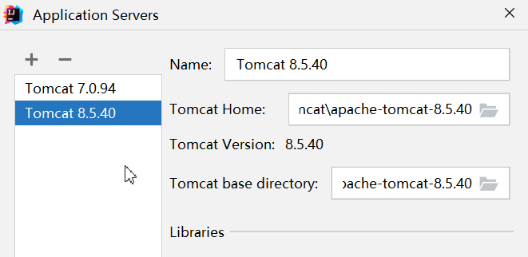

* 添加Deployment, 添加web应用

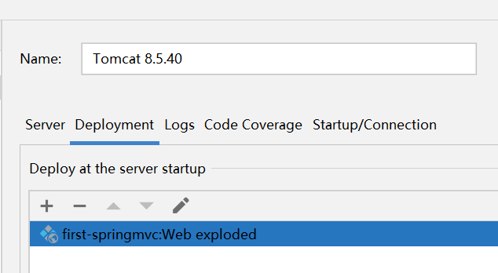

这里有上下文设置, 对应到访问的URL: http://localhost:8080/first_springmvc_Web_exploded/

如果配置/, 那就是localhost

设置port为80: http://localhost:80/

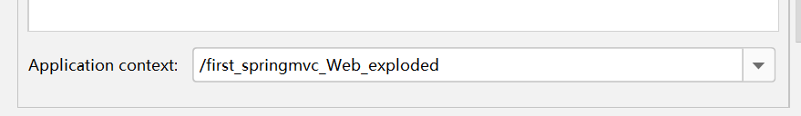

* 设置热部署

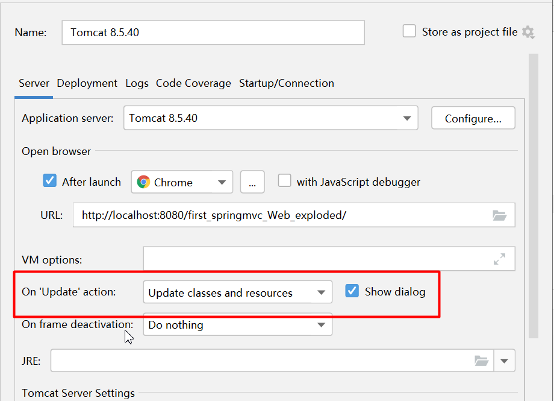

### Spring mvc具体配置

1. Maven依赖spring-webmvc

2. web.xml配置DispatcherServlet

3. 配置applicationContext的mvc标记

4. 开发测试Controller

---

1. maven添加spring-webmvc依赖

```xml
<dependency>
    <groupId>org.springframework</groupId>
    <artifactId>spring-webmvc</artifactId>
    <version>5.1.9.RELEASE</version>
</dependency>
```

2. web.xml中添加配置DispatcherServlet(对所有请求进行拦截)

DispatcherServlet是Spring MVc最核心的对象, 用于拦截Http请求, 并根据请求的URL调用与之对应的Controller方法，来完成Http请求的处理. 中转站

类比前台, 接待客户, 接收邮件, 首先面向前台, 然后前台根据不同的情况联系内部不同的人来进行处理. 合同->法务部, 客户->市场部. 外部环境和内部人员的对接窗口, 所有的进出都需要通过前台完成. DispatcherServlet就是前台, Controller就是具体的部门处理人员

* web.xml中添加DispatcherServlet

```xml
<!-- DispatcherServlet -->
<servlet>
    <servlet-name>springmvc</servlet-name>
    <!--
            DispatcherServlet是Spring MVc最核心的对象
            DispatcherServlet用于拦截Http请求，
            并根据请求的URL调用与之对应的Controller方法，来完成Http请求的处理
        -->

    <servlet-class>org.springframework.web.servlet.DispatcherServlet</servlet-class>
</servlet>
```

* 添加servlet-mapping

```xml
<servlet-mapping>
    <servlet-name>springmvc</servlet-name>
    <!-- 写上url请求的根, 那么所有的请求都会通过DispatcherServlet来分发 -->
    <!-- / 代表拦截所有请求-->
    <url-pattern>/</url-pattern>
</servlet-mapping>
```

* DispatcherServlet添加额外的配置

load-on-startup: 在Web应用启动时自动创建Spring IoC容器, 并初始化DispatcherServlet.如果没有这句话, 会在第一次访问url的时候创建. 因为要初始化IOC容器, 所以DispatcherServlet需要知道applicationContext.xml的路径 -> contextConfigLocation

```xml
<!-- DispatcherServlet -->
<servlet>
    <servlet-name>springmvc</servlet-name>
    <!--
            DispatcherServlet是Spring MVc最核心的对象
            DispatcherServlet用于拦截Http请求，
            并根据请求的URL调用与之对应的Controller方法，来完成Http请求的处理
        -->
    <servlet-class>org.springframework.web.servlet.DispatcherServlet</servlet-class>

    <!-- applicationContext.xml -->
    <init-param>
        <param-name>contextConfigLocation</param-name>
        <param-value>classpath:applicationContext.xml</param-value>
    </init-param>
    <!-- 额外的选项 -->
    <!--
            在Web应用启动时自动创建Spring IoC容器，
            并初始化DispatcherServlet.
            如果没有这句话, 会在第一次访问url的时候创建
            因为要初始化IOC容器, 所以DispatcherServlet需要知道applicationContext.xml的路径
        -->
    <load-on-startup>0</load-on-startup>
</servlet>
```

---

整体的web.xml

```xml
<?xml version="1.0" encoding="UTF-8"?>
<web-app xmlns="http://xmlns.jcp.org/xml/ns/javaee"
         xmlns:xsi="http://www.w3.org/2001/XMLSchema-instance"
         xsi:schemaLocation="http://xmlns.jcp.org/xml/ns/javaee http://xmlns.jcp.org/xml/ns/javaee/web-app_3_1.xsd"
         version="3.1">
    <!-- DispatcherServlet -->
    <servlet>
        <servlet-name>springmvc</servlet-name>
        <!--
            DispatcherServlet是Spring MVc最核心的对象
            DispatcherServlet用于拦截Http请求，
            并根据请求的URL调用与之对应的Controller方法，来完成Http请求的处理
        -->
        <servlet-class>org.springframework.web.servlet.DispatcherServlet</servlet-class>
        <!-- applicationContext.xml -->
        <init-param>
            <param-name>contextConfigLocation</param-name>
            <param-value>classpath:applicationContext.xml</param-value>
        </init-param>
        <!-- 额外的选项 -->
        <!--
            在Web应用启动时自动创建Spring IoC容器，
            并初始化DispatcherServlet.
            如果没有这句话, 会在第一次访问url的时候创建
            因为要初始化IOC容器, 所以DispatcherServlet需要知道applicationContext.xml的路径
        -->
        <load-on-startup>0</load-on-startup>
    </servlet>
    
    <servlet-mapping>
        <servlet-name>springmvc</servlet-name>
        <!-- 写上url请求的根, 那么所有的请求都会通过DispatcherServlet来分发 -->
        <!-- / 代表拦截所有请求-->
        <url-pattern>/</url-pattern>
    </servlet-mapping>
</web-app>
```

3. 添加applicationContext.xml, 注意需要配置mvc的命名空间: xmlns:mvc

```xml
<?xml version="1.0" encoding="UTF-8"?>
<beans xmlns="http://www.springframework.org/schema/beans"
       xmlns:xsi="http://www.w3.org/2001/XMLSchema-instance"
       xmlns:context="http://www.springframework.org/schema/context"
       xmlns:mvc="http://www.springframework.org/schema/mvc"
       xsi:schemaLocation="
        http://www.springframework.org/schema/beans
        https://www.springframework.org/schema/beans/spring-beans.xsd
        http://www.springframework.org/schema/context
        https://www.springframework.org/schema/context/spring-context.xsd
        http://www.springframework.org/schema/mvc
        https://www.springframework.org/schema/mvc/spring-mvc.xsd">
</beans>
```

启动注解模式, mvc注解. 排除静态资源

```xml
<!-- context:component-scan标签作用
        在Spring IoC初始化过程中，自动创生并营理com.imooc.springmvc及子包中
        拥有以下注解的对象.
        @Repository
        @Service
        @Controller
        @Component
    -->
<context:component-scan base-package="com.imooc.springmvc"/>

 <!-- 启用Spring MVC的注解开发模式 -->
<mvc:annotation-driven/>

<!-- 将图片/JS/CSs等静态资源排除在外，可提高执行效率 -->
<mvc:default-servlet-handler/>
```

mvc:default-servlet-handler. 当http请求发过来之后, springmvc发现是静态资源, 就不会处理

---

applicationContext.xml

```xml
<?xml version="1.0" encoding="UTF-8"?>
<beans xmlns="http://www.springframework.org/schema/beans"
       xmlns:xsi="http://www.w3.org/2001/XMLSchema-instance"
       xmlns:context="http://www.springframework.org/schema/context"
       xmlns:mvc="http://www.springframework.org/schema/mvc"
       xsi:schemaLocation="
        http://www.springframework.org/schema/beans
        https://www.springframework.org/schema/beans/spring-beans.xsd
        http://www.springframework.org/schema/context
        https://www.springframework.org/schema/context/spring-context.xsd
        http://www.springframework.org/schema/mvc
        https://www.springframework.org/schema/mvc/spring-mvc.xsd">

    <!-- context:component-scan标签作用
        在Spring IoC初始化过程中，自动创生并营理com.imooc.springmvc及子包中
        拥有以下注解的对象.
        @Repository
        @Service
        @Controller
        @Component
    -->
    <context:component-scan base-package="com.imooc.springmvc"/>

    <!-- 启用Spring MVC的注解开发模式 -->
    <mvc:annotation-driven/>

    <!-- 将图片/JS/CSS等静态资源排除在外，可提高执行效率 -->
    <mvc:default-servlet-handler/>
</beans>
```

4. 开发Controller

类添加注解@Controller表明是Controller

@GetMapping: 将当前方法绑定某个get请求url

@ResponseBody: 直接向响应输出字符串数据，不跳转页面

```java
package com.imooc.springmvc.controller;
import org.springframework.stereotype.Controller;
import org.springframework.web.bind.annotation.GetMapping;
import org.springframework.web.bind.annotation.ResponseBody;
/**
 * 处理http请求, 并返回相应
 */
@Controller
public class TestController {
    // GetMapping: 将当前方法绑定某个get请求url
    @GetMapping("/t")
    @ResponseBody // 直接向响应输出字符串数据，不跳转页面
    public String test() {
        return "hello spring mvc";
    }
}
```

5. 调整tomcat

Edit Configuration -> Deployment -> Edit. 调整部署

默认情况下, 底层依赖的jar包不会自动放到当前的发布目录中, 需要手动将maven依赖放入.

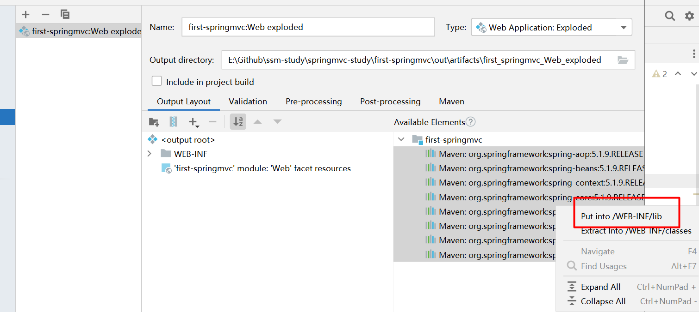

回到Deployment, Application Context配置/即可, 简化web的访问, 默认路径为: http://localhost:8080/

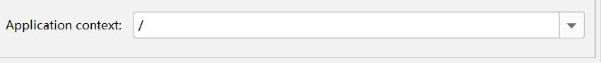

6. 测试

直接在浏览器地址中输入: http://localhost:8080/t

@GetMapping注解将test方法绑定到/t的请求响应

只需要在方法上添加注解就可以完成web请求的处理和返回

---

示意图:

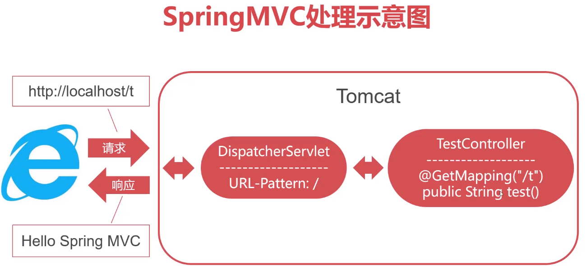

`URL-Pattern:/`: 拦截所有请求, 请求会被发送到DispatcherServlet -> 当前访问地址是/t, 在方法中找哪个方法上映射了/t -> test方法处理请求 -> return String -> 返回响应

## Spring MVC数据绑定

### URL Mapping(URL 映射)

* URL Mapping指将URL与Controller方法绑定

* 通过将URL与方法绑定, SpringMVC便可通过Tomcat对外暴露服务

对于Web应用, 对外暴露的接口都是url网址, 通过url执行后端的程序代码

#### URL Mapping注解

- @RequestMapping-通用绑定

* @GetMapping-绑定Get请求

* @PostMapping-绑定Post请求

---

#### GetMapping和PostMapping

这两个注解通常放在方法上

1. 新建URLMappingController, 其中添加get和post的Mapping

```java
package com.imooc.springmvc.controller;
import org.springframework.stereotype.Controller;
import org.springframework.web.bind.annotation.GetMapping;
import org.springframework.web.bind.annotation.PostMapping;
import org.springframework.web.bind.annotation.ResponseBody;
@Controller
public class URLMappingController {
    @GetMapping("/g")
    @ResponseBody
    public String getMapping() {
        return "this is get method";
    }
    @PostMapping("/p")
    @ResponseBody
    public String postMapping() {
        return "this is post method";
    }
}
```

2. 运行tomcat

可以查看当访问对应的url: `http://localhost:8080/g` 的时候, 会return响应

当访问`http://localhost:8080/p`的时候, 弹出错误:405-Method Not Allowed

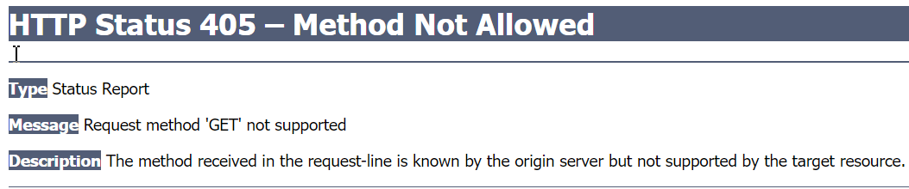

浏览器中直接输入地址, 是get请求, 而程序映射的是post的请求, 请求类型不一致. 405 -> 请求类型错误

3. post请求访问

post请求如何访问, 可以通过html的表单. 

在webapp/index.html中添加表单

```html
<body>
    <form action="/p" method="post">
        <input type="submit" value="提交">
    </form>
</body>
```

action绑定到/p上

运行tomcat, 点击提交按钮后, 发到postMapping上, 返回数据. Post请求生效

#### RequestMapping

全局通用的请求映射

* 作用在类上就是给所有的get, postMapping添加访问前缀

* 作用在方法上, 不用区分get/post请求, 所有的请求都可以访问到该方法 -> 不建议使用, 因为在实际开发中每个方法都应该有明确的访问方式. 作用在方法上, 还是优先使用getMapping和PostMapping
  当然也可以通过参数Method来指定使用的是什么请求类型. 
  `@RequestMapping(method = RequestMethod.GET, value = "/q")`相当于`@GetMapping("/q")`

---

注解通常放在类上, 因为url会有多级结构, 例如所有的映射地址都要有前缀`um`, 如果类中方法很多, 则每个方法的注解都要加前缀. 所以统一在RequestMapping中设置

```java
@RequestMapping("/um")
public class URLMappingController {}
```

这样子类中方法访问的时候都需要添加对应的前缀再加上方法上的url才可以访问

添加后update tomcat, 再访问原来的地址就会404

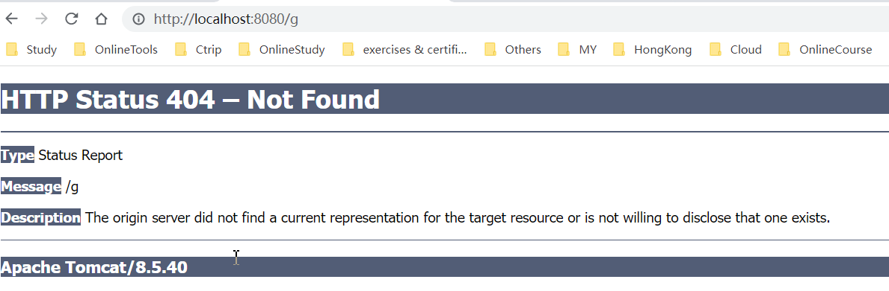

需要在地址上添加前缀um: `http://localhost:8080/um/g`

### Controller接收请求参数

例如:用户登陆的用户名和pwd.

#### 接收参数的常见做法

* 使用Controller**方法参数**接收 -> post请求接收参数, get请求接收参数

* 使用Java Bean接收请求参数

#### post请求接收参数

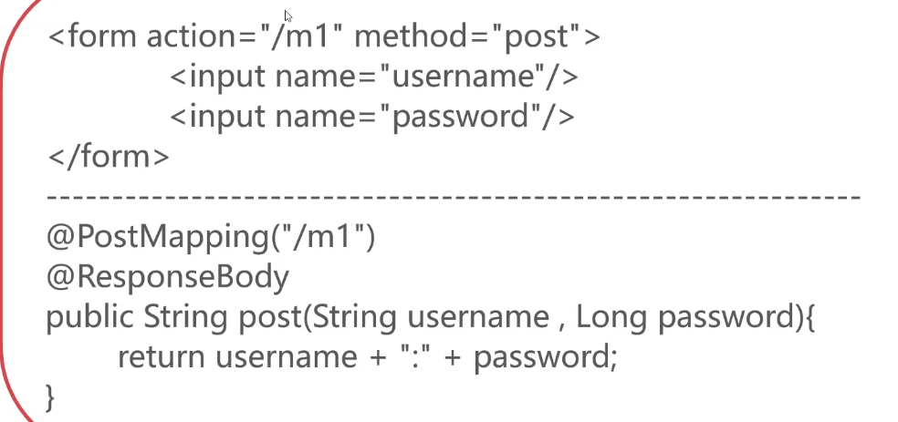

**方法的参数名称** 和 **提交数据的参数名称**完全一致.  

-> 或者使用@RequestParam来做value(前台参数名称)和default赋值

---

SpringMVC允许进行数据转换, 如果前台保证pwd只允许输入数字, 那么可以进行强制类型转换成Long

新增方法getUserNamePwd, password修改成Long类

```java
@PostMapping("/m1")
@ResponseBody
public String getUserNamePwd(String username, Long password) {
    System.out.println(username + ":" + password);
    return username + ":" + password;
}
```

在index.xml中添加input:

```xml
<body>
    <form action="/um/m1" method="post">
        <input name="username"/><br/>
        <input name="password"/><br/>
        <input type="submit" value="submit">
    </form>
</body>
```

注意这里的input name务必和后台方法中的参数名称一致, spring mvc会完成数据的注入

`String username` 和 `<input name="username"/>`

这里输入用户名, 密码(纯数字)会返回对应页面.

这个比Servlet的方式简单, 如果是Servlet获取参数, 需要使用request.getParamter()来进行获取

---

这里前台index中没有做任何校验是否是数字, 默认直接传给mvc, 如果我传入的password有字母, 则会报错: 400, Bad Request

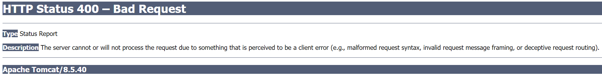

报错日志:

```
org.springframework.web.servlet.handler.AbstractHandlerExceptionResolver.logException Resolved [org.springframework.web.method.annotation.MethodArgumentTypeMismatchException: Failed to convert value of type 'java.lang.String' to required type 'java.lang.Long'; nested exception is java.lang.NumberFormatException: For input string: "asd"]
```

所以前台增加表单验证, 校验是否是纯数字 -> 后续看到400错误需要想到是否是因为前台校验不够严谨导致.

#### get请求接收参数

get请求如何获取参数, url: `http://localhost:8080/um/g?manager_name=lily`

可以看到这里传入的参数是manager_name, 不符合Java中的驼峰命名, managerName

这里使用@RequestParam注解, 书写在参数之前, 同时增加要映射的原始参数.

---

完整含义: 作为请求中的参数manager_name, 在运行时动态注入到后面的参数managerName中

```java
@GetMapping("/g")
@ResponseBody
public String getMapping(@RequestParam("manager_name") String managerName) {
    System.out.println("managerName: " + managerName);
    return "this is get method. " + managerName;
}
```

#### 使用Java Bean接收请求参数

之前的用户名和密码的表单, 假设有很多输入项, 不可能将所有的输入项都作为参数列举出来, 

-> 创建对象保存输入项

```java
User user = new User();
user.setParam1();
user.setParam2();
....
```

如果是这种写法, 很麻烦, spring mvc允许前台输入数据一次性保存为Java Bean. 

一步到位, 数据到对象

---

1. 新增User类

```java
package com.imooc.springmvc.entity;
import lombok.Getter;
import lombok.Setter;
@Getter
@Setter
public class User {
    private String username;
    private Long password;
}
```

务必注意这里的属性名称必须和前台传入参数的名字完全一致

```xml
<body>
    <form action="/um/p1" method="post">
        <input name="username"/><br/>
        <input name="password"/><br/>
        <input type="submit" value="submit">
    </form>
</body>
```

2. Controller中

```java
@PostMapping("p1")
@ResponseBody
public String postMapping1(User user) {
    System.out.println(user.getUsername() + ": " + user.getPassword());
    return "postMapping1";
}
```

使用Java Bean接收数据, Springmvc在运行时, 只要数据提交到p1这个地址上, spring mvc发现该方法的参数是一个实体类, 那么就会自动在实体类中寻找同名的请求参数, 自动完成数据注入.

如果这里的函数签名修改为, 那么是哪一个username被赋值呢?

```java
@PostMapping("p1")
@ResponseBody
public String postMapping1(User user, String username) {
    System.out.println(user.getUsername() + ": " + user.getPassword());
    return "postMapping1";
}
```

增加断点调试后可见, user中的username, username都被注入, 所以不管有多少个参数, 只要参数名称和请求参数同名, 就全部都会赋值

---

所以, 如果接收的参数较少, 可以直接使用参数方式来接收请求参数. 如果参数很多, 可以通过新建实体类, Java Bean注入的方式来进行参数接收.

#### @RequestParam注入默认参数

在下节的from工程中, 对于前台传递的参数获取, 可以通过下面的方式.

```java
@PostMapping("/apply")
@ResponseBody
public String apply(String name, String course, Integer[] purpose) {}
```

这里函数签名的参数名称一定要和前台的参数名称一致, 

但是可以通过@RequestParam

```java
@PostMapping("/apply")
@ResponseBody
public String apply(@RequestParam(value = "n", defaultValue = "anonymous") String name, String course, Integer[] purpose) {
```

这里就是对前台传入的参数`n`, 如果不存在就设置默认值anonymous, 然后赋值到name中

因为前台咩有该参数, 那么name就一致是anonymous

---

```java
@PostMapping("/apply")
@ResponseBody    
public String apply(@RequestParam(value = "name", defaultValue = "anonymous") String duck, String course, Integer[] purpose) {
```

这里就可以@RequestParam接收前台的参数到controller中的方法参数中, 不需要参数名称和接收的参数名称一致

### 获取复合数据

调查问卷: 

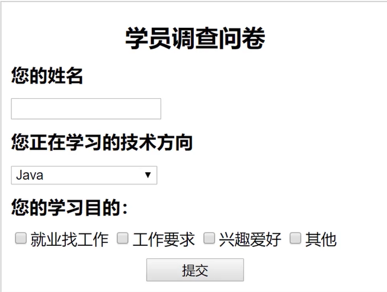

知识点:

* 利用数组或者List接收请求中的复合数据

* 利用@RequestParam为参数设置默认值 -> 上节中讲解

* 使用Map对象接收请求参数及注意事项 -> map无法接收复合数据

---

预备好index.html

```html
<!DOCTYPE html>
<html lang="en">
<head>
    <meta charset="UTF-8">
    <title>学员调查问卷</title>
    <style>
        .container {
            position: absolute;
            border: 1px solid #cccccc;
            left: 50%;
            top: 50%;
            width: 400px;
            height: 300px;
            margin-left: -200px;
            margin-top: -150px;
            box-sizing: border-box;
            padding: 10px;
        }

        h2 {
            margin: 10px 0px;
            text-align: center;
        }

        h3 {
            margin: 10px 0px;
        }
    </style>
</head>
<body>
<div class="container">
    <h2>学员调查问卷</h2>
    <form action="./apply" method="post">
        <h3>您的姓名</h3>
        <input name="name" class="text" style="width: 150px">
        <h3>您正在学习的技术方向</h3>
        <select name="course" style="width: 150px">
            <option value="java">Java</option>
            <option value="h5">HTML5</option>
            <option value="python">Python</option>
            <option value="php">PHP</option>
        </select>
        <div>
            <h3>您的学习目的：</h3>
            <input type="checkbox" name="purpose" value="1">就业找工作
            <input type="checkbox" name="purpose" value="2">工作要求
            <input type="checkbox" name="purpose" value="3">兴趣爱好
            <input type="checkbox" name="purpose" value="4">其他
        </div>
        <div style="text-align: center;padding-top:10px">
            <input type="submit" value="提交" style="width:100px">
        </div>
    </form>

</div>
</body>
</html>
```

观察看这里的`<form action="./apply" method="post">`. 这里的action后的网址带有`.`, 这是什么?

* URI绝对路径和相对路径

`./`: 当前路径

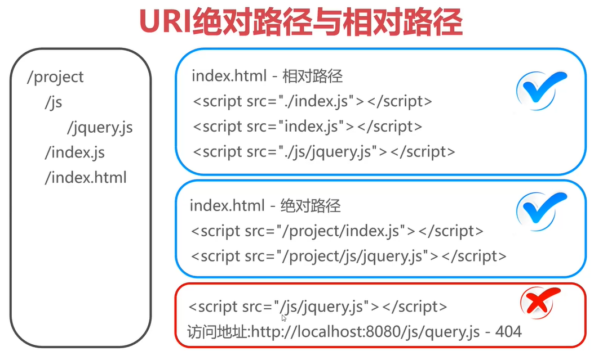

如果路径以`/`开头, 必然是绝对路径. 后面是应用的上下文

上图中的错误情况就是绝对路径, 必须要加上`/project`

回到案例中的`<form action="./apply" method="post">`

使用相对路径

`<form action="./apply" method="post">`

页面地址: `http://localhost:8080/[上下文路径]/form.html`

提交地址: `http://localhost:8080/[上下文路径]/apply`

因为使用了相对路径, 不管前面的上下文路径是什么, 只需要保证提交地址apply和当前的html在同一个层级就可以了, 请求必然会被送达. 使用相对路径可以降低工程对web配置的依赖.

#### 利用数组或者List接收请求中的复合数据

使用数组接收参数

```java
@Controller
public class FormController {
    /**
     * 数组方法接收参数
     */
    @PostMapping("/apply")
    @ResponseBody
    public String apply(@RequestParam(value = "name", defaultValue = "anonymous") String v1, String course, Integer[] purpose) {
        System.out.println(v1);
        System.out.println(course);
        for (Integer p : purpose) {
            System.out.println(p);
        }
        return "success";
    }
}
```

这里的purpose使用数组来接收参数

---

使用List接收请求参数

务必注意, 这里必须在方法参数前使用@RequestParam注解, 这样springmvc才会知道请求中包含的复合数据转化为list形式进行存储

```java
@RequestParam List<Integer> purpose
```

```java
@PostMapping("/apply")
@ResponseBody
public String apply(String name, String course,
                    @RequestParam List<Integer> purpose) {
    System.out.println(duck);
    System.out.println(course);
    for (Integer p : purpose) {
        System.out.println(p);
    }

    return "success";
}
```

如果不在List复合参数前添加注解, 报错

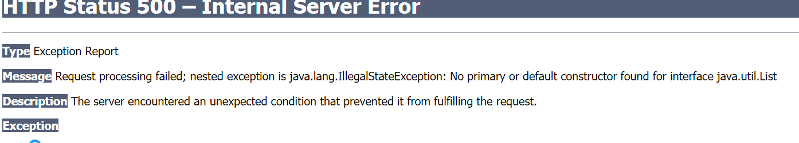

同时可以看到, List实际的数据载体是ArrayList

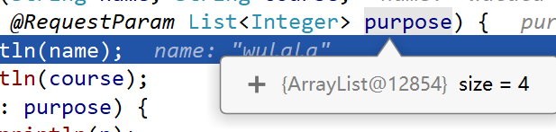

在开发中建议使用List的方式存储复合参数

---

更多时候, 此类结构化的数据会使用类的方式来接收, 那么在对象中的属性List是否还会生效?

1. 新建entity, Form类

```java
@Getter
@Setter
public class Form {
    private String name;
    private String course;
    private List<Integer> purpose;   
}
```

2. Controller中

```java
@PostMapping("/apply")
@ResponseBody
public String apply(Form form) {
    System.out.println(form.getName());
    System.out.println(form.getCourse());

    for (Integer p : form.getPurpose()) {
        System.out.println(p);
    }
    return "success";
}
```

调试可以看到, form中接收到了参数

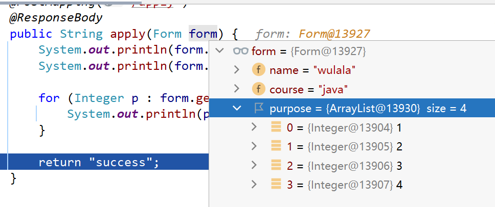

所以在使用实体类接收数据的时候, 可以使用List来接收复合数据(数组), 通过实体类和List的结合, 可以简化接收表单数据的工作量.

---

#### 使用Map对象接收请求参数及注意事项(map无法接收复合数据)

在接收复合数据时, map有缺陷

使用Map来接收所有参数, 需要添加@RequestParam注解

```java
@PostMapping("/apply")
@ResponseBody
public String apply(@RequestParam Map map) {
    System.out.println(map);
    return "success";
}
```

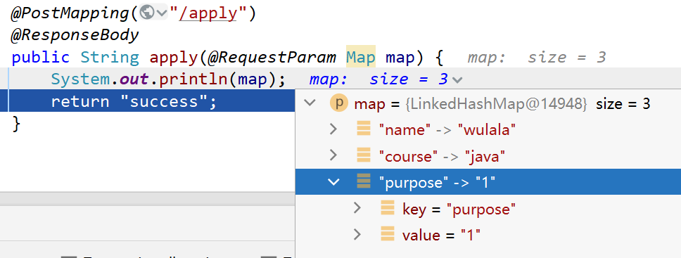

前台选择的purpose是1,2,3,4. 可以看出map无法接收复合数据

map在默认情况下只会把数组中的第一个数据进行返回, purpose = 1

---

如果表达不包含任何的复合数据(数组数据), 可以使用map来接收, 但是如果有复合数组, 不能用map

### 关联对象赋值

关联对象: 一个对象中引用了另一个对象, 需要对被引用对象赋值

复杂内容表单:

```
用户名：<input name="username">
密码：<input name="password">
----------------------------------
姓名：<input name="name">
身份证号：<input name="idno">
过期时间:<input name="expire">
```

结构如下:

注册信息和身份信息. 两组数据 -> 两个类

```Java
public class User {
    private String username;
    private String username;
    private IDCard idcard = new IDCard;
}
```

```java
public class IDCard {
    private String name;
    private String idno;
    private Date expire;
}
```

那么IDCard这个关联对象如何设置?

Springmvc中关联对象赋值: 需要将关联对象的对象名放到表单name属性的前缀. springmvc就可以自动完成赋值操作

需要在表单中, 将属性的name增加前缀`idcard.`

```
复杂内容表单
用户名：<input name="username">
密码：<input name="password">
---------------------------------
姓名：<input name="idcard.name">
身份证：<input name="idcard.idno">
过期时间：<input name="idcard.expire">
```

---

调查问卷的例子中, 添加收货地址的表单, index.html

```html
<!-- 收货地址 -->
<h3>收货人</h3>
<input name="name" class="text" style="width: 150px">
<h3>联系电话</h3>
<input name="mobile" class="text" style="width: 150px">
<h3>收货地址</h3>
<input name="address" class="text" style="width: 150px">
```

1. 新增entity: Delivery

```java
@Setter
@Getter
public class Delivery {
    private String name;
    private String mobile;
    private String address;
}
```

2. 关联表单数据

Form中添加对象, 注意必须要实例化对象才可以关联

```java
public class Form {
    private String name;
    private String course;
    private List<Integer> purpose;

    // 这里需要实例化才可以保证赋值成功
    private Delivery delivery = new Delivery();
}
```

在index中添加前缀, 注意前缀的名字务必和表单中对象名称相同

```html
<!-- 收货地址 -->
<!-- 增加前缀, 这里前缀的名字就是Form表单中的对象名称 -->
<h3>收货人</h3>
<input name="delivery.name" class="text" style="width: 150px">
<h3>联系电话</h3>
<input name="delivery.mobile" class="text" style="width: 150px">
<h3>收货地址</h3>
<input name="delivery.address" class="text" style="width: 150px">
```

注意这里添加的前缀就是表单中关联对象的名称

3. Controller查看

```java
@PostMapping("/apply")
@ResponseBody
public String applyDelivery(Form form) {
    System.out.println(form.getDelivery().getname());
    return "success";
}
```

### 接收日期数据

@DateTimeFormat: 根据指定格式将前台的String转成Date对象. 需要指定格式pattern

1. html中接收日期

```html
<body>
    <form action="/um/p1" method="post">
        <input name="username"/><br/>
        <input name="password"/><br/>
        <input name="createtime"/><br/>
        <input type="submit" value="submit">
    </form>
</body>
```

2. 接收createtime的参数

```java
@PostMapping("p1")
@ResponseBody
public String postMapping1(User user, String username, Date createtime) {}
```

3. 测试2015-01-01

报错400, 2015-01-01无法有效转换成Date类型

需要手动转换. 

4. 添加@DateTimeFormat注解: @DateTimeFormat(pattern = "yyyy-MM-dd")

需要指定格式

```java
@PostMapping("p1")
@ResponseBody
public String postMapping1(User user, String username,
                           @DateTimeFormat(pattern = "yyyy-MM-dd") Date createtime) {
    // 不管有多少个参数, 只要参数名称和请求参数同名, 就全部都会赋值
    System.out.println(user.getUsername() + ": " + user.getPassword());
    return "postMapping1";
}
```

可以看到日期对象接收成功

```
Thu Jan 01 00:00:00 CST 2015
```

5. 实体对象中添加Date, 属性上添加注解

实体类User中添加注解

```java
@Getter
@Setter
public class User {
    private String username;
    private Long password;
    
    @DateTimeFormat(pattern = "YYYY-MM-dd")
    private Date createtime;
}
```

---

如果有很多地方需要日期类型的转换, 注解就不方便了

-> 设置全局的默认时间格式, 按照指定的规则转换

1. 新建自定义日期转换类, 实现convert接口, 接口有两个泛型代表要转换的类

在方法内部实现类型转换

```java
package com.imooc.springmvc.convert;
import org.springframework.core.convert.converter.Converter;
import java.text.ParseException;
import java.text.SimpleDateFormat;
import java.util.Date;
public class MyDateConvertor implements Converter<String, Date> {
    @Override
    public Date convert(String s) {
        SimpleDateFormat sdf = new SimpleDateFormat("yyyy-MM-dd");
        try {
            return sdf.parse(s);
        } catch (ParseException e) {
            e.printStackTrace();
            return null;
        }
    }
}
```

这时候MyDateConvertor只是一个Java类, 需要让Spring mvc知道他

2. applicationContext中进行通知springmvc该转换类

通知Spring MVC有哪些自定义的转换类 -> FormattingConversionServiceFactoryBean

```xml
<!-- 通知Spring MVC有哪些自定义的转换类 -->
<bean id="conversionService"
      class="org.springframework.format.support.FormattingConversionServiceFactoryBean">
    <property name="converters">
        <set>
            <bean class="com.imooc.springmvc.convert.MyDateConvertor"/>
        </set>
    </property>
</bean>
```

* 用来通知Spring MVC有哪些自定义的转换类
* 一般默认id: conversionService
* 其中的属性中声明自定义的转换类, set集合

3. annotation-driven中添加 conversion-service

```xml
<!-- 启用Spring MVC的注解开发模式 -->
<mvc:annotation-driven conversion-service="conversionService"/>
```

4. get方法测试

直接新增参数, 不使用注解方式.`http://localhost:8080/um/g?manager_name=asd&createTime=2010-01-01`

```java
@GetMapping("/g")
@ResponseBody
public String getMapping(@RequestParam("manager_name") String managerName, Date createTime) {
    System.out.println("managerName: " + managerName);
    System.out.println("createTime: " + createTime.toString());
    return "this is get method. " + managerName;
}
```

---

如果既配置了自定义转换器, 又书写了注解, 以什么为准?

springmvc强制要求, 如果配置了自定义转换器, 那么就一定会使用自定义转换器, 忽略注解

---

如果有多重日期格式, 可以在MyDateConvertor中根据String输入的长度来if else判断来处理的pattern.

## Spring mvc中文乱码问题

### 问题由来

Tomcat默认使用字符集ISO-8859-1,属于西欧字符集

解决乱码的核心思路是将ISO-8859-1转换为UTF-8

Controller中请求与响应都需要设置UTF-8字符集

### 问题配置

* Get请求乱码 -> server.xml增加URIEncoding属性

* Post请求乱码 -> web.xml配置CharacterEncodingFilter

* Response响应乱码-Spring配置StringHttpMessageConverter

一般项目中全部都要设置

### Get请求乱码

C:\tomcat\apache-tomcat-8.5.40\conf\server.xml中增加URIEncoding属性:

URIEncoding="UTF-8"

```xml
<Connector port="8080" protocol="HTTP/1.1"
               connectionTimeout="20000"
               redirectPort="8443" 
			   URIEncoding="UTF-8"/>
```

自动把URI的字符集改成utf-8

注意在tomcat8.0之后, URIEncoding默认就是UTF-8. 8.0之前默认还是ISO-8859-1

### post请求乱码

web.xml中添加CharacterEncodingFilter

```xml
<!-- post请求中文乱码解决 -->
<filter>
    <filter-name>characterFilter</filter-name>
    <filter-class>org.springframework.web.filter.CharacterEncodingFilter</filter-class>
    <init-param>
        <param-name>encoding</param-name>
        <param-value>UTF-8</param-value>
    </init-param>
</filter>
<!-- 映射地址 -->
<filter-mapping>
    <filter-name>characterFilter</filter-name>
    <!--对所有URL进行拦截-->
    <url-pattern>/*</url-pattern>
</filter-mapping>

```

### 响应response中的乱码问题

```xml
<!-- 启用Spring MVC的注解开发模式 -->
<mvc:annotation-driven conversion-service="conversionService">
    <!-- 消息转换器, 可以对响应的消息进行调整 -->
    <mvc:message-converters>
        <!-- 对http中的响应消息的文本进行转换 -->
        <bean class="org.springframework.http.converter.StringHttpMessageConverter">
            <property name="supportedMediaTypes">
                <list>
                    <!-- servlet中是response.setContentType("text/html;charset=utf-8")
                            mvc底层以参数的形式暴露出来, 底层也是这个语句-->
                    <value>text/html;charset=UTF-8</value>
                </list>
            </property>
        </bean>
    </mvc:message-converters>
</mvc:annotation-driven>
```

supportedMediaTypes复数, 是list集合

调试后, 中文正确输出

核心语句就是下面的, 和servlet中相同, 只是spring mvc以配置的形式暴露出来, 维护更方便

```java
response.setContentType("text/html;charset=utf-8")
```

## 响应输出

响应中产生结果主要有两种方式：

* @ResponseBody 产生响应文本, 返回字符串

* ModelAndView 利用模板引擎(jsp, freemarker等)渲染输出, 返回页面. 页面的跳转

### @ResponseBody

@ResponseBody直接产生响应体的数据, 过程不涉及任何视图。

@ResponseBody可产生标准字符串/JSON/XML等格式数据。 生产环境中常用JSON给客户端

@ResponseBody产生的字符串被StringHttpMessageConverter所影响。 -> 上节字符集

---

```java
@PostMapping("p1")
@ResponseBody
public String postMapping1(User user, String username,
                           @DateTimeFormat(pattern = "yyyyMMdd") Date createtime) {
    // 不管有多少个参数, 只要参数名称和请求参数同名, 就全部都会赋值
    System.out.println(user.getUsername() + ": " + user.getPassword());
    System.out.println(createtime.toString());
    
    return "<h1>hello<h1>";
}
```

会对html进行解释, 输出对应内容 -> 查看网页源代码, 也是`<h1>`

但是实际开发一般不会返回这种html片段, 复杂的页面html很大. 一般由Controller中产生数据, 再结合jsp等模板引擎对页面进行动态展现.

### ModelAndView

* ModelAndView对象是指“模型(数据)与视图(界面)”对象。

* 通过ModelAndView可将包含数据对象与模板引擎进行绑定。

* Spring MVC中默认的视图View是JSP，也可以配置其他模板引擎。

---

1. Controller中

文件名中的 / 说明要存储在webapp的根路径下

```java
@GetMapping("/view")
public ModelAndView showView() {
    // 文件名中的 / 说明要存储在webapp的根路径下
    ModelAndView modelAndView = new ModelAndView("/view.jsp");
    return modelAndView;
}
```

2. view.jsp

webapp下新建view.jsp

```jsp
<%--
  Created by IntelliJ IDEA.
  User:
  Date: 2021/12/31
  Time: 19:32
  To change this template use File | Settings | File Templates.
--%>
<%@ page contentType="text/html;charset=UTF-8" language="java" %>
<html>
<head>
    <title>Title</title>
</head>
<body>
<h1>this is view page</h1>
</body>
</html>
```

3. 运行后输出

---

这里浏览器访问/view或者/view.jsp是一样的, 为什么要增加Contorller方法?

因为在Controller中可以动态生成某些数据, 单纯的jsp页面是写死的, 无法把**数据和页面绑定**在一起

 一般后端返回页面的时候肯定需要传入参数，因此我们需要向View页面中注入参数

1. 在Controller中根据参数动态生成数据

```java
@GetMapping("/view")
public ModelAndView showView(Integer userId) {
    // 文件名中的 / 说明要存储在webapp的根路径下
    ModelAndView modelAndView = new ModelAndView("/view.jsp");
    User user = new User();
    if (userId == 1) {
        user.setUsername("1");
    } else if (userId == 2) {
        user.setUsername("2");
    }
    // 在当前请求中增加对象, 别名u
    modelAndView.addObject("u", user);
    return modelAndView;
}
```

2. 在jsp中提取数据

注意别名要一致

```jsp
<%--
  Created by IntelliJ IDEA.
  User:
  Date: 2021/12/31
  Time: 19:32
  To change this template use File | Settings | File Templates.
--%>
<%@ page contentType="text/html;charset=UTF-8" language="java" %>
<html>
<head>
    <title>Title</title>
</head>
<body>
<h1>this is view page</h1>
<hr>
<h1>username:${u.username}</h1>
</body>
</html>
```

3. 输出

根据传入的参数不同, 输出不同的数据

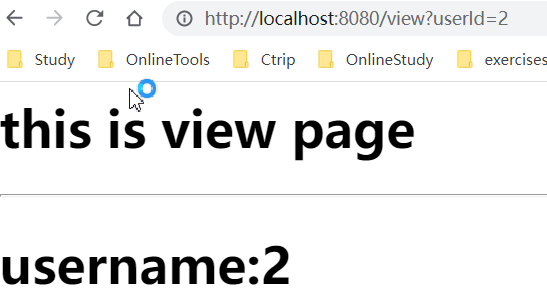

```
在view中返回map、list都是可行的，不仅只有对象：
Map<String, String> map=new HashMap<String, String>();
map.put("sex","男");
mav.addObject("map",map);

或者直接返回一个字符串也行：
mav.addObject("msg", "我要返回值");
```

可以通过此例子看出mvc的设计核心, 视图和模型的解耦, 通过ModelAndView对象把数据产生的过程和界面展现的过程做了解耦. 例如: 前端开发jsp, 后端开发Controller, 前端只需要知道u中有一个属性username即可, 不需要了解u是哪个表, 哪个类. 后端不关心前端的变化. 前后端只需要规定好名称和数据存放的地方, 别名. 数据之间解耦. 中间对象是ModelAndView, 承上启下. 数据的产生和页面展现解耦

### ModelAndView的核心用法

ModelAndView用来做数据和试图绑定

* mav.addObject()方法设置的属性默认存放在**当前请求**中. 用来设置页面要显示的数据是什么

* 默认ModelAndView使用请求转发(底层使用forward)至页面

* 页面重定向使用new ModelAndView("redirect:/index.jsp")

#### 请求转发和重定向

```java
@GetMapping("/view")
public ModelAndView showView(Integer userId) {
    // 文件名中的 / 说明要存储在webapp的根路径下
    ModelAndView modelAndView = new ModelAndView("/view.jsp");

    User user = new User();
    if (userId == 1) {
        user.setUsername("1");
    } else if (userId == 2) {
        user.setUsername("2");
    } else if (userId == 3) {
        user.setUsername("3");
    }

    // 在当前请求中增加对象, 别名u
    modelAndView.addObject("u", user);

    return modelAndView;
}
```


请求转发: 把当前给showView方法的请求, 原封不动地传递给view.jsp. 也即是说showView方法中的请求和view.jsp中使用的请求是同一个. mav.addObject()方法就是往当前请求中存放数据, 那么showView放入数据, jsp中提取数据

在浏览器中输入`http://localhost:8080/view?userId=2`可以看到输出的结果:

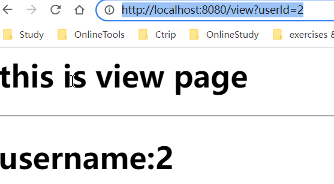

同时可以发现, url地址没有变化, 也就是说在Controller中的请求被转发到了jsp中, jsp和Controller共享一个request对象. 

此时在代码中修改, 在`/view.jsp`前添加`redirect:`(页面重定向)

```java
// ModelAndView modelAndView = new ModelAndView("/view.jsp");
ModelAndView modelAndView = new ModelAndView("redirect:/view.jsp");
```

页面重定向: 通知浏览器建立一个新的请求

还是一样的url:`http://localhost:8080/view?userId=2`回车后可以发现url修改为: `http://localhost:8080/view.jsp`

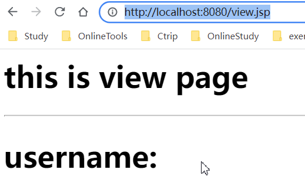

页面重定向后, 地址变成了`http://localhost:8080/view.jsp`

请求转发是Controller共享一个request请求对象

页面重定向是Controller通知客户端浏览器重新建立一个新的请求来访问view.jsp这个地址. 额外创建了一个请求, view.jsp. 因为在mav.addObject()中数据默认都会存放到当前的请求中, 但是页面重定向跳转后, 包含数据的请求被清空了, 取而代之的是跳转至view.jsp的新请求, 新请求中并没有之前的数据.

---

#### 那么重定向什么时候使用?

跳转的view和当前Controller处理关系不紧密的时候, 例如注册之后完了之后回到首页, 首页和注册功能关系不大, 所以注册完成后就可以在mav中使用redirect:

---

#### 页面地址的细节

创建的时候也可以无需设置访问地址, 使用`modelAndView.setViewName()`来进行设置访问的页面, 更加灵活

```java
modelAndView.setViewName("/view.jsp");
modelAndView.setViewName("view.jsp");
```

两者的区别:

没有/就是相对路径, 相对于当前访问地址的路径, 如果类上添加@RequestMapping("/um"), 那么地址就是在webapp下新建um下的view.jsp文件. 指定的url前缀也要在webapp中有目录

建议使用绝对路径

```java
ModelAndView modelAndView = new ModelAndView();
modelAndView.setViewName("view.jsp");
```

jsp的文件路径:src/main/webapp/um/view.jsp 
```jsp
<%--
  Created by IntelliJ IDEA.
  User:
  Date: 2021/12/31
  Time: 19:32
  To change this template use File | Settings | File Templates.
--%>
<%@ page contentType="text/html;charset=UTF-8" language="java" %>
<html>
<head>
    <title>Title</title>
</head>
<body>
<h1>this is view page(/um/view)</h1>
<hr>
<h1>username:${u.username}</h1>
</body>
</html>
```

可以发现访问到了:

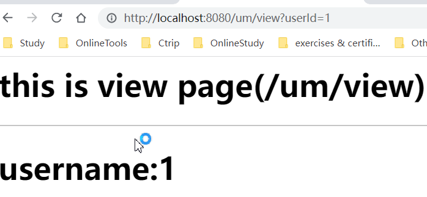

### String和ModelMap

使用ModelMap对应模型数据, 向里面设置值, 给页面提供数据

直接返回String.

就是把ModelAndView拆分成两个对象, 分别存储 -> 实际使用很常见

```java
/**
     * String 和 ModelMap
     */
public String showView1(Integer userId, ModelMap modelMap) {
    String view = "/um/view.jsp";
    User user = new User();
    if (userId == 1) {
        user.setUsername("1");
    } else if (userId == 2) {
        user.setUsername("2");
    } else if (userId == 3) {
        user.setUsername("3");
    }
    modelMap.addAttribute("u", user);
    return view;
}
```

ModelMap不是必须的, 在很多场景下不需要给指定试图添加数据

---

Controller方法返回string的情况

1.方法被@ResponseBody描述，SpringMVC直接响应String字符串本身

2.方法不存在@ResponseBody,则SpringMVC处理String指代的视图（页面）

## SpringMVC整合Freemarker

SpringMVC默认使用JSP作为模板引擎

1. pom依赖: freemarker和spring上下文支持包

```xml
<!-- freemarker引入依赖 spring上下文支持依赖-->
<dependency>
    <groupId>org.freemarker</groupId>
    <artifactId>freemarker</artifactId>
    <version>2.3.28</version>
</dependency>
<dependency>
    <groupId>org.springframework</groupId>
    <artifactId>spring-context-support</artifactId>
    <version>5.1.9.RELEASE</version>
</dependency>
```

2. 通知Spring使用freemarker模板引擎

applicationContext中:

```xml
<!-- freemarker -->
<bean id="ViewResolver" class="org.springframework.web.servlet.view.freemarker.FreeMarkerViewResolver">
    <!--设置响应输出，并解决中文乱码-->
    <property name="contentType" value="text/html;charset=utf-8"/>
    <!--指定Freemarker模板文件扩展名, 后续就不需要写扩展名了, suffix: 后缀-->
    <property name="suffix" value=".ftl"/>
</bean>
```

3. 配置Freemarker参数

freemarker本身相关的设置

```xml
<!--配置Freemarker参数-->
<bean id="freemarkerConfig" class="org.springframework.web.servlet.view.freemarker.FreeMarkerConfigurer">
    <!--设置模板保存的目录-->
    <property name="templateLoaderPath" value="/WEB-INF/ftl"/>
    <!--其他模板引擎设置-->
    <property name="freemarkerSettings">
        <props>
            <!--设置Freemarker脚本与数据渲染时使用的字符集-->
            <prop key="defaultEncoding">UTF-8</prop>
        </props>
    </property>
</bean>
```

注意2, 3中的UTF-8作用的时机不一样

tomcat无法直接解析freemarker引擎, 不像jsp, 为了保证模板的安全, 模板文件存放在无法从外侧直接访问的WEB_INF目录中, 通常又会新增一个ftl目录

4. 代码

```java
@GetMapping("/test")
public ModelAndView showTest() {
    // 因为配置了扩展名，所以不需要写完整名
    // /:代表根目录, 是配置了的/WEB-INF/ftl目录
    ModelAndView modelAndView = new ModelAndView("/test");

    User user = new User();
    user.setUsername("wahaha");
    modelAndView.addObject("u", user);
    return modelAndView;
}
```

```
<h1>${u.username}</h1>
```

5. pom中新增了依赖, 但是需要手动把依赖的jar包发布

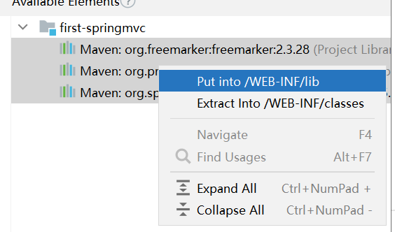

6. 访问

`http://localhost:8080/fm/test?userId=1`

查看输出:

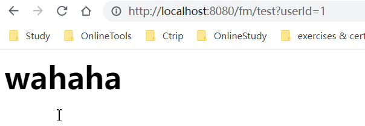

# RESTful

## 简介

### 传统web应用的问题

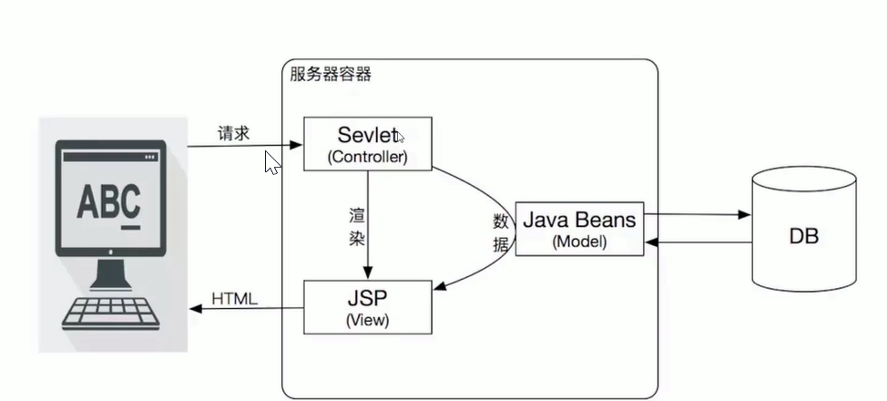

MVC结构, jsp返回的是html, 所以client也必须是支持html的浏览器, 那么其他的不支持html的客户端(微信小程序, app等), 我们也希望他可以通过html和后端来进行通信. -> 全新的理念RESTful开发风格

### REST和RESTful

REST是一种理念, 不是具体的实现

REST：表现层状态转移(Representational State Transfer), 资源在网络中以某种形式进行状态转移. 在web环境下以url的方式进行资源的处理. 例如: 获取图片, 网页资源以url的方式. 访问图片的网址, 返回的就是图片, 访问css的网址, 返回的就是css.

RESTful: 基于REST理念的一套开发风格，是具体的开发规则。

REST风格下, Client可以不是浏览器, 小程序, app等都可以. 

---

client和server的交互例子:

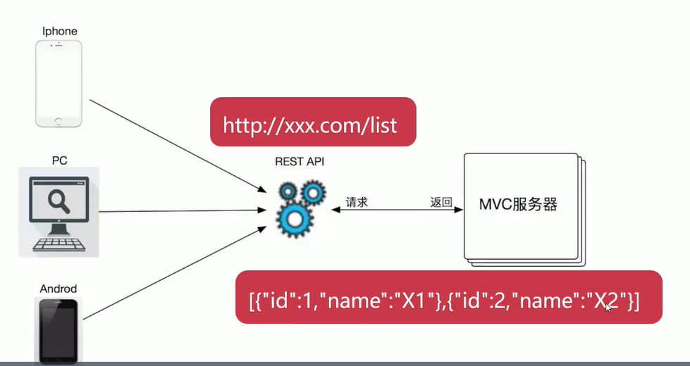

iphone中小程序向url(`http://xxx.com/list`)发送请求, 该请求发送到web的服务器上, 请求被处理后, 关键点在于Server返回的数据不再是html文本, 而是json或者xml格式数据.

RESTful最典型的特征就是Server只返回数据, 数据以json或xml方式来体现, 同时返回的数据不包含任何与展示的相关的内容. 数据送回client之后, 由client来做数据的渲染展现, 例如pc是完整表格, app是滑动列表. 具体的展现是client的事情, server不关心前端的来源是app还是小程序等等, 只关注数据本身即可, 不关心数据以什么方式显现. -> **前后端分离**. 前后端工程师约定好开发的格式和url, 同时开发

### RESTful开发规范

* 使用URL作为用户交互入口
* 明确的语义规范(GET|POST|PUT|DELETE). 在web环境下, 只支持get和post不支持put和delete. 所以只在浏览器写代码是没有后两种的, **get: 查询, post: 新增, put: 更新, delete: 删除**. 所以同一个url在向Server发送请求时, 不同的请求方式, 在Server的处理也不一样.  
* 只返回数据(JSON|XML), 不包含任何展现. 优先json

### RESTful命名要求

| URI(url去掉域名)<br />统一资源标识符 | 说明                                     |  修改建议               |
| ---------------------- | -------------------------------------------- | ------------------- |
| GET /articles?au=lily  | 正确用法 |                                              |
| GET /a/1               | URI必须具语义                       | GET /student/1                               |
| POST /createArticle/1  | URI必须使用名词                     | POST /article/1                              |
| GET /articles/author/1 | URI扁平化，不超两级. <br />id参数化, 同时这里查询的是<br />author的id. 就近 | GET /articles/author?id=1                    |
| DELETE /articles/1     | URI名词区分单复数 | GET /articles?au=lily<br />DELETE /article/1 |

这里的1是什么意思? RESTful的特殊写法, 把id号附在uri中, 向Server查询id为1的学生信息

## 开发RESTful web应用

### 基础RESTful

新建restful项目, 将工程设置为web开发(配置facets), 并添加mvc基础配置

web.xml

```xml
<?xml version="1.0" encoding="UTF-8"?>
<web-app xmlns="http://xmlns.jcp.org/xml/ns/javaee"
         xmlns:xsi="http://www.w3.org/2001/XMLSchema-instance"
         xsi:schemaLocation="http://xmlns.jcp.org/xml/ns/javaee http://xmlns.jcp.org/xml/ns/javaee/web-app_3_1.xsd"
         version="3.1">
    
    <servlet>
        <servlet-name>springmvc</servlet-name>
        <servlet-class>org.springframework.web.servlet.DispatcherServlet</servlet-class>

        <init-param>
            <param-name>contextConfigLocation</param-name>
            <param-value>classpath:applicationContext.xml</param-value>
        </init-param>

        <load-on-startup>0</load-on-startup>
    </servlet>

    <servlet-mapping>
        <servlet-name>springmvc</servlet-name>
        <url-pattern>/</url-pattern>
    </servlet-mapping>
    
    <!-- 执行顺序上, CharacterEncodingFilter优先于DispatcherServlet执行 -->
    <filter>
        <filter-name>characterFilter</filter-name>
        <filter-class>org.springframework.web.filter.CharacterEncodingFilter</filter-class>
        <init-param>
            <param-name>encoding</param-name>
            <param-value>UTF-8</param-value>
        </init-param>
    </filter>
    <filter-mapping>
        <filter-name>characterFilter</filter-name>
        <url-pattern>/*</url-pattern>
    </filter-mapping>
</web-app>
```

applicationContext.xml

```xml
<?xml version="1.0" encoding="UTF-8"?>
<beans xmlns="http://www.springframework.org/schema/beans"
       xmlns:xsi="http://www.w3.org/2001/XMLSchema-instance"
       xmlns:context="http://www.springframework.org/schema/context"
       xmlns:mvc="http://www.springframework.org/schema/mvc"
       xsi:schemaLocation="
        http://www.springframework.org/schema/beans
        https://www.springframework.org/schema/beans/spring-beans.xsd
        http://www.springframework.org/schema/context
        https://www.springframework.org/schema/context/spring-context.xsd
        http://www.springframework.org/schema/mvc
        https://www.springframework.org/schema/mvc/spring-mvc.xsd">
    
    <context:component-scan base-package="com.imooc.restful"/>

    <mvc:annotation-driven>
        <mvc:message-converters>
            <bean class="org.springframework.http.converter.StringHttpMessageConverter">
                <property name="supportedMediaTypes">
                    <list>
                        <value>text/html;charset=UTF-8</value>
                    </list>
                </property>
            </bean>
        </mvc:message-converters>
    </mvc:annotation-driven>

    <mvc:default-servlet-handler/>
</beans>
```

启动的时候发现报错:

```
02-Jan-2022 14:06:01.829 涓ラ噸 [RMI TCP Connection(3)-127.0.0.1] org.apache.catalina.core.StandardContext.filterStart Exception starting filter [characterFilter]
 java.lang.ClassNotFoundException: org.springframework.web.filter.CharacterEncodingFilter
```

类找不到的错误, 一般是没有引入依赖, 原因是需要手动添加web的依赖. pom添加的依赖不会自动加入发布包中, 需要手动加入

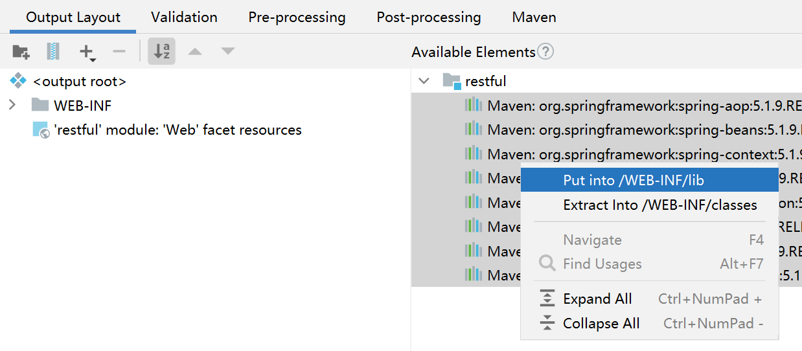

---

REST一种风格, 不是什么新技术

* 要求URL中所有的都是名词

* return返回的数据要求是json或者xml格式

新增controller类

```java
package com.imooc.restful.controller;

@Controller
@RequestMapping("restful")
public class RestfulController {
    @GetMapping("/request")
    @ResponseBody
    public String doGetRequest() {
        //使用\原义输出
        return "{\"message\":\"返回查询结果\"}";
    }
}
```

然后浏览器访问`http://localhost:8080/restful/request`

得到json(JSONVue美化后结果) -> 这就是一个RESTful风格的例子

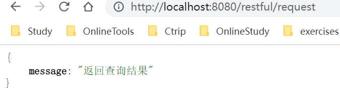

json格式字符串本身放在浏览器中咩有什么用, 本质上来说, 直接访问url返回的时候不会做直接做展示, 需要客户端的支持(app, 小程序等)提供与url交互的功能, -> Ajax, 在页面中异步地向url发送请求, 返回相应结果

### Client与Server的RESTful交互

#### 基础的前后端分离

复制`jquery-3.3.1.min.js`到webapp目录与out目录下(`restful\out\artifacts\restful_Web_exploded`), 使用Ajax函数向controller发送http请求

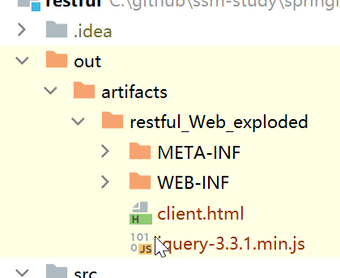

新增client.html, 发布异步请求

```html
<!DOCTYPE html>
<html lang="en">
<head>
    <meta charset="UTF-8">
    <title>restful实验室</title>
    <script src="jquery-3.3.1.min.js"></script>
    <script>
        $(function() {
            $("#btnGet").click(function() {
                $.ajax({
                    url: "/restful/request",
                    type: "get",
                    dataType: "json",
                    // 成功返回
                    success: function (json) {
                        $("#message").text(json.message);
                    }
                })
            })
        })
    </script>
</head>
<body>
<input type="button" id="btnGet" value="send get request">
<h1 id="message"></h1>
</body>
</html>
```

浏览器访问`http://localhost:8080/client.html`

可以看到输出返回

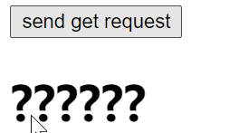


一堆问号, 查看网路请求, 响应请求头，发现采用不正确的字符集。

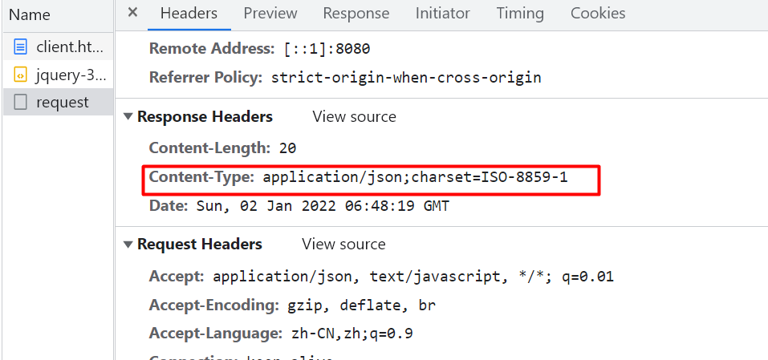

可以看到contextType是:application/json的字符集不支持, 所以需要进行修改

在applicationContext.xml中修改

```xml
<mvc:annotation-driven>
        <mvc:message-converters>
            <bean class="org.springframework.http.converter.StringHttpMessageConverter">
                <property name="supportedMediaTypes">
                    <list>
                        <value>text/html;charset=UTF-8</value>
                        
                        <!--通知浏览器以这种格式加载数据-->
                        <value>application/json;charset=UTF-8</value>
                    </list>
                </property>
            </bean>
        </mvc:message-converters>
    </mvc:annotation-driven>
```

再次测试可见中文正常显示

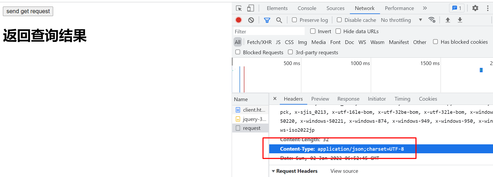

使用Ajax函数, 模拟html5客户端向服务器发送请求的过程

本质上, 小程序app等也都是向Server发送http请求. 只不过app和小程序有自己的函数来发送, 而不是Ajax. 对于Server的程序处理, 不关心是什么client, 都返回相同的数据, 数据的展现由client处理 

-> 前后端分离最基础的实现

#### 不同类型的请求

RESTful针对不同类型的请求做不同的操作

get: 查询, post: 新增, put: 更新, delete: 删除

1. 增加不同类型的请求, url一样, 只是请求方式不一样

```java
package com.imooc.restful.controller;
import org.springframework.stereotype.Controller;
import org.springframework.web.bind.annotation.*;
@Controller
@RequestMapping("restful")
public class RestfulController {
    @GetMapping("/request")
    @ResponseBody
    public String doGetRequest() {

        //使用\原义输出
        return "{\"message\":\"返回查询结果\"}";
    }

    @PostMapping("/request")
    @ResponseBody
    public String doPostRequest() {
        return "{\"message\":\"数据新建成功\"}";
    }

    @PutMapping("/request")
    @ResponseBody
    public String doPutRequest() {
        return "{\"message\":\"数据更新成功\"}";
    }

    @DeleteMapping("/request")
    @ResponseBody
    public String doDeleteRequest() {
        return "{\"message\":\"数据删除成功\"}";
    }
}
```

2. Ajax中发送请求

Ajax中type参数来说明发送什么请求

```html
<!DOCTYPE html>
<html lang="en">
<head>
    <meta charset="UTF-8">
    <title>restful实验室</title>
    <script src="jquery-3.3.1.min.js"></script>
    <script>
        // get
        $(function () {
            $("#btnGet").click(function () {
                $.ajax({
                    url: "/restful/request",
                    type: "get",
                    dataType: "json",
                    success: function (json) {
                        $("#message").text(json.message);
                    }
                })
            })

        })

        // post
        $(function () {
            $("#btnPost").click(function () {
                $.ajax({
                    url: "/restful/request",
                    type: "post",
                    dataType: "json",
                    success: function (json){
                        $("#message").text(json.message);
                    }
                })
            })
        })

        // put
        $(function () {
            $("#btnPut").click(function () {
                $.ajax({
                    url: "/restful/request",
                    type: "put",
                    dataType: "json",
                    success: function (json){
                        $("#message").text(json.message);
                    }
                })
            })
        })

        // delete
        $(function () {
            $("#btnDel").click(function () {
                $.ajax({
                    url: "/restful/request",
                    type: "delete",
                    dataType: "json",
                    success: function (json){
                        $("#message").text(json.message);
                    }
                })
            })
        })
    </script>
</head>
<body>
<input type="button" id="btnGet" value="send get request">
<input type="button" id="btnPost" value="send post request">
<input type="button" id="btnPut" value="send put request">
<input type="button" id="btnDel" value="send delete request">
<h1 id="message"></h1>
</body>
</html>
```

请求类型不一样, 处理结果也不一样

3. 测试

浏览器访问`http://localhost:8080/client.html`, 点击不同的button发送不同类型请求

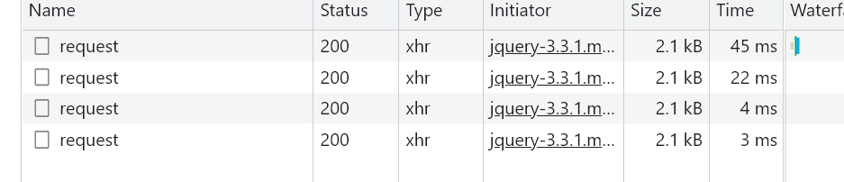

---

* 程序的问题

1. 返回值是新建json字符串方式, 如果是大对象, 很麻烦 -> 要优化
2. 每个方法都使用注解@ResponseBody, 说明返回字符串,  -> 可以不需要这么麻烦
3. 例如`/request/1`的请求, 如何获取url中的数据

以上的问题, 使用RESTful的简单开发技巧: @RestController和路径变量

### @RestController

每次书写方法后, 都需要添加注解@ResponseBody表示返回字符串输出到响应, 每个都要添加很麻烦

-> jdk1.4后提供新的Controller注解: @RestController, 表示默认当前类的方法返回的都是REST形式的数据, 而不是页面的跳转

```java
package com.imooc.restful.controller;
import org.springframework.web.bind.annotation.*;
@RestController
@RequestMapping("restful")
public class RestfulController {
    @GetMapping("/request")
    // @ResponseBody
    public String doGetRequest() {

        //使用\原义输出
        return "{\"message\":\"返回查询结果\"}";
    }
    @PostMapping("/request")
    // @ResponseBody
    public String doPostRequest() {
        return "{\"message\":\"数据新建成功\"}";
    }
    @PutMapping("/request")
    // @ResponseBody
    public String doPutRequest() {
        return "{\"message\":\"数据更新成功\"}";
    }
    @DeleteMapping("/request")
    // @ResponseBody
    public String doDeleteRequest() {
        return "{\"message\":\"数据删除成功\"}";
    }
}
```

### 路径变量

例如:`POST /article/1`, `POST /restful/request/100`

放在uri中的变量就被称为路径变量.

这里的1, 100, 不是参数而是URI的一部分, 要如何接收?

-> springmvc提供的路径变量: 

1. 方法前添加注解@PostMapping("/request/{rid}")
2. 方法参数前添加注解@PathVariable("rid"). 只要能匹配上, rid的数值就会自动注入到requestId参数中

```java
@PostMapping("/request/{rid}")
public String doPostRequest(@PathVariable("rid") Integer requestId) {
    return "{\"message\":\"数据新建成功\", \"id\": "+requestId+"}";
}
```

3. client.html中添加变量

```html
// post
        $(function () {
            $("#btnPost").click(function () {
                $.ajax({
                    url: "/restful/request/100",
                    type: "post",
                    dataType: "json",
                    success: function (json) {
                        $("#message").text(json.message + ":" + json.id);
                    }
                })
            })
        })
```

4. 输出

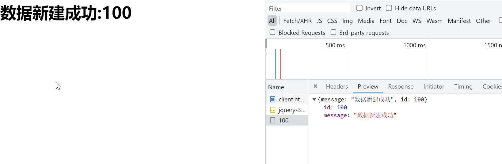

### 简单请求和非简单请求

* 简单请求是指标准结构的HTTP请求，对应GET/POST请求

* 非简单请求是复杂要求的HTTP请求，指PUT/DELETE、扩展标准请求
* 两者最大区别是非简单请求发送前需要发送预检请求

数据结构基本一致, 内容不同

预检请求: Server预先处理, 返回该请求能否被正常处理. 如果请求有问题, 就不会发送, 减轻网络传输压力

---

非简单请求的过程:

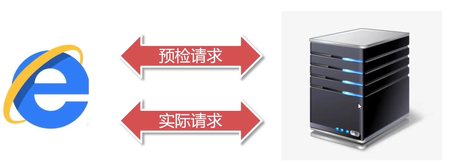

类比: 送快递, 打电话知道你在家, 我再送.

---

查看不同请求的, mvc处理异同

1. Ajax中的post和put请求分别添加data

```
// post
$(function () {
    $("#btnPost").click(function () {
        $.ajax({
            url: "/restful/request/100",
            type: "post",
            data: "name=lily&age=23",
            dataType: "json",
            success: function (json) {
                $("#message").text(json.message + ":" + json.id);
            }
        })
    })
})
// put
$(function () {
    $("#btnPut").click(function () {
        $.ajax({
            url: "/restful/request",
            type: "put",
            data: "name=lily&age=23",
            dataType: "json",
            success: function (json) {
                $("#message").text(json.message);
            }
        })
    })
})
```

2. 新增Person entity

```java
package com.imooc.restful.entity;
@Getter
@Setter
public class Person {
    private String name;
    private Integer age;
}
```

3. 修改Controller中的post和put方法, -> put的方法有问题后续修改

```java
@PostMapping("/request/{rid}")
// @ResponseBody
public String doPostRequest(@PathVariable("rid") Integer requestId, Person person) {
    System.out.println(person.getName() + ": " + person.getAge());
    return "{\"message\":\"数据新建成功\", \"id\": " + requestId + "}";
}

@PutMapping("/request")
// @ResponseBody
public String doPutRequest(Person person) {
    System.out.println(person.getName() + ": " + person.getAge());
    return "{\"message\":\"数据更新成功\"}";
}
```

在增加Person对象之后, mvc自动注入, put也按照post的方式直接书写

4. 运行

运行后发现, 

* post的请求正常

控制台输出: `lily: 23`, 

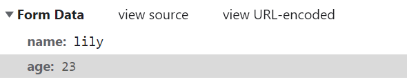

* put请求有问题

控制台输出: `null: null`, 注入失败.

这就是简单请求和非简单请求的区别了, 

5. 处理非简单请求

一开始的springmvc只支持get和post, 后续需要增加非简单请求, 不能修改源代码. 所以做了一个折中的方式. 

-> 对于put和delete非简单请求, springmvc提供额外的表单内容过滤器做处理.

web.xml中

```xml
<!-- 支持非简单请求, put和delete -->
<filter>
    <filter-name>formContentFilter</filter-name>
    <filter-class>org.springframework.web.filter.FormContentFilter</filter-class>
</filter>
<filter-mapping>
    <filter-name>formContentFilter</filter-name>
    <url-pattern>/*</url-pattern>
</filter-mapping>
```

增加后, 就可以支持put和delete非简单请求了

FormContentFilter是对springmvc能力的扩展

## JSON序列化

### 安全隐患

jackson2.9版本前有严重安全隐患, 与MySQL同时使用的时候漏洞会被黑客利用.

jackson必须使用2.9版本之后

---

### 引入步骤

1. 添加jackson依赖, 
   jackson-core, jackson-databind(jackson与目标对象交互的根源所在), jackson-annotations

```xml
<!-- jackson依赖 -->
<dependency>
    <groupId>com.fasterxml.jackson.core</groupId>
    <artifactId>jackson-core</artifactId>
    <version>2.9.9</version>
</dependency>
<dependency>
    <groupId>com.fasterxml.jackson.core</groupId>
    <artifactId>jackson-databind</artifactId>
    <version>2.9.9</version>
</dependency>
<dependency>
    <groupId>com.fasterxml.jackson.core</groupId>
    <artifactId>jackson-annotations</artifactId>
    <version>2.9.9</version>
</dependency>
```

spring非常智能，只要检查有jackson-core和jackson-databind这两个依赖包, 就会自动启用jackson为我们提供json序列化服务。

注意新增的依赖需要添加到web中

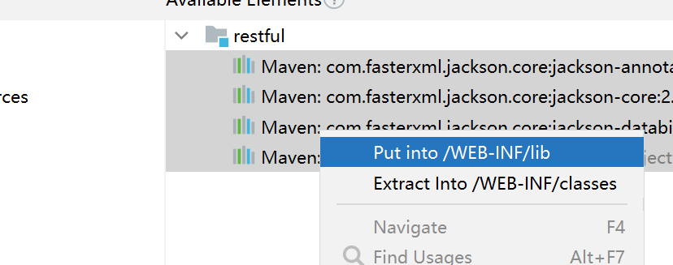

2. 书写java测试

```java
@GetMapping("/person")
public Person getPersonById(Integer id) {
    Person person = new Person();
    if (id == 1) {
        person.setName("1");
        person.setAge(11);
    } else if (id == 2) {
        person.setName("2");
        person.setAge(22);
    } else  {
        person.setName("3");
        person.setAge(33);
    }
    return person;
}
```

可以看到这里, 类上有注解@RestController, 理应返回json字符串, 但是这里直接返回person

**如果我们返回一个实体对象，并且配置了@RestController或者@ResponseBody，那么jackson就会自动提供序列化服务。**

3. 运行

浏览器访问:`http://localhost:8080/restful/person?id=1`

可以看到输出为:

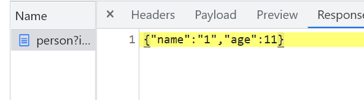


### 返回多个对象

返回多条数据, list集合

```java
@GetMapping("/persons")
public List<Person> getPersons() {
    List<Person> personList = new ArrayList<>();
    personList.add(new Person());
    personList.get(0).setName("zero");
    personList.get(0).setAge(10);
    personList.add(new Person());
    personList.get(1).setName("one");
    personList.get(1).setAge(11);
    personList.add(new Person());
    personList.get(2).setName("two");
    personList.get(2).setAge(12);

    return personList;
}
```

运行后返回数据:

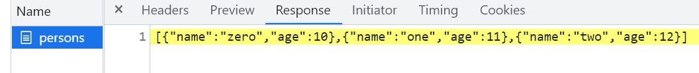

---

如何在Client使用提取该数据:

Ajax中交互

```
// persons info
        $(function () {
            $("#btnPersons").click(function () {
                $.ajax({
                    url: "/restful/persons",
                    type: "get",
                    dataType: "json",
                    success: function (json){
                        console.info(json);
                    }
                })
            })
        })
        
        
        
        <input type="button" id="btnPersons" value="get persons info">
```

浏览器中输出:

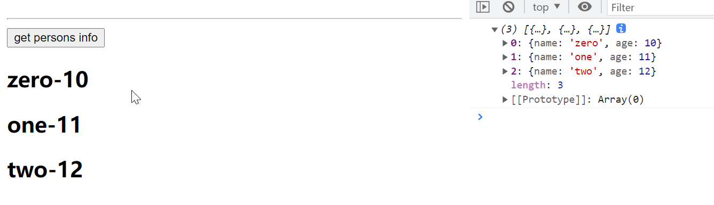

### jackson时间处理

jackson中时间处理并不理想, 需要.添加注解, 指定pattern和时区.

```
@JsonFormat(pattern = "yyyy-MM-dd HH:mm:ss", timezone = "GMT+8")
```

1. 添加日期属性:

```java
@Getter
@Setter
public class Person {
    private String name;
    private Integer age;
    private Date birthday;
}
```

2. 响应中添加日期属性

```java
// 多条数据json
@GetMapping("/persons")
public List<Person> getPersons() {
    List<Person> personList = new ArrayList<>();
    personList.add(new Person());
    personList.get(0).setName("zero");
    personList.get(0).setAge(10);
    personList.get(0).setBirthday(new Date());
    personList.add(new Person());
    personList.get(1).setName("one");
    personList.get(1).setAge(11);
    personList.get(1).setBirthday(new Date());
    personList.add(new Person());
    personList.get(2).setName("two");
    personList.get(2).setAge(12);
    personList.get(2).setBirthday(new Date());

    return personList;
}
```

3. Ajax中添加前台显示

```
$("#divPersons").append("<h2>" + p.name + "-" + p.age + "-" + p.birthday + "</h2>");
```

4. 查看前台对日期的显示

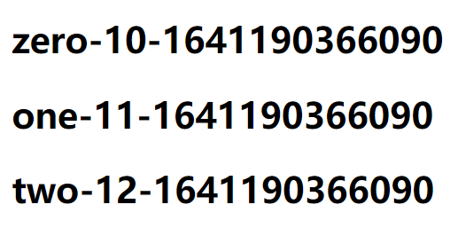

如果不做处理，就是直接返回事件戳的形式。从1970年到现在为止的毫秒数

所以要做处理, 添加注解@JsonFormat

5. 添加@JsonFormat(pattern = "yyyy-MM-dd HH:mm:ss")

```java
package com.imooc.restful.entity;
import com.fasterxml.jackson.annotation.JsonFormat;
import lombok.Getter;
import lombok.Setter;
import java.util.Date;

@Getter
@Setter
public class Person {
    private String name;
    private Integer age;

    @JsonFormat(pattern = "yyyy-MM-dd HH:mm:ss")
    private Date birthday;
}
```

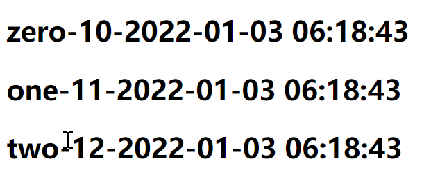

还有需要注意的是jackson默认使用格林时间，需要指定时区：

```java
@JsonFormat(pattern = "yyyy-MM-dd HH:mm:ss", timezone = "GMT+8")
private Date birthday;
```

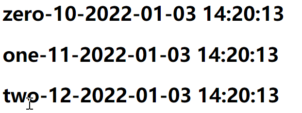

输出时间正常

## 浏览器的跨域访问

在RESTful中必须要考虑的问题, 跨域访问的根源来自于浏览器的同源策略

### 浏览器的同源策略

* 阻止从一个域加载的脚本去获取另一个域上的资源。
* 只要协议、域名、端口有任何不同，都被当做是不同的域。
* 浏览器Console看到Access-Control-Allow-Origin就代表跨域了。

两个网站A和B, 有不同的域名在不同的服务器上, 如果A的某个页面向B的某个url发送Ajax请求, 就会因为同源策略被阻止.

原因: 浏览器为了保证网站的安全. 如果没有同源策略的保护, 任何一个网站都可以向其他网站发送请求, 那么黑客就可以在自己网站的js中模拟10w个人发起Ajax请求, 另外的网站就会因为请求过多瘫痪. -> 同源策略对资源进行保护. 网站的页面或者请求, 只能获取同网站(也就是同域名)下的资源, 不能跨域名访问其他的资源

---

演示:

1. 模拟跨域

client.html和jQuery两个客户端资源复制到桌面

btnPersons中, 修改Ajax中请求的地址:

```
$(function () {
            $("#btnPersons").click(function () {
                $.ajax({
                    url: "http://localhost:8080/restful/persons",
                    ...
                        }
                    }
                })
            })
        })
```

2. chrome打开

此时浏览器地址栏的url: `file:///C:/Users/Admin/Desktop/client.html`, 并不是通过localhost访问的, 而是通过系统本地直接打开, 那么就和原始的localhost机器形成了跨域访问.

当点击btnPersons之后, 可以看到并没有返回.

F12查看

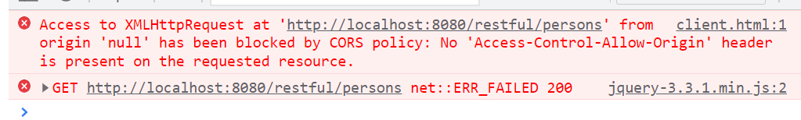

```
Access to XMLHttpRequest at 'http://localhost:8080/restful/persons' from origin 'null' has been blocked by CORS policy: No 'Access-Control-Allow-Origin' header is present on the requested resource.
```

发现当前访问的地址和浏览器中的域名不同, 错误, 浏览器只认识localhost域名下的某个页面发出的请求. 此时不符合同源策略

在RESTful请求中, 有很大程度需要跨域名访问, 例如: 气象局的天气数据, 购买了服务的门户网站通过浏览器访问的时候, 不会在同一个域名下, 需要做额外的设置. 否则即使数据可以被访问, client门户这边也无法做处理. 

-> 解决方法: Access-Control-Allow-Origin中设置跨域访问的范围, 可以决定某些域名访问服务 

-> Spring mvc中的跨域访问

---

同源策略示例:

| 源URL              | 目标URL                      | 直接访问？                           |
| ------------------ | ---------------------------- | ------------------------------------ |
| `http://imooc.com` | `https://xxx.com:8080/test`  | 不能. 域名, 端口, 协议都不同         |
| `http://imooc.com` | `https://imooc.com`          | 不能. 协议不同                       |
| `http://imooc.com` | `http://abc.imooc.com`       | 不能. 域名不同                       |
| `http://imooc.com` | `http://imooc.com:8080`      | 不能. 端口不同, 默认是80, 目标是8080 |
| `http://localhost` | `http://127.0.0.1`           | 不能. 特例, 虽然系统侧面都是本机     |
| `http://imooc.com` | `http://imooc.com/user/test` | 能. 后面uri有几个层级不影响          |

---

* HTML中允许跨域的标签：

`` : 显式远程图片

`<script>` : 加载远程JS, 加载指定url的js脚本

`<link>` : 加载远程CSS

### SpringMVC解决跨域

#### CORS

CORS(Cross-origin resource sharing, 跨域资源访问): 

* CORS是一种机制，使用额外的HTTP头通知浏览器访问其他域。

* URL响应头中包含Access-Control-*指明请求允许跨域。

---

SpringMVC中两种方法解决跨域: 

* @CrossOrigin - Controller跨域注解, 当前Controller映射的url可以被跨域访问. 局部处理, 当前controller生效

* `<mvc:cors>` : Spring MVC全局跨域配置

---

使用8080端口和8081端口两个不同的项目来做跨域请求, 做演示

前置设置: 复制另外一个项目, restful_8081, 并做修改

1. 配置web

与之前一样:

* 添加web

* 配置Web Module Deployment Descriptor

* 配置Web Resource Directory

2. 修改tomcat中配置

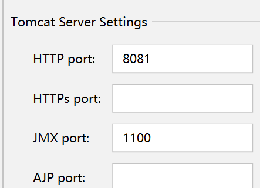

* 端口修改
* deployment中配置对应的facets, 然后修改Application context为`/`
* 添加依赖

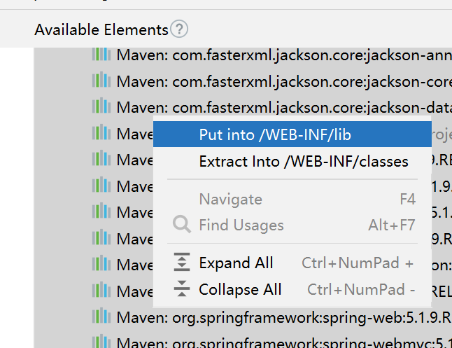

3. client.html中修改persons中的Ajax跨域请求

```
// persons info
$(function () {
    $("#btnPersons").click(function () {
        $.ajax({
            url: "http://localhost:8081/restful/persons",
            type: "get",
            dataType: "json",
            success: function (json) {
                console.info(json);
                for (var i = 0; i < json.length; i++) {
                    var p = json[i];
                    $("#divPersons").append("<h2>" + p.name + "-" + p.age + "-" + p.birthday + "</h2>");
                }
            }
        })
    })
})
```

此时点击按钮可以看到错误:

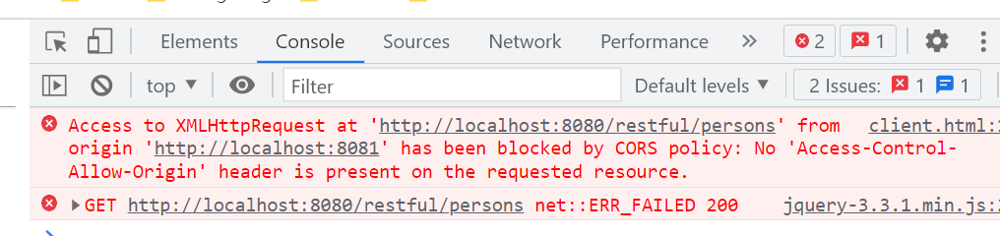

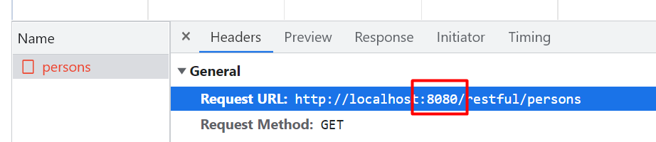

8081端口向8080端口发送跨域请求

```
Access to XMLHttpRequest at 'http://localhost:8080/restful/persons' from origin 'http://localhost:8081' has been blocked by CORS policy: No 'Access-Control-Allow-Origin' header is present on the requested resource.
```

解决: 在controller上声明跨域的注解即可

#### @CrossOrigin

1. 8080工程中Controller类中添加注解@CrossOrigin

`@CrossOrigin(origins = {"http://localhost:8081"})`

```java
@RestController
@RequestMapping("restful")
@CrossOrigin(origins = {"http://localhost:8081"})
public class RestfulController {}
```

2. 重启

重新访问, 可以看到结果显示

从8081访问8080

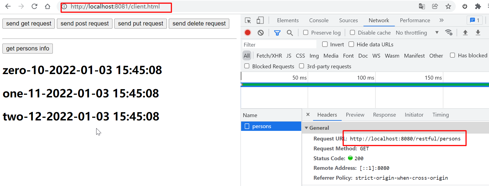

---

为什么添加注解就可以了

* 查看RequestHeader, 如果是跨域访问, 就会有`Sec-Fetch-Mode: cors`, 数据获取的模式CORS, 代表跨域访问, 说明当前的请求需要跨域访问

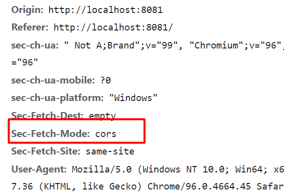

* 查看ResponseHeader, 因为添加了响应的注解, 通过Vary响应头设置跨域访问的权限, 其实添加了注解后, 本质就是添加了该信息. 
  Access-Control-Request-Method
  Access-Control-Request-Headers
  当这些响应头送达到客户端浏览器时, 说明远程url允许访问资源, 浏览器正常显示结果. 如果没有这些响应头, 即使后来network中得到了信息, 浏览器也不会显示结果, 不会做解析.


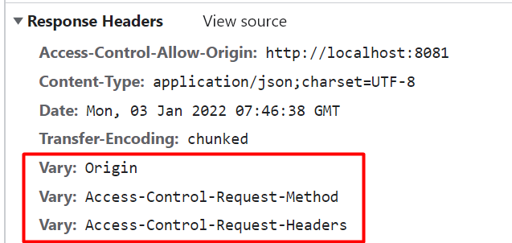

---

多个域名需要跨域授权:

* 在注解中添加即可

```java
@CrossOrigin(origins = {"http://localhost:8081", "http://www.imooc.com"})
```

* 偷懒的方法, 不推荐使用

```java
@CrossOrigin(origins = "*")
```

任何人都可以发送请求

---

CrossOrigin中maxAge参数: 设置预检请求的缓存时间3600s 

对于非简单请求来说

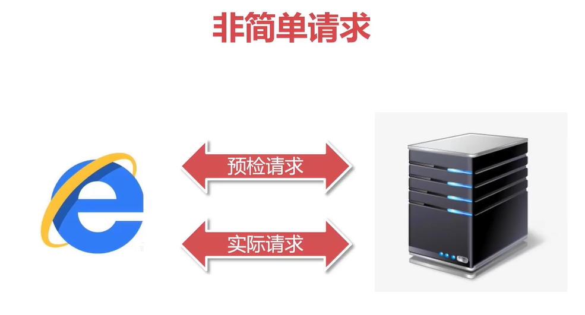

可以将预检请求的结果进行缓存, 在设置时间内同样的请求过来就不需要再做预检处理, 直接发送实际请求. 降低Server压力.

注意maxAge不是缓存请求的内容, 而是对于预检请求的处理结果进行缓存.

#### `<mvc:cors>`: CORS全局设置

applicationContext中配置

```xml
<mvc:cors>
    <!-- path: 当前应用的url地址, 哪一个路径允许跨域访问-->
    <!-- allowed-origins: 哪些域名允许进行跨域访问 -->
    <!-- 预检请求的缓存时间 -->

    <mvc:mapping
                 path="/restful/**"
                 allowed-origins="http://localhost:8081, www.imooc.com"
                 max-age="3600"/>
</mvc:cors>
```

如果既配置了全局的有配置了注解的, 以注解为准

---

注意, CORS跨域资源访问只是在浏览器中的安全策略, 如果是app或者小程序等, 上面的安全策略都不生效.

# SpringMVC拦截器

-> 与过滤器filter有相似, 都是对请求的拦截. 但是底层实现逻辑不一样

## Interceptor拦截器

* 拦截器(Interceptor)用于对URL请求进行前置/后置过滤。

* Interceptor与Filter用途相似(对于请求的拦截), 但实现方式不同。

    * Interceptor是SpringMVC的标准组件, Interceptor在被创建之后是天然运行在IOC容器之中的。

    * Filter是J2EE的标准组件，不同的Filter是由不同的容器厂商所实现的。

* Interceptor底层就是基于SpringAOP面向切面编程实现。与环绕通知很相似

## 拦截器开发流程

* Maven依赖servlet-api, 底层依赖j2e的servlet (scope是provided)

* 实现HandlerInterceptor接口

* applicationContext.xml拦截器配置

---

1. pom添加依赖

```xml
<!-- 拦截器 -->
<dependency>
    <groupId>javax.servlet</groupId>
    <artifactId>javax.servlet-api</artifactId>
    <version>3.1.0</version>
    <!--防止servlet自带api与tomcat配置的api相互冲突-->
    <!--provided意味着只有在开发编译才会进行引用-->
    <scope>provided</scope>
</dependency>
```

最终的tomcat运行环境自带servlet-api jar包, 如果在程序打包发布的时候将当前的依赖也放入了war包, 可能造成工程中的servlet-api与tomcat自带的api版本冲突, 增加风险

这里添加了`<scope>provided</scope>`, 含义是只有在开发编译的时候才会进行引用, 打包最终使用的时候该jar会被排除

2. 新增MyInterceptor

拦截器必须实现HandlerInterceptor接口, 同时必须实现以下三个方法:

* preHandler: 前置执行处理. 请求产生后, 还没有进入controller前, 先进preHandler, 对请求进行预置处理.

* postHandle: 目标资源已被SpringMVC框架处理. 例子: 如果是在controller, 就是在内部方法return之后，但是还没有产生响应文本之前, 执行posthandler. -> 目标资源已被处理, 但还没有产生响应文本

* afterCompletion: 响应文本已经产生了, 执行afterCompletion. 比如在jackson自动实现序列化之后. 例如: 返回modelandview, 数据和模板引擎混合, 产生html片段, afterCompletion就会执行.

preHandler: 必须返回布尔值，true请求会继续向后方(拦截器或者控制器)传递; false请求被阻止，直接返回响应给client.

`request.getRequestURL()`: 获取当前的URL地址, 之前pom引入的依赖就是在这里使用, 参数都是指向了原生的Servletrequest和response对象, 不引入依赖的话就会报依赖的错误

```java
package com.imooc.restful.interceptor;

import org.springframework.web.servlet.HandlerInterceptor;
import org.springframework.web.servlet.ModelAndView;

import javax.servlet.http.HttpServletRequest;
import javax.servlet.http.HttpServletResponse;

/**
 * 拦截器必须实现HandlerInterceptor接口, 同时必须实现以下三个方法:
 * <p>
 * * preHandler: 前置执行处理. 请求产生后,
 * 还没有进入controller前, 先进preHandler, 对请求进行预置处理.
 * <p>
 * * postHandle: 目标资源已被SpringMVC框架处理. 例子:
 * 如果是在controller, 就是在内部方法return之后，但是还没有产生响应文本之前, 执行posthandler.
 * <p>
 * * afterCompletion: 响应文本已经产生了, 执行afterCompletion.
 * 比如在jackson自动实现序列化之后.
 * 例如: 返回modelandview, 数据和模板引擎混合, 产生html片段, afterCompletion就会执行.
 */
public class MyInterceptor implements HandlerInterceptor {
    @Override
    public boolean preHandle(HttpServletRequest request, HttpServletResponse response, Object handler) throws Exception {
        System.out.println("preHandle: " + request.getRequestURL());
        return true;
        // return HandlerInterceptor.super.preHandle(request, response, handler);
    }

    @Override
    public void postHandle(HttpServletRequest request, HttpServletResponse response, Object handler, ModelAndView modelAndView) throws Exception {
        System.out.println("postHandler: " + request.getRequestURI());

        // HandlerInterceptor.super.postHandle(request, response, handler, modelAndView);
    }

    @Override
    public void afterCompletion(HttpServletRequest request, HttpServletResponse response, Object handler, Exception ex) throws Exception {
        System.out.println("afterCompletion: " + request.getRequestURI());
        // HandlerInterceptor.super.afterCompletion(request, response, handler, ex);
    }
}
```

3. applicationContext配置

```xml
<mvc:interceptors>
    <mvc:interceptor>
        <!-- 对哪些URL进行拦截 -->
        <!-- /**: 对所有请求进行拦截, 被拦截的请求会送到MyInterceptor -->
        <mvc:mapping path="/**"/>
        <!-- 拦截之后使用哪个class进行处理 -->
        <bean class="com.imooc.restful.interceptor.MyInterceptor"/>
    </mvc:interceptor>
</mvc:interceptors>
```

 /**: 对所有请求进行拦截.  被拦截的请求会送到MyInterceptor

4. 测试

在Controller中添加输出:

```java
@GetMapping("/persons")
public List<Person> getPersons() {
    List<Person> personList = new ArrayList<>();
    personList.add(new Person());
    personList.get(0).setName("zero");
    personList.get(0).setAge(10);
    personList.get(0).setBirthday(new Date());
    personList.add(new Person());
    personList.get(1).setName("one");
    personList.get(1).setAge(11);
    personList.get(1).setBirthday(new Date());
    personList.add(new Person());
    personList.get(2).setName("two");
    personList.get(2).setAge(12);
    personList.get(2).setBirthday(new Date());
    System.out.println("RestfulController getPersons");
    return personList;
}
```

---

访问: `http://localhost:8080/restful/persons`, 查看输出

```
preHandle: http://localhost:8080/restful/persons-准备执行
RestfulController getPersons
postHandler: /restful/persons-处理成功
afterCompletion: /restful/persons-响应内容已产生
```

RestfulController getPersons的输出可以看到postHandler的输出时机: 如果是在controller, 就是在内部方法return之后，但是还没有产生响应文本之前, 执行posthandler

## 拦截器使用细则

### 排除对静态资源的拦截

直接访问`http://localhost:8080/client.html`, 后台输出:

```
preHandle: http://localhost:8080/client.html-准备执行
postHandler: /client.html-处理成功
afterCompletion: /client.html-响应内容已产生
preHandle: http://localhost:8080/jquery-3.3.1.min.js-准备执行
postHandler: /jquery-3.3.1.min.js-处理成功
afterCompletion: /jquery-3.3.1.min.js-响应内容已产生
```

输入的是html, 但是打印了许多额外的信息. 对于client.html, 每一个发送localhost url的时候, 本质都是通过tomcat调用springmvc的解析功能来获取对应的资源, 这些资源因为符合之前配置的`/**`的规则, 都会被拦截.

疑问, 因为之前配置了静态资源排除在外. 可以看到静态资源还是被拦截了, 

```xml
<mvc:default-servlet-handler/>
```

注意, 拦截器是不受该影响, 只要符合配置的url规则, 都会被处理(preHandler, postHandler, afterCompletion).

但是大多数情况下, 并不希望对这些静态资源做处理, 添加配置排除: `<mvc:exclude-mapping path="/**.ico"/>`

```xml
<mvc:interceptors>
    <mvc:interceptor>
        <!-- 对哪些URL进行拦截 -->
        <!-- /**: 所有请求 -->
        <mvc:mapping path="/**"/>
        <!-- 要排除的地址有哪些 -->
        <mvc:exclude-mapping path="/**.ico"/>
        <mvc:exclude-mapping path="/**.jpg"/>
        <mvc:exclude-mapping path="/**.gif"/>
        <mvc:exclude-mapping path="/**.js"/>
        <mvc:exclude-mapping path="/**.css"/>

        <!-- 拦截之后使用哪个class进行处理 -->
        <bean class="com.imooc.restful.interceptor.MyInterceptor"/>
    </mvc:interceptor>
</mvc:interceptors>
```

之后就只对html做拦截:

```
preHandle: http://localhost:8080/client.html-准备执行
postHandler: /client.html-处理成功
afterCompletion: /client.html-响应内容已产生
```

---

`mvc:exclude-mapping`的配置方式有一点不好, 实际开发过程中, 静态资源很多, 要把静态资源和controller做区分.

-> 实际开发中: 将所有静态文件不直接放在webapp的根目录下, 而是全部放在webapp一个子目录下，这样拦截目录即可：

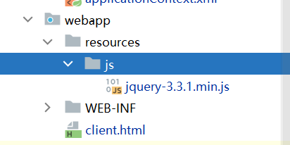

将静态资源区分保存. 然后配置目录即可

```xml
<mvc:exclude-mapping path="/resources/**"/>
```

也可以针对某个uri的请求进行拦截

```xml
<mvc:mapping path="/restful/**"/>
```

如果有多个uri需要做拦截, 可以配置多条

```xml
<mvc:interceptors>
    <mvc:interceptor>
        <!-- 对哪些URL进行拦截 -->
        <!-- /**: 所有请求 -->
        <mvc:mapping path="/**"/>
        <mvc:mapping path="/restful/**"/>
        <mvc:mapping path="/webapi/**"/>
        <!-- 要排除的地址有哪些 -->
        <mvc:exclude-mapping path="/**.ico"/>
        <mvc:exclude-mapping path="/**.jpg"/>
        <mvc:exclude-mapping path="/**.gif"/>
        <mvc:exclude-mapping path="/**.js"/>
        <mvc:exclude-mapping path="/**.css"/>
        <mvc:exclude-mapping path="/resources/**"/>
        
        <!-- 拦截之后使用哪个class进行处理 -->
        <bean class="com.imooc.restful.interceptor.MyInterceptor"/>
    </mvc:interceptor>
</mvc:interceptors>
```

### 多Interceptor执行顺序

一个请求被多个拦截器过滤, 执行顺序是怎样的

1. 复制出类MyInterceptor2, 修改output添加2

2. applicationContext.xml中配置

```xml
<mvc:interceptors>
    <mvc:interceptor>
        <!-- 对哪些URL进行拦截 -->
        <!-- /**: 所有请求 -->
        <mvc:mapping path="/**"/>
        <mvc:mapping path="/restful/**"/>
        <mvc:mapping path="/webapi/**"/>
        <!-- 要排除的地址有哪些 -->
        <mvc:exclude-mapping path="/**.ico"/>
        <mvc:exclude-mapping path="/**.jpg"/>
        <mvc:exclude-mapping path="/**.gif"/>
        <mvc:exclude-mapping path="/**.js"/>
        <mvc:exclude-mapping path="/**.css"/>

        <mvc:exclude-mapping path="/resources/**"/>


        <!-- 拦截之后使用哪个class进行处理 -->
        <bean class="com.imooc.restful.interceptor.MyInterceptor"/>
    </mvc:interceptor>
</mvc:interceptors>

<!-- 另一个拦截器 -->
<mvc:interceptors>
    <mvc:interceptor>
        <!-- 对哪些URL进行拦截 -->
        <!-- /**: 所有请求 -->
        <mvc:mapping path="/**"/>
        <mvc:mapping path="/restful/**"/>
        <mvc:mapping path="/webapi/**"/>
        <!-- 要排除的地址有哪些 -->
        <mvc:exclude-mapping path="/**.ico"/>
        <mvc:exclude-mapping path="/**.jpg"/>
        <mvc:exclude-mapping path="/**.gif"/>
        <mvc:exclude-mapping path="/**.js"/>
        <mvc:exclude-mapping path="/**.css"/>

        <mvc:exclude-mapping path="/resources/**"/>


        <!-- 拦截之后使用哪个class进行处理 -->
        <bean class="com.imooc.restful.interceptor.MyInterceptor2"/>
    </mvc:interceptor>
</mvc:interceptors>
```

3. 查看输出结果:

```
preHandle: http://localhost:8080/client.html-准备执行
preHandle2: http://localhost:8080/client.html-准备执行2
postHandler2: /client.html-处理成功2
postHandler: /client.html-处理成功
afterCompletion2: /client.html-响应内容已产生2
afterCompletion: /client.html-响应内容已产生
```

applicationContext中MyInterceptor配置在在MyInterceptor2前.

preHandler过程中, 执行过程按照配置顺序来

postHandler和afterCompletion的顺序与配置顺序相反

原因如图:

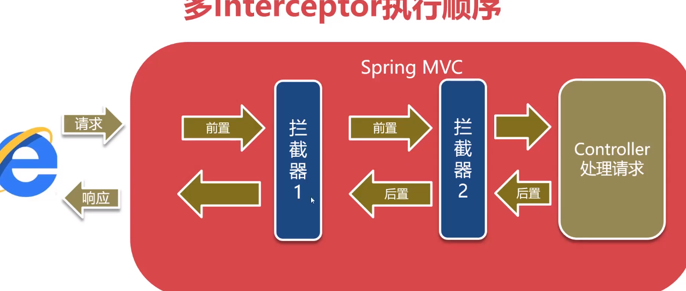


### preHandler

如果preHandler返回false

可以看到输出只有preHandler, 并且页面空白

```
preHandle: http://localhost:8080/client.html-准备执行
```

阻断, 所有的后续请求都没有被处理, 被阻断. 因为return false, 响应看到的就是一个空字符串.

---

修改preHandler, 添加response writer中空数组

```java
@Override
public boolean preHandle(HttpServletRequest request, HttpServletResponse response, Object handler) throws Exception {
    System.out.println("preHandle: " + request.getRequestURL() + "-准备执行");
    // return true;
    response.getWriter().print("[]");
    return false;
    // return HandlerInterceptor.super.preHandle(request, response, handler);
}
```

页面输出:

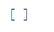

控制台仍然输出:

```
preHandle: http://localhost:8080/client.html-准备执行
```

---

通过preHandler可以做url的前置检查, 对不符合要求的url做拦截.

## 用户流量拦截器


## spring mvc处理流程


# Ref

* 博客园笔记: [[明王不动心](https://www.cnblogs.com/yangmingxianshen/)](https://www.cnblogs.com/yangmingxianshen/p/12521605.html)


